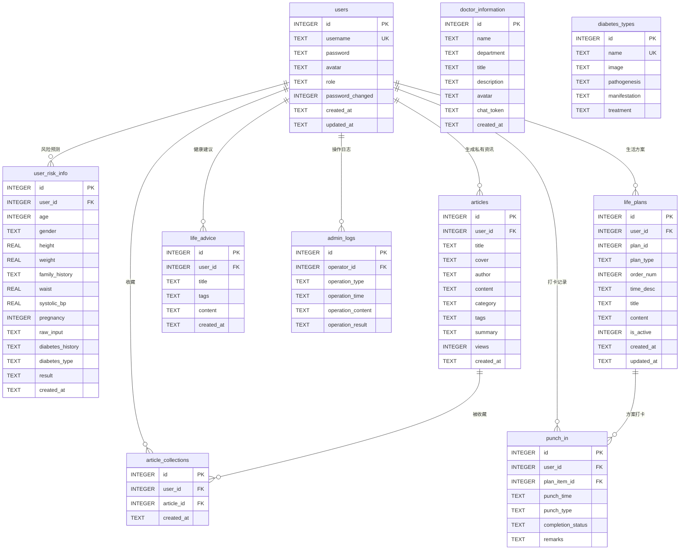

# 糖尿病预治智能助手 —— 详细设计文档

## 1. 系统架构详细设计

### 1.1 系统整体架构图

系统采用三层架构：前端层（浏览器SPA）→ Express中间层（API服务）→ Dify/DeepSeek AI层。

```
                        ┌──────────────────────────────────────────┐
                        │              用户浏览器                    │
                        │  ┌─────────────────────────────────────┐ │
                        │  │  Vue3 SPA (Vite 构建产物 dist/)     │ │
                        │  │  ┌──────────────────────────────┐   │ │
                        │  │  │  App.vue (根组件)             │   │ │
                        │  │  │  ├── <router-view /> (路由出口)│   │ │
                        │  │  │  │   ├── Home.vue              │   │ │
                        │  │  │  │   ├── Consultation.vue      │   │ │
                        │  │  │  │   ├── LifePlan.vue          │   │ │
                        │  │  │  │   ├── News.vue              │   │ │
                        │  │  │  │   ├── Profile.vue           │   │ │
                        │  │  │  │   ├── Risk.vue              │   │ │
                        │  │  │  │   ├── Punch.vue             │   │ │
                        │  │  │  │   ├── HealthAdvice.vue      │   │ │
                        │  │  │  │   ├── Admin.vue             │   │ │
                        │  │  │  │   ├── ChangePassword.vue    │   │ │
                        │  │  │  │   └── Login.vue             │   │ │
                        │  │  │  ├── TabBar.vue (底部Tab栏)     │   │ │
                        │  │  │  ├── FabButton.vue (FAB悬浮按钮)│   │ │
                        │  │  │  └── AiChatDialog.vue (AI弹窗)  │   │ │
                        │  │  └──────────────────────────────┘   │ │
                        │  │  Vue Router 4 (history模式)          │ │
                        │  │  Pinia Store (authStore/chatStore/   │ │
                        │  │    riskFormStore — 全局状态管理)     │ │
                        │  │  Axios 拦截器 (JWT + 401处理)        │ │
                        │  └─────────────────────────────────────┘ │
                        └──────────────────────────────────────────┘
                              │              │ SSE流
                    HTTP/HTTPS│              │
                              ▼              ▼
          ┌──────────────────────────────────────────────────┐
          │      服务器2 (主) / 服务器3 (备)                   │
          │      Nginx 反向代理 + 负载均衡 + Keepalived        │
          │      VIP: 10.0.0.100 (虚拟IP)                     │
          └──────────────┬───────────────────────────────────┘
                         │ /api/* 代理转发
                         ▼
          ┌──────────────────────────────────────────────────┐
          │              服务器1 (数据服务器)                  │
          │  ┌─────────────────┐  ┌──────────────────────┐   │
          │  │ Nginx :80       │  │ Express :3000        │   │
          │  │ 静态文件服务     │  │ REST API + SSE代理   │   │
          │  │ /static/        │  │ JWT中间件            │   │
          │  │ /assets/        │  │ bcrypt密码校验       │   │
          │  │ (Vite dist/)    │  │ SQLite读写           │   │
          │  └─────────────────┘  └──────────┬───────────┘   │
          │                                  │               │
          │                       ┌──────────▼───────────┐   │
          │                       │  SQLite 数据库文件    │   │
          │                       │  /data/database.sqlite│   │
          │                       └──────────────────────┘   │
          └──────────────────────────────────────────────────┘
                         │ HTTP API 调用
                         ▼
          ┌──────────────────────────────────────────────────┐
          │            外部云服务 (Dify + DeepSeek)            │
          │  Dify平台 (工作流 + Agent + 聊天助手)              │
          │  DeepSeek大模型API (模型推理)                      │
          └──────────────────────────────────────────────────┘
```

### 1.2 Vue3 SPA 前端架构图

```
App.vue (根组件)
├── <router-view /> (Vue Router 4 history模式路由出口)
├── TabBar.vue (底部Tab栏组件, 5个Tab)
│   ├── 首页 → /home
│   ├── 咨询 → /consultation
│   ├── 生活方案 → /life-plan
│   ├── 资讯 → /news
│   └── 我的 → /profile
├── FabButton.vue (FAB悬浮按钮, position: fixed)
│   └── AiChatDialog.vue (AI助手对话弹窗, 全局组件层, 遮罩覆盖)
├── Pinia Store 体系 (跨组件状态共享)
│   ├── authStore.ts — 登录态 (JWT Token, user info, role, must_change_password)
│   ├── chatStore.ts — AI对话状态 (conversation_id, 消息列表, SSE连接状态)
│   └── riskFormStore.ts — 风险预测表单多步骤数据
├── Vue Router 4 (history模式, createWebHistory)
│   ├── 路由表 (路径 → 懒加载组件)
│   ├── 全局前置守卫 (beforeEach: JWT认证 + 角色检查 + 强制改密拦截)
│   └── 登录回跳 (query参数 redirect)
├── Axios 全局拦截器 (请求拦截 + 响应拦截)
│   ├── 请求拦截: 自动附加 Authorization 头
│   ├── 响应拦截: 401处理 → 清除Token → 广播登出
│   └── Token过期提示条 (非阻断Toast)
└── 公共状态
    ├── localStorage: JWT Token, role, 免责确认状态
    ├── Pinia persist (pinia-plugin-persistedstate): authStore持久化, chatStore.doctorConversations/assistantConversationId/adminConversationId持久化
    └── 响应式变量: 当前活跃Tab, FAB弹窗状态
```

**Vue3 SPA 跨组件通信机制**：

1. **登录态同步**: 登录成功 -> authStore.login() (内部同步设置 token、role 和 user) -> Pinia响应式自动通知所有订阅组件更新登录态。
2. **AI助手导航**: FAB弹窗内AI回复含导航指令 -> chatStore触发 router.push({name, params}) -> Vue Router导航至目标页面。
3. **模块间数据传递**: 风险预测页 -> riskFormStore.saveResult(data) -> 生活方案页 onMounted 读取 riskFormStore.result -> 预填方案生成参数。对于不需持久化的瞬时数据传递，使用路由 query params（如 /life-plan?riskLevel=high&diabetesType=2型）在目标页面的 onMounted 中读取。
4. **跨浏览器标签页的登录态同步**: 在 App.vue 挂载时注册 storage 事件监听。当 localStorage 中 token 或 role 发生变化（如在其他标签页退出登录或切换账号时），如果新值为空，调用 authStore.clearAuth() 并在当前标签页提示并重定向至登录页；如果新值不一致，则调用 authStore.syncFromStorage() 从 localStorage 同步恢复 token/role/userInfo 三个字段以保持多标签页之间的登录态同步（v13 修订：原 setToken() 仅同步 token 未同步 role 和 userInfo，会导致切换账号时 UI 显示旧用户信息但 token 为新用户的状态错乱；syncFromStorage 方法详见 3.7 节 authStore 接口定义）。

### 1.3 技术选型详情表

| 技术 | 版本 | 选型理由 | 引入方式 |
|------|------|---------|---------|
| Vue | 3.x | 渐进式前端框架，组合式API，TypeScript原生支持，生态成熟 | npm (package.json) |
| TypeScript | 5.x | 静态类型检查，接口契约，提升代码可维护性 | npm (package.json) |
| Vite | 5.x | 快速HMR，ESBuild预构建，Vue官方推荐构建工具 | npm (package.json) |
| Vue Router | 4.x | Vue官方路由方案，history模式支持干净URL | npm (package.json) |
| Pinia | 2.x | Vue官方状态管理库，TypeScript友好，模块化Store | npm (package.json) |
| Axios | 1.x | HTTP客户端，拦截器支持，请求/响应统一处理 | npm (package.json) |
| DOMPurify | 3.x | HTML净化库，marked.js渲染Markdown后防XSS | npm (package.json) |
| Tailwind CSS | 3.x | 原子化CSS，移动端优先，与U+平台一致 | npm + PostCSS (Vite集成) |
| Vant | 4.x | 移动端优先的 Vue 3 组件库，提供 Tabbar、ActionSheet、DatetimePicker、PullRefresh、Toast、Dialog 等移动端特有交互组件，避免从零开发（需求 8.1 节推荐） | npm (package.json) + 按需引入 (unplugin-vue-components) |
| Swiper | 11.x | 成熟的移动端轮播组件，支持触摸滑动 | `/static/lib/swiper-bundle.min.js` + `.min.css` |
| SweetAlert2 | 11.x | 美观的弹窗组件，替代原生alert/confirm | npm (package.json) |
| Font Awesome | 6.x | 免费图标库，图标丰富 | `/static/lib/all.min.css` + `/static/webfonts/` |
| marked.js | 12.x | 轻量Markdown渲染，用于文章正文展示 | npm (package.json) |
| Node.js | 18 LTS | 稳定长期支持版本，npm生态丰富 | 服务器安装 |
| Express | 4.x | 最流行的Node.js Web框架 | npm install express |
| better-sqlite3 | 9.x | Node.js同步SQLite驱动，性能优于异步 | npm install better-sqlite3 |
| jsonwebtoken | 9.x | JWT生成与验证 | npm install jsonwebtoken |
| bcryptjs | 2.x | 纯JS bcrypt实现，无需编译 | npm install bcryptjs |
| multer | 1.x | Express文件上传中间件 | npm install multer |
| dotenv | 16.x | .env环境变量加载 | npm install dotenv |
| Dify平台 | SaaS | 工作流编排、Agent管理、知识库检索 | HTTP API调用 |
| DeepSeek | API | 大模型推理引擎，支持Function Calling | 通过Dify间接调用 |
| SQLite | 3 | 零配置、单文件、适合实训规模 | 文件型数据库 |
| Nginx | 1.24+ | 高性能HTTP服务器、反向代理 | yum/apt安装 |
| Keepalived | 2.x | 主备模式高可用，VIP漂移 | yum/apt安装 |

> **Markdown 渲染模式**: 当前 marked v12 同步模式 (`marked.parse(md, { async: false })`)
> 与未来 v13+ 异步模式 (`marked.parse(md, { async: true })`) 为有意并存的双模式策略。
> - 同步模式: 用于当前所有 Markdown 渲染场景（LifePlan 方案内容、Punch AI 分析评语）
> - 异步迁移路径: 已在 `useMarkdown.ts` 中以 G16 注释标注 (`// G16: marked v13+ 异步模式`)
> - 当前 marked v12 同步模式稳定可用，无迁移紧迫性

### 1.4 模块划分与依赖关系

```
项目根目录 diabetesAssistant/
├── index.html                    # Vite SPA入口 (挂载点)
├── package.json                  # Node.js依赖管理
├── vite.config.ts                # Vite构建配置
├── tsconfig.json                 # TypeScript编译配置
├── server.js                     # Express启动入口
├── .env                          # 环境变量配置
├── .env.example                  # 环境变量模板
│
├── src/                          # 前端源码 (Vue3 + TypeScript)
│   ├── App.vue                   # 根组件 (<router-view /> + TabBar + FAB)
│   ├── main.ts                   # 入口 (createApp, router, pinia, axios拦截器注册)
│   ├── router/
│   │   └── index.ts              # Vue Router 4 路由配置 (history模式, 路由守卫)
│   ├── stores/                   # Pinia Store 模块
│   │   ├── authStore.ts          # 登录态管理 (JWT Token, user info, role)
│   │   ├── chatStore.ts          # AI对话状态 (conversation_id, 消息列表, SSE连接)
│   │   └── riskFormStore.ts      # 风险预测表单多步骤数据
│   ├── types/                    # TypeScript 类型定义
│   │   ├── api.ts                # API请求/响应类型 (RiskPredictRequest, PaginatedResponse<T>, ApiError等)
│   │   ├── models.ts             # 业务实体类型 (User, Doctor, Article, LifePlan, PunchRecord等)
│   │   └── sse.ts                # SSE事件类型 (SSEMessageEvent, SSEErrorEvent, SSEMessageEndEvent等)
│   ├── views/                    # 页面级组件 (.vue 单文件组件)
│   │   ├── Home.vue              # 系统首页
│   │   ├── Consultation.vue      # 医师咨询 (医生列表)
│   │   ├── DoctorChatView.vue    # 医师对话
│   │   ├── LifePlan.vue          # 生活方案
│   │   ├── NewsView.vue          # 健康资讯列表
│   │   ├── ArticleDetailView.vue # 科普文章详情
│   │   ├── Profile.vue           # 个人中心
│   │   ├── Risk.vue              # 糖尿病风险预测
│   │   ├── Punch.vue             # 打卡记录与分析
│   │   ├── HealthAdvice.vue      # 健康建议列表
│   │   ├── Admin.vue             # 智能管理 (管理员)
│   │   ├── ChangePassword.vue    # 管理员强制密码修改
│   │   └── Login.vue             # 登录/注册
│   ├── components/               # 可复用组件
│   │   ├── TabBar.vue            # 底部Tab导航栏
│   │   ├── FabButton.vue         # FAB悬浮按钮
│   │   ├── AiChatDialog.vue      # AI助手对话弹窗 (全局层)
│   │   ├── SkeletonLoader.vue    # 骨架屏组件
│   │   ├── ErrorRetry.vue        # 错误重试组件
│   │   ├── EmptyState.vue        # 空数据引导组件
│   │   └── DisclaimerBar.vue     # 医学免责标识条
│   ├── composables/              # Vue组合式函数 (复用逻辑)
│   │   ├── useApi.ts             # API请求封装 (axios + JWT + 拦截器)
│   │   ├── useAuth.ts            # JWT认证工具 (Token读写、解析、过期检测)
│   │   ├── useSSE.ts             # SSE流式请求封装
│   │   └── useUI.ts              # UI工具 (Toast、Loading)
│   ├── utils/                    # 通用工具函数
│   │   └── helpers.ts            # 日期格式化、防抖截流等
│   ├── styles/                   # 全局样式
│   │   └── animations.css         # 全局动画 (v16 修订：替代原 common.css)
│   └── assets/                    # 静态资源 (v16 修订新增目录)
│       └── variables.css          # CSS变量定义 (设计系统，v16 修订：原位于 styles/)
│
├── server/                       # Express后端源码
│   ├── app.js                    # Express应用配置 (中间件注册)
│   ├── routes/                   # 路由模块 (14个文件)
│   │   ├── auth.js               # 认证路由 (/api/auth/*)
│   │   ├── user.js               # 用户路由 (/api/user/*)
│   │   ├── doctors.js            # 医生路由 (/api/doctors/*)
│   │   ├── chat.js               # 医师对话路由 (/api/chat/*)
│   │   ├── risk.js               # 风险预测路由 (/api/risk/*)
│   │   ├── plan.js               # 方案路由 (/api/plan/*)
│   │   ├── punch.js              # 打卡路由 (/api/punch/*)
│   │   ├── articles.js           # 资讯路由 (/api/articles/*)
│   │   ├── diabetes.js           # 糖尿病类型路由 (/api/diabetes-types/*)
│   │   ├── assistant.js          # AI助手路由 (/api/assistant/*)
│   │   ├── admin.js              # 管理路由 (/api/admin/*)
│   │   ├── dify.js               # Dify代理路由 (/api/dify/*)
│   │   └── upload.js             # 文件上传路由 (/api/upload/*)
│   ├── middleware/               # Express中间件
│   │   ├── auth.js               # JWT认证中间件
│   │   ├── admin.js              # 管理员角色校验中间件
│   │   └── difyAuth.js           # Dify API Key校验中间件
│   ├── services/                 # 业务逻辑层
│   │   ├── difyService.js        # Dify API调用封装
│   │   └── sseProxy.js           # SSE流式代理工具
│   └── db/                       # 数据库层
│       ├── database.js           # SQLite连接管理
│       ├── init.sql              # 数据库初始化DDL
│       └── seed.sql              # 初始数据预填充
│
├── static/                       # 静态资源
│   ├── lib/                      # 第三方库 (非npm管理的CDN回退)
│   │   ├── swiper-bundle.min.js  # Swiper
│   │   ├── swiper-bundle.min.css
│   │   ├── all.min.css           # Font Awesome
│   │   └── purify.min.js         # DOMPurify
│   ├── webfonts/                 # Font Awesome字体文件
│   ├── images/                   # 预置图片资源
│   │   ├── logo_main.png
│   │   ├── doctors/    (doc1.jpg, doc2.png, doc3.png)
│   │   ├── diabetes/   (t1.jpg, t2.jpg, t3.jpg, t4.jpg)
│   │   ├── banner/     (lb1.png, lb2.png, lb3.jpeg)
│   │   └── default/    (default-avatar.png, default-cover.png)
│   └── uploads/                   # 用户上传
│       └── avatars/               # 用户头像
│
└── data/                         # 运行时数据
    └── database.sqlite           # SQLite数据库文件(运行时生成)
```

**模块依赖方向规则**：
- composables/ (useApi.ts, useAuth.ts, useUI.ts) 不依赖任何页面组件
- views/ 组件可依赖 composables/、stores/、components/，不可直接依赖其他 views/ 组件
- 跨页面数据传递通过 Pinia Store 共享或 Vue Router query params 传递
- 禁止子组件直接操作父组件/根组件的 DOM

**main.ts (Vue3 SPA 入口)**:
```typescript
// src/main.ts — Vue3 SPA 应用初始化入口
// v16 修订：存储方案由 localStorage + pinia-plugin-persistedstate 切换为 sessionStorage + BroadcastChannel
// 理由：sessionStorage 天然隔离多标签页多账号场景，BroadcastChannel 提供跨标签页实时同步
import { createApp } from 'vue';
import { createPinia } from 'pinia';
// pinia-plugin-persistedstate 不再引入 — 由 sessionStorage + BroadcastChannel 替代 (v16 决策)
import App from './App.vue';
import router from './router';
// Axios 拦截器在 useApi.ts 模块顶层自注册（导入即生效），不再通过 setupAxiosInterceptors 显式调用 (v16 决策)
import { useAuthStore } from './stores/authStore';
import './assets/variables.css';
import './styles/animations.css';

const app = createApp(App);

// 1. Pinia (sessionStorage + BroadcastChannel 手动持久化，v16 修订)
const pinia = createPinia();
app.use(pinia);

// 2. 从 sessionStorage 恢复登录态
const authStore = useAuthStore();
authStore.syncFromStorage();

// 3. Vue Router 4
app.use(router);

// 4. 挂载到 #app
app.mount('#app');
```

**vite.config.ts (Vite 构建配置)**:
```typescript
// vite.config.ts — Vite 5 构建配置
import { defineConfig } from 'vite';
import vue from '@vitejs/plugin-vue';
import { resolve } from 'path';

export default defineConfig({
  plugins: [vue()],
  resolve: {
    alias: {
      '@': resolve(__dirname, 'src'),
    },
  },
  server: {
    port: 5173,
    proxy: {
      '/api': {
        target: 'http://localhost:3000',  // Express 开发服务器
        changeOrigin: true,
      },
      '/static': {
        target: 'http://localhost:3000',
        changeOrigin: true,
      },
    },
  },
  build: {
    outDir: 'dist',
    assetsDir: 'assets',
  },
});
```

**env.d.ts (.vue 模块 TypeScript 类型声明)**:
```typescript
// src/env.d.ts — .vue 单文件组件类型声明，使 TypeScript 能够识别 .vue 文件的导入
declare module '*.vue' {
  import type { DefineComponent } from 'vue';
  const component: DefineComponent<{}, {}, any>;
  export default component;
}

// Vite 环境变量类型声明
/// <reference types="vite/client" />
```

### 1.5 跨模块通信机制详细设计

#### 1.5.1 Pinia Store 跨组件状态共享

Vue3 SPA 架构中，跨模块通信通过 Pinia Store 实现，替代 v1 的 postMessage 消息总线。三个核心 Store 覆盖所有跨组件通信场景：

| Store | 文件 | 用途 | 关键 state | 关键 actions |
|-------|------|------|-----------|-------------|
| authStore | stores/authStore.ts | 登录态管理 | token: string\|null, user: User\|null, role: 'user'\|'admin'\|null, mustChangePassword: boolean | login(), logout(), setToken(), setAuth(), syncFromStorage(), clearAuth(), fetchProfile(), setProfile(), clearMustChangePassword() |
| chatStore | stores/chatStore.ts | AI对话状态 | doctorConversations: Map<number, string>, assistantConversationId: string\|null, adminConversationId: string\|null, conversations: ChatMessage[], fabOpen: boolean, isStreaming: boolean, activeAbortController: AbortController\|null | sendMessage(), sendMessageWithRetry(), sendAssistantMessage(), sendAdminMessage(), toggleFab(), navigate(), getDoctorConversation(), setDoctorConversation(), clearDoctorConversation(), getAssistantConversation(), setAssistantConversation(), clearAssistantConversation(), getAdminConversation(), setAdminConversation(), clearAllConversations(), switchDoctor(), registerAbortController(), abortActiveConnection() |
| riskFormStore | stores/riskFormStore.ts | 风险预测表单数据 | currentStep: number, formData: RiskFormData, result: RiskResult\|null | saveStep(), saveResult(), reset(), loadFromStorage(), clearSession() |
| homeStore | stores/homeStore.ts | 首页数据缓存 (v16 新增) | doctors, articles, diabetesTypes + 各区块独立 loading/error | fetchHomeData(), fetchDiabetesTypeDetail(), clearHomeCache() |
| lifePlanStore | stores/lifePlanStore.ts | 生活方案管理 (v16 新增) | currentPlan, generating, completedMap | fetchCurrent(), generate(), adjust(), createPunch(), clearPlanCache() |
| punchStore | stores/punchStore.ts | 打卡记录与分析 (v16 新增) | records, pagination, filter, analysis | fetchList(), loadMore(), fetchAnalysis(), setFilter() |

> **v16 修订说明**：
> - 存储介质由 localStorage 切换为 sessionStorage（token/role/user），通过 BroadcastChannel 实现跨标签页同步，详见 1.5.2 节 authStore 伪代码
> - pinia-plugin-persistedstate 不再使用，持久化由手动 sessionStorage 读写替代
> - chatStore 字段 `messages` 在代码中实际命名为 `conversations`（ChatMessage[]），本表同步更新
> - homeStore / lifePlanStore / punchStore 为实际代码扩展，管理页面级业务状态，含 sessionStorage 缓存（TTL 分别为 1h/30min/—）

#### 1.5.2 跨组件通信实现（替代原 postMessage）

**登录态同步**:
```typescript
// authStore.ts — 登录成功后所有订阅组件自动响应
// v16 修订：存储介质由 localStorage 切换为 sessionStorage，通过 BroadcastChannel 实现跨标签页同步
// 理由：sessionStorage 天然隔离多标签页多账号场景，避免 token 覆盖；BroadcastChannel 提供同源标签页实时同步
// 详见 docs/4_frontend_gap_todo_v2.md §13 决策记录
export const useAuthStore = defineStore('auth', () => {
  const token = ref<string | null>(sessionStorage.getItem('token'));
  const role = ref<'user' | 'admin' | null>(
    parseRole(sessionStorage.getItem('role'))
  );
  const user = ref<LoginUser | null>(() => {
    try {
      const raw = JSON.parse(sessionStorage.getItem('user') || 'null');
      if (raw && typeof raw.id === 'number' && typeof raw.username === 'string') return raw as LoginUser;
    } catch { /* corrupted */ }
    return null;
  });
  const mustChangePassword = ref<boolean>(localStorage.getItem('must_change_password') === 'true');

  async function login(username: string, password: string) {
    const res = await api.post<LoginResponse>('/api/auth/login', { username, password });
    setAuth(res.data.token, res.data.role, res.data.user);
    if (res.data.must_change_password) {
      mustChangePassword.value = true;
      localStorage.setItem('must_change_password', 'true');
    }
  }

  function setAuth(newToken: string, newRole: 'user' | 'admin', newUser: LoginUser) {
    token.value = newToken;
    role.value = newRole;
    user.value = newUser;
    sessionStorage.setItem('token', newToken);
    sessionStorage.setItem('role', newRole);
    sessionStorage.setItem('user', JSON.stringify(newUser));
    // v16 修订新增：通过 BroadcastChannel 广播认证变更，其他标签页实时同步
    broadcastChannel.postMessage({ type: 'AUTH_CHANGED', token: newToken, role: newRole, user: newUser });
  }

  function logout() {
    // 完整的登出流程编排由 Profile.vue 在调用此方法前执行（中止 SSE、清理会话、清除表单）
    token.value = null;
    role.value = null;
    user.value = null;
    mustChangePassword.value = false;
    sessionStorage.removeItem('token');
    sessionStorage.removeItem('role');
    sessionStorage.removeItem('user');
    localStorage.removeItem('must_change_password');
    broadcastChannel.postMessage({ type: 'AUTH_CHANGED', token: null, role: null, user: null });
    router.push('/home');
  }

  return { token, role, user, mustChangePassword, login, logout, setAuth };
});
```

**FAB 弹窗状态控制**（替代原 FAB_OPEN postMessage）:
```typescript
// chatStore.ts — FAB弹窗通过 Store 状态控制显隐
const fabOpen = ref(false);
function toggleFab() { fabOpen.value = !fabOpen.value; }
```

**AI助手跨模块导航**（替代原 NAVIGATE postMessage）:
```typescript
// chatStore.ts — AI回复含导航指令时通过 router.push 实现
function navigate(target: { name: string, params?: object, query?: object }) {
  router.push(target);
}
```

#### 1.5.3 数据流图

```mermaid
登录流程:
  用户输入凭据 -> Login.vue -> POST /api/auth/login
    -> useApi 收到 {token, role, user}
    -> authStore.login() 更新 token/user 响应式变量
    -> 所有订阅 authStore 的组件自动更新登录态（Pinia 响应式机制）

跨模块数据传递 (风险预测->生活方案):
  方案A (Pinia Store 共享, 推荐):
    Risk.vue -> 用户完成风险预测
      -> riskFormStore.saveResult({ riskLevel: 'high', diabetesType: '2型' })
      -> router.push('/life-plan')
      -> LifePlan.vue onMounted -> 读取 riskFormStore.result
      -> 预填方案生成参数

  方案B (路由参数传递, 适用于瞬时数据):
    Risk.vue -> router.push({ path: '/life-plan', query: { riskLevel: 'high', diabetesType: '2型' } })
    -> LifePlan.vue onMounted -> 读取 route.query -> 预填方案生成参数
```

### 1.6 前端路由详细设计

#### 1.6.1 Vue Router 4 history模式路由映射表

| 路径 | 对应组件 (懒加载) | meta.requiresAuth | meta.requiresAdmin | 说明 |
|------|------------------|-------------------|--------------------|------|
| /home | () => import('@/views/Home.vue') | false | false | 系统首页(默认路由) |
| /consultation | () => import('@/views/Consultation.vue') | false | false | 医师咨询(医生列表) |
| /consultation/doctor/:id | () => import('@/views/DoctorChatView.vue') | true | false | 医师对话(路由参数传医生ID) |
| /life-plan | () => import('@/views/LifePlan.vue') | true | false | 生活方案 |
| /news | () => import('@/views/NewsView.vue') | false | false | 健康资讯列表 |
| /news/article/:id | () => import('@/views/ArticleDetailView.vue') | false | false | 文章详情 |
| /profile | () => import('@/views/Profile.vue') | true | false | 个人中心(父路由，嵌套 `<router-view />`) |
| /profile/risk | () => import('@/views/Risk.vue') | true | false | 风险预测(我的Tab子页面，嵌套在 `/profile` 中) |
| /profile/punch | () => import('@/views/Punch.vue') | true | false | 打卡记录(我的Tab子页面，嵌套在 `/profile` 中) |
| /profile/advice | () => import('@/views/HealthAdvice.vue') | true | false | 健康建议(我的Tab子页面，嵌套在 `/profile` 中) |
| /admin | () => import('@/views/Admin.vue') | true | true | 智能管理 |
| /change-password | () => import('@/views/ChangePassword.vue') | true | false | 管理员强制密码修改页（仅首次登录） |
| /login | () => import('@/views/Login.vue') | false | false | 登录/注册 |
| /:pathMatch(.*)* | redirect to /home | — | — | 404兜底 |

#### 1.6.2 Vue Router 全局前置守卫 (beforeEach)

```typescript
// router/index.ts — Vue Router 4 全局前置守卫
import { createRouter, createWebHistory, RouteRecordRaw } from 'vue-router';
import { useAuthStore } from '@/stores/authStore';
import { useUI } from '@/composables/useUI';

const routes: RouteRecordRaw[] = [
  {
    path: '/home',
    component: () => import('@/views/Home.vue'),
    meta: { requiresAuth: false }
  },
  {
    path: '/consultation',
    component: () => import('@/views/Consultation.vue'),
    meta: { requiresAuth: false }
  },
  {
    path: '/consultation/doctor/:id',
    component: () => import('@/views/DoctorChatView.vue'),
    meta: { requiresAuth: true, requiresDisclaimer: true }
  },
  {
    path: '/life-plan',
    component: () => import('@/views/LifePlan.vue'),
    meta: { requiresAuth: true, requiresDisclaimer: true }
  },
  {
    path: '/news',
    component: () => import('@/views/NewsView.vue'),
    meta: { requiresAuth: false }
  },
  {
    path: '/news/article/:id',
    component: () => import('@/views/ArticleDetailView.vue'),
    meta: { requiresAuth: false }
  },
  {
    path: '/profile',
    component: () => import('@/views/Profile.vue'),
    meta: { requiresAuth: true },
    children: [
      {
        path: 'risk',
        component: () => import('@/views/Risk.vue'),
        meta: { requiresAuth: true, requiresDisclaimer: true }
      },
      {
        path: 'punch',
        component: () => import('@/views/Punch.vue'),
        meta: { requiresAuth: true }
      },
      // v5-S13: Punch 路由免责声明决策 — Punch 页面展示 AI 生成的分析内容（依从性评语、改进建议）。
      // 当前 Punch 路由仅设置 meta: { requiresAuth: true }，不要求免责声明。
      // 决策: Punch 不需要免责声明——Punch 页面展示的是统计性分析（基于用户打卡数据计算
      // 完成率/趋势），而非生成式 AI 内容。AI 依从性评语是对统计结果的文字化陈述，不触发
      // 免责声明要求。若产品后续将此判定为需要免责声明，需同步修改路由 meta 和 src/router/index.ts。
      {
        path: 'advice',
        component: () => import('@/views/HealthAdvice.vue'),
        meta: { requiresAuth: true, requiresDisclaimer: true }
      }
    ]
  },
  {
    path: '/admin',
    component: () => import('@/views/Admin.vue'),
    meta: { requiresAuth: true, requiresAdmin: true }
  },
  {
    path: '/change-password',
    component: () => import('@/views/ChangePassword.vue'),
    meta: { requiresAuth: true }
  },
  {
    path: '/login',
    component: () => import('@/views/Login.vue'),
    meta: { requiresAuth: false }
  },
  {
    path: '/:pathMatch(.*)*',
    redirect: '/home'
  }
];

const router = createRouter({
  history: createWebHistory(),
  routes
});

router.beforeEach(async (to, from, next) => {
  const authStore = useAuthStore();
  const token = authStore.token;

  // 1. 公开路由直接放行
  if (to.meta.requiresAuth === false) {
    return next();
  }

  // 2. 检查Token是否存在
  // v16 修订：当前仅检查 token 存在性，JWT exp 过期检测待 useAuth composable 实现后引入
  // useAuth composable 实现计划参见 docs/4_frontend_gap_todo_v2.md §12 A4 项
  if (!token) {
    return next({ path: '/login', query: { redirect: encodeURIComponent(to.fullPath) } });
  }

  // 3. 管理员角色校验 (v16 修订：实际实现中角色检查先于改密检查，与设计顺序颠倒但影响极小)
  if (to.meta.requiresAdmin && authStore.role !== 'admin') {
    return next('/home');
  }

  // 4. 管理员首次登录强制修改密码拦截
  if (authStore.role === 'admin' && authStore.mustChangePassword) {
    if (to.path !== '/change-password') {
      return next('/change-password');
    }
  }

  // 5. AI功能入口医学免责声明拦截（需求4.11合规要求）
  // v16 修订：hasAcceptedDisclaimer / showDisclaimer 当前内联在路由文件中（router/index.ts）
  // 待 useUI composable 实现后统一迁移至此，详见 docs/4_frontend_gap_todo_v2.md §12 A5 项
  if (to.meta.requiresDisclaimer) {
    if (!hasAcceptedDisclaimer()) {
      const accepted = await showDisclaimer();
      if (accepted) {
        localStorage.setItem('disclaimer_accepted', 'true');
      } else {
        // v16 修订：保留来源页语义，无来源页时回首页
        return next(from.path && from.path !== to.path ? false : '/home');
      }
    }
  }

  next();
});

export default router;
```

**医学免责声明拦截流程** (需求4.11合规要求):
1. 用户首次访问任何标记 `requiresDisclaimer: true` 的 AI 功能入口（医师对话/生活方案/风险预测/健康建议）
2. 路由守卫步骤5调用 `useUI().hasAcceptedDisclaimer()` 检查 `localStorage['disclaimer_accepted']`
3. 若未同意，调用 `showDisclaimer()` 弹出 SweetAlert2 确认框，展示医学免责声明全文
4. 用户点击"已知晓" → 写入 `localStorage.setItem('disclaimer_accepted', 'true')`，跨标签页持久化，放行导航
5. 用户点击"取消" → 调用 `next(false)` 回退导航，或重定向至 `/home`
6. 全局 AI 助手悬浮窗 `AiChatDialog.vue` 不经路由，需在 `chatStore.toggleFab()` 打开弹窗前补充调用 `hasAcceptedDisclaimer()` 判定，未同意时同样调用 `showDisclaimer()`，拒绝则不展开弹窗

**管理员强制密码修改流程** (与 v1 等价，改用 Pinia Store + Vue Router):
1. 管理员使用预置账号登录 -> POST /api/auth/login 返回 `must_change_password: true`
2. authStore 将 mustChangePassword 设为 true
3. 路由守卫拦截所有非 /change-password 路径的导航，强制跳转到 /change-password
4. ChangePassword.vue 页面展示密码修改表单（新密码 + 确认新密码），不允许绕过
5. 用户提交新密码 -> PUT /api/user/password（首次修改无需提供old_password，后端根据password_changed='0'判断）
6. 后端更新密码哈希并设置 password_changed='1' -> authStore 清除 mustChangePassword
7. 路由守卫放行，管理员可正常使用管理功能

### 1.7 三条数据操作路径的架构流程图

```mermaid
路径1: 常规CRUD路径 (标准业务操作)
  Vue组件 useApi().post/get()
    -> Express REST端点
    -> better-sqlite3直接执行SQL
    -> 返回JSON响应
  适用: 注册/登录、个人信息读写、打卡记录CRUD、文章收藏、操作日志查询

路径2: AI驱动的Text2SQL路径 (自然语言->数据库)
  管理员场景:
    前端 Admin.vue 中 useSSE()
      -> POST /api/admin/chat (JWT认证, role=admin校验)
      -> Express代理 -> Dify admin-manager-agent
      -> Agent Text2SQL工具回调 POST /api/admin/execute
           (携带DIFY_SERVICE_API_KEY + user_id)
      -> Express端点 (API Key校验 -> 执行SQL -> 写入admin_logs)
      -> SSE流返回结果

  AI助手场景:
    前端 AiChatDialog.vue 中 useSSE()
      -> POST /api/assistant/chat (JWT认证)
      -> Express代理 -> Dify diabetes-assistant-agent
      -> Agent Text2SQL工具回调 POST /api/admin/execute
           (携带DIFY_SERVICE_API_KEY + user_id)
      -> Express端点 (API Key校验 -> 行级权限约束 -> 执行SQL)
      -> SSE流返回结果

路径3: AI内容生成持久化路径 (Dify工作流->数据库)
  Vue组件 useApi().post()
    -> Express端点 (如POST /api/risk/predict)
    -> Express调用Dify工作流API (blocking模式)
    -> 接收Dify完整响应 -> 解析AI生成内容 -> 数据结构化
    -> INSERT/UPDATE SQLite数据库
       (user_risk_info / life_plans，自动生成的 articles 正常落库并绑定 user_id 成为私有资讯，与公共列表隔离)
    -> 返回结果给前端
```

### 1.8 数据字段映射与中英转换机制设计

> **方案决策（v13 修订，对齐需求 6.3/6.6 节）**：本轮迭代将 API 接口层枚举值从原"中文枚举值 + 后端 mapper.js 转换层"方案切换为**方案 A：API 接口层使用英文枚举值（与需求 6.3/6.6 节规范一致），前端 UI 渲染时通过查表将英文映射为中文展示**。原方案 B（中文枚举值 + mapper.js）虽然前端直接展示中文较友好，但与需求规范直接矛盾，且增加了双向映射字典的维护复杂度。方案 A 下，数据库 CHECK 约束（英文小写）、API 契约（英文小写）、TypeScript 类型（英文小写）三层完全一致，无需后端转换层；前端在视图层做英文→中文的展示映射即可。

#### 1.8.1 前端展示映射字典定义

```typescript
// src/utils/enumLabels.ts
// 前端展示映射字典：英文枚举值 → 中文展示标签
// 仅用于 UI 渲染层展示，不参与 API 请求/响应与数据库存储
const ENUM_LABELS = {
  gender: { male: '男', female: '女' },
  family_history: { yes: '有', no: '无' },
  diabetes_history: { healthy: '健康', prediabetes: '糖尿病前期', diagnosed: '已确诊' },
  diabetes_type: {
    type1: '1型糖尿病', type2: '2型糖尿病',
    gestational: '妊娠期糖尿病', other: '其他特殊类型糖尿病'
  },
  plan_type: { diet: '饮食', exercise: '运动', other: '其他' },
  // v14 修订：punch_type 仅含 diet/exercise（对齐需求 5 节 CHECK 约束），不含 'other'（'other' 类型方案项仅供展示不支持打卡）
  punch_type: { diet: '饮食', exercise: '运动' },
  completion_status: { completed: '已完成', uncompleted: '未完成' },
  risk_level: { low: '低风险', medium: '中风险', high: '高风险' },
} as const;

// 展示映射函数：传入枚举类别与英文值，返回中文标签
function enumLabel(category: keyof typeof ENUM_LABELS, value: string): string {
  return ENUM_LABELS[category][value as keyof typeof ENUM_LABELS[typeof category]] ?? value;
}
```

#### 1.8.2 各层枚举值规范（方案 A 统一英文）

| 层 | gender | family_history | diabetes_history | plan_type | punch_type | completion_status | pregnancy |
|----|--------|----------------|------------------|-----------|------------|-------------------|-----------|
| **需求 6.3/6.6 节** | male/female | yes/no | healthy/prediabetes/diagnosed | diet/exercise/other | diet/exercise | completed/uncompleted | true/false |
| **数据库 CHECK 约束 / DDL 类型** | TEXT (male/female) | TEXT (yes/no) | TEXT (healthy/prediabetes/diagnosed) | TEXT (diet/exercise/other) | TEXT (diet/exercise) | TEXT (completed/uncompleted) | **INTEGER(0/1) 或 NULL**（v14 修订新增；DDL: `pregnancy INTEGER DEFAULT NULL CHECK(pregnancy IN (0, 1) OR pregnancy IS NULL)`）|
| **API 请求/响应契约** | male/female | yes/no | healthy/prediabetes/diagnosed | diet/exercise/other | diet/exercise | completed/uncompleted | **boolean**（true/false） |
| **TypeScript 类型** | 'male'/'female' | 'yes'/'no' | 'healthy'/'prediabetes'/'diagnosed' | 'diet'/'exercise'/'other' | 'diet'/'exercise' | 'completed'/'uncompleted' | **boolean \| undefined** (`pregnancy?: boolean`) |
| **前端 UI 展示** | 男/女 | 有/无 | 健康/糖尿病前期/已确诊 | 饮食/运动/其他 | 饮食/运动 | 已完成/未完成 | 是/否（仅女性字段渲染） |

> 四层（需求/DB/API/TS）统一英文枚举值，仅前端 UI 展示层通过 `enumLabel()` 函数映射为中文。原 `server/utils/mapper.js` 后端转换层**移除**，Express 路由处理器直接将英文枚举值透传至 SQLite（CHECK 约束已为英文小写），出库时直接返回英文枚举值给前端。
>
> **`pregnancy` 字段特殊转换机制（v14 修订新增，对齐需求 6.3 节 boolean 类型与 SQLite DDL INTEGER 类型）**：需求 6.3 节定义 `pregnancy: boolean`（前端 TypeScript 类型为 `pregnancy?: boolean`，API 契约层传递 `true`/`false`），但 SQLite DDL 为 `INTEGER`（存储 `0`/`1`，`NULL` 表示未提供）。**转换职责归属**：Express 路由处理器 `server/routes/risk.js` 在写入前 `pregnancy ? 1 : 0`（写入 SQLite），读取后 `row.pregnancy === 1` 转换为 `boolean` 返回前端（NULL 保持 undefined）。此转换不属于枚举值映射，由 Express 路由内联处理，不通过 `mapper.js` 集中转换。详细端到端字段映射见第 5.2.1.1 节。

#### 1.8.3 前端展示映射调用策略

- **Risk.vue 风险预测表单**：表单选项的 `value` 使用英文枚举值（如 `<option value="male">男</option>`），提交 `POST /api/risk/predict` 时请求体直接携带 `gender: "male"`、`diabetes_history: "healthy"` 等英文值，无需转换。
- **RiskHistoryItem 历史记录展示**：`GET /api/risk/history` 返回 `gender: "male"`、`family_history: "yes"`，前端在渲染历史卡片时调用 `enumLabel('gender', item.gender)` 显示"男"。
- **Punch.vue 打卡记录展示**：`GET /api/punch/list` 返回 `punch_type: "diet"`、`completion_status: "completed"`，前端列表项渲染时调用 `enumLabel('punch_type', record.punch_type)` 显示"饮食"。
- **LifePlan.vue 方案展示**：`GET /api/plan/current` 返回 `plan_type: "diet"`，前端按时段分组渲染时调用 `enumLabel('plan_type', plan.plan_type)` 显示"饮食"。
- **下拉刷新/筛选器**：Punch.vue 的 `punch_type` 筛选 chip 按钮组，每个 chip 的 `data-value` 使用英文值（`diet`/`exercise`，v14 修订：移除 'other'，对齐 punch_in.punch_type CHECK 约束），按钮文本通过 `enumLabel` 显示中文。

#### 1.8.4 TEXT 字段 JSON 序列化/反序列化规范（v14 修订新增）

> **方案决策**：`articles.tags` 和 `life_advice.tags` 字段在 SQLite DDL 中为 `TEXT` 类型存储 JSON 数组字符串（如 `'["饮食", "血糖管理"]'`），但前端 TypeScript `Article.tags` 和 `LifeAdvice.tags` 类型为 `string[]`。**转换职责归属**：Express 路由处理器在写入时 `JSON.stringify(tags)` 转为字符串入库，读取时 `JSON.parse(row.tags)` 转为数组返回前端。此转换不属于枚举值映射（1.8.2 节覆盖范围），由 Express 路由内联处理，不通过 `mapper.js` 集中转换。

**`tags` 字段端到端映射契约**：

| 字段 | 前端 TS 类型 | API 请求/响应契约 | Express 路由处理器转换 | DDL 类型与默认值 |
|------|--------------|-------------------|------------------------|------------------|
| articles.tags | `string[]` | `["饮食", "血糖管理"]`（JSON 数组） | 写入前：`JSON.stringify(tags)`；读取后：`JSON.parse(row.tags) ?? []`（NULL 安全降级为空数组） | `TEXT NOT NULL DEFAULT '[]'` |
| life_advice.tags | `string[]` | `["饮食", "血糖管理"]`（JSON 数组） | 同上 | `TEXT DEFAULT '[]'` |

**转换职责说明**：
- **写入路径**（前端 → API → Express → 隔离落库）：前端通过 `POST /api/articles/generate` 触发文章生成时，Express 调用 Dify `health-article-generator` 工作流，工作流输出 `tags: string[]` 数组（与 `summary`、`content` 一并产出），Express `articles.js` 路由处理器解析后将数据连同当前用户的 `user_id` 一并执行 `INSERT INTO articles` 写入操作。此隔离策略将自动生成的文章标识为用户"私有文章"（`user_id` 非空），在 `GET /api/articles` 拉取公共资讯列表时通过 `WHERE user_id IS NULL` 进行过滤，既避免同质化冗余内容污染公共知识库，又保留了合法的 `article_id` 主键使得文章收藏功能的数据流与外键约束得以完美闭环。`life_advice` 表由 AI 助手对话触发生成，写入逻辑保持落库。
- **读取路径**（SQLite → Express → API → 前端）：`GET /api/articles`、`GET /api/articles/:id`、`GET /api/assistant/advice` 查询时，SQLite 返回 TEXT 字符串，Express 路由处理器对 `row.tags` 执行 `JSON.parse(row.tags)`，若解析失败或为 NULL 则降级为空数组 `[]`，确保前端接收到的 `tags` 始终为 `string[]` 类型。
- **异常处理**：`JSON.parse` 失败时降级为空数组 `[]`，不抛出错误（保证列表查询不会因单条记录 tags 字段损坏而整体失败）；同时记录 `console.warn` 日志便于排查数据质量问题。
- **不通过 mapper.js 集中转换的理由**：`tags` 字段为 JSON 数组序列化（非枚举值中英映射），转换逻辑由 Express 路由内联处理即可，无需引入额外的转换层。枚举值映射（1.8.2 节覆盖）与 JSON 序列化（本节覆盖）属两类不同转换机制，分别由不同章节规范化。

---

## 2. 数据库详细设计

### 2.1 完整ER图 (Mermaid)



### 2.2 完整DDL语句

```sql
-- ============================================================
-- 数据库初始化DDL脚本 (server/db/init.sql)
-- 数据库: SQLite 3
-- ============================================================

-- 1. 用户表
CREATE TABLE IF NOT EXISTS users (
    id INTEGER PRIMARY KEY AUTOINCREMENT,
    username TEXT NOT NULL UNIQUE,
    password TEXT NOT NULL,
    avatar TEXT DEFAULT NULL,
    role TEXT NOT NULL DEFAULT 'user' CHECK(role IN ('user', 'admin')),
    password_changed INTEGER NOT NULL DEFAULT 0 CHECK(password_changed IN (0, 1)),
    created_at TEXT NOT NULL DEFAULT (datetime('now', 'localtime')),
    updated_at TEXT NOT NULL DEFAULT (datetime('now', 'localtime'))
);

-- 2. 医生信息表
CREATE TABLE IF NOT EXISTS doctor_information (
    id INTEGER PRIMARY KEY AUTOINCREMENT,
    name TEXT NOT NULL,
    department TEXT NOT NULL,
    title TEXT NOT NULL,
    description TEXT DEFAULT '',
    avatar TEXT DEFAULT NULL,
    chat_token TEXT NOT NULL,  -- v15 修订：存储 AES-256-GCM 加密后的密文（非明文 app-XXX），Express 读取后用 JWT_SECRET 派生密钥解密，加密策略详见 7.8 节
    created_at TEXT NOT NULL DEFAULT (datetime('now', 'localtime'))
);

-- 3. 科普文章表
CREATE TABLE IF NOT EXISTS articles (
    id INTEGER PRIMARY KEY AUTOINCREMENT,
    user_id INTEGER DEFAULT NULL,
    title TEXT NOT NULL,
    cover TEXT DEFAULT NULL,
    author TEXT NOT NULL DEFAULT 'AI健康助手',
    content TEXT NOT NULL,
    category TEXT NOT NULL DEFAULT '糖尿病知识科普',
    tags TEXT NOT NULL DEFAULT '[]',  -- v13 修订新增：标签JSON数组，用于列表卡片展示
    summary TEXT NOT NULL DEFAULT '',  -- v13 修订新增：文章摘要文本，用于列表卡片展示
    views INTEGER NOT NULL DEFAULT 0,
    created_at TEXT NOT NULL DEFAULT (datetime('now', 'localtime')),
    FOREIGN KEY (user_id) REFERENCES users(id) ON DELETE CASCADE
);

-- 4. 糖尿病类型表
CREATE TABLE IF NOT EXISTS diabetes_types (
    id INTEGER PRIMARY KEY AUTOINCREMENT,
    name TEXT NOT NULL UNIQUE,
    image TEXT DEFAULT NULL,
    pathogenesis TEXT NOT NULL,
    manifestation TEXT NOT NULL,
    treatment TEXT NOT NULL
);

-- 5. 文章收藏表
CREATE TABLE IF NOT EXISTS article_collections (
    id INTEGER PRIMARY KEY AUTOINCREMENT,
    user_id INTEGER NOT NULL,
    article_id INTEGER NOT NULL,
    created_at TEXT NOT NULL DEFAULT (datetime('now', 'localtime')),
    FOREIGN KEY (user_id) REFERENCES users(id) ON DELETE CASCADE,
    FOREIGN KEY (article_id) REFERENCES articles(id) ON DELETE CASCADE,
    UNIQUE(user_id, article_id)
);

-- 6. 用户风险信息表
CREATE TABLE IF NOT EXISTS user_risk_info (
    id INTEGER PRIMARY KEY AUTOINCREMENT,
    user_id INTEGER NOT NULL,
    age INTEGER NOT NULL,
    gender TEXT NOT NULL CHECK(gender IN ('male', 'female')),
    height REAL NOT NULL,
    weight REAL NOT NULL,
    family_history TEXT NOT NULL CHECK(family_history IN ('yes', 'no')),
    waist REAL DEFAULT NULL,
    systolic_bp REAL DEFAULT NULL,
    pregnancy INTEGER DEFAULT NULL CHECK(pregnancy IN (0, 1) OR pregnancy IS NULL),
    raw_input TEXT DEFAULT NULL,
    diabetes_history TEXT NOT NULL CHECK(diabetes_history IN ('healthy', 'prediabetes', 'diagnosed')),
    diabetes_type TEXT DEFAULT NULL CHECK(diabetes_type IN ('type1', 'type2', 'gestational', 'other') OR diabetes_type IS NULL),
    result TEXT DEFAULT NULL,
    created_at TEXT NOT NULL DEFAULT (datetime('now', 'localtime')),
    FOREIGN KEY (user_id) REFERENCES users(id) ON DELETE CASCADE
);

-- 7. 生活方案表
CREATE TABLE IF NOT EXISTS life_plans (
    id INTEGER PRIMARY KEY AUTOINCREMENT,
    user_id INTEGER NOT NULL,
    plan_id INTEGER NOT NULL,  -- v14 修订新增：方案组 ID（对齐需求 6.5 节），同一批生成的所有方案项共享此 plan_id，用于方案调整的整体替换
    plan_type TEXT NOT NULL CHECK(plan_type IN ('diet', 'exercise', 'other')),
    order_num INTEGER NOT NULL DEFAULT 0,
    time_desc TEXT DEFAULT '',
    title TEXT NOT NULL,
    content TEXT NOT NULL,
    is_active INTEGER NOT NULL DEFAULT 1 CHECK(is_active IN (0, 1)),
    created_at TEXT NOT NULL DEFAULT (datetime('now', 'localtime')),
    updated_at TEXT NOT NULL DEFAULT (datetime('now', 'localtime')),
    FOREIGN KEY (user_id) REFERENCES users(id) ON DELETE CASCADE
);

-- 8. 生活建议表
CREATE TABLE IF NOT EXISTS life_advice (
    id INTEGER PRIMARY KEY AUTOINCREMENT,
    user_id INTEGER NOT NULL,
    title TEXT NOT NULL,
    tags TEXT NOT NULL DEFAULT '[]',  -- v15 修订：与 articles 表保持一致，统一为 NOT NULL DEFAULT '[]'，避免 NULL 导致 JSON.parse(null) 抛出错误
    content TEXT NOT NULL,
    created_at TEXT NOT NULL DEFAULT (datetime('now', 'localtime')),
    FOREIGN KEY (user_id) REFERENCES users(id) ON DELETE CASCADE
);

-- 9. 打卡记录表
CREATE TABLE IF NOT EXISTS punch_in (
    id INTEGER PRIMARY KEY AUTOINCREMENT,
    user_id INTEGER NOT NULL,
    plan_item_id INTEGER DEFAULT NULL,
    punch_time TEXT NOT NULL DEFAULT (datetime('now', 'localtime')),
    -- v14 修订：恢复 punch_type CHECK 为 IN ('diet', 'exercise')，对齐需求 5 节显式定义
    -- 'other' 类型方案项仅供展示不支持打卡（详见 v14 修订说明与 2.5 节 life_plans 数据字典注释）
    punch_type TEXT NOT NULL CHECK(punch_type IN ('diet', 'exercise')),
    completion_status TEXT NOT NULL CHECK(completion_status IN ('completed', 'uncompleted')),
    remarks TEXT DEFAULT '',
    FOREIGN KEY (user_id) REFERENCES users(id) ON DELETE CASCADE,
    FOREIGN KEY (plan_item_id) REFERENCES life_plans(id) ON DELETE SET NULL
);

-- 10. 管理员操作日志表
CREATE TABLE IF NOT EXISTS admin_logs (
    id INTEGER PRIMARY KEY AUTOINCREMENT,
    operator_id INTEGER NOT NULL,
    operation_type TEXT NOT NULL,
    operation_time TEXT NOT NULL DEFAULT (datetime('now', 'localtime')),
    operation_content TEXT NOT NULL,
    operation_result TEXT DEFAULT '',
    FOREIGN KEY (operator_id) REFERENCES users(id) ON DELETE CASCADE
);
```

### 2.3 索引策略

| 表名 | 索引名 | 索引字段 | 索引类型 | 理由 |
|------|--------|---------|---------|------|
| users | idx_users_username | username | UNIQUE | 登录时用户名精确查询，最高频 |
| users | idx_users_role | role | 普通 | 管理员列表查询 |
| article_collections | idx_collections_user | user_id | 普通 | 查询用户收藏列表 |
| article_collections | idx_collections_article | article_id | 普通 | 查询文章被收藏数 |
| article_collections | idx_collections_user_article | (user_id, article_id) | UNIQUE | 防重复收藏+快速判断收藏态 |
| articles | idx_articles_category | category | 普通 | 按分类筛选文章 |
| articles | idx_articles_created | created_at | 普通 | 按时间排序、分页 |
| user_risk_info | idx_risk_user | user_id | 普通 | 查询用户历史预测记录 |
| user_risk_info | idx_risk_user_created | (user_id, created_at) | 复合 | 获取用户最新预测(降级数据源) |
| life_plans | idx_plans_user | user_id | 普通 | 查询用户方案列表 |
| life_plans | idx_plans_user_type | (user_id, plan_type) | 复合 | 按类型筛选方案项 |
| life_plans | idx_plans_user_plan | (user_id, plan_id) | 复合 | v14 修订新增：方案调整时按 plan_id 整体定位方案组，UPDATE life_plans SET is_active=0 WHERE user_id=? AND plan_id=? |
| life_advice | idx_advice_user | user_id | 普通 | 查询用户建议列表 |
| punch_in | idx_punch_user | user_id | 普通 | 查询用户打卡记录 |
| punch_in | idx_punch_user_time | (user_id, punch_time) | 复合 | 按日期范围筛选打卡 |
| punch_in | idx_punch_plan | plan_item_id | 普通 | 按方案项关联打卡 |
| admin_logs | idx_logs_operator | operator_id | 普通 | 按操作者查询操作日志 |
| admin_logs | idx_logs_time | operation_time | 普通 | 按时间排序 |

```sql
-- 索引创建SQL (包含在init.sql中)
CREATE UNIQUE INDEX IF NOT EXISTS idx_users_username ON users(username);
CREATE INDEX IF NOT EXISTS idx_users_role ON users(role);
CREATE INDEX IF NOT EXISTS idx_collections_user ON article_collections(user_id);
CREATE INDEX IF NOT EXISTS idx_collections_article ON article_collections(article_id);
CREATE UNIQUE INDEX IF NOT EXISTS idx_collections_user_article ON article_collections(user_id, article_id);
CREATE INDEX IF NOT EXISTS idx_articles_category ON articles(category);
CREATE INDEX IF NOT EXISTS idx_articles_created ON articles(created_at);
CREATE INDEX IF NOT EXISTS idx_risk_user ON user_risk_info(user_id);
CREATE INDEX IF NOT EXISTS idx_risk_user_created ON user_risk_info(user_id, created_at);
CREATE INDEX IF NOT EXISTS idx_plans_user ON life_plans(user_id);
CREATE INDEX IF NOT EXISTS idx_plans_user_type ON life_plans(user_id, plan_type);
CREATE INDEX IF NOT EXISTS idx_plans_user_plan ON life_plans(user_id, plan_id);  -- v14 修订新增
CREATE INDEX IF NOT EXISTS idx_advice_user ON life_advice(user_id);
CREATE INDEX IF NOT EXISTS idx_punch_user ON punch_in(user_id);
CREATE INDEX IF NOT EXISTS idx_punch_user_time ON punch_in(user_id, punch_time);
CREATE INDEX IF NOT EXISTS idx_punch_plan ON punch_in(plan_item_id);
CREATE INDEX IF NOT EXISTS idx_logs_operator ON admin_logs(operator_id);
CREATE INDEX IF NOT EXISTS idx_logs_time ON admin_logs(operation_time);
```

### 2.4 初始数据INSERT脚本

```sql
-- ============================================================
-- 初始数据预填充脚本 (server/db/seed.sql)
-- ============================================================

-- 1. 管理员账号 (默认密码: admin123)
-- bcrypt哈希由部署前执行: node -e "const bcrypt=require('bcryptjs');bcrypt.hash('admin123',10).then(h=>console.log(h))"
INSERT INTO users (username, password, role, password_changed) VALUES (
    'admin',
    '$2a$10$PLACEHOLDER_BCRYPT_HASH_GOES_HERE',
    'admin',
    0
);

> [!WARNING]
> **离线直接部署风险提示**：本 `seed.sql` 脚本中的管理员密码包含占位符 `'$2a$10$PLACEHOLDER_BCRYPT_HASH_GOES_HERE'`。系统正常启动时，`initDatabase()` 逻辑会自动读取此文件并将占位符替换为真实的 bcrypt 密码哈希值（见后端 `database.js` 配置）。如果开发者不通过后端应用，而是直接使用 SQLite 命令行或第三方客户端工具（如 DBeaver、Navicat 等）离线导入执行此 SQL 脚本，该占位符将作为字面量存入数据库，导致管理员无法使用默认密码登录。因此：
> 1. 推荐通过启动 Node.js/Express 后端自动调用 `initDatabase()` 完成初始化。
> 2. 若必须手动/离线直接导入 `seed.sql`，请务必先将占位符替换为通过 `node -e "const bcrypt=require('bcryptjs');bcrypt.hash('your_default_password', 10).then(console.log)"` 生成的有效 bcrypt 哈希串，再执行导入。

-- 2. 预置医生 (chat_token为占位符, 需在Dify平台创建聊天助手后替换)
INSERT INTO doctor_information (name, department, title, description, avatar, chat_token) VALUES
('张明远', '内分泌科', '主任医师',
 '从事内分泌代谢疾病临床工作20年，擅长糖尿病及其并发症的综合管理，精通个体化治疗方案设计。',
 '/static/images/doctors/doc1.jpg', 'app-PLACEHOLDER_DOC1'),
('李静怡', '糖尿病专科', '专科医师',
 '糖尿病专科医师，专注糖尿病患者的个体化治疗方案制定和长期随访管理，在饮食运动指导方面经验丰富。',
 '/static/images/doctors/doc2.png', 'app-PLACEHOLDER_DOC2'),
('王建国', '营养科', '营养科专家',
 '临床营养学专家，擅长糖尿病患者的医学营养治疗和个性化饮食方案设计，帮助数百位患者通过饮食管理改善血糖。',
 '/static/images/doctors/doc3.png', 'app-PLACEHOLDER_DOC3');

-- 3. 糖尿病类型科普内容
INSERT INTO diabetes_types (name, image, pathogenesis, manifestation, treatment) VALUES
('1型糖尿病', '/static/images/diabetes/t1.jpg',
 '1型糖尿病是一种自身免疫性疾病，机体免疫系统错误地攻击并破坏胰岛beta细胞，导致胰岛素绝对缺乏。遗传因素和环境因素（如病毒感染）共同参与发病。',
 '多发生于儿童和青少年，起病较急，症状明显——多饮、多食、多尿、体重减轻（三多一少）。由于胰岛素严重缺乏，易发生糖尿病酮症酸中毒等急性并发症。',
 '需终身依赖胰岛素治疗，通过每日注射或胰岛素泵维持血糖稳定。同时需定期监测血糖，配合饮食控制和适量运动，预防并发症的发生。'),
('2型糖尿病', '/static/images/diabetes/t2.jpg',
 '2型糖尿病是最常见的糖尿病类型，主要病理机制为胰岛素抵抗和胰岛素分泌相对不足。与遗传易感性、不良生活方式（高热量饮食、缺乏运动）、肥胖等因素密切相关。',
 '多见于中老年人但近年来有年轻化趋势。起病较隐匿，早期症状不明显。常有肥胖、高血压、血脂异常等代谢综合征表现。部分患者以并发症首发就诊。',
 '生活方式干预是基础（饮食控制、规律运动、体重管理）。根据病情可口服降糖药或注射胰岛素。定期监测血糖、糖化血红蛋白，每年筛查并发症。'),
('妊娠期糖尿病', '/static/images/diabetes/t3.jpg',
 '妊娠期糖尿病是妊娠期间首次发现或发生的糖代谢异常。妊娠期胎盘分泌的激素（如人胎盘生乳素）具有拮抗胰岛素的作用，导致血糖升高。',
 '多数患者无明显症状，通常在孕24-28周糖耐量筛查时发现。可能出现多饮、多尿、反复感染等表现。对母婴均有潜在风险（巨大儿、新生儿低血糖等）。',
 '首选饮食控制和适当运动。若饮食控制后血糖仍不达标，需使用胰岛素治疗（妊娠期不宜使用口服降糖药）。产后多数可恢复，但未来2型糖尿病风险显著升高，需定期随访。'),
('其他特殊类型糖尿病', '/static/images/diabetes/t4.jpg',
 '包括MODY（青少年起病的成人型糖尿病）、胰腺疾病继发性糖尿病、内分泌疾病继发性糖尿病、药物或化学物质诱导的糖尿病等。由特定的遗传缺陷、疾病或外部因素引起。',
 '临床表现因具体病因不同而异。MODY患者通常25岁前发病，有糖尿病家族史，非肥胖体型；胰腺疾病继发性糖尿病伴有胰腺炎、胰腺手术等病史。',
 '针对原发疾病进行治疗。根据胰岛功能状况选择口服降糖药或胰岛素治疗。部分特殊类型（如MODY）有特定的药物敏感性差异，需个体化精准治疗。');

-- 4. 示例科普文章
INSERT INTO articles (title, cover, author, content, category, views) VALUES
('糖尿病患者的饮食指南', '/static/images/default/default-cover.png', 'AI健康助手',
 '# 糖尿病患者的饮食指南

合理的饮食管理是糖尿病治疗的基石。科学的饮食计划能帮助稳定血糖、预防并发症。

## 饮食原则

- **控制总热量摄入**：根据身高、体重、活动量计算每日所需热量
- **均衡营养配比**：碳水化合物50%-60%，蛋白质15%-20%，脂肪25%-30%
- **定时定量进餐**：规律进食，避免暴饮暴食
- **优选低GI食物**：选择升糖指数低的食物

## 推荐食物

1. **主食类**：全麦面包、燕麦、糙米、荞麦等粗粮
2. **蔬菜类**：绿叶蔬菜、西兰花、黄瓜、番茄等
3. **蛋白质**：鱼、去皮禽肉、豆制品、鸡蛋
4. **水果**：苹果、梨、柚子、樱桃等（适量食用）

## 避免的食物

- 含糖饮料和甜点
- 精制碳水化合物（白面包、白米饭过量）
- 高脂肪肉类和油炸食品
- 过量饮酒

> 以上内容由AI自动生成，仅供参考，不构成医疗诊断或治疗建议。如有健康问题，请及时咨询专业医师。
', '饮食指导', 1200),
('适合糖尿病患者的运动建议', '/static/images/default/default-cover.png', 'AI健康助手',
 '# 适合糖尿病患者的运动建议

规律运动是糖尿病管理的重要组成部分。适当的运动可以增加胰岛素敏感性、帮助控制血糖、改善心血管健康。

## 运动类型推荐

### 有氧运动
- **快走**：每天30分钟，是最安全有效的运动方式
- **游泳**：对关节压力小，适合肥胖患者
- **骑自行车**：中等强度，可持续较长时间
- **太极拳**：适合老年人，改善平衡和柔韧性

### 抗阻训练
- 每周2-3次，与有氧运动交替进行
- 使用弹力带、哑铃或自身体重训练
- 从低强度开始，循序渐进

## 运动注意事项

1. **运动前检查血糖**：血糖低于5.6mmol/L应先补充碳水化合物
2. **避免空腹运动**：餐后1-2小时运动最佳
3. **穿着合适的鞋袜**：防止足部损伤
4. **随身携带糖果**：预防低血糖
5. **避免高强度运动**：血糖波动过大的患者应避免

## 运动处方制定

建议在医生指导下制定个性化运动处方，包括运动类型、强度、频率和持续时间。

> 以上内容由AI自动生成，仅供参考，不构成医疗诊断或治疗建议。如有健康问题，请及时咨询专业医师。
', '运动指南', 856),
('如何正确监测血糖水平', '/static/images/default/default-cover.png', 'AI健康助手',
 '# 如何正确监测血糖水平

自我血糖监测是糖尿病管理的重要环节。通过定期监测，患者可以了解饮食、运动和药物对血糖的影响，及时调整治疗方案。

## 监测时间点

| 时间点 | 意义 |
|--------|------|
| 空腹血糖 | 反映基础胰岛素分泌能力 |
| 餐前血糖 | 指导餐前胰岛素或药物调整 |
| 餐后2小时血糖 | 反映饮食和药物的综合效果 |
| 睡前血糖 | 预防夜间低血糖 |
| 凌晨3点血糖 | 鉴别黎明现象和Somogyi效应 |

## 正确的测量步骤

1. 用肥皂和温水洗手并擦干
2. 将试纸插入血糖仪
3. 用采血针刺破指尖侧面（非指腹正中）
4. 将血滴接触试纸吸血端
5. 等待数秒读取结果并记录

## 血糖控制目标（中国2型糖尿病防治指南）

- 空腹血糖：4.4-7.0 mmol/L
- 餐后2小时血糖：<10.0 mmol/L
- 糖化血红蛋白（HbA1c）：<7.0%

## 记录与分析

建议建立血糖监测日志，记录测量时间、血糖值、饮食内容、运动情况和用药信息，便于医生分析血糖波动规律。

> 以上内容由AI自动生成，仅供参考，不构成医疗诊断或治疗建议。如有健康问题，请及时咨询专业医师。
', '生活习惯', 1500);
```

### 2.5 数据字典（按表详细说明）

#### users (用户表)

| 字段 | 类型 | 约束 | 默认值 | 业务含义 |
|------|------|------|--------|---------|
| id | INTEGER | PK, AUTOINCREMENT | 自增 | 用户唯一标识 |
| username | TEXT | NOT NULL, UNIQUE | - | 登录用户名，全局唯一 |
| password | TEXT | NOT NULL | - | bcrypt哈希后的密码密文（60字符） |
| avatar | TEXT | - | NULL | 头像文件相对路径 |
| role | TEXT | NOT NULL, CHECK IN ('user','admin') | 'user' | 角色：user=普通用户, admin=管理员 |
| password_changed | INTEGER | NOT NULL, CHECK IN (0, 1) | 0 | 管理员首次登录密码修改标记：0=未修改(需强制修改), 1=已修改。仅对role=admin的用户有意义，普通用户的此字段值忽略 |
| created_at | TEXT | NOT NULL | datetime('now') | 注册时间 (ISO8601) |
| updated_at | TEXT | NOT NULL | datetime('now') | 最后更新时间 |

#### doctor_information (医生信息表)

| 字段 | 类型 | 约束 | 默认值 | 业务含义 |
|------|------|------|--------|---------|
| id | INTEGER | PK | 自增 | 医生唯一标识 |
| name | TEXT | NOT NULL | - | 医生姓名 |
| department | TEXT | NOT NULL | - | 科室 |
| title | TEXT | NOT NULL | - | 职称 |
| description | TEXT | - | '' | 医生简介，在对话欢迎页展示 |
| avatar | TEXT | - | NULL | 头像路径 |
| chat_token | TEXT | NOT NULL | - | Dify聊天助手API Secret, 格式app-XXX。**v15 修订新增**：本字段存储 AES-256-GCM 加密后的密文（非明文），Express 读取后使用 Node.js 内置 `crypto` 模块以 `JWT_SECRET` 派生密钥解密使用。加密策略详见 7.8 节《敏感字段加密》 |
| created_at | TEXT | NOT NULL | datetime('now') | 记录创建时间 |

#### articles (科普文章表)

| 字段 | 类型 | 约束 | 默认值 | 业务含义 |
|------|------|------|--------|---------|
| id | INTEGER | PK | 自增 | 文章唯一标识 |
| user_id | INTEGER | FK | NULL | 归属用户ID，为空表示公共资讯，非空表示该用户生成的私有资讯（v16 修订新增隔离机制） |
| title | TEXT | NOT NULL | - | 文章标题 |
| cover | TEXT | - | NULL | 封面图片URL（外部URL或相对路径） |
| author | TEXT | NOT NULL | 'AI健康助手' | 文章作者 |
| content | TEXT | NOT NULL | - | 文章正文，Markdown格式存储 |
| category | TEXT | NOT NULL | '糖尿病知识科普' | 分类标签 |
| tags | TEXT | NOT NULL | '[]' | 标签JSON数组（v13 修订新增，对齐需求 6.7 节），如 `["饮食", "血糖管理"]`，用于列表卡片展示 |
| summary | TEXT | NOT NULL | '' | 文章摘要文本（v13 修订新增，对齐需求 6.7 节），用于列表卡片展示，由 AI 生成文章时同步生成 |
| views | INTEGER | NOT NULL | 0 | 阅读量计数 |
| created_at | TEXT | NOT NULL | datetime('now') | 发布时间 |

> **字段名映射说明（v13 修订，对齐需求 6.7 节）**：需求 6.7 节列表响应使用 `publish_time` 和 `read_count` 字段名，本设计保留 `created_at` 和 `views` 命名（与 DDL 字段名、`Article` TypeScript 类型一致）。映射关系：`publish_time → created_at`、`read_count → views`。此偏离理由：`created_at` 是本系统所有表的统一时间戳命名规范，`views` 语义更准确（"阅读量"对应"浏览次数"）。前端 TypeScript 类型与 API 契约均使用 `created_at`/`views`，无歧义。

#### diabetes_types (糖尿病类型表)

| 字段 | 类型 | 约束 | 默认值 | 业务含义 |
|------|------|------|--------|---------|
| id | INTEGER | PK | 自增 | 类型唯一标识 |
| name | TEXT | NOT NULL, UNIQUE | - | 糖尿病类型名称 |
| image | TEXT | - | NULL | 配图路径 |
| pathogenesis | TEXT | NOT NULL | - | 发病机制描述文本 |
| manifestation | TEXT | NOT NULL | - | 临床表现描述文本 |
| treatment | TEXT | NOT NULL | - | 治疗方式描述文本 |

#### article_collections (文章收藏表)

| 字段 | 类型 | 约束 | 默认值 | 业务含义 |
|------|------|------|--------|---------|
| id | INTEGER | PK | 自增 | 收藏记录ID |
| user_id | INTEGER | NOT NULL, FK | - | 收藏用户ID |
| article_id | INTEGER | NOT NULL, FK | - | 被收藏文章ID |
| created_at | TEXT | NOT NULL | datetime('now') | 收藏时间 |
| (user_id,article_id) | - | UNIQUE | - | 防重复收藏约束 |

#### user_risk_info (用户风险信息表)

| 字段 | 类型 | 约束 | 默认值 | 业务含义 |
|------|------|------|--------|---------|
| id | INTEGER | PK | 自增 | 预测记录ID |
| user_id | INTEGER | NOT NULL, FK | - | 用户ID |
| age | INTEGER | NOT NULL | - | 年龄 |
| gender | TEXT | NOT NULL, CHECK(gender IN ('male', 'female')) | - | 性别：male=男, female=女 |
| height | REAL | NOT NULL | - | 身高(cm) |
| weight | REAL | NOT NULL | - | 体重(kg) |
| family_history | TEXT | NOT NULL, CHECK(family_history IN ('yes', 'no')) | - | 家族糖尿病史：yes=有, no=无 |
| waist | REAL | - | NULL | 腰围(cm), 可选 |
| systolic_bp | REAL | - | NULL | 收缩压(mmHg), 可选 |
| pregnancy | INTEGER | CHECK(pregnancy IN (0, 1) OR pregnancy IS NULL) | NULL | 妊娠状态，布尔映射整数存储：0=否/未妊娠，1=是/已妊娠，仅女性有效（gender='female'） |
| raw_input | TEXT | - | NULL | 原始用户输入JSON存档 |
| diabetes_history | TEXT | NOT NULL, CHECK(diabetes_history IN ('healthy', 'prediabetes', 'diagnosed')) | - | 糖尿病病史：healthy=健康, prediabetes=糖尿病前期, diagnosed=已确诊 |
| diabetes_type | TEXT | - | NULL | AI预测的糖尿病类型：type1=1型, type2=2型, gestational=妊娠期, other=其他特殊类型 |
| result | TEXT | - | NULL | AI预测结果JSON |
| created_at | TEXT | NOT NULL | datetime('now') | 预测时间 |

#### life_plans (生活方案表)

| 字段 | 类型 | 约束 | 默认值 | 业务含义 |
|------|------|------|--------|---------|
| id | INTEGER | PK | 自增 | 方案项ID |
| user_id | INTEGER | NOT NULL, FK | - | 用户ID |
| plan_id | INTEGER | NOT NULL | - | v14 修订新增：方案组 ID（对齐需求 6.5 节），同一批生成的所有方案项共享此 plan_id，用于后续方案调整的整体替换和 GET /api/plan/current 的活跃方案查询。PUT /api/plan/adjust 通过 `UPDATE life_plans SET is_active=0 WHERE user_id=? AND plan_id=?` 精确定位待调整的方案组，避免误伤其他历史方案组 |
| plan_type | TEXT | NOT NULL, CHECK(plan_type IN ('diet', 'exercise', 'other')) | - | 方案类型：diet=饮食, exercise=运动, other=其他。'other' 类型方案项仅供展示，不支持打卡（punch_in.punch_type CHECK 约束限制为 diet/exercise，详见 v14 修订说明） |
| order_num | INTEGER | NOT NULL | 0 | 排序号 (饮食:1=早餐,2=午餐,3=晚餐,4=加餐; 运动:1=晨间,2=晚间,3=周末) |
| time_desc | TEXT | - | '' | 时间描述文本 |
| title | TEXT | NOT NULL | - | 方案项标题 |
| content | TEXT | NOT NULL | - | 方案项详细内容 |
| is_active | INTEGER | NOT NULL, CHECK(is_active IN (0, 1)) | 1 | 是否活跃（在SQLite中使用0和1表示，1=活跃，0=非活跃） |
| created_at | TEXT | NOT NULL | datetime('now') | 创建时间 |
| updated_at | TEXT | NOT NULL | datetime('now') | 最后更新时间 |

> **业务约束说明（v15 修订新增，对齐 3.2.13/3.2.14 节服务端处理流程）**：同一 `user_id` 同时仅允许存在一套 `is_active=1` 的方案组（由 `plan_id` 标识）。`POST /api/plan/generate` 和 `PUT /api/plan/adjust` 在写入新方案组前，均先执行 `UPDATE life_plans SET is_active=0, updated_at=datetime('now','localtime') WHERE user_id=? AND is_active=1` 将旧方案逻辑过期。SQLite 不支持部分索引（Partial Index）的复杂约束来强制此业务规则，因此通过 Express `plan.js` 路由处理器的应用层事务保证（旧方案过期 + 新方案写入在同一 `db.transaction` 中执行）。历史方案组（`is_active=0`）保留在表中供历史查询，不参与 `GET /api/plan/current` 响应。

#### life_advice (生活建议表)

| 字段 | 类型 | 约束 | 默认值 | 业务含义 |
|------|------|------|--------|---------|
| id | INTEGER | PK | 自增 | 建议ID |
| user_id | INTEGER | NOT NULL, FK | - | 用户ID |
| title | TEXT | NOT NULL | - | 建议标题 |
| tags | TEXT | NOT NULL | '[]' | 标签JSON数组。**v15 修订**：与 articles 表 tags 字段约束统一为 `NOT NULL DEFAULT '[]'`，避免 Text2SQL 的 INSERT 语句显式传入 NULL 时 SQLite 不拦截导致 `JSON.parse(null)` 抛出错误 |
| content | TEXT | NOT NULL | - | 建议详细内容 |
| created_at | TEXT | NOT NULL | datetime('now') | 创建时间 |

#### punch_in (打卡记录表)

| 字段 | 类型 | 约束 | 默认值 | 业务含义 |
|------|------|------|--------|---------|
| id | INTEGER | PK | 自增 | 打卡记录ID |
| user_id | INTEGER | NOT NULL, FK | - | 用户ID |
| plan_item_id | INTEGER | FK, ON DELETE SET NULL | NULL | 关联 life_plans 的方案项ID, 支撑依从性分析。**v15 修订说明**：`plan_item_id` 在 `POST /api/punch` 接口层为必填（对齐需求 6.6 节），DDL 层允许 NULL 是为了支持 `ON DELETE SET NULL` 外键约束（当 `life_plans` 记录被删除时，`punch_in.plan_item_id` 自动设为 NULL 保留打卡历史）和管理员 Text2SQL 场景（管理员可能通过 `execute_SQL` 兜底工具直接 INSERT 打卡记录且不关联方案项）。应用层（Express `punch.js`）在 INSERT 前校验 `plan_item_id` 必填，DDL 层的 DEFAULT NULL 不影响接口契约的必填语义 |
| punch_time | TEXT | NOT NULL | datetime('now') | 打卡时间 |
| punch_type | TEXT | NOT NULL, CHECK(punch_type IN ('diet', 'exercise')) | - | v14 修订：恢复为 `IN ('diet', 'exercise')`（对齐需求 5 节显式定义）。打卡类型：diet=饮食, exercise=运动。'other' 类型方案项仅供展示不支持打卡（详见 2.5 节 life_plans 数据字典 plan_type 字段说明） |
| completion_status | TEXT | NOT NULL, CHECK(completion_status IN ('completed', 'uncompleted')) | - | 完成状态：completed=已完成, uncompleted=未完成 |
| remarks | TEXT | - | '' | 备注(用户感受) |

#### admin_logs (管理员操作日志表)

| 字段 | 类型 | 约束 | 默认值 | 业务含义 |
|------|------|------|--------|---------|
| id | INTEGER | PK | 自增 | 日志ID |
| operator_id | INTEGER | NOT NULL, FK | - | 操作者用户ID（v13 修订：原字段名 `admin_id` 重命名为 `operator_id`，消除"管理员ID"语义混淆）。记录操作者用户 ID，可能是 admin（管理员操作）或 user（普通用户经 AI 助手触发 Text2SQL 操作），通过 `operation_type` 字段区分（`user_text2sql` 标识普通用户操作） |
| operation_type | TEXT | NOT NULL | - | 操作类型(INSERT/UPDATE/DELETE/SELECT/user_text2sql/user_text2sql_denied) |
| operation_time | TEXT | NOT NULL | datetime('now') | 操作时间 |
| operation_content | TEXT | NOT NULL | - | 操作内容(SQL语句或自然语言描述) |
| operation_result | TEXT | - | '' | 操作结果简述 |

---

## 3. API接口详细设计

### 3.1 完整端点清单

系统共有14组API端点，所有需认证的端点须在请求头携带 `Authorization: Bearer <JWT_TOKEN>`。

#### 3.1.1 认证相关 (auth)

| 方法 | 端点 | 说明 | 认证 |
|------|------|------|------|
| POST | /api/auth/register | 用户注册 | 否 |
| POST | /api/auth/login | 用户登录 | 否 |
| POST | /api/auth/logout | 登出 | 是 |

#### 3.1.2 用户相关 (user)

| 方法 | 端点 | 说明 | 认证 |
|------|------|------|------|
| GET | /api/user/profile | 获取个人信息 | 是 |
| PUT | /api/user/profile | 修改个人信息 | 是 |
| PUT | /api/user/password | 修改密码 | 是 |

#### 3.1.3 风险预测相关 (risk)

| 方法 | 端点 | 说明 | 认证 |
|------|------|------|------|
| POST | /api/risk/predict | 提交健康数据预测风险 | 是 |
| GET | /api/risk/history | 获取历史预测记录(分页) | 是 |

#### 3.1.4 医师咨询相关

| 方法 | 端点 | 说明 | 认证 |
|------|------|------|------|
| GET | /api/doctors | 获取医生列表(分页) | 否 |
| GET | /api/doctors/:id | 获取医生详情 | 否 |
| POST | /api/chat/doctor/:id | 发送消息(SSE流) | 是 |
| GET | /api/chat/doctor/:id/conversations | 获取历史会话列表 | 是 |

#### 3.1.5 生活方案相关 (plan)

| 方法 | 端点 | 说明 | 认证 |
|------|------|------|------|
| POST | /api/plan/generate | 生成饮食运动方案 | 是 |
| PUT | /api/plan/adjust | 调整方案 | 是 |
| GET | /api/plan/current | 获取当前活跃方案 | 是 |

#### 3.1.6 打卡相关 (punch)

| 方法 | 端点 | 说明 | 认证 |
|------|------|------|------|
| POST | /api/punch | 记录打卡 | 是 |
| GET | /api/punch/list | 获取打卡列表(分页+筛选) | 是 |
| GET | /api/punch/analysis | 获取打卡分析 | 是 |

#### 3.1.7 健康资讯相关 (articles)

| 方法 | 端点 | 说明 | 认证 |
|------|------|------|------|
| GET | /api/articles | 获取文章列表(分页+筛选) | 否 |
| GET | /api/articles/:id | 获取文章详情 | 否 |
| POST | /api/articles/generate | 生成AI文章 | 是 |
| POST | /api/articles/:id/collect | 收藏文章 | 是 |
| DELETE | /api/articles/:id/collect | 取消收藏 | 是 |
| GET | /api/articles/collections | 获取收藏列表(分页) | 是 |

#### 3.1.8 糖尿病类型相关 (diabetes-types)

| 方法 | 端点 | 说明 | 认证 |
|------|------|------|------|
| GET | /api/diabetes-types | 获取类型列表 | 否 |
| GET | /api/diabetes-types/:id | 获取类型详情 | 否 |

#### 3.1.9 AI智能助手相关 (assistant)

| 方法 | 端点 | 说明 | 认证 |
|------|------|------|------|
| POST | /api/assistant/chat | 发送消息(SSE流) | 是 |
| GET | /api/assistant/advice | 获取健康建议列表(分页) | 是 |
| GET | /api/assistant/conversations | 获取历史会话列表 | 是 |

#### 3.1.10 管理相关 (admin)

| 方法 | 端点 | 说明 | 认证 |
|------|------|------|------|
| POST | /api/admin/chat | 管理员自然语言对话(SSE流) | 是+admin |
| POST | /api/admin/execute | 执行SQL (双认证) | JWT/APIKey |
| GET | /api/admin/logs | 获取操作日志(分页) | 是+admin |

#### 3.1.11 Dify代理 (内部)

| 方法 | 端点 | 说明 | 认证 |
|------|------|------|------|
| POST | /api/dify/workflow/:workflow_id | Dify工作流代理 | 是 |
| POST | /api/dify/agent/:agent_id | Dify Agent代理 | 是 |

#### 3.1.12 文件上传

| 方法 | 端点 | 说明 | 认证 |
|------|------|------|------|
| POST | /api/upload/avatar | 上传用户头像 | 是 |

### 3.2 各端点请求/响应JSON Schema

#### 3.2.1 POST /api/auth/register

**请求体**:
```json
{
  "username": "string (必填, 全局唯一, 3-50字符)",
  "password": "string (必填, 8位以上, 含字母和数字)"
}
```

**响应体 (201)** — 与登录响应结构一致（v14 修订，对齐需求 6.1 节"注册成功后直接返回 JWT Token 和用户信息，用户无需重复登录"）：
```json
{
  "success": true,
  "message": "注册成功",
  "data": {
    "token": "eyJhbGciOiJIUzI1NiIs...",
    "role": "user",
    "user": {
      "id": 1,
      "username": "newuser",
      "avatar": null
    }
  }
}
```

> **响应结构说明（v14 修订）**：注册成功响应 `data` 对象结构与 `POST /api/auth/login` 完全一致，包含 `token`（JWT）、`role`（顶层字段，取值 `'user'` 或 `'admin'`）、`user`（用户基本信息对象，仅含 `id`/`username`/`avatar`，对应 `LoginUser` 类型）。注册场景 `must_change_password` 字段可选（普通用户注册时为 `false` 或不返回；管理员预置账号不通过注册接口创建）。前端 `Login.vue` 注册成功后直接调用 `authStore.login()` 等效逻辑（设置 token/role/user 三字段并写入 localStorage），自动登录并跳转至首页，无需用户重复输入凭据登录。

**错误响应 (422)**:
```json
{
  "error": {
    "code": "VALIDATION_ERROR",
    "message": "密码长度不少于8位且需包含字母和数字"
  }
}
```

**错误响应 (409)**:
```json
{
  "error": {
    "code": "CONFLICT",
    "message": "用户名已存在"
  }
}
```

#### 3.2.2 POST /api/auth/login

**请求体**:
```json
{
  "username": "string (必填)",
  "password": "string (必填)"
}
```

**响应体 (200) — 普通用户登录**（v14 修订：`role` 提升至顶层字段，与 `token`/`user` 平级，对齐需求 6.1 节定义）:
```json
{
  "success": true,
  "data": {
    "token": "eyJhbGciOiJIUzI1NiIs...",
    "role": "user",
    "user": {
      "id": 1,
      "username": "user1",
      "avatar": "/static/uploads/avatars/user_1.jpg"
    }
  }
}
```

**响应体 (200) — 管理员首次登录 (password_changed=0)**（v14 修订：`role` 顶层字段）:
```json
{
  "success": true,
  "data": {
    "token": "eyJhbGciOiJIUzI1NiIs...",
    "role": "admin",
    "user": {
      "id": 1,
      "username": "admin",
      "avatar": "/static/uploads/avatars/user_1.jpg"
    },
    "must_change_password": true
  }
}
```
当管理员首次登录时（role='admin' 且 password_changed=0），后端在登录响应中附加 `must_change_password: true` 标志。前端路由守卫检测到此标志后强制跳转至密码修改页面，管理员必须更换默认密码后方可继续使用管理功能。密码修改成功后后端将 password_changed 更新为 1。

> **`role` 字段位置说明（v14 修订，对齐需求 6.1 节）**：需求 6.1 节登录响应明确定义 `role` 为顶层字段（与 `token`、`user` 平级，非嵌套在 `user` 对象内）。前端 `authStore.login()` 伪代码（1.5.2 节）从 `res.data.role` 提取角色并独立持久化至 `localStorage('role')`，路由守卫 `authStore.role === 'admin'` 判定基于此独立 ref 变量。

**错误响应 (401)**:
```json
{
  "error": {
    "code": "AUTH_INVALID",
    "message": "用户名或密码错误"
  }
}
```

#### 3.2.3 POST /api/auth/logout

**请求体**: 无

**响应体 (200)**:
```json
{
  "success": true,
  "message": "已登出"
}
```

> **前端登出完整流程（v15 修订新增，对齐 4.3 节 Profile.vue 流程图登出分支）**：登出操作需按顺序清理前端各 Store 状态和浏览器资源，避免登出后残留的 SSE 连接、对话历史、表单数据泄露给下一个登录用户。Express 后端仅负责 JWT 失效（可选，JWT 无状态设计下后端不维护会话），前端负责全部状态清理。完整流程如下：
>
> 1. **中止活跃 SSE 连接**：调用 `chatStore.abortActiveConnection()` 中止当前活跃的 AbortController（若存在医师对话、AI 助手或管理员对话的 SSE 流式连接，立即中断避免登出后继续接收流式数据）。
> 2. **清理所有对话会话**：调用 `chatStore.clearAllConversations()`（v15 修订新增方法，详见 3.7 节 chatStore 接口定义）清空 `doctorConversations` Map、`assistantConversationId`、`adminConversationId` 三个会话 ID，并清理 `messages` 数组。同步清理 `pinia-plugin-persistedstate` 持久化到 localStorage 的对话历史。
> 3. **清除风险预测表单数据**：调用 `riskFormStore.reset()` 清除 `currentStep`、`formData`、`result` 状态，并清理 `sessionStorage('risk_form_data')`。
> 4. **清除认证状态并跳转**：调用 `authStore.logout()` 清除 `token`、`role`、`user`、`mustChangePassword` 四个状态，同步清理 `localStorage('token')` 和 `localStorage('role')`，最后 `router.push('/home')` 跳转首页。
> 5. **可选清理页面级缓存**：清理 `sessionStorage` 中的页面级缓存（如 `NewsView` 的 `currentPage`、`category` 缓存等），避免下一个登录用户看到上一个用户的浏览位置。此步骤可选，因为 sessionStorage 会在浏览器标签页关闭时自动清理。
>
> **清理顺序的重要性**：必须先中止 SSE 连接（步骤1）再清理会话（步骤2），否则清理会话时活跃的 SSE 流可能仍写入 messages 数组。必须先清理各 Store 状态（步骤1-3）再清除认证状态（步骤4），因为 Store 状态清理可能依赖认证上下文（如向服务器发送会话关闭请求需携带 JWT）。

#### 3.2.4 GET /api/user/profile

**响应体 (200)**:
```json
{
  "success": true,
  "data": {
    "id": 1,
    "username": "user1",
    "role": "user",
    "avatar": "/static/uploads/avatars/user_1.jpg",
    "created_at": "2026-06-01T10:30:00"
  }
}
```

#### 3.2.5 PUT /api/user/profile

**请求体**:
```json
{
  "username": "string (可选, 新用户名)",
  "avatar": "string (可选, 头像文件相对路径, 由POST /api/upload/avatar返回)"
}
```

**响应体 (200)**:
```json
{
  "success": true,
  "data": {
    "id": 1,
    "username": "newusername",
    "avatar": "/static/uploads/avatars/user_1_1624000000.jpg"
  }
}
```

#### 3.2.6 PUT /api/user/password

**请求体**:
```json
{
  "old_password": "string (必填, 当前密码)",
  "new_password": "string (必填, 8位以上, 含字母和数字)"
}
```

**响应体 (200)**:
```json
{
  "success": true,
  "message": "密码修改成功"
}
```

**管理员首次登录强制修改密码场景**: 当后端检测到当前用户 role='admin' 且 password_changed=0 时，允许在请求体中仅传 new_password（无需提供 old_password），修改成功后后端将 password_changed 更新为 1。普通用户修改密码或管理员非首次修改时，仍需提供 old_password 进行身份验证。
#### 3.2.7 POST /api/risk/predict

**请求体**:
```json
{
  "diabetes_history": "string (必填, 枚举值: healthy/prediabetes/diagnosed)",
  "diabetes_type": "string (可选, 已确诊时填写: 枚举值 type1/type2/gestational/other)",
  "age": 45,
  "gender": "string (必填, 枚举值: male/female)",
  "height": 170.0,
  "weight": 75.0,
  "waist": "number (可选, 若填写则不能为0，输入0将触发422校验错误)",
  "systolic_bp": "number (可选, 若填写则不能为0，输入0将触发422校验错误)",
  "family_history": "string (必填, 枚举值: yes/no)",
  "pregnancy": false
}
```

> **枚举值规范（v13 修订，对齐需求 6.3 节）**：请求体所有枚举字段使用英文小写值，与需求 6.3 节定义、数据库 CHECK 约束、TypeScript `RiskPredictRequest` 类型完全一致。前端 UI 表单选项的 `value` 直接使用英文枚举值，展示文本通过 `enumLabel()` 函数映射为中文（详见 1.8 节）。后端 Express 路由处理器直接将英文枚举值透传至 SQLite，无需 mapper.js 转换层。

**错误响应 (422 - 0值参数校验失败)**:
```json
{
  "error": {
    "code": "VALIDATION_ERROR",
    "message": "腰围/收缩压不能为 0，请填写有效值或留空"
  }
}
```

> 注：HTTP 状态码 422 与需求 6.13 节错误码枚举表定义的 `VALIDATION_ERROR → 422` 保持一致，与 3.4 节错误码枚举、6.3.5 节"Dify 400 → Express 422 VALIDATION_ERROR"映射规则统一。

**响应体 (200)** - Express调用Dify工作流后持久化并返回:
```json
{
  "success": true,
  "data": {
    "record_id": 1,
    "risk_score": 28,
    "risk_level": "high",
    "risk_level_label": "高风险",
    "matched_diabetes_type": "2型糖尿病",
    "advice": "根据中国2型糖尿病防治指南评分体系，您的评分为28分(>=25分)，属于高风险人群。\n\n### 建议：\n- 建议尽快就医进行口服葡萄糖耐量试验(OGTT)检查\n- 控制饮食中碳水化合物的摄入比例\n- 每周至少进行150分钟中等强度有氧运动\n- 定期监测空腹血糖和餐后2小时血糖",
    "created_at": "2026-06-23T14:30:00"  // v15 修订：由 Express 端点从 user_risk_info.created_at 列返回，用于前端展示预测时间（必填字段，与 3.8.4 节 RiskPredictResponse 类型一致）
  }
}
```

*注：响应字段与 Dify 工作流输出、数据库存储的端到端映射关系见第 5.2.1.1 节《风险预测端到端字段映射契约》。后端 `risk.js` 在调用 Dify 工作流后，将 `risk_level_detail` 与 `suggestions` 数组拼接为 `advice` 字符串，连同 `risk_score/risk_level/risk_level_label/matched_diabetes_type` 序列化为 JSON 写入 `user_risk_info.result` 列，确保 SQLite 查询提取键名与存储键名完全一致。*

#### 3.2.8 GET /api/risk/history?page=1&pageSize=20

**响应体 (200)**:
```json
{
  "success": true,
  "data": [
    {
      "id": 1,
      "risk_score": 28,
      "risk_level": "high",
      "risk_level_label": "高风险",
      "matched_diabetes_type": "2型糖尿病",
      "age": 45,
      "gender": "male",
      "bmi": 25.95,
      "family_history": "yes",
      "created_at": "2026-06-23T14:30:00"
    }
  ],
  "pagination": {
    "page": 1,
    "pageSize": 20,
    "total": 3,
    "totalPages": 1
  }
}
```

**SQLite 查询设计**:
```sql
-- 获取当前用户的风险预测历史记录(带分页)
SELECT 
  id,
  CAST(json_extract(result, '$.risk_score') AS INTEGER) AS risk_score,
  json_extract(result, '$.risk_level') AS risk_level,
  json_extract(result, '$.risk_level_label') AS risk_level_label,
  json_extract(result, '$.matched_diabetes_type') AS matched_diabetes_type,
  age,
  gender,
  ROUND(weight / ((height / 100.0) * (height / 100.0)), 2) AS bmi,
  family_history,
  created_at
FROM user_risk_info
WHERE user_id = ?
ORDER BY created_at DESC
LIMIT ? OFFSET ?;

-- 获取总记录数以支持分页计算
SELECT COUNT(*) AS total FROM user_risk_info WHERE user_id = ?;
```
*注：从数据库中查询出的 `gender` ('male'/'female') 与 `family_history` ('yes'/'no') 为英文，API 契约层同样使用英文枚举值（v13 修订后移除 mapper.js 转换层），后端直接透传英文值返回前端；前端 UI 展示时通过 `enumLabel('gender', item.gender)` 和 `enumLabel('family_history', item.family_history)` 函数映射为中文标签。*

*字段来源说明（与第 5.2.1.1 节端到端契约对应）：`risk_score`、`risk_level`、`risk_level_label`、`matched_diabetes_type` 四个字段均通过 `json_extract(result, '$.xxx')` 从 `user_risk_info.result` JSON 列提取，提取键名与 `risk.js` 写入存储时的键名完全一致；`age`、`gender`、`height`、`weight`、`family_history`、`created_at` 来自 `user_risk_info` 表的独立列；`bmi` 由 `weight` 与 `height` 列实时计算。历史列表不返回 `advice`（长文本，仅 `POST /api/risk/predict` 即时响应与详情页返回）。*

#### 3.2.9 GET /api/doctors?page=1&pageSize=20

**响应体 (200)**:
```json
{
  "success": true,
  "data": [
    {
      "id": 1,
      "name": "张明远",
      "department": "内分泌科",
      "title": "主任医师",
      "description": "从事内分泌代谢疾病临床工作20年...",
      "avatar": "/static/images/doctors/doc1.jpg"
    }
  ],
  "pagination": {
    "page": 1,
    "pageSize": 20,
    "total": 3,
    "totalPages": 1
  }
}
```
注意: chat_token字段不在响应中，仅在服务端使用。

#### 3.2.10 GET /api/doctors/:id

**响应体 (200)**:
```json
{
  "success": true,
  "data": {
    "id": 1,
    "name": "张明远",
    "department": "内分泌科",
    "title": "主任医师",
    "description": "从事内分泌代谢疾病临床工作20年...",
    "avatar": "/static/images/doctors/doc1.jpg",
    "created_at": "2026-06-01T08:00:00"
  }
}
```

#### 3.2.11 POST /api/chat/doctor/:id (SSE流式)

**请求体**:
```json
{
  "message": "string (必填, 用户对话消息)",
  "conversation_id": "string (可选, Dify会话ID, 首次对话不传)"
}
```

**SSE响应流事件格式**:
```
data: {"event": "message", "answer": "您好，我是张医生。", "conversation_id": "abc123", "message_id": "msg001"}

data: {"event": "message", "answer": "请问有什么可以帮您的？", "conversation_id": "abc123", "message_id": "msg001"}

data: {"event": "message_end", "conversation_id": "abc123", "message_id": "msg001"}
```

SSE流内错误事件:
```
data: {"event": "error", "message": "知识库检索失败，AI将基于通用知识回复", "code": "knowledge_base_error"}
```

#### 3.2.12 GET /api/chat/doctor/:id/conversations

**响应体 (200)**:
```json
{
  "success": true,
  "data": [
    {
      "conversation_id": "abc123",
      "name": "关于胸闷的咨询",
      "created_at": "2026-06-23T10:00:00"
    }
  ]
}
```

#### 3.2.13 POST /api/plan/generate

**请求体**:
```json
{
  "health_info": {
    "age": 45,
    "gender": "male",
    "height": 170.0,
    "weight": 75.0
  },
  "preferences": {
    "dietary": "低盐低脂，偏好中式家常菜",
    "activity": "膝关节有旧伤，避免剧烈跑跳"
  }
}
```

**响应体 (200)**:
```json
{
  "success": true,
  "data": {
    "plan_id": 1,
    "diet_plans": [
      {
        "id": 1,
        "plan_type": "diet",
        "order_num": 1,
        "time_desc": "7:00-8:00",
        "title": "燕麦粥 + 水煮蛋 + 凉拌黄瓜",
        "content": "燕麦50g，加水煮粥；鸡蛋1个水煮；黄瓜100g切丝凉拌，少油少盐..."
      }
    ],
    "exercise_plans": [
      {
        "id": 5,
        "plan_type": "exercise",
        "order_num": 1,
        "time_desc": "6:30-7:00",
        "title": "晨间快走",
        "content": "在公园或小区内快走30分钟，速度5-6km/h，心率控制在120次/分以内..."
      }
    ],
    "other_plans": []
  }
}
```

> **`other_plans` 字段说明（v14 修订新增，对齐 LifePlan.plan_type 联合类型含 'other'）**：响应新增 `other_plans: LifePlan[]` 字段承载 `plan_type='other'` 的方案项。当前 Dify `life-plan-generator` 工作流（5.2.2 节）仅生成 diet（4 项）和 exercise（3 项），`other_plans` 默认返回空数组 `[]`。若未来 Dify 工作流扩展输出 'other' 类型方案项（如生活习惯建议），API 响应可直接承载无需契约变更。'other' 类型方案项仅供前端展示，不支持打卡（`punch_in.punch_type` CHECK 约束限制为 `diet`/`exercise`）。

> **响应结构设计偏离说明（v13 修订，对齐需求 6.5 节）**：
> - **分组结构**：需求 6.5 节响应返回单一 `items` 数组（含所有方案项），本设计拆分为 `diet_plans` + `exercise_plans` 两个分组数组。此为合理设计偏离——分组结构对前端渲染更友好（无需自行分组），前端 TypeScript `PlanResponse` 类型（3.8.5 节）与详细设计响应结构一致。
> - **字段名映射**：需求 6.5 节使用 `type`/`order`/`time`，本设计使用 `plan_type`/`order_num`/`time_desc`，与 `life_plans` 表 DDL 字段名一致。保留详细设计命名理由：`order` 是 SQL 保留字，使用 `order_num` 更安全；`time` 是 SQL 时间类型关键字，使用 `time_desc` 避免歧义。字段映射关系：`type → plan_type`、`order → order_num`、`time → time_desc`。
> - **`plan_type` 枚举值（v13 修订）**：响应中 `plan_type` 使用英文枚举值 `diet`/`exercise`/`other`（与需求 5 节、DDL CHECK 约束一致），前端 UI 渲染时通过 `enumLabel('plan_type', plan.plan_type)` 显示"饮食"/"运动"/"其他"。
> - **`life_plans` 表字段名**：需求 5 节用 `order` 和 `time`，DDL 用 `order_num` 和 `time_desc`。保留 DDL 命名（`order` 是 SQL 保留字），此偏离在 2.2 节 DDL 与 2.5 节数据字典中已体现。

> **服务端处理流程（v15 修订新增，对齐 3.2.14 节 PUT /api/plan/adjust 的处理流程说明）**：Express 端 `plan.js` 路由处理器在收到 POST 请求后执行以下流程：
> 1. **幂等性检查**：检查同一 `user_id` 在过去 30 秒内是否已有 `POST /api/plan/generate` 请求（基于内存级最近请求时间戳 `Map<userId, lastRequestAt>`，或基于 `life_plans` 表 `created_at` 列查询最近一条记录）。若 30 秒内已有请求，返回 409 CONFLICT 错误码（详见 3.4 节错误码枚举），提示"请求过于频繁，请稍后再试"，避免用户快速双击导致重复生成多套方案。
> 2. **旧方案逻辑过期**：调用 Dify 工作流前先将用户当前活跃方案逻辑过期：`UPDATE life_plans SET is_active=0, updated_at=datetime('now','localtime') WHERE user_id=? AND is_active=1`。此操作确保同一 `user_id` 同时仅存在一套 `is_active=1` 的活跃方案组（业务约束详见 2.5 节 life_plans 数据字典）。
> 3. **plan_id 生成**：采用应用层自增序列策略 `SELECT COALESCE(MAX(plan_id), 0) + 1 FROM life_plans WHERE user_id=?`，避免 INSERT 获取 AUTOINCREMENT id 再 UPDATE plan_id 的两步操作事务复杂度。生成的 `plan_id` 在内存中暂存，供后续所有新方案项 INSERT 使用。
> 4. **调用 Dify 工作流**：以 `health_info` 和 `preferences` 作为输入，调用 `life-plan-generator` 工作流（5.2.2 节），blocking 模式，超时 15s。
> 5. **解析 Dify 输出**：按 5.2.2 节定义的三层降级解析策略（JSON 优先 → 正则提取降级 → LLM 二次调用降级）解析输出，解析失败返回 `PLAN_PARSE_ERROR` 错误响应。
> 6. **写入新方案项**：将解析得到的方案项数组逐条 INSERT 到 `life_plans` 表，所有方案项的 `plan_id` 统一填入第 3 步生成的值，`is_active=1`，`created_at`/`updated_at` 由 DDL 默认值填充。
> 7. **返回响应**：按 `diet_plans` + `exercise_plans` + `other_plans` 分组返回新方案，含新生成的 `plan_id`。
>
> 此流程与 3.2.14 节 `PUT /api/plan/adjust` 的处理逻辑（旧方案逻辑过期 + plan_id 生成 + Dify 调用 + 写入新方案）保持一致，差异仅在于 `POST /api/plan/generate` 不需要 `feedback` 输入和原 `health_info` 复用。

#### 3.2.14 PUT /api/plan/adjust

**请求体**:
```json
{
  "plan_id": 1,
  "feedback": "减少晚餐碳水含量，增加周末运动强度"
}
```

**响应体 (200)**: 与POST /api/plan/generate结构一致。

> **`plan_id` 参数语义与处理逻辑（v14 修订，对齐需求 6.5 节）**：`plan_id` 为方案组 ID（同一批生成的所有方案项共享此值，对应 `life_plans.plan_id` 列）。Express 端 `plan.js` 路由处理器在收到 PUT 请求后执行以下处理流程：
> 1. **逻辑过期旧方案组**：`UPDATE life_plans SET is_active=0, updated_at=datetime('now','localtime') WHERE user_id=? AND plan_id=?` —— 通过 `(user_id, plan_id)` 复合索引精确定位待调整的方案组，避免误伤其他历史方案组。
> 2. **调用 Dify 工作流重新生成方案**：以 `feedback` 和原 `health_info` 作为输入，Dify 返回新方案项数组。
> 3. **写入新方案组**：为新方案项生成新的 `plan_id`（推荐取本批首条方案项的 `id` 作为 plan_id，或使用应用层自增序列），全部写入 `life_plans` 表，`is_active=1`。
> 4. **返回新方案响应**：响应结构同 `POST /api/plan/generate`，含新的 `plan_id` 和分组方案数组。
>
> 此修订消除了 v5 中 `plan_id` 作为死参数的契约误导，前后端契约一致。

#### 3.2.15 GET /api/plan/current

**响应体 (200)**:
```json
{
  "success": true,
  "data": {
    "plan_id": 1,
    "diet_plans": [...],
    "exercise_plans": [...],
    "other_plans": [],
    "generated_at": "2026-06-23T14:30:00"
  }
}
```

**SQLite 查询设计**:
```sql
-- v15 修订：限制为最新一套活跃方案组，避免返回历史多套方案
SELECT * FROM life_plans 
WHERE user_id = ? AND is_active = 1 
  AND plan_id = (SELECT MAX(plan_id) FROM life_plans WHERE user_id = ? AND is_active = 1)
ORDER BY plan_type, order_num;
```

方案为空时:
```json
{
  "success": true,
  "data": null,
  "message": "尚未生成方案，请先完成风险预测或直接生成方案"
}
```

#### 3.2.16 POST /api/punch

**请求体**:
```json
{
  "plan_id": 1,
  "punch_type": "diet",
  "completion_status": "completed",
  "remarks": "今天早餐按方案执行，感觉不错"
}
```

> **枚举值规范（v14 修订，对齐需求 6.6 节与需求 5 节）**：`punch_type` 枚举值仅 `diet`/`exercise`（恢复为需求 5 节显式定义的 CHECK 约束，移除 v11/v12 扩展的 'other'），`completion_status` 枚举值 `completed`/`uncompleted`，均为英文小写，与需求 6.6 节定义、DDL CHECK 约束、TypeScript 类型一致。前端 UI 渲染时通过 `enumLabel()` 映射为中文展示。'other' 类型方案项仅供展示不支持打卡（详见 2.5 节 life_plans 数据字典）。

**响应体 (201)**:
```json
{
  "success": true,
  "data": {
    "id": 1,
    "plan_id": 1,
    "punch_type": "diet",
    "completion_status": "completed",
    "remarks": "今天早餐按方案执行，感觉不错",
    "punch_time": "2026-06-23T07:30:00"
  }
}
```

#### 3.2.17 GET /api/punch/list?page=1&pageSize=20&startDate=2026-06-01&endDate=2026-06-30&punch_type=diet

**响应体 (200)**:
```json
{
  "success": true,
  "data": [
    {
      "id": 1,
      "plan_id": 1,
      "plan_title": "燕麦粥 + 水煮蛋",
      "punch_type": "diet",
      "completion_status": "completed",
      "remarks": "今天早餐按方案执行",
      "punch_time": "2026-06-23T07:30:00"
    }
  ],
  "pagination": {
    "page": 1,
    "pageSize": 20,
    "total": 15,
    "totalPages": 1
  }
}
```

**SQLite 查询设计**:
```sql
-- 获取当前用户的打卡记录列表(支持按日期范围及类型过滤，带分页)
-- 注：startDate, endDate, punch_type 参数为可选，后端会动态拼接 SQL 语句
SELECT 
  p.id,
  p.plan_id,
  l.title AS plan_title,
  p.punch_type,
  p.completion_status,
  p.remarks,
  p.punch_time
FROM punch_in p
LEFT JOIN life_plans l ON p.plan_id = l.id
WHERE p.user_id = ?
  -- 动态过滤: 仅在传入了 startDate 时动态拼接 AND p.punch_time >= ?
  -- 动态过滤: 仅在传入了 endDate 时动态拼接 AND p.punch_time <= ? (注：若为 YYYY-MM-DD 格式，通常需处理为结束日期的 23:59:59)
  -- 动态过滤: 仅在传入了 punch_type 时动态拼接 AND p.punch_type = ?
ORDER BY p.punch_time DESC
LIMIT ? OFFSET ?;

-- 动态获取符合筛选条件的总记录数以支持分页
SELECT COUNT(*) AS total
FROM punch_in p
WHERE p.user_id = ?
  -- 动态拼接相同的过滤条件
;
```
*注：数据库中 `punch_type` ('diet'/'exercise') 与 `completion_status` ('completed'/'uncompleted') 为英文，API 契约层同样使用英文枚举值（v13 修订后移除 mapper.js 转换层；v14 修订恢复 punch_type 仅含 diet/exercise 对齐需求 5 节），后端直接透传英文值入库与返回；前端 UI 展示时通过 `enumLabel()` 函数映射为中文标签。*
```

#### 3.2.18 GET /api/punch/analysis

**响应体 (200)**:
​```json
{
  "success": true,
  "data": {
    "diet_completion_rate": 0.75,
    "exercise_completion_rate": 0.60,
    "total_punches": 30,
    "last_7_days_trend": [
      {"date": "2026-06-17", "diet_completed": 3, "exercise_completed": 1},
      {"date": "2026-06-18", "diet_completed": 4, "exercise_completed": 2}
    ],
    "adherence_comment": "近7天饮食依从性较好(75%)，运动依从性有待提升(60%)。建议关注晚间运动时段的执行情况。",
    "improvement_suggestions": ["建议固定晚间运动时间", "周末可增加运动时长"]
  }
}
```

#### 3.2.19 GET /api/articles?page=1&pageSize=20&category=饮食指导

**响应体 (200)**:
```json
{
  "success": true,
  "data": [
    {
      "id": 1,
      "title": "糖尿病患者的饮食指南",
      "cover": "https://example.com/cover.jpg",
      "author": "AI健康助手",
      "category": "饮食指导",
      "tags": ["饮食", "血糖管理"],
      "summary": "本文从碳水化合物控制、食物选择、餐次分配三个维度，系统介绍糖尿病患者日常饮食管理要点...",
      "views": 1200,
      "created_at": "2026-06-01T10:00:00"
    }
  ],
  "pagination": {
    "page": 1,
    "pageSize": 20,
    "total": 3,
    "totalPages": 1
  }
}
```

> **查询隔离说明（v16 修订新增隔离机制）**：`GET /api/articles` 查询时强制追加 `WHERE user_id IS NULL` 条件，仅返回由系统或管理员发布的公共资讯。用户生成的私有文章（`user_id` 非空）被隔离在全局列表之外，避免同质化内容污染。

> **字段说明（v13 修订，对齐需求 6.7 节）**：响应元素新增 `tags: string[]`（标签数组，由 DB 中 `tags` TEXT 列 `JSON.parse` 得到）和 `summary: string`（文章摘要文本）两个字段，用于前端文章列表卡片渲染标签和摘要。字段名 `created_at`/`views` 对应需求 6.7 节 `publish_time`/`read_count`（映射关系详见 2.5 节 articles 数据字典说明）。

#### 3.2.20 GET /api/articles/:id

**响应体 (200)**:
```json
{
  "success": true,
  "data": {
    "id": 1,
    "title": "糖尿病患者的饮食指南",
    "cover": "https://example.com/cover.jpg",
    "author": "AI健康助手",
    "content": "# 糖尿病患者的饮食指南\n\n合理的饮食管理...",
    "category": "饮食指导",
    "tags": ["饮食", "血糖管理"],
    "summary": "本文从碳水化合物控制、食物选择、餐次分配三个维度...",
    "views": 1201,
    "is_collected": true,
    "created_at": "2026-06-01T10:00:00"
  }
}
```

> **`is_collected` 字段说明（v13 修订新增，对齐需求 6.7 节）**：响应中新增 `is_collected: boolean` 字段，表示当前登录用户是否已收藏此文（未登录时为 false）。由 Express 端点在查询文章详情时同步联查 `article_collections` 表判断当前用户收藏状态：若 `authStore.token` 存在（用户已登录），执行 `SELECT 1 FROM article_collections WHERE user_id = ? AND article_id = ?` 查询，有结果则 `is_collected = true`，否则 `false`；若未登录，直接返回 `false`。此设计避免前端打开文章详情时发起额外的收藏状态查询请求，符合需求 6.7 节"避免额外的收藏状态查询请求"的设计意图。

#### 3.2.21 POST /api/articles/generate

**请求体**:
```json
{
  "category": "饮食指导"
}
```

分类生成阶段(不传category):
```json
{}
```

**响应体 (category未传时-返回推荐分类)**:
```json
{
  "success": true,
  "data": {
    "stage": "category_selection",
    "categories": [
      {"label": "饮食指导", "recommended": true, "reason": "基于您的BMI为25.95，饮食管理是血糖控制的关键"},
      {"label": "运动指南", "recommended": false},
      {"label": "生活习惯", "recommended": false},
      {"label": "糖尿病知识科普", "recommended": false}
    ]
  }
}
```

**响应体 (category已传-返回生成文章)**:
```json
{
  "success": true,
  "data": {
    "id": 4,
    "title": "2型糖尿病患者的饮食策略",
    "cover": "https://dify-generated.example.com/cover_abc.jpg",
    "author": "AI健康助手",
    "content": "# 2型糖尿病患者的饮食策略\n\n...",
    "category": "饮食指导",
    "tags": ["饮食", "血糖管理"],
    "summary": "本文针对2型糖尿病患者...",
    "is_collected": false,
    "created_at": "2026-06-23T14:35:00"
  }
}
```

> **落库与隔离机制（v16 修订）**：新生成的文章不仅返回给前端，还会在服务端连同当前用户的 `user_id` 一起正常写入 `articles` 表进行持久化，从而获得合法的 `id`（文章主键），彻底打通文章收藏（`article_collections`）的数据流与外键约束。通过 `user_id` 的绑定，生成的文章成为用户的私有资讯，与公共资讯（`user_id IS NULL`）严格隔离，保证全局列表不受污染。

> **响应结构对齐（v13 修订，对齐需求 6.7 节）**：`POST /api/articles/generate` 生成文章响应结构与 `GET /api/articles/:id` 详情结构保持一致，新增 `tags`、`summary`、`is_collected` 字段。新生成的文章 `is_collected` 固定为 `false`（当前用户尚未收藏）。`tags` 和 `summary` 由 Dify 文章生成工作流（5.3.3 节）在生成正文时同步产出，Express 端点将其与 `content` 和 `user_id` 一并写入 articles 表。

> **幂等性保护（v15 修订新增，对齐 3.2.13 节 POST /api/plan/generate 的幂等性策略）**：本端点为有数据库写入副作用的 AI 生成端点，用户快速双击、网络重试、前端未正确禁用提交按钮时可能触发多次请求，导致 `articles` 表写入重复文章。Express 端 `articles.js` 路由处理器在调用 Dify 工作流前执行幂等性检查：检查同一 `user_id` 在过去 30 秒内是否已有 `POST /api/articles/generate` 请求（基于内存级最近请求时间戳 `Map<userId, lastRequestAt>`，或基于 `articles` 表 `created_at` 列查询最近一条记录）。若 30 秒内已有请求，返回 409 CONFLICT 错误码，提示"请求过于频繁，请稍后再试"。前端按钮 loading 态与服务端幂等性检查形成双重保护，避免重复生成。

#### 3.2.22 POST /api/articles/:id/collect 和 DELETE /api/articles/:id/collect

**请求体**: 无

**响应体 (收藏成功)**:
```json
{
  "success": true,
  "message": "收藏成功"
}
```

**响应体 (取消收藏)**:
```json
{
  "success": true,
  "message": "已取消收藏"
}
```

#### 3.2.23 GET /api/articles/collections?page=1&pageSize=20

**响应体 (200)**: 与GET /api/articles结构一致，data中额外含collect_id字段。

#### 3.2.24 GET /api/diabetes-types 和 GET /api/diabetes-types/:id

**响应体 (200)**:
```json
{
  "success": true,
  "data": [
    {
      "id": 1,
      "name": "1型糖尿病",
      "image": "/static/images/diabetes/t1.jpg",
      "pathogenesis": "1型糖尿病是一种自身免疫性疾病...",
      "manifestation": "多发生于儿童和青少年...",
      "treatment": "需终身依赖胰岛素治疗..."
    }
  ]
}
```

#### 3.2.25 POST /api/assistant/chat (SSE流式)

**请求体**:
```json
{
  "message": "string (必填, 自然语言消息)",
  "conversation_id": "string (可选, Dify Agent会话ID)"
}
```

**SSE响应流事件格式** (与医师对话格式一致):
```
data: {"event": "message", "answer": "我帮您查询最近的打卡记录...", "conversation_id": "xyz789"}

data: {"event": "message", "answer": "查询结果显示您本周已完成5次饮食打卡和2次运动打卡。", "conversation_id": "xyz789"}

data: {"event": "message_end", "conversation_id": "xyz789"}

data: {"event": "error", "message": "Text2SQL执行失败：数据库连接超时", "code": "tool_call_error"}
```

#### 3.2.26 GET /api/assistant/advice?page=1&pageSize=20

**响应体 (200)**:
```json
{
  "success": true,
  "data": [
    {
      "id": 1,
      "title": "改善饮食习惯的建议",
      "tags": ["饮食", "血糖管理"],
      "content": "根据您的打卡数据，建议...",
      "created_at": "2026-06-23T16:00:00"
    }
  ],
  "pagination": {
    "page": 1,
    "pageSize": 20,
    "total": 5,
    "totalPages": 1
  }
}
```

#### 3.2.27 GET /api/assistant/conversations

**响应体 (200)**: 与GET /api/chat/doctor/:id/conversations结构一致。

#### 3.2.28 POST /api/admin/chat (SSE流式)

**请求体**:
```json
{
  "message": "string (必填, 管理员自然语言指令)",
  "conversation_id": "string (可选)"
}
```

**SSE响应流事件格式**:
```
data: {"event": "message", "answer": "正在查询所有用户信息...", "conversation_id": "adm001"}

data: {"event": "message", "answer": "查询结果：共找到3个用户。1. admin(管理员) 2. user1(普通用户) ...", "conversation_id": "adm001"}

data: {"event": "message_end", "conversation_id": "adm001"}
```

#### 3.2.29 POST /api/admin/execute (双认证模式)

**Dify Agent回调场景请求体**:

专用工具回调请求体（携带 `tool_name`，由 5.2.5/5.2.6 节定义的参数化查询工具触发，不含 `sql` 字段）：
```json
{
  "tool_name": "query_user_profile",
  "user_id": "1",
  "api_key": "dify-service-key-xxxxxxxx",
  "user_profile_id": 1
}
```

`execute_SQL` 兜底工具回调请求体（携带 `sql` 字段，不含 `tool_name`）：
```json
{
  "sql": "SELECT * FROM users WHERE id = 1",
  "user_id": "1",
  "api_key": "dify-service-key-xxxxxxxx"
}
```

> **`tool_name` 与 `sql` 字段的互斥关系（v15 修订新增，对齐 5.2.5/5.2.6 节工具定义）**：5.2.5 节明确指出"由 Express 端点根据 `tool_name` 参数分发至对应的参数化查询处理器"。请求体中 `tool_name` 与 `sql` 字段互斥：
> - **专用工具回调**（`query_user_profile`、`query_risk_info`、`query_life_plans`、`query_punch_records`、`query_article_collections` 等参数化查询工具，由 Agent 根据用户意图自动选择）携带 `tool_name` + 业务参数（如 `user_profile_id`），不含 `sql` 字段。Express 路由处理器根据 `tool_name` 分发至对应的参数化查询处理器（预定义 SQL 模板 + 占位符绑定，杜绝 SQL 注入）。
> - **`execute_SQL` 兜底工具回调**携带 `sql` 字段（动态生成的 SQL 字符串），不含 `tool_name` 字段。Express 路由处理器走 `execute_SQL` 兜底路径，执行 7.3.3 节定义的白名单校验 + 行级权限校验（`validateRowLevelPermission`）。
> - 两种回调场景均携带 `user_id`（Dify `{{user}}` 变量透传）和 `api_key`（`difyAuth.js` 中间件校验）。

**浏览器直连场景请求体 (保留兼容)**:
```json
{
  "sql": "SELECT * FROM users"
}
```
此场景请求头同时携带 `Authorization: Bearer <JWT>`，不携带 `tool_name`，走 `execute_SQL` 兜底路径。

**响应体 (200)**:
```json
{
  "success": true,
  "data": {
    "rows": [...],
    "rowCount": 3,
    "operation_type": "SELECT"
  }
}
```

**响应体 (403 行级权限拒绝)**:
```json
{
  "error": {
    "code": "FORBIDDEN",
    "message": "仅允许操作本人相关数据"
  }
}
```

#### 3.2.30 GET /api/admin/logs?page=1&pageSize=20

**响应体 (200)**:
```json
{
  "success": true,
  "data": [
    {
      "id": 1,
      "operator_id": 1,
      "operator_username": "admin",
      "operation_type": "INSERT",
      "operation_content": "INSERT INTO doctor_information (name, department, title) VALUES ('张三', '内分泌科', '主治医师')",
      "operation_result": "成功, 影响1行",
      "operation_time": "2026-06-23T15:00:00"
    }
  ],
  "pagination": {
    "page": 1,
    "pageSize": 20,
    "total": 10,
    "totalPages": 1
  }
}
```

#### 3.2.31 POST /api/upload/avatar

**请求格式**: multipart/form-data
**字段名**: avatar (文件字段)
**文件限制**: JPEG/PNG/WebP, <=2MB

**响应体 (200)**:
```json
{
  "success": true,
  "data": {
    "url": "/static/uploads/avatars/user_1_1624000000.jpg",
    "filename": "user_1_1624000000.jpg"
  }
}
```

#### 3.2.32 Dify代理端点 (内部)

POST /api/dify/workflow/:workflow_id 和 POST /api/dify/agent/:agent_id 的通用请求体:
```json
{
  "inputs": {"age": 45, "gender": "male"},
  "query": "string (仅Agent模式)",
  "conversation_id": "string (可选)",
  "user": "string (必填, Express从JWT提取的user_id)",
  "response_mode": "streaming"
}
```

### 3.3 SSE流事件完整格式定义

所有SSE端点严格使用Dify原始事件格式透传:

| event类型 | data字段结构 | 触发时机 |
|-----------|-------------|---------|
| message | `{"event": "message", "answer": "文本片段", "conversation_id": "xxx", "message_id": "xxx", "created_at": 1719139200}` | AI逐token生成时多次推送 |
| message_end | `{"event": "message_end", "conversation_id": "xxx", "message_id": "xxx", "created_at": 1719139200}` | AI完整回复结束 |
| error | `{"event": "error", "message": "错误描述", "code": "错误码"}` | 流内逻辑错误(工具调用失败等) |
| workflow_started | `{"event": "workflow_started", "workflow_run_id": "xxx"}` | 工作流开始执行 |
| workflow_finished | `{"event": "workflow_finished", "workflow_run_id": "xxx"}` | 工作流执行完成 |
| agent_message | `{"event": "agent_message", "answer": "...", "conversation_id": "xxx"}` | Agent工具调用过程中的中间消息（基于 Dify 平台可能的事件类型预扩展，实际支持情况以 Dify 部署版本为准；若部署版本不推送此事件则前端不渲染） |
| agent_thought | `{"event": "agent_thought", "thought": "需要查询数据库...", "tool": "Text2SQL"}` | Agent ReAct推理过程 |

> **`created_at` 字段说明（v13 修订，对齐需求 6.9 节）**：`message` 和 `message_end` 事件的 data 字段新增 `created_at: number`（Unix 时间戳，秒），由 Dify 平台在消息创建时返回。前端在渲染消息气泡时，将 `created_at` 格式化为 `<span class="msg-time">` 节点的内容（如 "14:30"），满足需求 6.9 节"消息创建时间"字段定义。

> **`agent_message` 事件说明（v13 修订）**：需求 6.9 节定义的事件类型枚举为 `message, message_end, error, workflow_started, workflow_finished, agent_thought`，未包含 `agent_message`。本设计保留 `agent_message` 作为 Dify 平台可能事件类型的预扩展，实际是否推送以 Dify 部署版本为准。前端 `useSSE.ts` 的回调分发逻辑对此事件类型做容错处理（未知事件类型静默忽略，不触发错误）。

前端在fetch的ReadableStream中按 `\n\n` 分隔事件块，每行去除 `data: ` 前缀后JSON.parse解析。

### 3.4 统一错误响应格式及错误码枚举

**格式**:
```json
{
  "error": {
    "code": "ERROR_CODE",
    "message": "人类可读的错误描述"
  }
}
```

**完整错误码枚举**:

| HTTP状态码 | 错误码 | 含义 | 触发场景 |
|-----------|--------|------|---------|
| 400 | BAD_REQUEST | 请求格式错误 | 请求体非有效JSON |
| 401 | AUTH_REQUIRED | 未登录或Token过期 | Token不存在/无效/过期 |
| 401 | AUTH_INVALID | 凭据错误 | 登录用户名或密码错误 |
| 403 | FORBIDDEN | 权限不足 | 非admin访问管理端点/行级权限拒绝 |
| 404 | NOT_FOUND | 资源不存在 | 文章/医生/医生ID不存在 |
| 409 | CONFLICT | 资源冲突 | 注册时用户名已存在/重复收藏/重复生成请求（同一 user_id 30秒内重复提交 `POST /api/plan/generate` 或 `POST /api/articles/generate`，v15 修订新增幂等性保护触发场景） |
| 413 | FILE_TOO_LARGE | 文件过大 | 上传头像超过2MB |
| 415 | UNSUPPORTED_FILE_TYPE | 文件类型不支持 | 上传非JPEG/PNG/WebP文件 |
| 422 | VALIDATION_ERROR | 参数校验失败 | 必填字段缺失/密码强度不足/字段类型错误 |
| 429 | RATE_LIMITED | 请求过于频繁 | 同一IP短时间内过多请求 |
| 500 | INTERNAL_ERROR | 服务端内部错误 | Express未捕获异常/SQLite执行错误 |
| 502 | DIFY_ERROR | Dify服务错误 | Dify API返回非200 |
| 504 | AI_TIMEOUT | AI接口超时 | Dify请求超过15秒未响应 |

### 3.5 分页响应统一格式

```json
{
  "success": true,
  "data": [...],
  "pagination": {
    "page": 1,
    "pageSize": 20,
    "total": 150,
    "totalPages": 8
  }
}
```

分页参数规范: page默认1, pageSize默认20, pageSize最大100。totalPages = Math.ceil(total / pageSize)。

### 3.6 Express代理层请求参数映射表

| Express端点请求体字段 | Dify API参数名 | 说明 |
|----------------------|----------------|------|
| message | query | 对话消息内容映射 (chat/doctor, assistant/chat, admin/chat) |
| conversation_id | conversation_id | 会话ID, 参数名一致无需转换 |
| age, gender, height, weight, waist, systolic_bp, family_history, pregnancy, diabetes_history, diabetes_type | inputs.{field_name} | 工作流端点业务字段映射到inputs对象: 如 {age:45} -> {inputs:{age:45}} |
| health_info | inputs.health_info | 方案生成的健康信息对象, 原样嵌套 |
| preferences | inputs.preferences | 方案生成的偏好对象, 原样嵌套 |
| category | inputs.category | 文章生成的分类标签 |
| feedback | inputs.feedback | 方案调整的反馈文本 |
| user_id (risk/punch工作流) | inputs.user_id | 打卡分析等需用户ID的工作流 |
| punch_records | inputs.punch_records | Punch-analysis工作流预查询数据：Express在转发前先从SQLite查询打卡记录并序列化为JSON数组注入inputs。Dify工作流不再自行查询数据库，直接接收预查询数据进行分析。 |
| user_health_data | inputs.user_health_data | Health-article-generator工作流预查询数据：Express在转发前先从SQLite查询用户健康信息(user_risk_info最新记录)并序列化为JSON对象注入inputs。Dify工作流不再自行查询数据库，直接接收预查询数据进行分类推荐和文章生成。 |

**预查询数据注入说明**：由于Dify平台部署在外部云服务，无法直接访问本地SQLite数据库，以下两个工作流的inputs中需要Express代理层在执行Dify调用前预先查询数据库并将结果注入：
- `punch-analysis`：Express在调用前查询 `punch_in` 表（按user_id和可选date_range筛选），将结果序列化为 `punch_records` 数组注入 `inputs`。
- `health-article-generator`：Express在调用前查询 `user_risk_info` 表最新记录（无记录时传入包含完整键但值为空的字典 `{ "age": "", "gender": "", "height": "", "weight": "", "diabetes_type": "", "family_history": "" }`，以满足 Dify 工作流预定义变量校验并触发通用科普模式），将结果序列化为 `user_health_data` 对象注入 `inputs`。

### 3.7 Pinia Store 接口定义（替代 v1 postMessage 协议）

Vue3 SPA 架构使用 Pinia Store 替代 v1 的 postMessage 消息总线。三个核心 Store 的完整接口定义如下：

**authStore** (存储键: `auth`):
```typescript
// stores/authStore.ts
interface AuthState {
  token: string | null;
  user: LoginUser | null;         // 来自 GET /api/user/profile 及其它登录相关响应
  role: 'user' | 'admin' | null;  // 独立持久化到 localStorage key='role'，页面刷新后无需解码JWT即可恢复
  mustChangePassword: boolean;
}

interface AuthActions {
  login(username: string, password: string): Promise<void>;     // 调用 POST /api/auth/login, 同时将 role 写入 localStorage('role')（v14 修订：login() 伪代码设置 token/role/user 三字段，详见 1.5.2 节）
  logout(): Promise<void>;                                       // 调用 POST /api/auth/logout, 同时清除 localStorage('role')
  setToken(token: string): void;                                 // 手动设置Token (从localStorage恢复)
  setAuth(newToken: string, newRole: 'user' | 'admin', user: LoginUser): void;  // v13 修订新增（对齐需求 4.10 节）：同时更新 token/role/userInfo 三个字段，用于跨浏览器标签页登录态同步
  syncFromStorage(): void;                                        // v13 修订新增：从 localStorage 同步恢复 token/role/userInfo 三个字段，由 storage 事件监听器调用
  clearAuth(): void;                                             // 清除Token及role（登出/过期）
  clearMustChangePassword(): void;                               // v14 修订新增：将 mustChangePassword 状态置为 false 并同步至 localStorage（或 pinia-plugin-persistedstate 持久化），ChangePassword.vue 修改密码成功后调用
  fetchProfile(): Promise<void>;                                 // 调用 GET /api/user/profile
}
```

**role 独立持久化策略**: `role` 作为独立字段写入 localStorage key `role`（而非嵌套在 user 对象中）。页面刷新时，authStore 初始化逻辑按以下顺序恢复状态：(1) 从 localStorage 读取 `token`；(2) 从 localStorage 读取 `role` 独立键（若存在则直接恢复，无需解码 JWT）；(3) 仅当 `role` 独立键不存在时才从 JWT payload 解码恢复。此策略避免每次页面刷新都需解码 JWT 的开销，同时保证 `role` 信息与 `token` 生命周期解耦（token 过期清除时 role 同步清除）。

**chatStore** (存储键: `chat`):
```typescript
// stores/chatStore.ts
interface ChatState {
  doctorConversations: Map<number, string>; // 按医生ID管理会话ID
  assistantConversationId: string | null;  // 智能助手会话ID
  adminConversationId: string | null;      // 管理员智能管理会话ID（基于需求 6.10 节 POST /api/admin/chat 端点扩展，需求 4.10 节 chatStore 类型定义未包含此字段）
  messages: Message[];                     // 当前对话消息列表
  fabOpen: boolean;                        // FAB弹窗显隐状态（替代原 FAB_OPEN 消息）
  isStreaming: boolean;                    // SSE流是否活跃
  activeAbortController: AbortController | null; // 活跃的 SSE AbortController，用于并发控制和注销
}

interface ChatActions {
  sendMessage(text: string, mode: 'assistant' | 'admin'): Promise<void>;
  toggleFab(): void;                       // 切换FAB弹窗（替代原 postMessage({type:'FAB_OPEN'}) ）
  navigate(target: { name: string; params?: object; query?: object }): void;  // AI导航指令（替代原 NAVIGATE 消息）
  // v13 修订：方法名对齐需求 4.10 节规范（移除 "Id" 后缀），返回类型 null（非 undefined）
  getDoctorConversation(doctorId: number): string | null;
  setDoctorConversation(doctorId: number, id: string): void;
  clearDoctorConversation(doctorId: number): void;  // v13 修订新增（对齐需求 4.2/4.8 节"用户手动删除历史会话"要求）：清除指定医生的会话ID，同步清理 localStorage 持久化键
  getAssistantConversation(): string | null;
  setAssistantConversation(id: string | null): void;
  clearAssistantConversation(): void;  // v13 修订新增：清除 AI 助手会话ID，同步清理 localStorage 持久化键
  getAdminConversation(): string | null;
  setAdminConversation(id: string | null): void;
  // v15 修订新增：登出时统一清理所有对话会话，替代分别调用 clearDoctorConversation/clearAssistantConversation/clearAdminConversation
  // 清空 doctorConversations Map、assistantConversationId、adminConversationId 三个会话 ID，并清空 messages 数组
  // 同步清理 pinia-plugin-persistedstate 持久化到 localStorage 的对话历史，避免登出后残留对话数据泄露给下一个登录用户
  clearAllConversations(): void;
  registerAbortController(controller: AbortController): void; // 注册并追踪活跃的 AbortController
  abortActiveConnection(): void;           // 中止当前活跃的 SSE 连接，限制并发数为 1
}
```

**conversation_id 管理策略**: 所有对话场景的 conversation_id 统一由 chatStore 管理，替代散落在各组件中的 localStorage 分散键名方案。医师对话使用 `doctorConversations` Map（以医生ID为键存储，如 `doctorConversations.get(1) = 'abc123'`），AI助手使用 `assistantConversationId`，管理员对话使用 `adminConversationId`。chatStore 通过 `pinia-plugin-persistedstate` 将这些状态持久化到 localStorage，跨会话恢复时自动还原。各组件通过各自对应的 getters/actions（如 `getDoctorConversation(id)`、`getAssistantConversation()` 等）获取和设置对应场景的 conversation_id，不再使用 localStorage 直接读写。这解决了 Consultation.vue 使用 `conversation_doctor_{id}`、Admin.vue 使用 `admin_conversation_id` 的存储键名不一致问题。

**SSE 连接控制与并发限制机制（v13 修订完善）**：

`chatStore` 通过 `activeAbortController` 状态和 `registerAbortController`/`abortActiveConnection` actions 实现全局 SSE 连接管理与"同时活跃连接数上限为 1"约束（对齐需求 4.2 节）：

1. **发送消息前**：组件调用 `chatStore.registerAbortController(new AbortController())` 注册新的控制器。`registerAbortController` 内部逻辑：若 `activeAbortController` 已存在（有活跃连接），先调用 `activeAbortController.abort()` 中止旧连接，再注册新控制器，确保同时仅有一个活跃连接。
2. **正常结束/出错/手动中止**：组件调用 `chatStore.abortActiveConnection()` 中止当前活跃连接，并将 `activeAbortController` 置为 `null`。
3. **三端并发场景处理策略**：
   - **医师对话页面（DoctorChatView.vue）→ 打开 AI 助手 FAB 弹窗**：用户在医师对话 SSE 流式响应期间点击 FAB 打开 AI 助手弹窗并发送消息时，`registerAbortController` 会自动中止医师对话的 SSE 连接（医师对话流被中断，已接收文本保留），再建立 AI 助手的新 SSE 连接。用户关闭 FAB 弹窗返回医师对话页时，需重新发送消息建立新连接。此策略严格遵循需求 4.2 节"同时活跃的 SSE 连接数上限为 1"。
   - **AI 助手 FAB 弹窗 → 切换至医师对话页**：用户在 AI 助手对话期间导航至医师对话页并发送消息，同理 `registerAbortController` 自动中止 AI 助手 SSE 连接。
   - **管理员对话（Admin.vue）**：管理员对话页面切换至日志视图或组件卸载时，必须调用 `abortActiveConnection` 中止连接（详见 4.3 节 Admin.vue 流程图）。
4. **DoctorChatView.vue 路由参数变化场景**：Vue Router 在 `/consultation/doctor/1` → `/consultation/doctor/2` 同组件复用场景下 `onUnmounted` 不触发，需通过 `watch(() => route.params.id, ...)` 监听路由参数变化并调用 `abortActiveConnection` 关闭旧连接（详见 4.3 节 DoctorChatView.vue 流程图）。

**riskFormStore** (存储键: `riskForm`):
```typescript
// stores/riskFormStore.ts
interface RiskFormState {
  currentStep: 1 | 2 | 3;
  formData: Partial<RiskFormData>;
  result: RiskResult | null;       // 预测结果，供生活方案页读取
}

interface RiskFormActions {
  saveStep(step: number, data: Partial<RiskFormData>): void;  // 保存步骤数据到内存 + sessionStorage('risk_form_data')
  saveResult(result: RiskResult): void;  // 保存预测结果后 LifePlan.vue 可读取
  reset(): void;                          // 清除内存状态 + sessionStorage('risk_form_data')
  loadFromStorage(): void;                // 从 sessionStorage('risk_form_data') 恢复表单数据（页面刷新/返回时调用）
}
```

**sessionStorage 持久化策略**: `saveStep` 在更新内存状态的同时，将 `{ currentStep, formData }` 序列化写入 `sessionStorage` 键 `risk_form_data`，与 Risk.vue 流程图中步骤1/2切换时的 sessionStorage 读写逻辑一致。`reset` 同时清除内存状态和 sessionStorage 键。Store 初始化时调用 `loadFromStorage()` 自动恢复 sessionStorage 中的数据（如存在），实现表单数据的跨步骤持久化和页面返回时的状态恢复。`result` 预测结果仅存内存（Pinia Store），不写入 sessionStorage，供 LifePlan.vue 跨页面读取。

**跨模块数据传递替代方案映射**:

| v1 postMessage 消息类型 | v2 Pinia 替代方式 |
|------------------------|-------------------|
| AUTH_SYNC (登录态广播) | `authStore.token` 响应式自动通知所有订阅组件 |
| NAVIGATE (AI导航指令) | `chatStore.navigate()` → `router.push()` |
| DATA_TRANSFER (模块间数据) | `riskFormStore.result` 共享 或 `router.push({query})` |
| TOKEN_EXPIRED (过期通知) | Axios 响应拦截器 401 → `authStore.clearAuth()` + Toast |
| LOADING (加载状态) | 各组件内 `ref<boolean>` 局部状态控制 |
| TAB_SWITCH (Tab切换) | Vue Router `<router-link>` + `route.path` 响应式 |
| FAB_OPEN (AI弹窗) | `chatStore.fabOpen` 响应式变量 |

---

### 3.8 TypeScript 类型定义（前后端接口契约）

Vue3 + TypeScript 前端需要使用严格的类型定义作为前后端协作的接口契约。以下类型定义覆盖所有 API 请求/响应、Pinia Store、SSE 事件和业务实体。

#### 3.8.1 API 通用类型

```typescript
// types/api.ts

/** 统一成功响应包装 */
interface ApiResponse<T> {
  success: true;
  data: T;
  message?: string;
}

/** 统一分页响应 */
interface PaginatedResponse<T> {
  success: true;
  data: T[];
  pagination: {
    page: number;
    pageSize: number;
    total: number;
    totalPages: number;
  };
}

/** 统一错误响应 */
interface ApiError {
  error: {
    code: string;      // 错误码枚举值，如 'AUTH_REQUIRED'、'VALIDATION_ERROR'
    message: string;    // 人类可读的错误描述
  };
}

/** 分页查询参数 */
interface PaginationParams {
  page?: number;       // 默认 1
  pageSize?: number;   // 默认 20, 最大 100
}
```

#### 3.8.2 认证相关类型

```typescript
// types/api.ts (续)

interface RegisterRequest {
  username: string;    // 3-50字符, 全局唯一
  password: string;    // 8位以上, 含字母和数字
}

interface LoginRequest {
  username: string;
  password: string;
}

interface LoginResponse {
  // v14 修订：role 提升至顶层字段（对齐需求 6.1 节定义，与 token/user 平级）
  token: string;
  role: 'user' | 'admin';
  user: LoginUser;  // v14 修订：使用 LoginUser 类型（仅含 id/username/role/avatar，不含 created_at）
  must_change_password?: boolean;  // 仅管理员首次登录时为 true
}

// v14 修订新增：登录/注册响应中的 user 对象类型（仅含核心字段，与 GET /api/user/profile 返回的 User 类型区分）
// 方案 A：为登录响应定义单独的 LoginUser 类型，User 类型保留完整字段用于 GET /api/user/profile
interface LoginUser {
  id: number;
  username: string;
  role: 'user' | 'admin';
  avatar: string | null;
}

interface RegisterResponse {
  // v14 修订：与 LoginResponse 结构一致，复用同一类型别名（对齐需求 6.1 节"注册成功后直接返回 JWT Token 和用户信息"）
  token: string;
  role: 'user' | 'admin';
  user: LoginUser;
  must_change_password?: boolean;
}
```

#### 3.8.3 业务实体类型

```typescript
// types/models.ts

interface User {
  // v14 修订说明：User 类型保留完整字段（含 created_at）用于 GET /api/user/profile 响应
  // 登录/注册响应中的 user 对象使用 LoginUser 类型（仅含 id/username/role/avatar），详见 3.8.2 节
  id: number;
  username: string;
  role: 'user' | 'admin';
  avatar: string | null;
  created_at: string;  // ISO8601，仅 GET /api/user/profile 返回；登录响应不含此字段
}

interface Doctor {
  id: number;
  name: string;
  department: string;
  title: string;
  description: string;
  avatar: string | null;
  // chat_token 不在前端响应中
}

interface Article {
  id: number;
  title: string;
  cover: string | null;
  author: string;
  category: string;
  tags: string[];       // v13 修订新增，对齐需求 6.7 节（由 DB TEXT 列 JSON.parse 得到）
  summary: string;      // v13 修订新增，对齐需求 6.7 节
  views: number;        // 对应需求 6.7 节 read_count
  created_at: string;   // 对应需求 6.7 节 publish_time
}

interface ArticleDetail extends Article {
  content: string;  // Markdown 格式
  is_collected: boolean;  // v13 修订新增，对齐需求 6.7 节：当前登录用户是否已收藏此文（未登录时为 false）
}

interface DiabetesType {
  id: number;
  name: string;
  image: string | null;
  pathogenesis: string;
  manifestation: string;
  treatment: string;
}

interface LifePlan {
  id: number;
  plan_type: 'diet' | 'exercise' | 'other';  // 英文枚举值（v13 修订，对齐需求 5 节与 DDL）；UI 展示时通过 enumLabel('plan_type', ...) 映射为中文
  order_num: number;
  time_desc: string;
  title: string;
  content: string;
}

interface LifeAdvice {
  id: number;
  title: string;
  tags: string[];       // JSON.parse from DB TEXT
  content: string;
  created_at: string;
}

interface PunchRecord {
  id: number;
  plan_id: number | null;
  plan_title?: string;  // JOIN 获取
  punch_type: 'diet' | 'exercise';  // v14 修订：恢复为 diet/exercise（对齐需求 5 节与 DDL），不含 'other'（'other' 方案项不支持打卡）
  completion_status: 'completed' | 'uncompleted';  // 英文枚举值
  remarks: string;
  punch_time: string;
}

interface AdminLog {
  id: number;
  operator_id: number;  // v13 修订：原 admin_id 重命名为 operator_id，记录操作者用户ID（admin 或 user）
  operator_username: string;  // v13 修订：原 admin_username 重命名为 operator_username
  operation_type: string;
  operation_content: string;
  operation_result: string;
  operation_time: string;
}
```

#### 3.8.4 风险预测相关类型

```typescript
// types/api.ts (续)

interface RiskPredictRequest {
  diabetes_history: 'healthy' | 'prediabetes' | 'diagnosed';  // 英文枚举值（v13 修订，对齐需求 6.3 节）
  diabetes_type?: 'type1' | 'type2' | 'gestational' | 'other';
  age: number;
  gender: 'male' | 'female';
  height: number;       // cm
  weight: number;       // kg
  waist?: number;       // cm
  systolic_bp?: number; // mmHg
  family_history: 'yes' | 'no';
  pregnancy?: boolean;
}

interface RiskPredictResponse {
  record_id: number;
  risk_score: number;        // 0-51
  risk_level: 'low' | 'medium' | 'high';
  risk_level_label: '低风险' | '中风险' | '高风险';
  matched_diabetes_type: string;
  advice: string;            // Markdown 建议文本
  created_at: string;
}

interface RiskHistoryItem {
  id: number;
  risk_score: number;
  risk_level: 'low' | 'medium' | 'high';
  risk_level_label: '低风险' | '中风险' | '高风险';
  matched_diabetes_type: string;
  age: number;
  gender: 'male' | 'female';  // 英文枚举值（v13 修订）；UI 展示通过 enumLabel('gender', ...) 映射
  bmi: number;
  family_history: 'yes' | 'no';  // 英文枚举值
  created_at: string;
}
```

#### 3.8.5 方案相关类型

```typescript
interface PlanGenerateRequest {
  health_info: {
    age: number;
    gender: string;
    height: number;
    weight: number;
  };
  preferences: {
    dietary: string;
    activity: string;
  };
}

interface PlanAdjustRequest {
  // v14 修订：plan_id 现由 life_plans.plan_id 列支撑（不再为死参数），后端通过 (user_id, plan_id) 整体定位待调整方案组
  plan_id: number;
  feedback: string;
}

interface PlanResponse {
  plan_id: number;
  diet_plans: LifePlan[];
  exercise_plans: LifePlan[];
  // v14 修订新增：承载 'other' 类型方案项（对齐 LifePlan.plan_type 联合类型含 'other' 的设计）
  // 当前 Dify life-plan-generator 工作流仅生成 diet(4项)+exercise(3项)，other_plans 默认为空数组
  // 若未来工作流扩展输出 'other' 类型方案项，API 响应可承载，无需契约变更
  other_plans: LifePlan[];
}

interface PlanCurrentResponse {
  plan_id: number;
  diet_plans: LifePlan[];
  exercise_plans: LifePlan[];
  other_plans: LifePlan[];  // v14 修订新增：同 PlanResponse
  generated_at: string;
}
```

#### 3.8.6 打卡相关类型

```typescript
interface PunchCreateRequest {
  plan_id: number;
  punch_type: 'diet' | 'exercise';  // v14 修订：恢复为 diet/exercise（对齐需求 6.6 节与 DDL，移除 'other'）
  completion_status: 'completed' | 'uncompleted';
  remarks?: string;
}

interface PunchCreateResponse {
  id: number;
  plan_id: number;
  // v14 修订：punch_type/completion_status 改为精确联合类型（与 PunchCreateRequest 一致），提升类型安全
  punch_type: 'diet' | 'exercise';
  completion_status: 'completed' | 'uncompleted';
  remarks: string;
  punch_time: string;
}

interface PunchListParams extends PaginationParams {
  startDate?: string;   // YYYY-MM-DD
  endDate?: string;
  punch_type?: 'diet' | 'exercise';  // v14 修订：恢复为 diet/exercise（对齐 DDL）
}

interface PunchAnalysis {
  diet_completion_rate: number;
  exercise_completion_rate: number;
  total_punches: number;
  last_7_days_trend: Array<{ date: string; diet_completed: number; exercise_completed: number }>;
  adherence_comment: string;
  improvement_suggestions: string[];
}
```

#### 3.8.7 对话/SSE 相关类型

```typescript
// types/sse.ts

/** SSE message 事件 — AI逐token生成 */
interface SSEMessageEvent {
  event: 'message';
  answer: string;
  conversation_id: string;
  message_id: string;
  created_at: number;  // Unix 时间戳（秒），消息创建时间（需求 6.9 节）
}

/** SSE message_end 事件 — AI完整回复结束 */
interface SSEMessageEndEvent {
  event: 'message_end';
  conversation_id: string;
  message_id: string;
  created_at: number;  // Unix 时间戳（秒），消息创建时间（需求 6.9 节）
}

/** SSE error 事件 — 流内逻辑错误 */
interface SSEErrorEvent {
  event: 'error';
  message: string;
  code: string;  // 如 'knowledge_base_error', 'tool_call_error'
}

/** SSE 事件类型判别联合 */
type SSEEvent = SSEMessageEvent | SSEMessageEndEvent | SSEErrorEvent;

/** 对话消息（前端消息气泡） */
interface ChatMessage {
  id: string;
  role: 'user' | 'assistant';
  content: string;
  timestamp: number;
}

interface ChatSendRequest {
  message: string;
  conversation_id?: string;
}

interface ConversationItem {
  conversation_id: string;
  name: string;
  created_at: string;
}
```

#### 3.8.8 Pinia Store 类型（详见 3.7 节）

```typescript
// stores/authStore.ts
interface AuthState { token: string | null; user: LoginUser | null; role: 'user' | 'admin' | null; mustChangePassword: boolean; }
interface AuthActions {
  login(username: string, password: string): Promise<void>;
  logout(): Promise<void>;
  setToken(token: string): void;
  setAuth(newToken: string, newRole: 'user' | 'admin', user: LoginUser): void;  // v13 修订新增（对齐需求 4.10 节）
  syncFromStorage(): void;  // v13 修订新增：跨标签页同步恢复 token/role/userInfo
  clearAuth(): void;
  clearMustChangePassword(): void;  // v14 修订新增：ChangePassword.vue 修改密码成功后调用
  fetchProfile(): Promise<void>;
}

// stores/chatStore.ts
interface ChatState { doctorConversations: Map<number, string>; assistantConversationId: string | null; adminConversationId: string | null; messages: ChatMessage[]; fabOpen: boolean; isStreaming: boolean; activeAbortController: AbortController | null; }

// stores/riskFormStore.ts
interface RiskFormState { currentStep: 1 | 2 | 3; formData: Partial<RiskPredictRequest>; result: RiskPredictResponse | null; }
```

---

## 4. 前端模块详细设计

### 4.1 各页面组件树 (Vue Template 结构)

> **架构说明**: v2 前端采用 Vue 3 + TypeScript + Vite 技术栈。所有页面使用 `.vue` 单文件组件（views/ 目录），`<template>` 块描述 DOM 结构，`<script setup lang="ts">` 实现逻辑。原 v1 的 `iframe` + `postMessage` 架构全部废弃，跨组件通信改用 Pinia Store + Vue Router。
>
> **v1 HTML → v2 Vue 组件映射**: index.html → App.vue, home.html → Home.vue, consultation.html → Consultation.vue, life-plan.html → LifePlan.vue, news.html → News.vue, profile.html → Profile.vue, risk.html → Risk.vue, punch.html → Punch.vue, health-advice.html → HealthAdvice.vue, admin.html → Admin.vue, login.html → Login.vue, change-password.html → ChangePassword.vue.

#### 4.1.1 App.vue (根组件)

```
App.vue
├── <template>
│   ├── <div id="app">
│   │   ├── <router-view />  (Vue Router 4 history模式路由出口, 页面内容在此渲染)
│   │   ├── <TabBar />  (底部导航栏组件, fixed bottom, 5个Tab)
│   │   │   ├── <router-link to="/home">
│   │   │   │   ├── <i class="fas fa-home">
│   │   │   │   └── <span>首页</span>
│   │   │   ├── <router-link to="/consultation">
│   │   │   │   ├── <i class="fas fa-comment-medical">
│   │   │   │   └── <span>咨询</span>
│   │   │   ├── <router-link to="/life-plan">
│   │   │   │   ├── <i class="fas fa-clipboard-list">
│   │   │   │   └── <span>生活方案</span>
│   │   │   ├── <router-link to="/news">
│   │   │   │   ├── <i class="fas fa-newspaper">
│   │   │   │   └── <span>资讯</span>
│   │   │   └── <router-link to="/profile">
│   │   │       ├── <i class="fas fa-user">
│   │   │       └── <span>我的</span>
│   │   ├── <FabButton /> (FAB悬浮按钮组件, fixed right-bottom, z-index: 9999)
│   │   │   └── <i class="fas fa-robot">
│   │   └── <AiChatDialog v-if="chatStore.fabOpen" /> (AI助手对话弹窗, 全局层渲染, 遮罩覆盖, 由 chatStore.fabOpen 响应式控制显隐)
│   │       ├── <div class="dialog-header">
│   │       │   ├── <button class="btn-back" @click="chatStore.toggleFab()">
│   │       │   ├── <h3>AI智能助手</h3>
│   │       │   └── <button class="btn-history">
│   │       ├── <div id="fab-messages" class="dialog-messages"> (仅已登录用户渲染)
│   │       ├── <div id="fab-welcome-logged-in" class="welcome-tips" v-if="authStore.token"> (v13 修订：已登录用户首次打开展示欢迎语+推荐提问)
│   │       │   └── <p>您好！我是 AI 智能助手小糖，可以帮您查询打卡记录、生成健康建议、分析健康数据...</p>
│   │       ├── <div id="fab-login-prompt" class="login-prompt" v-else> (v13 修订新增，对齐需求 4.8 节：未登录用户的登录引导区)
│   │       │   ├── <p>请先登录后使用 AI 智能助手</p>
│   │       │   └── <button @click="router.push('/login')">前往登录</button>
│   │       ├── <p class="disclaimer-text"> (固定免责提示，对话全程可见，合规要求)
│   │       └── <div class="dialog-input" v-if="authStore.token"> (v13 修订：仅已登录用户渲染输入区)
│   │           ├── <input id="fab-input">
│   │           └── <button id="fab-send">
├── <script setup lang="ts">
│   ├── import { useAuthStore, useChatStore, useRiskFormStore } from '@/stores/'
│   └── const chatStore = useChatStore()
```

#### 4.1.2 Home.vue (系统首页)

```
Home.vue
├── <header class="nav-bar">  (顶部导航栏, sticky)
│   ├── 
│   └── <i class="fas fa-search"> (搜索图标, 装饰性)
├── <main class="content-area">
│   ├── <div class="swiper">  (轮播Banner, Swiper组件)
│   │   ├── <div class="swiper-wrapper" id="bannerDiv">
│   │   │   └── <div class="swiper-slide"> x N
│   │   └── <div class="swiper-pagination">
│   ├── <section id="doctors-section">  (专业医师团队)
│   │   ├── <div class="section-header">
│   │   │   ├── <h2>专业医师团队</h2>
│   │   │   └── <a>查看全部  (点击跳转咨询Tab)</a>
│   │   └── <div id="doctors-container" class="flex overflow-x-auto">
│   │       └── <div class="doctor-card"> x N
│   │           ├──  (头像, 圆形容器)
│   │           ├── <div class="doctor-title-badge"> (职称标签)
│   │           ├── <h3> (医生姓名)
│   │           ├── <p> (科室)
│   │           └── <button class="consult-btn" data-doctor="id">立即咨询
│   ├── <section id="articles-section">  (健康科普文章)
│   │   ├── <div class="section-header">
│   │   │   ├── <h2>健康科普</h2>
│   │   │   └── <a>更多  (点击跳转资讯Tab)</a>
│   │   └── <div id="articles-container">
│   │       └── <div class="article-item"> x N
│   │           ├── 
│   │           ├── <h3 class="article-title">
│   │           ├── <p class="article-excerpt">
│   │           └── <span class="article-views">
│   └── <section id="types-section">  (糖尿病类型)
│       ├── <div class="section-header">
│       │   ├── <h2>糖尿病类型</h2>
│       │   └── <a>全部</a>
│       └── <div id="types-container" class="grid grid-cols-2">
│           └── <div class="category-item"> x N
│               ├── <div class="image-container">
│               │   └── 
│               ├── <h3> (类型名称)
│               └── <p> (简介)
```

#### 4.1.3 Consultation.vue (医师咨询 - 医生列表) 与 DoctorChatView.vue (医师咨询 - 对话)

**Consultation.vue (医生列表)**
```
Consultation.vue
├── <template>
│   ├── <div class="consultation-list-container">
│   │   ├── <header class="top-bar">
│   │   │   ├── <h1>医师咨询</h1>
│   │   └── <div id="doctor-list">
│   │       └── <div class="doctor-card-detail"> x N  (每个医生卡片)
│   │           ├── 
│   │           ├── <h2> (姓名)
│   │           ├── <p class="department"> (科室)
│   │           ├── <p class="title"> (职称)
│   │           ├── <p class="description"> (简介)
│   │           └── <button class="btn-chat" data-doctor="id" @click="goToChat(doc.id)">开始咨询
```

**DoctorChatView.vue (医生对话)**
```
DoctorChatView.vue
├── <template>
│   ├── <div class="doctor-chat-container">
│   │   ├── <header class="chat-header">  (顶部固定)
│   │   │   ├── <button class="btn-back" @click="router.push('/consultation')"> (返回医生列表)
│   │   │   ├── <div class="doctor-info-bar">
│   │   │   │   ├── 
│   │   │   │   ├── <h2> (姓名 + 在线状态)
│   │   │   │   └── <p> (科室 · 职称)
│   │   │   └── <button class="btn-delete"> (清空对话)
│   │   ├── <div class="disclaimer-bar"> (免责标识条, 半透明背景, 对话全程可见)
│   │   │   └── <p>本对话由AI虚拟医师提供，回复内容仅供参考
│   │   ├── <div id="chat-messages">  (消息列表, 可滚动)
│   │   │   ├── <div class="message-bubble received"> x N  (AI消息)
│   │   │   │   ├──  (医生头像)
│   │   │   │   ├── <span class="msg-name"> (医生姓名)
│   │   │   │   ├── <span class="msg-time"> (时间)
│   │   │   │   └── <div class="msg-content"> (消息内容)
│   │   │   ├── <div class="message-bubble sent"> x N  (用户消息)
│   │   │   │   ├──  (用户头像)
│   │   │   │   ├── <span class="msg-name">我
│   │   │   │   ├── <span class="msg-time">
│   │   │   │   └── <div class="msg-content">
│   │   │   └── <div class="warning-bubble"> (流内错误警告气泡)
│   │   └── <div class="chat-input"> (底部固定)
│   │       ├── <input type="text" id="msgInput">
│   │       └── <button id="sendBtn" class="hidden"> (输入为空时隐藏)
│   │           └── <i class="fas fa-paper-plane">
```

#### 4.1.4 LifePlan.vue (生活方案)

```
LifePlan.vue
├── (引导视图)  # 方案为空时展示
│   ├── <div class="empty-state">
│   │   ├──  (插图)
│   │   ├── <p>功能简介: 2-3句说明
│   │   └── <button class="btn-cta">开始风险预测 / 生成我的生活方案
│
├── (方案展示视图)  # 方案存在时展示
│   ├── <section id="diet-plans">
│   │   ├── <h2>饮食方案</h2>
│   │   └── <div class="plan-item"> x N  (按order_num排序)
│   │       ├── <div class="plan-header">
│   │       │   ├── <span class="time-tag"> (时段标签: 早餐/午餐/晚餐/加餐)
│   │       │   └── <span class="time-range"> (时间: 7:00-8:00)
│   │       ├── <h3> (方案标题)
│   │       ├── <p> (方案内容)
│   │       └── <button class="btn-punch" data-plan-id="1"> (打卡按钮)
│   │           └── <i class="fas fa-check-circle">
│   ├── <section id="exercise-plans">
│   │   ├── <h2>运动方案</h2>
│   │   └── <div class="plan-item"> x N
│   │       ├── ... (同饮食方案结构)
│   │       └── <button class="btn-punch">
│   ├── <p class="disclaimer-text"> (固定免责提示)
│   └── <div class="action-buttons">
│       ├── <button class="btn-adjust">调整方案
│       └── <button class="btn-regenerate">重新生成
```

#### 4.1.5 NewsView.vue (健康资讯列表) 与 ArticleDetailView.vue (科普文章详情)

**NewsView.vue (健康资讯列表)**
```
NewsView.vue
├── <template>
│   ├── <div class="news-list-container">
│   │   ├── <div class="category-tabs">  (分类标签: 全部/饮食指导/运动指南/生活习惯/知识科普)
│   │   ├── <div id="article-list">
│   │   │   └── <div class="article-card" v-for="item in articles" @click="goToDetail(item.id)">
│   │   │       ├── 
│   │   │       ├── <h3 class="card-title">
│   │   │       ├── <p class="card-meta"> (作者 · 时间)
│   │   │       └── <span class="card-views"> (阅读量)
│   │   ├── <div class="pagination"> (加载更多)
│   │   ├── <p class="disclaimer-text">
│   │   └── <button id="btn-generate-article">生成健康资讯 (需登录)
```

**ArticleDetailView.vue (科普文章详情)**
```
ArticleDetailView.vue
├── <template>
│   ├── <div class="article-detail-container">
│   │   ├── <header class="article-header">
│   │   │   ├── <button class="btn-back" @click="router.push('/news')">返回
│   │   │   └── <button class="btn-collect" :data-collected="isCollected"> (收藏按钮, 心形图标)
│   │   ├── 
│   │   ├── <h1 class="article-title">
│   │   ├── <p class="article-meta"> (作者 · 发布时间)
│   │   ├── <div id="article-content" class="markdown-body"> (marked.js + DOMPurify 渲染Markdown)
│   │   └── <p class="disclaimer-text">
```

#### 4.1.6 Profile.vue (个人中心)

```
Profile.vue
├── <template>
│   ├── <div class="profile-container">
│   │   ├── <div v-if="!isSubRouteActive" class="profile-main-view"> (主菜单/个人中心首页，子路由活跃时隐藏)
│   │   │   ├── <header class="profile-header">  (顶部用户信息区域)
│   │   │   │   ├── <div class="avatar-wrapper" id="avatar-upload-trigger"> (点击触发头像上传)
│   │   │   │   │   ├──  (圆形头像, 100x100)
│   │   │   │   │   └── <div class="avatar-overlay"> (悬浮相机图标, 提示"点击更换头像")
│   │   │   │   │       └── <i class="fas fa-camera">
│   │   │   │   ├── <h2 id="profile-username"> (用户名)
│   │   │   │   └── <p id="profile-role"> (角色标签: 普通用户 / 管理员)
│   │   │   ├── <input type="file" id="avatar-input" class="hidden" accept="image/jpeg,image/png,image/webp"> (隐藏的文件选择器)
│   │   │   └── <section class="profile-menu"> (功能入口列表)
│   │   │       ├── <router-link class="menu-item" to="/profile/risk">
│   │   │       │   ├── <i class="fas fa-heart-pulse"> (图标)
│   │   │       │   ├── <span>糖尿病风险预测
│   │   │       │   └── <i class="fas fa-chevron-right"> (右箭头)
│   │   │       ├── <router-link class="menu-item" to="/profile/punch">
│   │   │       │   ├── <i class="fas fa-clipboard-check">
│   │   │       │   ├── <span>打卡记录与分析
│   │   │       │   └── <i class="fas fa-chevron-right">
│   │   │       ├── <router-link class="menu-item" to="/profile/advice">
│   │   │       │   ├── <i class="fas fa-lightbulb">
│   │   │       │   ├── <span>健康建议
│   │   │       │   └── <i class="fas fa-chevron-right">
│   │   │       ├── <a class="menu-item" id="menu-edit-profile">
│   │   │       │   ├── <i class="fas fa-user-edit">
│   │   │       │   ├── <span>编辑资料
│   │   │       │   └── <i class="fas fa-chevron-right">
│   │   │       ├── <router-link class="menu-item admin-only hidden" to="/admin"> (仅admin角色可见)
│   │   │       │   ├── <i class="fas fa-shield-haltered">
│   │   │       │   ├── <span>智能管理
│   │   │       │   └── <i class="fas fa-chevron-right">
│   │   │       └── <a class="menu-item menu-item-danger" id="btn-logout">
│   │   │           ├── <i class="fas fa-sign-out-alt">
│   │   │           └── <span>退出登录
│   │   └── <router-view v-else /> (子路由出口，子路由活跃时显示，渲染子页面组件如 Risk.vue/Punch.vue/HealthAdvice.vue)
```

**嵌套路由显隐逻辑与出口设计**:
1. **子路由出口**: 在 `Profile.vue` 的模板最外层提供 `<router-view />` 作为 `/profile/risk`、`/profile/punch`、`/profile/advice` 的挂载出口。
2. **主菜单控制**: 在 `<script setup>` 中，通过监听路由对象的 `route.path` 状态，使用计算属性 `const isSubRouteActive = computed(() => route.path !== '/profile')` 判断当前是否处于子路由。若处于子路由，通过 `v-if` / `v-else` 隐藏个人中心首页的主菜单、头像和头部区域，使子页面铺满视图；当子路由非活跃时，恢复展示主菜单。

#### 4.1.7 Risk.vue (糖尿病风险预测 — 三步向导)

```
Risk.vue
├── <div id="step-indicator" class="step-progress"> (顶部进度指示器, 水平三步)
│   ├── <div class="step-node active" data-step="1"> (激活态: 蓝色圆点)
│   │   ├── <div class="step-circle">1
│   │   └── <span class="step-label">病史状态
│   ├── <div class="step-connector"> (连接线, 激活态蓝色/未激活灰色)
│   ├── <div class="step-node" data-step="2">
│   │   ├── <div class="step-circle">2
│   │   └── <span class="step-label">健康信息
│   ├── <div class="step-connector">
│   └── <div class="step-node" data-step="3">
│       ├── <div class="step-circle">3
│       └── <span class="step-label">评估结果
│
├── <div id="step-1" class="step-content"> (步骤1: 病史状态选择)
│   ├── <h2>您的糖尿病病史状态是？
│   └── <div class="option-group">
│       ├── <label class="option-card" data-value="健康">
│       │   ├── <input type="radio" name="diabetes_history" value="健康">
│       │   ├── <i class="fas fa-check-circle">
│       │   └── <span>健康 (无糖尿病)
│       ├── <label class="option-card" data-value="糖尿病前期">
│       │   ├── <input type="radio" name="diabetes_history" value="糖尿病前期">
│       │   └── <span>糖尿病前期
│       └── <label class="option-card" data-value="已确诊">
│           ├── <input type="radio" name="diabetes_history" value="已确诊">
│           └── <span>已确诊糖尿病
│   ├── <div id="diabetes-type-field" class="hidden"> (仅"已确诊"时显示)
│   │   ├── <label>糖尿病类型
│   │   └── <select name="diabetes_type">
│   │       ├── <option value="">请选择
│   │       ├── <option value="1型">1型糖尿病
│   │       ├── <option value="2型">2型糖尿病
│   │       ├── <option value="妊娠期">妊娠期糖尿病
│   │       └── <option value="其他特殊类型">其他特殊类型
│   └── <div class="step-actions">
│       └── <button class="btn-primary" id="btn-step1-next">下一步
│
├── <div id="step-2" class="step-content hidden"> (步骤2: 健康信息采集表单)
│   ├── <h2>请填写您的健康信息</h2>
│   ├── <div class="form-group">
│   │   ├── <label>年龄 <span class="required">*</span></label>
│   │   └── <input type="number" id="age" min="1" max="120" required>
│   ├── <div class="form-group">
│   │   ├── <label>性别 <span class="required">*</span></label>
│   │   └── <div class="radio-group">
│   │       ├── <label><input type="radio" name="gender" value="男" required> 男
│   │       └── <label><input type="radio" name="gender" value="女"> 女
│   ├── <div class="form-group">
│   │   ├── <label>身高 (cm) <span class="required">*</span></label>
│   │   └── <input type="number" id="height" min="50" max="250" step="0.1" required>
│   ├── <div class="form-group">
│   │   ├── <label>体重 (kg) <span class="required">*</span></label>
│   │   └── <input type="number" id="weight" min="20" max="300" step="0.1" required>
│   ├── <div class="form-group">
│   │   ├── <label>腰围 (cm) <span class="optional">(选填)</span></label>
│   │   └── <input type="number" id="waist" min="30" max="200" step="0.1">
│   ├── <div class="form-group">
│   │   ├── <label>收缩压 (mmHg) <span class="optional">(选填)</span></label>
│   │   └── <input type="number" id="systolic_bp" min="60" max="250">
│   ├── <div class="form-group">
│   │   ├── <label>家族糖尿病史 <span class="required">*</span></label>
│   │   └── <div class="radio-group">
│   │       ├── <label><input type="radio" name="family_history" value="有" required> 有
│   │       └── <label><input type="radio" name="family_history" value="无"> 无
│   ├── <div id="pregnancy-field" class="form-group hidden"> (仅女性显示)
│   │   ├── <label>是否妊娠</label>
│   │   └── <div class="radio-group">
│   │       ├── <label><input type="radio" name="pregnancy" value="true"> 是
│   │       └── <label><input type="radio" name="pregnancy" value="false"> 否
│   ├── <div class="field-error" id="field-error-container"> (字段校验错误文本, 红色12px, 默认隐藏)
│   └── <div class="step-actions">
│       ├── <button class="btn-secondary" id="btn-step2-prev">上一步
│       └── <button class="btn-primary" id="btn-step2-submit">提交评估
│
├── <div id="step-3" class="step-content hidden"> (步骤3: 结果展示)
│   ├── <div class="result-header">
│   │   ├── <div class="risk-level-badge" id="risk-level-badge"> (高风险=红色/中风险=黄色/低风险=绿色)
│   │   │   └── <span id="risk-level-text">
│   │   └── <div class="risk-score" id="risk-score"> (大号评分数字 + "/51分")
│   ├── <div class="result-detail">
│   │   ├── <h3>风险分析</h3>
│   │   └── <p id="risk-detail-text">
│   ├── <div class="result-suggestions">
│   │   ├── <h3>个性化建议</h3>
│   │   └── <ul id="suggestions-list"> (3-5条建议li)
│   ├── <p class="disclaimer-text"> (固定免责提示)
│   └── <div class="step-actions">
│       ├── <button class="btn-secondary" id="btn-restart">重新填写
│       └── <button class="btn-primary" id="btn-goto-plan">去生成生活方案
│
├── <div id="loading-container" class="hidden"> (AI生成加载态, 覆盖步骤2提交后的过渡)
│   └── (见 4.6.2 节 AI生成加载组件)
└── <div id="error-container" class="hidden"> (错误重试态)
    └── (见 4.6.4 节 错误重试组件)
```

#### 4.1.8 Punch.vue (打卡记录与分析)

```
Punch.vue
├── <header class="top-bar">
│   ├── <button class="btn-back"> (返回个人中心)
│   ├── <h1>打卡记录与分析
│   └── <div></div>
├── <section class="filter-bar"> (筛选条件区域)
│   ├── <div class="date-range-picker">
│   │   ├── <input type="date" id="start-date"> (开始日期)
│   │   ├── <span>至
│   │   └── <input type="date" id="end-date"> (结束日期)
│   ├── <div class="type-filter">
│   │   ├── <button class="filter-chip active" data-type="all">全部
│   │   ├── <button class="filter-chip" data-type="饮食">饮食
│   │   └── <button class="filter-chip" data-type="运动">运动
│   └── <button class="btn-icon" id="btn-refresh"> (刷新)
│       └── <i class="fas fa-sync">
├── <section id="analysis-section"> (AI分析结果区域, 页面顶部)
│   ├── <div class="analysis-cards"> (统计卡片行, 3列)
│   │   ├── <div class="stat-card"> (饮食完成率)
│   │   │   ├── <span class="stat-label">饮食完成率
│   │   │   └── <span class="stat-value" id="diet-rate">75%
│   │   ├── <div class="stat-card"> (运动完成率)
│   │   │   ├── <span class="stat-label">运动完成率
│   │   │   └── <span class="stat-value" id="exercise-rate">60%
│   │   └── <div class="stat-card"> (总打卡次数)
│   │       ├── <span class="stat-label">总打卡
│   │       └── <span class="stat-value" id="total-punches">30
│   ├── <div id="trend-chart"> (近7天趋势, 简易柱状图/列表, canvas或纯CSS实现)
│   └── <div class="analysis-comment">
│       ├── <p id="adherence-comment"> (依从性评语)
│       └── <ul id="improvement-suggestions"> (改进建议li列表)
├── <div id="punch-records-header">
│   └── <h2>打卡记录</h2>
├── <div id="punch-list"> (打卡记录列表)
│   └── <div class="punch-item"> x N
│       ├── <div class="punch-info">
│       │   ├── <span class="punch-type-badge"> (饮食/运动标签)
│       │   ├── <span class="punch-title"> (关联的方案项标题)
│       │   ├── <span class="punch-time"> (打卡时间)
│       │   └── <span class="punch-status"> (已完成=绿色勾/未完成=红色叉)
│       └── <p class="punch-remarks"> (备注, 如有)
├── <div id="empty-container" class="hidden"> (空数据引导)
│   └── (见 4.6.3 节 空数据引导页-打卡)
└── <div class="paginator"> (加载更多按钮, 或无限滚动)
    └── <button id="btn-load-more">加载更多
```

#### 4.1.9 HealthAdvice.vue (健康建议列表)

```
HealthAdvice.vue
├── <header class="top-bar">
│   ├── <button class="btn-back"> (返回个人中心)
│   ├── <h1>健康建议
│   └── <div></div>
├── <div id="advice-list"> (建议列表)
│   └── <div class="advice-item"> x N (可展开的建议卡片)
│       ├── <div class="advice-header" data-advice-id="x"> (点击展开/收起)
│       │   ├── <div class="advice-title-row">
│       │   │   ├── <h3 class="advice-title"> (建议标题)
│       │   │   └── <i class="fas fa-chevron-down expand-icon"> (展开箭头, 展开时旋转180度)
│       │   ├── <div class="advice-tags">
│       │   │   └── <span class="tag"> x N (标签, 如"饮食""血糖管理")
│       │   └── <span class="advice-time"> (创建时间)
│       └── <div class="advice-content hidden"> (默认收起, 点击展开)
│           ├── <div class="markdown-body"> (marked.js渲染的建议正文)
│           └── <p class="disclaimer-text"> (固定免责提示)
├── <div id="empty-container" class="hidden"> (空数据引导)
│   └── (见 4.6.3 节 空数据引导页-建议)
└── <div class="paginator">
    └── <button id="btn-load-more">加载更多
```

#### 4.1.10 Login.vue (登录/注册)

```
Login.vue
├── <div id="login-container"> (登录表单视图, 默认显示)
│   ├── <div class="login-header">
│   │   ├──  (平台Logo)
│   │   └── <h1>糖尿病预治智能助手
│   ├── <form id="login-form">
│   │   ├── <div class="form-group">
│   │   │   ├── <label>用户名</label>
│   │   │   └── <input type="text" id="login-username" required autocomplete="username">
│   │   ├── <div class="form-group">
│   │   │   ├── <label>密码</label>
│   │   │   └── <input type="password" id="login-password" required autocomplete="current-password">
│   │   ├── <div class="field-error" id="login-error"> (登录错误提示, 默认隐藏)
│   │   └── <button type="submit" class="btn-primary w-full">登录
│   └── <p class="switch-link">还没有账号？<a id="link-to-register">立即注册</a>
│
├── <div id="register-container" class="hidden"> (注册表单视图, 默认隐藏)
│   ├── <div class="login-header">
│   │   └── <h1>创建账号
│   ├── <form id="register-form">
│   │   ├── <div class="form-group">
│   │   │   ├── <label>用户名 <span class="required">*</span></label>
│   │   │   └── <input type="text" id="reg-username" required minlength="3" maxlength="50" autocomplete="username">
│   │   │   └── <span class="hint-text">3-50个字符，全局唯一
│   │   ├── <div class="form-group">
│   │   │   ├── <label>密码 <span class="required">*</span></label>
│   │   │   └── <input type="password" id="reg-password" required minlength="8" autocomplete="new-password">
│   │   │   └── <span class="hint-text">不少于8位，需包含字母和数字
│   │   ├── <div class="form-group">
│   │   │   ├── <label>确认密码 <span class="required">*</span></label>
│   │   │   └── <input type="password" id="reg-password-confirm" required minlength="8" autocomplete="new-password">
│   │   ├── <div class="field-error" id="register-error"> (注册错误提示, 默认隐藏)
│   │   └── <button type="submit" class="btn-primary w-full">注册
│   └── <p class="switch-link">已有账号？<a id="link-to-login">立即登录</a>
│
└── (登录/注册成功后通过 authStore.login() 更新状态 + router.push 跳转目标页面)
```

#### 4.1.11 Admin.vue (智能管理)

```
Admin.vue
├── (对话视图, 主体结构同 Consultation.vue 的对话视图)
│   ├── <header class="chat-header"> (顶部固定)
│   │   ├── <button class="btn-back"> (返回个人中心)
│   │   ├── <div class="admin-info-bar">
│   │   │   ├── <i class="fas fa-shield-haltered"> (管理图标)
│   │   │   ├── <h2>智能管理
│   │   │   └── <span class="admin-badge">管理员</span>
│   │   └── <button class="btn-logs" id="btn-view-logs">操作日志 (入口按钮)
│   ├── <div id="admin-chat-messages"> (消息列表, 可滚动, 结构同医师对话)
│   │   ├── <div class="message-bubble sent"> x N (管理员消息)
│   │   │   └── <div class="msg-content"> (自然语言操作指令文本)
│   │   ├── <div class="message-bubble received"> x N (Agent回复)
│   │   │   └── <div class="msg-content"> (数据库操作结果 / 表格 / 文字反馈)
│   │   └── <div class="warning-bubble"> (流内错误警告气泡, 同医师对话)
│   └── <div class="chat-input"> (底部固定)
│       ├── <input type="text" id="admin-msg-input" placeholder="输入管理指令，如"查询所有用户"">
│       └── <button id="admin-send-btn" class="hidden">
│           └── <i class="fas fa-paper-plane">
│
├── (操作日志视图, 点击"操作日志"按钮后切换)
│   ├── <header class="top-bar">
│   │   ├── <button class="btn-back" id="btn-back-to-chat"> (返回对话)
│   │   ├── <h1>操作日志
│   │   └── <div></div>
│   └── <div id="logs-list">
│       └── <div class="log-item"> x N
│           ├── <span class="log-type-badge"> (INSERT/UPDATE/DELETE/SELECT标签)
│           ├── <div class="log-detail">
│           │   ├── <p class="log-content"> (操作内容: SQL语句或自然语言)
│           │   └── <p class="log-meta"> (操作结果 · 操作时间)
│           └── <span class="log-admin"> (操作管理员用户名)
│   └── <div class="paginator">
│       └── <button id="btn-load-more-logs">加载更多
```

#### 4.1.12 ChangePassword.vue (管理员强制密码修改)

```
ChangePassword.vue
├── <div class="change-pwd-container">
│   ├── <div class="login-header">
│   │   ├── <i class="fas fa-lock text-4xl text-warning"> (锁图标)
│   │   └── <h1>首次登录，请修改密码</h1>
│   ├── <p class="text-sm text-gray-500 text-center mb-6">
│      系统检测到您正在使用默认密码。为保障管理安全，请立即设置新密码。
│   ├── <form id="change-pwd-form">
│   │   ├── <div class="form-group">
│   │   │   ├── <label>新密码 <span class="required">*</span></label>
│   │   │   └── <input type="password" id="new-pwd" required minlength="8" autocomplete="new-password">
│   │   │   └── <span class="hint-text">不少于8位，需包含字母和数字
│   │   ├── <div class="form-group">
│   │   │   ├── <label>确认新密码 <span class="required">*</span></label>
│   │   │   └── <input type="password" id="confirm-pwd" required minlength="8" autocomplete="new-password">
│   │   ├── <div class="field-error" id="pwd-error"> (密码不一致/强度不足等错误提示)
│   │   └── <button type="submit" class="btn-primary w-full">确认修改
│   └── <p class="text-xs text-gray-400 text-center mt-4">修改完成后将跳转至管理界面
```

### 4.2 各页面状态管理方案 (Pinia Store + 组件内响应式状态)

> **架构说明**: v2 使用 Pinia Store 管理跨组件共享状态，替代 v1 的 sessionStorage 中转缓存和 postMessage 消息总线。区分原则：
> - **Pinia Store 全局状态**: 多个页面/组件需要共享或响应式同步的状态（如登录态、AI 对话状态、风险预测结果）
> - **组件内 ref/reactive 局部状态**: 仅在当前页面内使用的 UI 状态（如当前步骤索引、表单校验状态、DOM 引用）
> - **localStorage**: 仅用于跨会话持久化场景（JWT Token、conversation_id）
> - **sessionStorage**: 用于页面级临时缓存场景——Home.vue 数据缓存（1小时过期）、LifePlan.vue 方案缓存（30分钟过期）、News.vue 列表分页状态缓存（5分钟过期）、Risk.vue 多步骤表单数据（由 riskFormStore 代理读写）。页面切换时 Pinia Store 保持活跃，sessionStorage 仅用于跨标签页隔离的浏览器会话级临时缓存

| 组件 | 状态存储位置 | 存储内容 | 生命周期 |
|------|------------|---------|---------|
| App.vue | Pinia authStore (persisted) | JWT Token, user info, role, mustChangePassword | 跨会话 (pinia-plugin-persistedstate 持久化) |
| App.vue | Pinia chatStore | AI对话状态 (conversation_id, 消息列表, fabOpen, SSE连接状态) | 应用生命周期 (页面切换不销毁) |
| App.vue + 各页面组件 | Pinia riskFormStore | 风险预测表单多步骤数据 + 预测结果（替代原 sessionStorage transfer_data -- LifePlan.vue 通过读取 riskFormStore.result 获取跨模块数据） | 表单提交成功后清除或手动 reset() |
| Home.vue | 组件内 ref | 医生/文章/糖尿病类型数据 (API 获取) | 组件卸载回收 (keep-alive 可选) |
| Home.vue | sessionStorage | 数据缓存 (含时间戳, 1小时过期) | 标签页关闭或超时清除 |
| Consultation.vue | Pinia chatStore | 当前对话消息列表, SSE 连接状态 | 应用生命周期 |
| Consultation.vue | Pinia chatStore | doctorConversations[id] (多医生会话ID，由 chatStore 统一管理) | 跨会话 (pinia-plugin-persistedstate 持久化) |
| Consultation.vue | 组件内 ref | 当前对话医生信息, 当前视图状态 (列表/对话) | 组件卸载回收 |
| Risk.vue | Pinia riskFormStore | 多步骤表单数据 (formData), 当前步骤 (currentStep), 表单校验状态 | 跨页面 (LifePlan.vue 可读取) |
| Risk.vue | 组件内 ref | 提交中状态, 错误信息 | 组件卸载回收 |
| LifePlan.vue | 组件内 ref + API | 当前方案数据 (饮食/运动方案项列表) | 组件卸载回收 (数据在数据库) |
| LifePlan.vue | Pinia riskFormStore | 从风险预测页传递的预测结果 (在 onMounted 中读取) | 按风险预测结果生命周期 |
| LifePlan.vue | sessionStorage | 方案缓存 (含生成时间戳, 30分钟过期) | 标签页关闭或超时清除 |
| News.vue | sessionStorage | 列表分页状态 (currentPage, 筛选条件 category), 列表数据缓存 (5分钟过期) | 标签页关闭清除 |
| News.vue | 组件内 ref + API | 文章详情数据, 收藏状态 | 组件卸载回收 |
| Profile.vue | 组件内 ref + API | 用户个人信息 (头像/用户名/注册时间) | 组件卸载回收 (数据来自 API) |
| Profile.vue | Pinia authStore | 角色信息 (用于控制功能入口菜单显隐) | 跨会话 (persisted) |
| Punch.vue | 组件内 ref | 列表筛选条件 (startDate/endDate/punch_type), 分页状态 (currentPage) | 组件卸载回收 |
| Punch.vue | 组件内 ref + API | 打卡记录列表数据, 打卡分析统计数据 | 组件卸载回收 |
| HealthAdvice.vue | 组件内 ref | 列表分页状态 (currentPage), 当前展开的卡片 ID (手风琴模式) | 组件卸载回收 |
| HealthAdvice.vue | 组件内 ref + API | 健康建议列表数据 | 组件卸载回收 |
| Login.vue | 组件内 ref | 表单数据 (用户名/密码), 校验错误信息, 提交中状态 | 组件卸载回收 |
| Admin.vue | Pinia chatStore | 管理员对话状态 (conversation_id, 消息列表) | 应用生命周期 |
| Admin.vue | Pinia chatStore | adminConversationId (管理员对话ID，由 chatStore 统一管理) | 跨会话 (pinia-plugin-persistedstate 持久化) |
| Admin.vue | 组件内 ref | 当前视图状态 (对话/日志列表), 日志列表分页状态 (currentPage), 提交中防重复标志 (isSubmitting) | 组件卸载回收 |
| ChangePassword.vue | Pinia authStore | mustChangePassword 标志 (读取后提交成功时清除) | 跨会话 (persisted) |
| ChangePassword.vue | 组件内 ref | 提交中防重复标志 (isSubmitting), 表单校验状态 | 组件卸载回收 |

> **设计说明——间接一致性模型**: LifePlan 内打卡与 Punch 列表展示采用间接一致性模型
> (consistency = eventual, via backend API)。LifePlan 打卡通过 `POST /api/punch` 写入后端，
> Punch 列表通过 `GET /api/punch/list` 从后端读取，两套独立状态通过后端 API 串联。
> 后端 `POST /api/punch` 的 HTTP 201 契约保证写入在响应返回前已持久化，
> 前端从 LifePlan 打卡后立即跳转 Punch 页面时，`GET /api/punch/list` 可读取到最新记录。

### 4.3 各页面JS逻辑流程图

#### Home.vue 流程图:

```mermaid
flowchart TD
    A[页面加载] --> B{检查sessionStorage缓存<br/>1小时有效期}
    B -->|缓存命中| C[直接渲染]
    B -->|缓存未命中| D[并行调用3个API:<br/>GET /api/doctors<br/>GET /api/articles<br/>GET /api/diabetes-types]
    D --> E{请求结果?}
    E -->|成功| F[数据缓存到sessionStorage<br/>含时间戳]
    F --> G[渲染DOM]
    E -->|失败| H[展示错误状态<br/>错误文案 + 重试按钮]
    C --> I[初始化Swiper轮播组件]
    G --> I
    H --> I
    I --> J[绑定"立即咨询"按钮事件<br/>router.push({path:'/consultation', query:{id: doctorId}})]
    J --> K[绑定文章点击事件<br/>router.push({path:'/news/article/' + articleId})]
    K --> L[绑定类型点击事件]
```

#### Consultation.vue 流程图 (医生列表):

```mermaid
flowchart TD
    A[页面加载] --> B[GET /api/doctors]
    B --> C{是否获取成功?}
    C -->|是| D[渲染医生卡片列表]
    C -->|否| E[展示错误状态与重试按钮]
    D --> F[用户点击某位医生卡片的"开始咨询"按钮]
    F --> G[调用 router.push将路由切换至 /consultation/doctor/:id]
```

#### DoctorChatView.vue 流程图 (医生对话):

```mermaid
flowchart TD
    A[页面加载] --> B[解析路由参数 route.params.id 获取医生ID]
    B --> C[调用 chatStore.getDoctorConversation 获取该医生的会话ID]
    C --> D[从本地缓存或 GET /api/doctors/:id 获取医生详情信息]
    D --> E[初始化对话视图，展示免责声明栏与欢迎语]
    
    F[用户输入并发送消息] --> G{消息是否为空?}
    G -->|否| H[构造用户消息气泡并添加到消息列表中]
    H --> I[调用 chatStore.registerAbortController 注册新的 AbortController]
    I --> J[发起 fetch POST /api/chat/doctor/:id SSE流式请求]
    J --> J1{fetch 返回状态码?}
    J1 -->|401 Token过期| J2[authStore.clearAuth<br/>展示 Toast 登录已过期<br/>保持对话窗口打开<br/>标记需要重新登录]
    J1 -->|200 正常| K[流式读取 ReadableStream 响应块]
    K --> L{解析SSE事件类型?}
    L -->|event=message| M[追加AI消息字符到当前最新气泡中，流式渲染<br/>同时读取 created_at 渲染为 msg-time 时间戳]
    M --> K
    L -->|event=message_end| N[调用 chatStore.setDoctorConversation 保存会话ID<br/>同时读取 created_at 渲染为 msg-time]
    N --> O[关闭流连接]
    L -->|event=error| P[渲染警告错误气泡，提供重新发送按钮]
    L -->|连接意外中断| Q[在消息列表顶部或下方展示连接中断提示条，保留已接收文本]
    
    R[用户点击返回按钮] --> S[调用 chatStore.abortActiveConnection 中止当前活跃的连接]
    S --> T[router.push('/consultation') 返回医生列表页]
    
    U[组件销毁 onUnmounted] --> V[自动调用 chatStore.abortActiveConnection 中止活跃连接并清理状态]
    
    W[路由参数变化<br/>/consultation/doctor/1 → /consultation/doctor/2<br/>同组件复用 onUnmounted 不触发] --> W1[watch route.params.id 触发]
    W1 --> W2[调用 chatStore.abortActiveConnection 中止旧医生的 SSE 连接]
    W2 --> W3[清空消息列表 重新初始化对话视图]
    W3 --> B
    
    X[用户点击清空对话按钮] --> X1[调用 chatStore.clearDoctorConversation(doctorId) 清除该医生会话ID<br/>同步清理 localStorage 持久化键]
    X1 --> X2[清空消息列表 重置对话视图至欢迎语状态]
```

> **流程图修订说明（v13 修订）**：
> - **401 处理分支（对齐需求 4.10 节）**：新增 `J1{fetch 返回状态码?} → |401| J2` 分支，`useSSE.ts` 在 fetch 后检查 401 状态码，触发 `clearAuth` + Toast + 保持窗口 + 标记重新登录，与 4.4.1 节 Axios 拦截器 401 逻辑等价。
> - **路由参数变化监听（对齐需求 4.2 节）**：新增 `W` 分支，使用 `watch(() => route.params.id, ...)` 监听同组件路由参数变化（如从医生 A 跳转至医生 B），调用 `abortActiveConnection` 关闭旧 SSE 连接，避免 Vue Router 同组件复用导致 `onUnmounted` 不触发、旧连接残留的问题。
> - **方法名对齐需求 4.10 节**：`getDoctorConversationId → getDoctorConversation`、`setDoctorConversationId → setDoctorConversation`；清空对话按钮调用新增的 `clearDoctorConversation(doctorId)` 方法。
> - **created_at 时间戳渲染（对齐需求 6.9 节）**：`message` 和 `message_end` 事件的 `created_at` 字段渲染为 `<span class="msg-time">` 节点内容。

#### Risk.vue 流程图 (三步向导):

```mermaid
flowchart TD
    A[页面加载] --> B{riskFormStore.loadFromStorage()<br/>从sessionStorage恢复数据}
    B -->|有数据| C[回填到对应步骤的表单<br/>恢复currentStep]
    B -->|无数据| D[从步骤1开始]
    C --> D
    
    D --> E[步骤1: 病史状态选择]
    E --> F{用户点击"下一步"}
    F --> G[校验当前步骤必填项]
    G -->|校验失败| H[展示字段级红色错误提示<br/>焦点定位首个错误字段]
    H --> E
    G -->|校验通过| I{检查腰围/收缩压是否为0?}
    I -->|是| H[展示字段级红色错误: 腰围/收缩压不能为0]
    I -->|否| I2[riskFormStore.saveStep()<br/>更新内存 + 写入sessionStorage]
    I2 --> J[切换至下一步]
    J --> K{用户点击"上一步"?}
    K -->|是| L[直接切换步骤<br/>数据已在riskFormStore/sessionStorage中]
    L --> E
    
    J --> M{是否为最终步骤?}
    M -->|否| E
    M -->|是| N[收集全部表单数据<br/>POST /api/risk/predict]
    N --> O[展示加载态<br/>"正在分析您的健康数据..."<br/>进度条动画]
    O --> P{等待响应<br/>最长15秒}
    P -->|成功| Q[riskFormStore.saveResult()<br/>riskFormStore.reset()清除sessionStorage<br/>渲染结果视图<br/>风险等级/评分/建议]
    P -->|失败/超时| R[读取最近一次预测历史缓存]
    R -->|存在历史数据| R1[展示"历史数据降级提示条"<br/>渲染历史风险评分与建议视图]
    R -->|无历史数据| R2[展示错误状态<br/>+ 重试按钮]
    
    Q --> S{用户点击"重新填写"?}
    S -->|是| T[riskFormStore.reset()<br/>清除sessionStorage + 重置表单<br/>回到步骤1]
    T --> E
```

#### LifePlan.vue 流程图:

```mermaid
flowchart TD
    A[页面加载] --> B[GET /api/plan/current]
    B --> C{方案存在?}
    C -->|是| D[渲染方案视图<br/>按时段分组, 按order_num排序]
    C -->|否| E[渲染引导页<br/>按钮跳转风险预测或直接生成]
    
    F[生成方案] --> G[收集health_info<br/>来自risk数据或手动输入<br/>和preferences]
    G --> H[POST /api/plan/generate<br/>v15 修订：按钮 loading 态防重复点击<br/>服务端 30s 幂等性检查]
    H --> I[展示加载态<br/>等待15秒]
    I --> J{响应结果?}
    J -->|成功| D
    J -->|409 CONFLICT| K1[展示"请求过于频繁,请稍后再试"<br/>v15 修订新增幂等性保护触发]
    J -->|失败/超时| K2[检查是否存在最近一次的方案缓存]
    K2 -->|存在| K3[展示"历史数据降级提示条"<br/>渲染缓存的方案视图]
    K2 -->|不存在| K4[展示错误状态 + 重试]
    
    L[打卡操作] --> M[点击方案项旁打卡按钮]
    M --> O[SweetAlert2确认弹窗<br/>收集完成/未完成状态 + 备注]
    O --> N[POST /api/punch]
    N --> P[乐观更新 completedMap<br/>打卡按钮状态即时切换]
    
    Q[调整方案] --> R[收集feedback]
    R --> S[PUT /api/plan/adjust]
    S --> I
```

#### NewsView.vue 流程图 (健康资讯列表):

```mermaid
flowchart TD
    A[页面加载] --> B[从 sessionStorage 读取 currentPage 与选中的 category 缓存]
    B --> C[发起请求 GET /api/articles?category=xxx&page=currentPage]
    C --> D{是否获取成功?}
    D -->|是| E[渲染科普文章卡片列表]
    D -->|否| F[展示网络错误重试组件]
    E --> G[用户切换分类标签 Tab]
    G --> H[更新 category 变量并保存到 sessionStorage，重置 page=1]
    H --> C
    E --> I[用户滚动到底部或点击加载更多]
    I --> J[currentPage++ 写入 sessionStorage]
    J --> K[请求下一页数据并追加到列表尾部]
    
    L[点击生成健康资讯按钮] --> L1{hasAcceptedDisclaimer?<br/>v13 修订新增 对齐需求 4.11 节}
    L1 -->|否 未同意| L2[调用 showDisclaimer 弹窗]
    L2 --> L3{用户同意?}
    L3 -->|否| L4[终止生成流程 不发起请求]
    L3 -->|是| L5[写入 localStorage disclaimer_accepted=true]
    L5 --> M[发起请求 POST /api/articles/generate 不传 category]
    L1 -->|是 已同意| M
    M --> N[后端返回可选推荐分类列表]
    N --> O[展示 SweetAlert2 弹出式分类选择框]
    O --> P[用户选定目标分类并确认]
    P --> Q[展示 AI 写作生成中加载状态<br/>v15 修订：按钮 loading 态防重复点击]
    Q --> R[发送请求 POST /api/articles/generate 携带选定 category<br/>服务端 30s 幂等性检查]
    R --> S{生成成功?}
    S -->|是| T[调用 router.push 跳转至 /news/article/:id 查看详情]
    S -->|409 CONFLICT| S1[展示"请求过于频繁,请稍后再试"<br/>v15 修订新增幂等性保护触发]
    S -->|否| U[展示生成错误重试状态]
```

#### ArticleDetailView.vue 流程图 (科普文章详情):

```mermaid
flowchart TD
    A[页面加载] --> B[解析路由参数 route.params.id 获取文章ID]
    B --> C[发起请求 GET /api/articles/:id 并累加阅读数]
    C --> D{是否获取成功?}
    D -->|是| E[获取 Markdown 格式正文内容]
    E --> F[调用 marked.js 解析为 HTML]
    F --> G[调用 DOMPurify 净化 HTML 防范 XSS]
    G --> H[渲染正文并展示固定医学免责声明]
    H --> H1[直接读取响应中的 is_collected 字段渲染收藏按钮状态<br/>v13 修订：移除原并行请求 GET /api/articles/collections 分支]
    H1 --> I{is_collected?}
    I -->|true| J[心形收藏图标高亮填充态]
    I -->|false| K[心形收藏图标灰色空心态]
    C -->|否| L[展示404资源不存在或加载失败重试组件]
    
    J --> M[用户点击收藏/取消收藏按钮]
    K --> M
    M --> N{当前状态?}
    N -->|已收藏| O[调用 DELETE /api/articles/:id/collect 取消收藏]
    O --> K
    N -->|未收藏| P[调用 POST /api/articles/:id/collect 添加收藏]
    P --> J
    
    Q[用户点击返回按钮] --> R[router.push('/news') 返回资讯列表页]
```

> **流程图修订说明（v13 修订，对齐需求 6.7 节）**：原流程图在渲染正文后"并行请求 GET /api/articles/collections 判断收藏状态"，每次打开文章详情都发起额外的收藏列表请求。本轮修订改为直接读取 `GET /api/articles/:id` 响应中的 `is_collected` 字段渲染收藏按钮状态，符合需求 6.7 节"避免额外的收藏状态查询请求"的设计意图。收藏/取消收藏操作成功后，前端本地更新 `is_collected` 状态并切换图标显示，无需重新请求详情接口。

#### App.vue 流程图 (Vue3 SPA 核心引擎):

```mermaid
flowchart TD
    A[应用启动] --> B[初始化模块]
    B --> C[1. Vue Router 4<br/>createWebHistory<br/>注册路由表<br/>注册 beforeEach 全局前置守卫]
    B --> D[2. Pinia Store 体系<br/>authStore 从 localStorage 恢复 Token<br/>chatStore 初始化对话状态<br/>riskFormStore 初始化表单状态]
    B --> E[3. Axios 全局拦截器<br/>请求拦截：自动附加 Authorization 头<br/>响应拦截：401 处理 + Toast 提示]
    B --> F[4. 挂载 App.vue 根组件<br/>渲染 TabBar + FAB + router-view]
    
    C --> G[路由变更 Vue Router 导航]
    G --> H[beforeEach 路由守卫检查]
    H --> I{守卫结果?}
    I -->|放行| J[router-view 渲染目标页面组件<br/>TabBar 高亮同步（route.path 响应式）]
    I -->|拦截-未登录| K[router.push /login<br/>?redirect=原路径]
    I -->|拦截-需改密 admin首次| L[router.push /change-password]
    I -->|拦截-权限不足| M[router.push /home]
    
    D --> N[跨组件通信通过 Pinia Store 响应式同步]
    N --> O[1. 登录态同步:<br/>authStore.login() -> token 响应式<br/>所有订阅组件自动更新登录态]
    N --> P[2. 跨模块数据传递:<br/>riskFormStore.saveResult()<br/>-> router.push /life-plan<br/>-> LifePlan.vue onMounted 读取 riskFormStore.result]
    N --> Q[3. FAB弹窗控制:<br/>chatStore.toggleFab() -> fabOpen 响应式<br/>所有组件可读取/控制弹窗显隐]
    N --> R[4. AI导航指令:<br/>chatStore.navigate() -> router.push<br/>支持跨模块页面跳转]

    E --> S[Axios 拦截器流程]
    S --> T[请求拦截<br/>读取 authStore.token<br/>附加 Authorization: Bearer token]
    T --> U[发送请求]
    U --> V{响应 status=401<br/>且 code=AUTH_REQUIRED?}
    V -->|是| W[authStore.clearAuth()<br/>Pinia 响应式自动通知所有组件<br/>展示非阻断 Toast<br/>提供重新登录按钮<br/>router.push /login]
    V -->|否| X[正常返回响应]
```

#### Profile.vue 流程图:

```mermaid
flowchart TD
    A[页面加载] --> B[从 Pinia authStore 读取<br/>token, user, role]
    B --> C[GET /api/user/profile]
    C --> D[渲染用户信息<br/>头像/用户名/注册时间]
    D --> E{根据 authStore.role 渲染<br/>功能入口菜单}
    E -->|role=admin| F[显示"智能管理"入口<br/>router-link to /admin]
    E -->|role=user| G[隐藏管理入口]
    F --> H[始终显示<br/>风险预测入口 /profile/risk<br/>打卡记录入口 /profile/punch<br/>健康建议入口 /profile/advice]
    G --> H
    
    I[修改个人信息] --> J{修改类型?}
    J -->|修改头像| K[点击头像区域<br/>触发隐藏file input]
    K --> L[选择文件]
    L --> M[前端校验<br/>类型JPEG/PNG/WebP<br/>大小≤2MB]
    M --> N{校验通过?}
    N -->|是| O[POST /api/upload/avatar<br/>multipart/form-data]
    O --> P[获取返回URL]
    P --> Q[PUT /api/user/profile<br/>avatar: url]
    Q --> R[更新头像显示]
    N -->|否| L
    
    J -->|修改用户名| S[PUT /api/user/profile<br/>username: newName]
    S --> T[校验唯一性]
    T --> U[成功刷新显示]
    
    V[退出登录] --> W[点击"退出登录"<br/>SweetAlert2确认弹窗]
    W --> X{用户确认?}
    X -->|是| Y1[chatStore.abortActiveConnection<br/>中止活跃 SSE 连接<br/>v15 修订新增]
    Y1 --> Y2[chatStore.clearAllConversations<br/>清空所有对话会话与消息历史<br/>v15 修订新增]
    Y2 --> Y3[riskFormStore.reset<br/>清除表单数据与 sessionStorage<br/>v15 修订新增]
    Y3 --> Y4[authStore.logout<br/>清除 Token + role + user<br/>Pinia 响应式自动通知所有组件]
    Y4 --> Z[router.push /home]
    X -->|否| H
```

#### Punch.vue 流程图:

```mermaid
flowchart TD
    A[页面加载] --> B[从URL参数或sessionStorage<br/>读取筛选条件<br/>默认近30天]
    B --> C[并行请求]
    C --> D[GET /api/punch/list<br/>?startDate=&endDate=&punch_type=&page=1]
    C --> E[GET /api/punch/analysis<br/>获取打卡分析统计]
    D --> F{数据就绪?}
    E --> F
    F -->|加载中| G[展示加载态]
    F -->|成功| H[渲染3个区域]
    
    H --> I[1. 日期筛选器<br/>两个date input start/end<br/>类型筛选chip按钮组]
    H --> J[2. AI分析统计卡片行<br/>饮食完成率/运动完成率<br/>总打卡次数 3列]
    H --> K[3. 打卡记录列表<br/>类型标签/方案标题<br/>时间/状态/备注]
    
    I --> L{用户操作}
    L -->|修改日期| M[重新请求list+analysis API<br/>更新渲染]
    L -->|点击chip筛选| N[更新punch_type参数<br/>重新请求]
    L -->|滚动到底部| O[page++<br/>GET /api/punch/list?page=N<br/>追加渲染 无限滚动]
    
    J --> P[分析数据展示<br/>完成率环形图<br/>近7天趋势柱状图<br/>依从性评语文本<br/>改进建议列表]
    P --> Q{数据是否不足7天?}
    Q -->|是| R[标注"数据量提示"]
```

#### HealthAdvice.vue 流程图:

```mermaid
flowchart TD
    A[页面加载] --> B[GET /api/assistant/advice<br/>?page=1&pageSize=20]
    B --> C{数据是否存在?}
    C -->|数据为空| D[展示空状态<br/>"还没有健康建议<br/>去AI助手对话中获取吧"<br/>+ CTA按钮打开AI助手]
    C -->|有数据| E[渲染可展开的建议卡片列表]
    
    E --> F[建议卡片交互]
    F --> G[初始状态: 折叠<br/>仅显示标题 + 标签行 + 创建时间]
    G --> H{用户点击标题行?}
    H -->|是| I[展开卡片<br/>旋转箭头动画<br/>显示完整正文<br/>marked.js渲染Markdown]
    H -->|点击其他卡片| J[收起当前展开<br/>手风琴模式 仅一个展开]
    J --> I
    
    I --> K{用户操作?}
    K -->|再次点击| L[收起卡片]
    K -->|滚动到底部| M[page++<br/>追加渲染]
```

#### Admin.vue 流程图:

```mermaid
flowchart TD
    A[页面加载] --> B{解析URL参数<br/>?view=logs?}
    B -->|默认| C[对话视图<br/>类医师对话布局]
    C --> D[从chatStore.adminConversationId读取]
    D --> E[渲染对话界面<br/>管理图标 + 欢迎语 + 输入框]
    E --> F[顶部显示"操作日志"入口按钮]
    B -->|view=logs| G[日志视图]
    G --> H[GET /api/admin/logs?page=1]
    H --> I[渲染操作日志表格列表]
    
    J[管理员发送自然语言指令] --> K[构造消息气泡添加到DOM]
    K --> K1[调用 chatStore.registerAbortController 注册新的 AbortController<br/>v13 修订新增：对齐需求 4.2 节并发限制]
    K1 --> L[fetch POST /api/admin/chat<br/>SSE流, 携带JWT]
    L --> L1{fetch 返回状态码?}
    L1 -->|401 Token过期| L2[authStore.clearAuth<br/>展示 Toast 登录已过期<br/>保持对话窗口打开]
    L1 -->|200 正常| M[读取ReadableStream<br/>逐块解析SSE事件]
    M --> N{事件类型?}
    N -->|event=message| O[追加/更新AI回复气泡<br/>SQL执行过程+结果展示<br/>读取 created_at 渲染时间戳]
    O --> M
    N -->|event=message_end| P[chatStore.setAdminConversation(conversation_id)]
    N -->|event=error| Q[展示警告气泡 + 重试按钮]
    
    R[视图切换] --> R0{切换方向?}
    R0 -->|点击"操作日志"| R1[调用 chatStore.abortActiveConnection 中止 SSE 连接<br/>v13 修订新增]
    R1 --> T[隐藏对话视图<br/>显示日志列表视图]
    T --> H
    R0 -->|点击"返回对话"| R2[隐藏日志视图<br/>显示对话视图]
    R2 --> E
    
    S[组件销毁 onUnmounted] --> S1[调用 chatStore.abortActiveConnection 中止活跃 SSE 连接<br/>v13 修订新增：避免组件卸载后 SSE 连接残留]
```

> **流程图修订说明（v13 修订，对齐需求 4.2 节）**：
> - **registerAbortController**：发送消息前调用 `chatStore.registerAbortController` 注册新的 AbortController，确保 SSE 连接纳入 chatStore 全局管理。
> - **abortActiveConnection**：视图切换（对话→日志）和组件卸载时调用 `chatStore.abortActiveConnection` 中止活跃 SSE 连接，避免连接残留违反"同时活跃连接数上限为 1"约束。
> - **401 处理分支**：新增 `L1{fetch 返回状态码?} → |401| L2` 分支，由 `useSSE.ts` 的 401 检查逻辑触发。
> - **方法名对齐需求 4.10 节**：`setAdminConversationId → setAdminConversation`。

#### AiChatDialog.vue 流程图 (AI助手对话弹窗，v13 修订新增):

```mermaid
flowchart TD
    A[用户点击 FAB 悬浮按钮] --> A0{authStore.token 存在?}
    A0 -->|否 未登录| A1[chatStore.toggleFab 打开弹窗]
    A1 --> A2[渲染 #fab-login-prompt 登录引导区<br/>显示"请先登录后使用 AI 智能助手"<br/>显示"前往登录"按钮<br/>隐藏输入框与发送按钮]
    A0 -->|是 已登录| B[chatStore.toggleFab 打开弹窗]
    B --> B0[首次打开调用 hasAcceptedDisclaimer 判定<br/>对齐需求 4.11 节]
    B0 -->|未同意| B1[调用 showDisclaimer 弹窗]
    B1 -->|用户同意| B2[写入 localStorage disclaimer_accepted=true]
    B1 -->|用户拒绝| B3[关闭弹窗 chatStore.toggleFab]
    B0 -->|已同意| B4[渲染 #fab-welcome-logged-in 欢迎语+推荐提问]
    B2 --> B4
    B4 --> C[从 chatStore.assistantConversationId 读取会话ID]
    C --> D[渲染对话界面 消息列表+输入框+发送按钮]
    
    E[用户输入并发送消息] --> F{消息是否为空?}
    F -->|否| G[构造用户消息气泡]
    G --> G1[调用 chatStore.registerAbortController 注册新 AbortController<br/>若医师对话有活跃连接则自动中止]
    G1 --> H[fetch POST /api/assistant/chat SSE流式请求]
    H --> H1{fetch 返回状态码?}
    H1 -->|401 Token过期| H2[authStore.clearAuth<br/>展示 Toast 登录已过期<br/>切换至 #fab-login-prompt 登录引导区]
    H1 -->|200 正常| I[流式读取解析SSE事件]
    I --> J{事件类型?}
    J -->|event=message| K[追加AI消息字符到气泡<br/>读取 created_at 渲染时间戳]
    K --> I
    J -->|event=message_end| L[chatStore.setAssistantConversation 保存会话ID]
    J -->|event=error| M[展示警告气泡 + 重试]
    J -->|AI回复含导航指令| N[chatStore.navigate 触发 router.push]
    
    O[用户点击关闭按钮/遮罩层] --> O1[调用 chatStore.abortActiveConnection 中止 AI 助手 SSE 连接<br/>v13 修订新增：避免弹窗关闭后连接残留]
    O1 --> O2[chatStore.toggleFab 关闭弹窗]
    
    P[用户点击"前往登录"按钮 未登录态] --> P1[chatStore.toggleFab 关闭弹窗]
    P1 --> P2[router.push /login]
```

> **AiChatDialog.vue 流程图说明（v13 修订新增，对齐需求 4.2/4.8/4.10/4.11 节）**：
> - **未登录处理（对齐需求 4.8 节）**：未登录用户点击 FAB 按钮时弹窗仍弹出，但渲染 `#fab-login-prompt` 登录引导区（含"前往登录"按钮），隐藏输入框与发送按钮。
> - **免责声明判定（对齐需求 4.11 节）**：已登录用户首次打开弹窗时调用 `hasAcceptedDisclaimer()` 判定，未同意则调用 `showDisclaimer()` 弹窗。
> - **SSE 连接管理（对齐需求 4.2 节）**：发送消息前调用 `registerAbortController`（若医师对话页面有活跃连接则自动中止），弹窗关闭时调用 `abortActiveConnection` 中止 AI 助手 SSE 连接。
> - **401 处理（对齐需求 4.10 节）**：fetch 返回 401 时切换至登录引导区。
> - **方法名对齐需求 4.10 节**：`setAssistantConversationId → setAssistantConversation`。

#### Login.vue 流程图:

```mermaid
flowchart TD
    A[页面加载] --> B{是否已有有效Token?<br/>检查 authStore.token<br/>且未过期}
    B -->|是| C[解析 route.query.redirect<br/>router.push 目标路径<br/>或默认 /home]
    B -->|否| D[渲染登录表单<br/>默认视图]
    
    D --> E[登录/注册视图切换]
    E --> F{Tab选择?}
    F -->|登录| G[登录视图<br/>用户名 + 密码 + 登录按钮<br/>"没有账号? 去注册"链接]
    F -->|注册| H[注册视图<br/>用户名 + 密码 + 确认密码<br/>注册按钮<br/>"已有账号? 去登录"链接]
    
    H --> I[注册表单实时校验]
    I --> J[用户名: 输入时检查长度3-50字符<br/>失焦时检查唯一性]
    I --> K[密码: 输入时检查长度≥8位<br/>格式含字母和数字]
    I --> L[确认密码: 输入时比对与密码是否一致]
    J --> M{校验失败?}
    K --> M
    L --> M
    M -->|是| N[字段下方红色错误文本<br/>提交按钮可点击<br/>点击后焦点跳转首个错误字段]
    
    G --> O[登录提交]
    O --> P[POST /api/auth/login<br/>username, password]
    P --> Q{响应结果?}
    Q -->|成功| R[authStore.login()<br/>更新 token/user 响应式变量<br/>Pinia 响应式自动通知所有组件]
    R --> S{检查 must_change_password?}
    S -->|是| T[router.push /change-password]
    S -->|否| U[router.push redirect 路径]
    Q -->|失败 401| V[展示"用户名或密码错误"]
    Q -->|网络错误| W[展示"网络连接失败<br/>请检查网络"]
    
    H --> X[注册提交]
    X --> Y[POST /api/auth/register<br/>username, password]
    Y --> Z{响应结果?}
    Z -->|成功 201| AA[authStore 设置 token/role/user<br/>v14 修订：注册响应与登录响应结构一致<br/>调用 setAuth(token, role, user) 自动登录<br/>写入 localStorage('token'/'role')]
    AA --> AB[SweetAlert2提示"注册成功"<br/>router.push redirect 路径或 /home<br/>用户无需重复登录]
    Z -->|失败 409| AC[展示"用户名已存在"]
    Z -->|失败 422| AD[展示具体校验错误信息]
```

#### ChangePassword.vue 流程图:

```mermaid
flowchart TD
    A[页面加载] --> B{从 authStore 读取<br/>mustChangePassword 标志}
    B -->|非true| C[router.push /home<br/>非强制改密场景不应访问此页]
    B -->|为true| D[渲染密码修改表单<br/>锁图标 + 提示文案<br/>新密码/确认密码 + 提交按钮]
    D --> E[页面不可通过Tab栏<br/>或返回按钮绕过<br/>路由守卫拦截]
    
    E --> F[表单实时校验]
    F --> G[新密码: 输入时检查长度≥8位<br/>格式含字母和数字]
    F --> H[确认密码: 输入时比对<br/>与新密码是否一致]
    G --> I{校验失败?}
    H --> I
    I -->|是| J[字段下方红色错误文本]
    
    D --> K[提交]
    K --> L[PUT /api/user/password<br/>new_password: xxx<br/>首次修改不传old_password<br/>后端根据password_changed=0判断]
    L --> M{响应结果?}
    M -->|成功| N[authStore.mustChangePassword = false<br/>Pinia 响应式自动通知路由守卫]
    N --> O[SweetAlert2提示<br/>"密码修改成功"]
    O --> P[authStore.clearMustChangePassword<br/>Pinia响应式自动通知]
    P --> Q[router.push /admin<br/>管理员默认页]
    M -->|失败| R[展示错误提示<br/>允许重试]
```

### 4.4 公共TypeScript模块设计 (Composables)

Vue3 + TypeScript 前端使用组合式函数 (Composables) 替代 v1 的纯 JS 公共模块，所有函数签名带完整 TypeScript 类型标注。

#### 4.4.1 useApi.ts (API请求封装)

```typescript
// composables/useApi.ts
// 模块职责: 封装所有HTTP请求, 统一处理错误, JWT Token自动注入
// 依赖: authStore (Pinia)

import axios, { AxiosInstance, AxiosRequestConfig } from 'axios';
import { useAuthStore } from '@/stores/authStore';

const apiClient: AxiosInstance = axios.create({
  baseURL: '/api',
  timeout: 15000,
  headers: { 'Content-Type': 'application/json' },
});

// 请求拦截: 自动附加 Authorization 头
apiClient.interceptors.request.use((config) => {
  const authStore = useAuthStore();
  if (authStore.token) {
    config.headers.Authorization = `Bearer ${authStore.token}`;
  }
  return config;
});

// 响应拦截: 统一处理401过期
apiClient.interceptors.response.use(
  (response) => response,
  (error) => {
    if (error.response?.status === 401) {
      const authStore = useAuthStore();
      authStore.clearAuth();
      // Toast提示 "登录已过期"
    }
    return Promise.reject(error);
  }
);

export function useApi() {
  async function get<T>(url: string, params?: Record<string, any>): Promise<T> {
    const response = await apiClient.get<T>(url, { params });
    return response.data;
  }
  async function post<T>(url: string, body?: any): Promise<T> {
    const response = await apiClient.post<T>(url, body);
    return response.data;
  }
  async function put<T>(url: string, body?: any): Promise<T> {
    const response = await apiClient.put<T>(url, body);
    return response.data;
  }
  async function del<T>(url: string): Promise<T> {
    const response = await apiClient.delete<T>(url);
    return response.data;
  }
  async function upload<T>(url: string, formData: FormData): Promise<T> {
    // 不手动设置 Content-Type，让浏览器自动添加 boundary 参数
    const response = await apiClient.post<T>(url, formData, {
      headers: { 'Content-Type': undefined as any },
    });
    return response.data;
  }
  return { get, post, put, del, upload };
}
```

#### 4.4.2 useSSE.ts (SSE流式请求封装)

```typescript
// composables/useSSE.ts
import { useAuthStore } from '@/stores/authStore';
import type { SSEMessageEvent, SSEErrorEvent, SSEMessageEndEvent } from '@/types/sse';

type SSECallback = {
  onMessage?: (event: SSEMessageEvent) => void;
  onMessageEnd?: (event: SSEMessageEndEvent) => void;
  onError?: (event: SSEErrorEvent) => void;
  onComplete?: () => void;
};

export function useSSE() {
  async function streamRequest(
    url: string,
    body: Record<string, any>,
    callbacks: SSECallback
  ): Promise<void> {
    const authStore = useAuthStore();
    const response = await fetch(url, {
      method: 'POST',
      headers: {
        'Content-Type': 'application/json',
        Authorization: `Bearer ${authStore.token}`,
      },
      body: JSON.stringify(body),
    });

    // v13 修订新增：401 响应处理（对齐需求 4.10 节 Token 过期处理契约）
    // useSSE.ts 使用原生 fetch 而非 axios，Axios 响应拦截器无法拦截此处请求
    // 必须在 fetch 调用后立即检查 response.status === 401，与 4.4.1 节 axios 拦截器 401 逻辑等价
    if (response.status === 401) {
      authStore.clearAuth();              // 清除登录态（token + role + userInfo）
      // 展示 Toast 提示"登录已过期，请重新登录"
      useUI().showToast('登录已过期，请重新登录', 'warning', 3000);
      // 保持对话窗口打开（不关闭当前对话视图），标记需要重新登录
      // 用户重新发送消息时，authStore.token 为空，组件应引导跳转登录页
      callbacks.onError?.({
        event: 'error',
        message: '登录已过期，请重新登录',
        code: 'AUTH_EXPIRED',
      });
      return;  // 直接返回，不进入流式读取
    }

    const reader = response.body?.getReader();
    const decoder = new TextDecoder();
    let buffer = '';

    while (true) {
      const { done, value } = await reader.read();
      if (done) { callbacks.onComplete?.(); break; }
      buffer += decoder.decode(value, { stream: true });
      const events = buffer.split('\n\n');
      buffer = events.pop() || '';
      for (const eventStr of events) {
        const line = eventStr.trim();
        if (line.startsWith('data: ')) {
          const data = JSON.parse(line.slice(6));
          if (data.event === 'message') callbacks.onMessage?.(data);
          else if (data.event === 'message_end') callbacks.onMessageEnd?.(data);
          else if (data.event === 'error') callbacks.onError?.(data);
        }
      }
    }
  }
  return { streamRequest };
}
```

> **401 处理说明（v13 修订，对齐需求 4.10 节）**：`useSSE.ts` 使用原生 `fetch` API 发起 SSE 流式请求，Axios 响应拦截器无法拦截此处请求。因此在 `fetch` 调用后立即检查 `response.status === 401`，若为 401 则：(1) 调用 `authStore.clearAuth()` 清除登录态；(2) 展示 Toast 提示"登录已过期"；(3) 保持对话窗口打开（不强制关闭），通过 `callbacks.onError` 通知组件 Token 已过期；(4) 直接返回不进入流式读取。此逻辑与 4.4.1 节 Axios 响应拦截器的 401 处理等价，覆盖医师对话、AI 助手、管理员对话三个 SSE 流式端点的 Token 过期场景。

#### 4.4.3 useAuth.ts (JWT认证工具)

```typescript
// composables/useAuth.ts
interface JwtPayload {
  user_id: number;
  role: 'user' | 'admin';
  exp: number;
  iat: number;
}

export function useAuth() {
  function parseToken(token: string): JwtPayload | null {
    try {
      const payload = token.split('.')[1];
      return JSON.parse(atob(payload));
    } catch { return null; }
  }
  function isTokenExpired(token: string): boolean {
    const payload = parseToken(token);
    return payload ? payload.exp * 1000 < Date.now() : true;
  }
  return { parseToken, isTokenExpired };
}
```

#### 4.4.4 useUI.ts (UI工具)

```typescript
// composables/useUI.ts
import Swal from 'sweetalert2';

export function useUI() {
  function showToast(message: string, type: 'success' | 'error' | 'warning' | 'info' = 'info', duration: number = 3000): void {
    // Toast实现（使用Tailwind + Vue Teleport 或 第三方库）
  }
  function showDisclaimer(): Promise<boolean> {
    return Swal.fire({
      title: '医学免责声明',
      text: '本平台提供的内容由AI生成，仅供参考，不构成医疗诊断或治疗建议。如有健康问题，请及时咨询专业医师。',
      icon: 'warning',
      showCancelButton: true,
      confirmButtonText: '已知晓',
      cancelButtonText: '取消',
    }).then((result) => result.isConfirmed);
  }
  function hasAcceptedDisclaimer(): boolean {
    return localStorage.getItem('disclaimer_accepted') === 'true';
  }
  return { showToast, showDisclaimer, hasAcceptedDisclaimer };
}
```

**免责声明函数调用点**（需求4.11合规要求，避免控制流悬空）:
- `router/index.ts` 全局前置守卫步骤5：对 `meta.requiresDisclaimer === true` 的路由（医师对话/生活方案/风险预测/健康建议）在首次访问时调用 `hasAcceptedDisclaimer()` 判定，未同意则调用 `showDisclaimer()`，同意后由守卫写入 `localStorage['disclaimer_accepted'] = 'true'`。
- `chatStore.toggleFab()`（全局 AI 助手悬浮窗）：打开 FAB 弹窗前补充调用 `hasAcceptedDisclaimer()` 判定，未同意则调用 `showDisclaimer()`，对齐需求 4.11 节"AI 助手对话"是 AI 功能入口的要求（详见 4.3 节 AiChatDialog.vue 流程图）。
- `NewsView.vue` "点击生成健康资讯按钮"分支（v13 修订新增，对齐需求 4.11 节"资讯生成"是 AI 功能入口的要求）：点击按钮后先调用 `hasAcceptedDisclaimer()` 判定，未同意则调用 `showDisclaimer()` 弹窗，用户同意后写入 `localStorage['disclaimer_accepted'] = 'true'` 再发起 `POST /api/articles/generate` 请求；用户拒绝则终止生成流程。由于 `/news` 和 `/news/article/:id` 路由本身不设置 `requiresDisclaimer: true`（浏览资讯不是 AI 功能），此判定在组件内部而非路由守卫中执行。
- `chatStore.toggleFab()`（或 `AiChatDialog.vue` 的 `onMounted`）：全局 AI 助手悬浮窗不经过路由守卫，需在打开弹窗前补充调用 `hasAcceptedDisclaimer()`，未同意时调用 `showDisclaimer()`，用户拒绝则不展开弹窗。

### 4.5 CSS设计系统

#### 4.5.1 CSS变量定义 (variables.css)

```css
:root {
  /* 品牌主色调 */
  --color-primary: #4A90D9;
  --color-primary-light: #E8F1FB;
  --color-primary-dark: #3A7BC8;
  --color-accent: #52C41A;
  --color-danger: #FF4D4F;
  --color-warning: #FAAD14;

  /* 中性色 */
  --color-text-primary: #333333;
  --color-text-secondary: #666666;
  --color-text-disabled: #BFBFBF;
  --color-bg: #F5F5F5;
  --color-divider: #E8E8E8;
  --color-card: #FFFFFF;

  /* 字体 */
  --font-family: -apple-system, BlinkMacSystemFont, "Segoe UI", "PingFang SC", "Microsoft YaHei", "Helvetica Neue", sans-serif;
  --font-size-h1: 20px;
  --font-size-h2: 18px;
  --font-size-h3: 16px;
  --font-size-body: 14px;
  --font-size-caption: 12px;
  --line-height-h1: 28px;
  --line-height-h2: 25px;
  --line-height-h3: 22px;
  --line-height-body: 20px;
  --line-height-caption: 17px;

  /* 间距 (4px基准) */
  --spacing-xs: 4px;
  --spacing-sm: 8px;
  --spacing-md: 12px;
  --spacing-lg: 16px;
  --spacing-xl: 20px;
  --spacing-2xl: 24px;
  --spacing-3xl: 32px;
  --page-margin: 16px;

  /* 圆角 */
  --radius-sm: 4px;
  --radius-md: 8px;
  --radius-lg: 12px;
  --radius-button: 12px;
  --radius-full: 9999px;

  /* 阴影 */
  --shadow-sm: 0 1px 3px rgba(0,0,0,0.08);
  --shadow-md: 0 2px 8px rgba(0,0,0,0.12);
  --shadow-lg: 0 4px 16px rgba(0,0,0,0.15);

  /* 动画 */
  --transition-fast: 0.15s ease;
  --transition-normal: 0.3s ease;

  /* 布局 */
  --tab-bar-height: 64px;
  --header-height: 48px;
  --max-content-width: 375px;
}

/* Vant 4 主题变量映射（需求 7.1 节要求，v13 修订新增） */
:root {
  --van-primary-color: var(--color-primary);
  --van-primary-color-light: var(--color-primary-light);
  --van-primary-color-dark: var(--color-primary-dark);
  --van-danger-color: var(--color-danger);
  --van-warning-color: var(--color-warning);
  --van-success-color: var(--color-accent);
  --van-text-color: var(--color-text-primary);
  --van-text-color-secondary: var(--color-text-secondary);
  --van-text-color-disabled: var(--color-text-disabled);
  --van-background: var(--color-bg);
  --van-background-2: var(--color-card);
  --van-border-color: var(--color-divider);
  --van-font-size-md: var(--font-size-body);
  --van-font-size-lg: var(--font-size-h3);
  --van-font-size-xl: var(--font-size-h2);
  --van-font-bold: 500;
  --van-radius-md: var(--radius-md);
  --van-radius-lg: var(--radius-lg);
  --van-radius-max: var(--radius-full);
  --van-tabbar-height: var(--tab-bar-height);
  --van-nav-bar-height: var(--header-height);
}
```

> **Vant 4 组件采用范围（v13 修订，需求 8.1 节）**：引入 Vant 4 后，以下移动端特有交互组件改用 Vant 4 实现，避免从零开发：
> - **TabBar.vue**：底部 5 Tab 导航改用 `<van-tabbar>` + `<van-tabbar-item>`，替代手写 fixed 定位 + router-link 方案，获得原生级别的触摸反馈与安全区适配（`safe-area-inset-bottom`）。
> - **Punch.vue 日期范围筛选器**：原 `<input type="date">` 改用 `<van-datetime-picker>`，通过 ActionSheet 弹出选择器，移动端滚轮体验优于原生 date input。
> - **Toast 提示**：`useUI.ts` 的 `showToast` 实现改用 Vant 4 的 `showToast` 函数式调用（`import { showToast } from 'vant'`），替代自研 Tailwind + Vue Teleport 方案。
> - **Dialog 确认弹窗**：`useUI.ts` 的 `showDisclaimer` 保留 SweetAlert2（PC 端弹窗样式更丰富）；管理类确认弹窗（如退出登录、删除记录）可选用 `<van-dialog>`。
> - **下拉刷新/上拉加载**：Punch.vue 列表无限滚动可改用 `<van-pull-refresh>` + `<van-list>` 实现。
> - **SweetAlert2 保留场景**：医学免责声明弹窗（需富文本+自定义图标）、登录注册错误提示等 PC 风格弹窗保留 SweetAlert2。
> - **Font Awesome 与 Vant 图标并存**：业务图标继续使用 Font Awesome；Vant 组件内置图标（如 tabbar 的选中态）使用 Vant 自带图标体系。

#### 4.5.2 组件样式规范

| 组件 | Tailwind类名组合 | 说明 |
|------|-----------------|------|
| 页面容器 | `min-h-screen bg-[#F5F5F5] font-sans` | 全屏、浅灰背景、系统字体 |
| 卡片 | `bg-white rounded-xl shadow-sm p-4` | 白色背景、12px圆角(rounded-xl=0.75rem=12px)、轻阴影 |
| 主按钮 | `bg-primary text-white px-6 py-2 rounded-xl font-medium hover:bg-primary-dark transition` | 品牌色背景、12px圆角 |
| 次按钮 | `border border-primary text-primary px-6 py-2 rounded-xl font-medium` | 边框样式、12px圆角 |
| 危险按钮 | `bg-danger text-white px-6 py-2 rounded-xl font-medium` | 红色警告、12px圆角 |
| 输入框 | `w-full bg-gray-100 rounded-full px-4 py-2 outline-none text-sm focus:ring-2 focus:ring-primary` | 全圆角输入框 |
| Tab栏 | `fixed bottom-0 w-full h-16 bg-white border-t border-gray-200 z-50` | 固定底部 |
| 导航栏 | `sticky top-0 z-40 bg-white shadow-sm` | 吸顶导航 |
| FAB按钮 | `fixed right-4 bottom-20 w-14 h-14 bg-primary text-white rounded-full shadow-lg flex items-center justify-center z-50` | 悬浮按钮(全圆角) |
| 消息气泡-AI | `bg-white rounded-xl shadow-sm px-3 py-2 max-w-[280px]` | 白色气泡、12px圆角 |
| 消息气泡-用户 | `bg-primary text-white rounded-xl shadow-sm px-3 py-2 max-w-[280px]` | 蓝色气泡、12px圆角 |
| 骨架屏 | `animate-pulse bg-gray-200 rounded` | 脉冲动画占位 |
| Toast提示 | `fixed top-4 left-1/2 transform -translate-x-1/2 z-50 px-4 py-2 rounded-xl shadow-lg` | 顶部居中提示、12px圆角 |

> **Tailwind圆角映射说明 (v3)**: `rounded-lg` = 0.5rem = 8px，`rounded-xl` = 0.75rem = 12px。本设计系统选择 `rounded-xl`（12px）作为组件默认圆角值，与CSS变量 `--radius-button: 12px` 和 `--radius-lg: 12px` 保持一致。需要较小圆角（8px）的场景使用 `rounded-lg`，需要正圆或胶囊形使用 `rounded-full`（值为 9999px）。此值适用于宽高相等的元素（如正方形头像、圆形 FAB 按钮）渲染为正圆，宽高不等的元素渲染为胶囊形（如输入框两端半圆）。

### 4.6 交互状态组件设计

#### 4.6.1 加载中骨架屏

```html
<!-- 文章列表骨架屏 (Home.vue / News.vue) -->
<div class="skeleton-list">
  <div class="skeleton-item flex p-3 animate-pulse">
    <div class="w-20 h-20 bg-gray-200 rounded-lg"></div>
    <div class="flex-1 ml-3 space-y-2">
      <div class="h-4 bg-gray-200 rounded w-3/4"></div>
      <div class="h-3 bg-gray-200 rounded w-full"></div>
      <div class="h-3 bg-gray-200 rounded w-1/2"></div>
    </div>
  </div>
  <!-- 重复3-4条 -->
</div>

<!-- 方案卡片骨架屏 (LifePlan.vue) -->
<div class="skeleton-plan p-4 space-y-3 animate-pulse">
  <div class="h-5 bg-gray-200 rounded w-1/3"></div>
  <div class="h-4 bg-gray-200 rounded w-full"></div>
  <div class="h-4 bg-gray-200 rounded w-5/6"></div>
  <div class="h-10 bg-gray-200 rounded w-24"></div>
</div>
```

#### 4.6.2 AI生成加载组件

```html
<!-- 风险预测/方案生成/文章生成 共用 -->
<div class="ai-loading flex flex-col items-center justify-center py-12">
  <div class="spinner mb-4">
    <div class="w-10 h-10 border-4 border-primary-light border-t-primary rounded-full animate-spin"></div>
  </div>
  <p id="loading-stage" class="text-sm text-gray-500 mb-3">正在分析您的健康数据...</p>
  <div class="w-48 h-1.5 bg-gray-200 rounded-full overflow-hidden">
    <div class="h-full bg-primary rounded-full animate-progress"></div>
  </div>
</div>
```

#### 4.6.3 空数据引导页

```html
<!-- 打卡记录为空 -->
<div class="empty-state flex flex-col items-center justify-center py-16 px-8">
  <div class="empty-illustration mb-6">
    <i class="fas fa-clipboard-check text-6xl text-gray-300"></i>
  </div>
  <h3 class="text-base font-medium text-gray-700 mb-2">还没有打卡记录</h3>
  <p class="text-sm text-gray-500 text-center mb-6">
    去生活方案页开始打卡吧！完成每日饮食和运动打卡，查看AI分析。
  </p>
  <button class="btn-primary" @click="router.push('/life-plan')">去打卡</button>
</div>

<!-- 方案为空 -->
<div class="empty-state flex flex-col items-center justify-center py-16 px-8">
  <div class="empty-illustration mb-6">
    <i class="fas fa-clipboard-list text-6xl text-gray-300"></i>
  </div>
  <h3 class="text-base font-medium text-gray-700 mb-2">尚未生成方案</h3>
  <p class="text-sm text-gray-500 text-center mb-2">
    通过风险预测了解您的糖尿病风险
  </p>
  <p class="text-sm text-gray-500 text-center mb-6">
    或直接生成个性化的饮食和运动方案
  </p>
  <div class="flex space-x-3">
    <button class="btn-primary" @click="router.push('/profile/risk')">开始风险预测</button>
    <button class="btn-secondary" id="btn-generate-plan">生成生活方案</button>
  </div>
</div>

<!-- 健康建议为空 -->
<div class="empty-state flex flex-col items-center justify-center py-16 px-8">
  <div class="empty-illustration mb-6">
    <i class="fas fa-lightbulb text-6xl text-gray-300"></i>
  </div>
  <h3 class="text-base font-medium text-gray-700 mb-2">还没有健康建议</h3>
  <p class="text-sm text-gray-500 text-center mb-6">
    去AI助手对话中获取吧！AI智能助手可以根据您的健康数据为您生成个性化的健康生活建议。
  </p>
  <button class="btn-primary" @click="chatStore.toggleFab()">
    <i class="fas fa-robot mr-1"></i>打开AI助手
  </button>
</div>
```

#### 4.6.4 错误重试组件

```html
<!-- 网络错误 -->
<div class="error-state flex flex-col items-center justify-center py-16 px-8">
  <div class="error-icon mb-4">
    <i class="fas fa-wifi-slash text-5xl text-gray-300"></i>
  </div>
  <h3 class="text-base font-medium text-gray-700 mb-2">网络连接失败</h3>
  <p class="text-sm text-gray-500 text-center mb-6">
    请检查网络连接后重试
  </p>
  <button class="btn-primary" @click="window.location.reload()">
    <i class="fas fa-redo mr-1"></i>重试
  </button>
</div>

<!-- AI 服务不可用 -->
<div class="error-state flex flex-col items-center justify-center py-16 px-8">
  <div class="error-icon mb-4 relative">
    <i class="fas fa-robot text-5xl text-gray-300"></i>
    <i class="fas fa-exclamation-circle text-warning absolute bottom-0 right-0 text-xl bg-white rounded-full"></i>
  </div>
  <h3 class="text-base font-medium text-gray-700 mb-2">AI 服务暂不可用</h3>
  <p class="text-sm text-gray-500 text-center mb-6">
    AI智能分析服务当前繁忙或不可用，请稍后再试
  </p>
  <button class="btn-primary" @click="window.location.reload()">
    <i class="fas fa-redo mr-1"></i>手动重试
  </button>
</div>

<!-- 权限错误 (403) -->
<div class="error-state flex flex-col items-center justify-center py-16 px-8">
  <i class="fas fa-lock text-5xl text-gray-300 mb-4"></i>
  <h3 class="text-base font-medium text-gray-700 mb-2">无权限访问</h3>
  <p class="text-sm text-gray-500 text-center mb-6">您没有访问该页面的权限</p>
  <button class="btn-primary" @click="router.push('/home')">返回首页</button>
</div>
```

#### 4.6.5 Token过期提示条

```html
<!-- 非阻断Toast, 自动消失或用户主动关闭 -->
<div id="token-expired-toast" class="token-expired-bar hidden">
  <div class="flex items-center justify-between bg-warning bg-opacity-10 border border-warning rounded-lg px-4 py-3 mx-4 mt-2">
    <div class="flex items-center">
      <i class="fas fa-exclamation-triangle text-warning mr-2"></i>
      <span class="text-sm text-gray-700">登录已过期，请重新登录</span>
    </div>
    <button class="text-sm text-primary font-medium" @click="router.push('/login')">重新登录</button>
  </div>
</div>
```

#### 4.6.6 流内错误警告气泡 (对话界面内)

```html
<!-- 在对话消息列表中插入 -->
<div class="warning-bubble flex items-center justify-center py-2">
  <div class="bg-warning bg-opacity-10 border border-warning rounded-lg px-4 py-2 max-w-[280px]">
    <p class="text-xs text-gray-600">操作执行失败：数据库查询超时</p>
    <button class="text-xs text-primary mt-1" @click="retryLastMessage()">点击重试</button>
  </div>
</div>
```

#### 4.6.7 历史数据降级提示条

```html
<!-- AI服务不可用时，展示基于缓存渲染的历史数据降级提示条 -->
<div class="degraded-state-bar mb-4">
  <div class="flex items-center justify-between bg-warning bg-opacity-10 border border-warning rounded-lg px-4 py-3">
    <div class="flex items-start">
      <i class="fas fa-exclamation-triangle text-warning mt-0.5 mr-2"></i>
      <div>
        <h4 class="text-sm font-medium text-warning-dark mb-1">AI 实时分析服务暂不可用</h4>
        <p class="text-xs text-gray-600">当前为您展示上次生成的结果（<span class="cached-time">2026-06-24 10:00</span>），部分内容可能不是最新的。</p>
      </div>
    </div>
    <button class="text-xs text-primary font-medium border border-primary rounded px-2 py-1" @click="retryAI()">重试生成</button>
  </div>
</div>
```

---

## 5. Dify工作流/Agent配置设计

### 5.1 七个Dify应用总览

| 应用标识 | 类型 | 用途 | 所属功能 | 触发端点 |
|---------|------|------|---------|---------|
| diabetes-risk-prediction | 工作流 | 风险评分与建议生成 | API接口 3.1.3 风险预测 | /api/dify/workflow/:id |
| life-plan-generator | 工作流 | 饮食与运动方案生成 | API接口 3.1.5 生活方案 | /api/dify/workflow/:id |
| health-article-generator | 工作流 | 资讯分类与文章生成 | API接口 3.1.7 健康资讯 | /api/dify/workflow/:id |
| punch-analysis | 工作流 | 打卡数据分析 | API接口 3.1.6 打卡分析 | /api/dify/workflow/:id |
| diabetes-assistant-agent | Agent | AI智能助手(多功能) | API接口 3.1.9 AI助手 | /api/dify/agent/:id |
| admin-manager-agent | Agent | 智能管理 | API接口 3.1.10 管理 | /api/dify/agent/:id |
| doctor-chat-{id} | 聊天助手 | 医师咨询(N位医生) | API接口 3.1.4 医师咨询 | /api/chat/doctor/:id |

### 5.2 各Dify应用设计规格

#### 5.2.1 diabetes-risk-prediction (工作流)

**系统提示词 (System Prompt)**:
```
你是一个专业的糖尿病风险评估系统。你的职责是根据《中国2型糖尿病防治指南（2020版）》的评分体系，对用户提交的健康数据进行风险评估。

# 评分规则
根据以下因素计算0-51分的风险评分：
1. 年龄(岁): <45=0分, 45-54=2分, 55-64=6分, >=65=8分
2. 性别: 女=0分, 男=2分
3. 腰围(cm): 男<85/女<80=0分, 男85-95/女80-90=5分, 男>=95/女>=90=8分
4. 收缩压(mmHg): <130=0分, 130-139=2分, 140-159=5分, >=160=8分
5. 体重指数(BMI, kg/m2): <24=0分, 24-28=3分, >=28=6分
6. 家族史: 无=0分, 有=6分
7. 妊娠史(仅女性): 无=0分, 有=5分

# 风险等级判定
- <15分: 低风险 (建议保持健康生活方式，定期体检)
- 15-24分: 中风险 (建议调整饮食结构，增加运动量，定期监测血糖)
- >=25分: 高风险 (强烈建议医院就诊，进行OGTT检查)

# 输出要求
1. 给出总评分和风险等级
2. 分析最可能匹配的糖尿病类型(1型/2型/妊娠期/其他)
3. 生成3-5条个性化预防或管理建议
4. 所有建议必须以医学指南为依据，不得编造

# 注意事项
- 若腰围未提供，使用公式估算: 男=身高(cm)*0.47, 女=身高(cm)*0.45; BMI<18.5时*0.92, BMI>=28时*1.10
- 若收缩压未提供，使用BMI分档估算: 男BMI<24=120, 24-28=128, >=28=138; 女BMI<24=112, 24-28=122, >=28=132
- 妊娠状态仅在gender=女时有效
```

**输入变量定义**:

| 变量名 | 类型 | 必填 | 示例值 | 说明 |
|--------|------|------|--------|------|
| age | number | 是 | 45 | 用户年龄 |
| gender | string | 是 | male | 性别 (male/female) |
| height | number | 是 | 170.0 | 身高(cm) |
| weight | number | 是 | 75.0 | 体重(kg) |
| waist | number | 否 | 85.0 | 腰围(cm)，不提供则估算 (不能为0) |
| systolic_bp | number | 否 | 130 | 收缩压(mmHg)，不提供则估算 (不能为0) |
| family_history | string | 是 | yes | 家族糖尿病史 (yes/no) |
| pregnancy | boolean | 否 | false | 是否妊娠 (仅女性，即 gender='female' 时有效) |
| diabetes_history | string | 是 | healthy | 病史状态 (healthy/prediabetes/diagnosed) |

**输出结构定义**:
```json
{
  "risk_score": 28,
  "risk_level": "high",
  "risk_level_label": "高风险",
  "risk_level_detail": "根据中国2型糖尿病防治指南评分体系，您的评分为28分(>=25分)，属于高风险人群。",
  "diabetes_type": "type2",
  "matched_diabetes_type": "2型糖尿病",
  "suggestions": ["建议1", "建议2", "建议3"],
  "bmi": 25.95
}
```

**字段说明**：Dify 工作流同时输出英文枚举（`risk_level`、`diabetes_type`，供后端逻辑判断与 API 契约直接使用）与中文展示标签（`risk_level_label`、`matched_diabetes_type`，供前端直接渲染与历史记录查询提取）。`risk_level_detail` 为风险等级的中文详细描述文本，`suggestions` 为 3-5 条个性化建议数组。v13 修订后 API 契约层使用英文枚举值，`risk_level` 英文值直接透传至前端，前端 UI 展示时可通过 `enumLabel('risk_level', level)` 映射为中文（`risk_level_label` 字段已提供中文标签，前端也可直接使用）。

**输出格式与解析失败处理策略（v15 修订新增，对齐 5.2.2 节 life-plan-generator 的三层降级框架）**：Dify 工作流 `diabetes-risk-prediction` 以 blocking 模式调用，输出为 JSON 对象。若工作流输出为自然语言文本（非结构化）或 JSON 解析失败，Express 端 `risk.js` 路由处理器执行以下解析策略：
1. **JSON 优先**：尝试 `JSON.parse(response.data.outputs.text)`，成功则直接按 5.2.1.1 节端到端字段映射契约写入 `user_risk_info.result` 列
2. **正则提取降级**：若 JSON 解析失败，使用正则表达式按 `risk_score`/`risk_level`/`risk_level_label`/`matched_diabetes_type`/`suggestions` 字段从文本中提取
3. **LLM 二次调用降级**（最终兜底）：若正则提取失败，将原始输出文本作为 query 再次调用 Dify 工作流，要求以严格 JSON 格式返回

解析失败时返回错误响应：
```json
{ "error": { "code": "RISK_PARSE_ERROR", "message": "风险预测成功但解析失败，请重试" } }
```

> **错误码扩展**：`RISK_PARSE_ERROR` 错误码对应 HTTP 502（Dify 服务返回内容但解析失败，归类为 Dify 服务错误），需在 3.4 节错误码枚举表中补充。

**知识库配置**: 上传《中国2型糖尿病防治指南（2020版）》关键章节、糖尿病类型科普文档。

##### 5.2.1.1 风险预测端到端字段映射契约

为彻底打通"Dify 输出 → 后端映射/转换 → 数据库存储 → SQLite 查询提取 → 前端渲染"整条链路，以下表格显式列出每一跳的字段命名契约，各层必须严格对应，杜绝键名漂移导致历史记录查询全为 NULL 的契约断裂：

| 字段 | Dify 工作流输出键 | 后端 risk.js 映射处理 | user_risk_info.result 存储键 | SQLite json_extract 提取键 | 3.2.7 响应键 | 3.2.8 响应键 | 前端渲染键 |
|------|------------------|----------------------|----------------------------|---------------------------|-------------|-------------|-----------|
| 风险评分 | risk_score | 原值透传 | risk_score | $.risk_score | risk_score | risk_score | risk_score |
| 风险等级(英文) | risk_level | 原值透传 | risk_level | $.risk_level | risk_level | risk_level | — (前端用 label) |
| 风险等级(中文) | risk_level_label | 原值透传 | risk_level_label | $.risk_level_label | risk_level_label | risk_level_label | risk_level_label |
| 风险详细描述 | risk_level_detail | 拼入 advice | — (不单独存) | — | — (并入 advice) | — | — |
| 糖尿病类型(英文) | diabetes_type | 原值透传 | diabetes_type | — (列直接存储) | — (前端用中文) | — | — |
| 糖尿病类型(中文) | matched_diabetes_type | 原值透传 | matched_diabetes_type | $.matched_diabetes_type | matched_diabetes_type | matched_diabetes_type | matched_diabetes_type |
| 建议数组 | suggestions | 拼入 advice | — (不单独存) | — | — (并入 advice) | — | — |
| 综合建议文本 | — (由后端构造) | risk_level_detail + "\n\n### 建议：\n" + suggestions 拼接 | advice | $.advice | advice | — (历史列表不返回) | advice |

**后端映射逻辑**（`server/routes/risk.js` 的 `POST /api/risk/predict` 处理器）：
1. 调用 Dify 工作流 `diabetes-risk-prediction` 获取输出 JSON。
2. 构造 `result` 字段存储对象：`{risk_score, risk_level, risk_level_label, matched_diabetes_type, advice}`，其中 `advice` = `risk_level_detail` + `"\n\n### 建议：\n"` + `suggestions.map(s => '- ' + s).join('\n')`。
3. 将该对象 `JSON.stringify` 后写入 `user_risk_info.result` 列；`diabetes_type`（英文）同时写入独立列 `user_risk_info.diabetes_type`。
4. 响应 3.2.7 时从 `result` 解析出 `risk_score/risk_level/risk_level_label/matched_diabetes_type/advice`，连同 `record_id`、`created_at` 返回。
5. 响应 3.2.8 历史列表时，SQLite 通过 `json_extract(result, '$.xxx')` 提取 `risk_score/risk_level/risk_level_label/matched_diabetes_type`，键名与存储键完全一致。

**`pregnancy` 字段端到端映射契约（v14 修订新增，对齐 1.8.2 节）**：

| 字段 | 前端 TS 类型 | API 请求/响应契约 | Express risk.js 转换处理 | user_risk_info.pregnancy 列（DDL） | Dify 输入变量 |
|------|--------------|-------------------|---------------------------|------------------------------------|----------------|
| pregnancy | `boolean \| undefined` | `true` / `false` / 不传 | 写入前：`pregnancy ? 1 : 0`（undefined 写入 NULL）；读取后：`row.pregnancy === 1 ? true : (row.pregnancy === 0 ? false : undefined)` | `INTEGER DEFAULT NULL CHECK(pregnancy IN (0, 1) OR pregnancy IS NULL)` | `boolean`（Dify 工作流输入变量声明为 boolean，由 Express 将 SQLite INTEGER 读取后转换为 boolean 注入，详见下条） |

**转换职责说明**：
- **写入路径**（前端 → API → Express → SQLite）：前端提交 `POST /api/risk/predict` 时 `pregnancy` 为 `boolean`（或省略），Express `risk.js` 在执行 `INSERT INTO user_risk_info` 前将 `true → 1`、`false → 0`、`undefined → NULL`，写入 SQLite INTEGER 列。
- **读取路径**（SQLite → Express → API → 前端）：`GET /api/risk/history` 查询时，SQLite 返回 INTEGER（0/1/NULL），Express 直接透传 INTEGER 给前端（历史记录不展示 pregnancy 字段，无需转换）；若未来 `GET /api/risk/history` 响应需包含 pregnancy，则 `risk.js` 读取后转换 `1 → true`、`0 → false`、`NULL → undefined` 返回。
- **Dify 工作流输入注入路径**（Express → Dify）：Express 在调用 Dify `diabetes-risk-prediction` 工作流前，从请求体直接读取 `pregnancy`（boolean）注入 `inputs.pregnancy`，无需经过 SQLite 中转（Dify 工作流输入变量类型为 boolean，与 API 契约一致，详见 5.2.1 节输入变量定义表）。
- **Dify 工作流输入变量类型为 boolean**：Dify 工作流的 `inputs.pregnancy` 变量声明为 `boolean` 类型（非 INTEGER），由 Express 在转发前从 API 请求体透传（不经过 SQLite INTEGER 中转），因此 Dify 工作流侧无需感知底层存储类型差异。SQLite INTEGER 类型仅影响数据库写入/读取两跳，由 Express 内联转换。

#### 5.2.2 life-plan-generator (工作流)

**系统提示词 (System Prompt)**:
```
你是一个专业的糖尿病健康管理师。你的职责是根据用户的身体信息和生活习惯偏好，生成个性化的饮食和运动方案。

# 方案要求
1. 饮食方案必须包含：早餐、午餐、晚餐、加餐共4项
   - 每项含时间节点、具体食物名称和份量
   - 考虑用户饮食偏好和禁忌
   - 总热量控制在用户每日需求的80-90%
2. 运动方案必须包含：晨间、晚间、周末共3项
   - 每项含时间、运动类型、强度和时长
   - 考虑用户运动偏好和身体限制(如关节问题)
   - 每周总计达到150分钟中等强度有氧运动

# 排序约定 (order_num字段)
饮食方案: 1=早餐, 2=午餐, 3=晚餐, 4=加餐
运动方案: 1=晨间, 2=晚间, 3=周末

# 输出格式
为每个方案项输出: 类型(饮食/运动)、排序号、时间描述、标题、详细内容

# 注意事项
- 方案内容必须个性化，不能是通用模板
- 食物选择参考《中国居民膳食指南2022》
- 运动强度参考用户年龄和体能状况
- 对有关节问题的用户避免推荐跑跳类运动
```

**输入变量定义**:

| 变量名 | 类型 | 必填 | 示例值 | 说明 |
|--------|------|------|--------|------|
| health_info | object | 是 | {age:45, gender:"male", height:170, weight:75} | 用户健康信息 |
| preferences | object | 是 | {dietary:"低盐低脂", activity:"避免剧烈跑跳"} | 用户偏好 |

**输出结构定义**: 饮食方案4条 + 运动方案3条, 每条含 plan_type, order_num, time_desc, title, content。

**输出格式**: Dify 工作流 `life-plan-generator` 以 blocking 模式调用，输出为 JSON 对象。若工作流输出为自然语言文本（非结构化），Express 端 `plan.js` 路由处理器需执行以下解析策略：
1. **JSON 优先**：尝试 `JSON.parse(response.data.outputs.text)`，成功则直接按字段映射写入 `life_plans` 表
2. **正则提取降级**：若 JSON 解析失败，使用正则表达式按"类型、排序号、时间描述、标题、内容"五元组从文本中提取方案项
3. **LLM 二次调用降级**（最终兜底）：若正则提取失败，将原始输出文本作为 query 再次调用 Dify 工作流，要求以严格 JSON 格式返回
解析失败时返回错误响应：
```json
{ "error": { "code": "PLAN_PARSE_ERROR", "message": "方案生成成功但解析失败，请重试" } }
```

**知识库配置**: 上传《中国居民膳食指南2022》关键章节、运动处方指南、糖尿病营养治疗指南。

#### 5.2.3 health-article-generator (工作流)

**系统提示词 (System Prompt)**:
```
你是一个专业的健康科普文章撰写助手。你的职责是根据用户的健康信息和选择的分类标签，生成高质量的健康科普文章。

# 两阶段工作模式
阶段1(无category输入): 分析用户健康数据(user_risk_info最新记录或降级数据)，推荐4个分类标签: 饮食指导、运动指南、生活习惯、糖尿病知识科普。返回推荐理由。

阶段2(有category输入): 根据用户选择的分类标签，生成完整的Markdown格式文章。

# 文章要求
- 标题: 吸引眼球且准确反映内容
- 正文采用Markdown格式，含 ## 标题层级、列表、加粗强调、引用块
- 字数800-1500字
- 内容基于医学事实，引用指南数据
- 末尾固定追加免责声明引用块

# 数据来源优先级
1. 优先: user_risk_info表最新记录的年龄/性别/BMI/家族史/糖尿病类型
2. 降级: 无记录时传入包含完整键但值为空的字典 `{ "age": "", "gender": "", "height": "", "weight": "", "diabetes_type": "", "family_history": "" }`，触发通用科普模式
3. 通用模式: 面向普通人群的通用科普

# 注意事项
- 文章分类标签固定为4种: 饮食指导、运动指南、生活习惯、糖尿病知识科普
- 封面URL由工作流输出(外部URL)或前端使用默认占位图
```

**输入变量定义**:

| 变量名 | 类型 | 必填 | 示例值 | 说明 |
|--------|------|------|--------|------|
| user_id | string | 是 | "1" | 用户ID, 供工作流日志跟踪使用 |
| category | string | 否 | "饮食指导" | 分类标签, 不传时进入分类阶段 |
| user_health_data | object | 是 | {age:45, gender:"男", bmi:25.95, family_history:"有", diabetes_type:"2型"} | Express代理层预查询的用户健康数据(来自user_risk_info最新记录，无记录时传包含完整键但值为空的字典{ "age": "", "gender": "", "height": "", "weight": "", "diabetes_type": "", "family_history": "" })。Dify工作流**不自行查询数据库**，直接使用此预查询数据进行分类推荐和文章个性化生成。 |

**输出结构定义**: 文章title, cover(URL), content(Markdown), category, tags。

**输出格式与解析失败处理策略（v15 修订新增，对齐 5.2.2 节 life-plan-generator 的三层降级框架）**：Dify 工作流 `health-article-generator` 以 blocking 模式调用，输出为 JSON 对象，含 `title`/`cover`/`content`/`category`/`tags`/`summary` 字段。若工作流输出为自然语言文本（非结构化）或 JSON 解析失败，Express 端 `articles.js` 路由处理器执行以下解析策略：
1. **JSON 优先**：尝试 `JSON.parse(response.data.outputs.text)`，成功则直接返回给前端展示（**不写入 `articles` 表**，避免同质化冗余内容污染公共知识库）
2. **正则提取降级**：若 JSON 解析失败，使用正则表达式按 `title`/`content`/`category`/`tags`/`summary` 字段从 Markdown 文本中提取（`cover` 缺失时使用默认占位图）
3. **LLM 二次调用降级**（最终兜底）：若正则提取失败，将原始输出文本作为 query 再次调用 Dify 工作流，要求以严格 JSON 格式返回

解析失败时返回错误响应：
```json
{ "error": { "code": "ARTICLE_PARSE_ERROR", "message": "文章生成成功但解析失败，请重试" } }
```

> **错误码扩展**：`ARTICLE_PARSE_ERROR` 错误码对应 HTTP 502（Dify 服务返回内容但解析失败，归类为 Dify 服务错误），需在 3.4 节错误码枚举表中补充。

#### 5.2.4 punch-analysis (工作流)

**系统提示词 (System Prompt)**:
```
你是一个专业的健康数据分析师。你的职责是对用户的饮食和运动打卡记录进行分析，提供客观的依从性评估和改进建议。

# 分析维度
1. 按类型汇总: 饮食/运动打卡完成率
2. 近7天趋势: 每日完成数量及变化趋势
3. 依从性评语: 综合评估用户的方案执行情况
4. 改进建议: 2-3条具体可执行的改进措施

# 输出格式
返回结构化的分析结果，包含数值统计和自然语言评语。

# 注意事项
- 分析基于客观数据，不做主观猜测
- 如果打卡数据不足7天，标注数据量提示
- 改进建议要具体、可操作，避免笼统的"多运动"
```

**输入变量定义**:

| 变量名 | 类型 | 必填 | 示例值 | 说明 |
|--------|------|------|--------|------|
| user_id | string | 是 | "1" | 用户ID, 供工作流日志跟踪使用 |
| date_range | object | 否 | {start:"2026-06-01", end:"2026-06-30"} | 日期范围 |
| punch_records | array | 是 | [{plan_item_id:1, punch_type:"diet", completion_status:"completed", punch_time:"2026-06-23T07:30:00", remarks:"..."}, ...] | Express代理层预查询的打卡记录数组(来自punch_in表, 按user_id和可选date_range筛选)。Dify工作流**不自行查询数据库**，直接使用此预查询数据进行统计计算和分析。 |

**输出格式**: 返回格式为标准JSON（大模型输出JSON结构），包含以下字段：`diet_completion_rate`、`exercise_completion_rate`、`total_punches`、`last_7_days_trend`、`adherence_comment`、`improvement_suggestions`。

**三层降级解析兜底策略**（Express代理层实现）：
为保障前端 JSON 解析的稳定性，Express 路由（`/api/dify/workflow/:id`）在接收 Dify `punch-analysis` 节点输出时，必须实施以下三层降级解析策略：
1. **直接解析尝试**：`JSON.parse(result.text)`，若成功且包含必填字段则直接返回。
2. **正则提取兜底**：使用正则 `const match = result.text.match(/\{[\s\S]*\}/);` 提取被 Markdown 代码块或多余文本包裹的 JSON 字符串，再次尝试 `JSON.parse`。
3. **安全默认值兜底**：若上述解析均失败（抛出 `SyntaxError`），禁止向前端抛出 500 错误，而是记录日志并返回结构完备的默认数据：
   ```javascript
   {
     diet_completion_rate: "暂无数据",
     exercise_completion_rate: "暂无数据",
     total_punches: 0,
     last_7_days_trend: [],
     adherence_comment: "打卡数据解析失败，请稍后再试。",
     improvement_suggestions: ["建议保持规律的打卡习惯", "如有疑问请咨询医生"]
   }
   ```

#### 5.2.5 diabetes-assistant-agent (Agent)

**系统提示词 (System Prompt)**:
```
# 角色
你是一个专业的糖尿病智能健康助手"小糖"，能够为糖尿病患者和关注健康的人群提供全面、专业、贴心的服务。你具备医疗知识、数据分析能力和工具调用能力。

# 用户信息
当前用户ID: {{user}}
你需要通过工具查询该用户的健康数据、方案信息、打卡记录等，以便提供个性化服务。

# 技能

## 技能1: 糖尿病知识问答
使用你的专业医学知识(基于知识库和训练数据)回答用户关于糖尿病预防、诊断、治疗、饮食、运动等问题。回答要准确、易懂、有依据。

## 技能2: 风险预测触发
当用户表达想了解自己的糖尿病风险时，引导用户提供必要的健康信息(年龄/性别/身高/体重/家族史等)，然后通过工具触发风险预测。

## 技能3: 方案生成
当用户需要饮食/运动方案时，先了解用户的身体状况和生活偏好，然后通过工具生成个性化方案。

## 技能4: 信息查询
当用户想查看自己的打卡记录、风险预测历史、健康建议等信息时，通过对应的专用工具（query_punch_records / query_risk_history / query_health_advice / query_life_plans / query_user_profile）查询数据库并以友好的表格或列表形式展示。未覆盖的查询场景可使用 execute_SQL 兜底工具。

## 技能5: 信息修改
当用户需要修改个人信息(身高、体重等)时，确认修改内容后通过 update_user_profile 工具更新数据库。

## 技能6: 健康建议生成
当用户在对话中表达健康管理意图(如"我应该怎么调整生活习惯""给我一些饮食建议""帮我分析现在的健康状况")时，分析用户数据后生成结构化的健康建议，通过 write_health_advice 工具将建议(标题、标签、内容)写入life_advice表，并在回复中告知用户"已为您生成一份健康建议，可在'我的-健康建议'中查看"。

## 技能7: 生活状态分析
当用户想了解自己的整体健康状态和方案执行情况时，通过 query_punch_records 工具查询punch_in表进行打卡数据分析（按user_id筛选，按日期范围聚合统计完成率），以友好的表格或列表形式展示分析结果。

# 限制
- 只提供与糖尿病健康管理相关的信息和服务，拒绝回答无关话题
- 所有建议必须基于医学事实，不得编造医疗信息
- 对于需要医疗诊断的问题，建议用户就医
- 输出内容按清晰、有条理的格式组织
- 涉及数据库修改操作时，必须先向用户确认
- 优先使用专用工具（query_*/write_*/update_*/knowledge_search），未覆盖场景才使用 execute_SQL 兜底工具
- 调用任何工具时须注意权限约束(仅能操作当前用户本人数据)
- knowledge_search 工具用于检索糖尿病知识库，不涉及 SQL 操作
```

**输入变量定义**:

| 变量名 | 类型 | 必填 | 示例值 | 说明 |
|--------|------|------|--------|------|
| query | string | 是 | "帮我查一下最近的打卡记录" | 用户自然语言消息 |
| user | string | 是 | "1" | 当前用户ID(Express从JWT提取后传入) |

**知识库配置**: 上传数据库结构知识库(tables.sql + 数据字典)、糖尿病医学知识库(5份docx文档)、糖尿病防治指南。

**工具定义（v13 修订，对齐需求 6.11 节工具清单）**：

本 Agent 配置 8 个专用工具 + 1 个兜底工具（execute_SQL），每个专用工具有明确的语义边界和权限约束，安全控制不依赖单一 execute_SQL 的 AST 解析。所有 HTTP 回调工具的回调 URL 统一为 `POST {EXPRESS_PUBLIC_URL}/api/admin/execute`（EXPRESS_PUBLIC_URL 为环境变量），由 Express 端点根据 `tool_name` 参数分发至对应的参数化查询处理器，行级权限约束由 `validateRowLevelPermission` 强制保障。

| 工具名 | 用途 | 回调请求体模板 | 权限约束 |
|--------|------|---------------|---------|
| `query_user_profile` | 查询当前用户个人信息 | `{"tool_name":"query_user_profile","user_id":"{{user}}","api_key":"DIFY_SERVICE_API_KEY"}` | 仅限查询当前 user_id 的本人数据（users 表 SELECT 限制为本人） |
| `query_risk_history` | 查询用户历史风险预测记录 | `{"tool_name":"query_risk_history","user_id":"{{user}}","api_key":"..."}` | 仅限查询当前 user_id 的 user_risk_info 表本人数据 |
| `query_punch_records` | 查询用户打卡记录（支持日期范围和类型筛选） | `{"tool_name":"query_punch_records","user_id":"{{user}}","start_date":"可选","end_date":"可选","punch_type":"可选","api_key":"..."}` | 仅限查询当前 user_id 的 punch_in 表本人数据 |
| `query_life_plans` | 查询用户当前活跃方案 | `{"tool_name":"query_life_plans","user_id":"{{user}}","api_key":"..."}` | 仅限查询当前 user_id 的 life_plans 表本人数据（is_active=1） |
| `query_health_advice` | 查询用户历史健康建议 | `{"tool_name":"query_health_advice","user_id":"{{user}}","api_key":"..."}` | 仅限查询当前 user_id 的 life_advice 表本人数据 |
| `write_health_advice` | 将健康生活建议写入 life_advice 表 | `{"tool_name":"write_health_advice","user_id":"{{user}}","title":"建议标题","tags":["标签"],"content":"建议正文","api_key":"..."}` | 仅限写入当前 user_id 的本人数据；INSERT 时 user_id 必须为 operatorId |
| `update_user_profile` | 修改用户个人信息（如用户名、健康数据补充） | `{"tool_name":"update_user_profile","user_id":"{{user}}","fields":{"username":"新用户名"},"api_key":"..."}` | 仅限修改当前 user_id 的本人数据；敏感字段修改建议二次确认 |
| `knowledge_search` | 检索糖尿病相关知识库（Dify 原生能力，非 SQL 操作） | **不通过 HTTP 回调**，由 Dify 平台原生知识库检索能力直接执行，Agent 系统提示词中配置知识库引用 | 无行级限制（知识库为只读共享资源） |
| `execute_SQL`（兜底） | 上述专用工具未覆盖的查询场景兜底 | `{"sql":"{{sql}}","user_id":"{{user}}","api_key":"..."}` | 由 `validateRowLevelPermission` AST 解析强制 user_id 约束（详见 7.3.4 节） |

> **工具设计说明（v13 修订，对齐需求 6.11 节）**：
> - **专用工具 vs 单一 execute_SQL**：需求 6.11 节定义的 8 个专用工具有明确的语义边界和权限约束（每个工具在 Express 端点对应一个参数化查询处理器，SQL 模板固定，仅参数化填充 user_id），安全控制不依赖 `validateRowLevelPermission` 的 AST 解析。保留 `execute_SQL` 作为兜底工具，覆盖专用工具未涉及的场景（如聚合统计、JOIN 查询），由 AST 解析强制 user_id 约束。
> - **`knowledge_search` 独立定义**：知识库检索是 Dify 平台原生能力（非 SQL 操作），无法通过 execute_SQL 实现。此工具不通过 HTTP 回调，由 Dify 平台直接执行知识库检索，Agent 系统提示词中配置知识库引用。
> - **`write_health_advice` 独立 INSERT 工具**：需求 6.11 节将其定义为独立的 INSERT 工具（非 execute_SQL 的 INSERT 操作），工具语义明确——Agent 调用此工具时 Express 端点执行参数化 INSERT INTO life_advice (user_id, title, tags, content) VALUES (operatorId, ?, ?, ?)，user_id 强制为 operatorId，杜绝越权写入。
> - **Express 端点分发逻辑**：`/api/admin/execute` 收到回调后，根据 `req.body.tool_name` 分发至对应的参数化查询处理器；若无 `tool_name` 但有 `sql` 字段，则走 `execute_SQL` 兜底路径（7.3.3 节伪代码）。

**模式选择**: Function Calling (DeepSeek原生支持，效率高于ReAct)

#### 5.2.6 admin-manager-agent (Agent)

**系统提示词 (System Prompt)**:
```
# 角色
你是一个数据库管理助手，专门协助管理员通过自然语言操作"糖尿病预治智能助手"平台的SQLite数据库。

# 数据库结构
你拥有数据库完整结构知识，包含: users, doctor_information, articles, diabetes_types, article_collections, user_risk_info, life_plans, life_advice, punch_in, admin_logs。

# 技能
1. 查询数据: 生成SELECT查询并执行，支持条件筛选、排序和限制条数
2. 新增数据: 确认信息完整后生成INSERT语句并执行
3. 修改数据: 先查询确认目标记录，修改后生成UPDATE语句并执行
4. 删除数据: 先查询确认待删除内容，获得二次确认后生成DELETE语句并执行
5. 查看操作日志: 查询admin_logs表并展示

# 管理场景覆盖
- 打卡信息管理: 查询用户打卡记录、统计完成率、按日期筛选、修正异常记录
- 健康资讯管理: 查看文章列表、按分类筛选、修改/删除文章、查看收藏数据

# 限制
- 优先使用专用工具（query_table / insert_record / update_record / delete_record / get_table_schema），未覆盖场景才使用 execute_SQL 兜底工具
- 所有数据库操作通过工具执行（专用工具或 execute_SQL 兜底）
- 删除操作须展示待删除内容并获管理员确认
- 禁止执行DROP TABLE、ALTER TABLE等DDL操作
- 操作结果以清晰格式反馈
```

**输入变量定义**: 与diabetes-assistant-agent相同(query + user)。

**知识库配置**: 数据库结构知识库、数据字典。

**工具定义（v13 修订，对齐需求 6.11 节工具清单）**：

本 Agent 配置 5 个专用工具 + 1 个兜底工具（execute_SQL），每个专用工具有明确的语义边界和权限约束。admin-manager-agent 服务于管理员（role=admin），工具权限约束为"role=admin 可操作所有表"，但仍需通过 `validateRowLevelPermission` 的 admin 全权限路径校验。

| 工具名 | 用途 | 回调请求体模板 | 权限约束 |
|--------|------|---------------|---------|
| `query_table` | 查询任意数据表内容（支持条件筛选和分页） | `{"tool_name":"query_table","table":"表名","where":"可选","order_by":"可选","limit":20,"offset":0,"user_id":"{{user}}","api_key":"..."}` | role=admin，可查询所有表 |
| `insert_record` | 向指定数据表插入新记录 | `{"tool_name":"insert_record","table":"表名","fields":{"字段名":"值"},"user_id":"{{user}}","api_key":"..."}` | role=admin，可向所有表插入；敏感表（如 users）建议二次确认 |
| `update_record` | 更新指定数据表中的已有记录 | `{"tool_name":"update_record","table":"表名","where":"条件","fields":{"字段名":"新值"},"user_id":"{{user}}","api_key":"..."}` | role=admin，可更新所有表；操作前展示影响行数预览 |
| `delete_record` | 删除指定数据表中的记录 | `{"tool_name":"delete_record","table":"表名","where":"条件","user_id":"{{user}}","api_key":"..."}` | role=admin，可删除所有表；前端必须展示二次确认弹窗（含影响行数预览） |
| `get_table_schema` | 获取数据表结构信息（列名、类型、约束） | `{"tool_name":"get_table_schema","table":"表名","user_id":"{{user}}","api_key":"..."}` | role=admin，可查看所有表结构 |
| `execute_SQL`（兜底） | 上述专用工具未覆盖的查询场景兜底 | `{"sql":"{{sql}}","user_id":"{{user}}","api_key":"..."}` | role=admin 全权限路径（7.3.3 节路由处理器中 operatorRole='admin' 跳过行级约束） |

> **工具设计说明（v13 修订，对齐需求 6.11 节）**：
> - **专用工具 vs 单一 execute_SQL**：需求 6.11 节定义的 5 个专用工具有明确的语义边界，每个工具在 Express 端点对应一个参数化查询处理器，SQL 模板固定（如 `query_table` 对应 `SELECT * FROM {table} WHERE {where} ORDER BY {order_by} LIMIT ? OFFSET ?`），表名和字段名通过白名单校验防注入。保留 `execute_SQL` 作为兜底工具覆盖复杂场景。
> - **`delete_record` 二次确认**：需求 6.11 节明确要求前端必须展示二次确认弹窗（含影响行数预览），Agent 系统提示词已包含"删除操作须展示待删除内容并获管理员确认"约束（见上方系统提示词"限制"部分）。
> - **Express 端点分发逻辑**：与 diabetes-assistant-agent 共用 `/api/admin/execute` 端点，根据 `req.body.tool_name` 分发。admin-manager-agent 的 user_id 对应用户 role=admin，路由处理器（7.3.3 节）查询 users 表获取 operatorRole='admin' 后跳过行级约束。

**模式选择**: Function Calling。

#### 5.2.7 doctor-chat-{id} (聊天助手 x N位医生)

**系统提示词模板**:
```
# 角色
你是{医生姓名}医生，{科室}{职称}，{简介}。你正在"糖尿病预治智能助手"平台上为用户提供在线健康咨询服务。

# 咨询范围
- 糖尿病相关健康问题的初步评估和建议
- 糖尿病药物使用注意事项讲解
- 饮食控制和运动方案的个体化指导
- 血糖监测结果解读
- 糖尿病并发症的预防知识

# 对话风格
- 专业但不生硬: 使用通俗语言解释医学概念
- 耐心细致: 认真听取用户描述，追问关键细节
- 谨慎负责: 强调平台AI咨询的辅助性质，必要时建议线下就医

# 重要限制
- 你是AI虚拟医师，不得声称自己是真实执业医师
- 不得开具处方或推荐具体药品品牌
- 遇到紧急情况(如酮症酸中毒症状描述)，立即建议拨打120
- 不得回答与糖尿病无关的医疗问题
```

**输入变量**: query (string, 必填, 用户对话消息)

**知识库配置**: 各医生配置专科领域知识库。

医生配置方案:

| 医生 | 科室 | 知识库重点 | 对话风格 |
|------|------|-----------|---------|
| 张明远 | 内分泌科 | 糖尿病综合管理、药物治疗、并发症 | 全面系统、权威专业 |
| 李静怡 | 糖尿病专科 | 个体化管理、血糖监测、生活干预 | 细致耐心、关注细节 |
| 王建国 | 营养科 | 医学营养治疗、饮食方案、体重管理 | 实用导向、操作性强 |

### 5.3 Dify工作流节点编排逻辑

#### 5.3.1 diabetes-risk-prediction 工作流编排

```
开始 -> 参数校验节点 -> BMI计算节点 -> 缺失值估算节点
  -> 评分计算节点 -> 风险等级判定节点 -> 建议生成节点(LLM)
  -> 结果格式化节点 -> 结束

节点说明:
1. 参数校验: 验证age/gender/height/weight/family_history必填且合法
2. BMI计算: BMI = weight / ((height/100)^2)
3. 缺失值估算: waist/systolic_bp为空则按公式估算
4. 评分计算: 代码节点按评分规则逐项打分求和(0-51分)
5. 风险等级判定: <15=低风险, 15-24=中风险, >=25=高风险
6. 建议生成(LLM): 基于评分+用户数据生成个性化建议
7. 结果格式化: 封装为结构化JSON输出
```

#### 5.3.2 life-plan-generator 工作流编排

```
开始 -> 参数校验 -> 饮食方案LLM生成(并行) + 运动方案LLM生成(并行)
  -> 方案项解析节点 -> 排序分配节点 -> 结果合并节点 -> 结束

节点说明:
1. 饮食方案LLM: health_info+preferences传入LLM, 生成4项饮食方案
2. 运动方案LLM: 并行调用另一个LLM节点, 生成3项运动方案
3. 方案项解析: 从LLM文本输出提取结构化数据
4. 排序分配: 饮食1=早餐,2=午餐,3=晚餐,4=加餐; 运动1=晨间,2=晚间,3=周末
5. 结果合并: 饮食+运动方案合并为一个输出
```

#### 5.3.3 health-article-generator 工作流编排

```
开始 -> 分支节点(是否有category?)
  -> 否(分类阶段): 接收预查询用户健康数据节点(inputs.user_health_data) -> 分类推荐LLM节点 -> 返回分类列表
  -> 是(文章生成): 接收预查询用户健康数据节点(inputs.user_health_data) -> 文章生成LLM节点 -> Markdown格式化节点 -> 结束

节点说明:
1. 接收预查询用户健康数据: 从inputs.user_health_data读取Express代理层预查询的用户健康信息（user_risk_info最新记录，无记录时传包含完整键但值为空的字典{ "age": "", "gender": "", "height": "", "weight": "", "diabetes_type": "", "family_history": "" }），Dify工作流不直接访问SQLite数据库
2. 分类推荐LLM: 基于预查询健康数据推荐4个分类标签及推荐理由
3. 文章生成LLM: 基于category+预查询健康数据生成完整Markdown文章
4. Markdown格式化: 对LLM输出进行格式规范化
```

#### 5.3.4 punch-analysis 工作流编排

```
开始 -> 接收预查询打卡数据节点(inputs.punch_records) -> 统计计算节点 -> 分析LLM节点 -> 结果合并节点 -> 结束

节点说明:
1. 接收预查询打卡数据: 从inputs.punch_records读取Express代理层预查询的打卡记录数组，Dify工作流不直接访问SQLite数据库
2. 统计计算(代码节点): 基于预查询数据计算完成率、每日完成数、7天趋势
3. 分析LLM: 将统计结果传入LLM生成评语和改进建议
4. 结果合并: 数值统计+LLM评语合并输出
```

### 5.4 Agent模式选择: Function Calling

| Agent | 选择模式 | 理由 |
|-------|---------|------|
| diabetes-assistant-agent | Function Calling | DeepSeek原生支持FC, 执行效率高于ReAct, Token消耗降低约40-60% |
| admin-manager-agent | Function Calling | 管理操作需频繁SQL调用, FC减少多轮"思考-行动-观察"延迟, 满足10秒内完成的要求 |

### 5.5 Dify平台能力验证任务与备选方案

#### 5.5.1 前置验证需求

当前设计中 diabetes-assistant-agent 和 admin-manager-agent 的 Text2SQL 工具回调请求体模板中引用了 `{{user}}` 变量（用于将当前用户的 user_id 传递至 `/api/admin/execute` 端点以进行行级权限约束）。此设计依赖 Dify 平台支持以下能力：**在工具回调 HTTP 请求体模板中动态引用对话上下文的 `user` 参数**。此能力并非所有 LLM Agent 平台的通用特性，必须在开发环境搭建阶段作为前置验证任务实测确认。

**验证任务定义**:

| 验证项 | 内容 |
|--------|------|
| **验证目标** | 确认 Dify 平台是否支持在 Text2SQL 工具回调请求体模板中引用 `{{user}}` 变量，且实际回调请求体中携带了正确的 user_id 值 |
| **验证方法** | 1. 在 Dify 平台上创建一个测试 Agent<br>2. 挂载一个 HTTP 工具，回调 URL 指向 Express 的测试端点（如 `POST /api/test/echo`）<br>3. 在工具回调请求体模板中设置 `"user_id": "{{user}}"`<br>4. 通过 Express 代理发送测试消息（在 user 参数中传入固定测试值，如 "test_user_123"）<br>5. Express 测试端点记录并返回收到的完整请求体<br>6. 检查回调请求体中 `user_id` 字段的实际值 |
| **验证端点** | Express 临时端点 `POST /api/test/echo`（开发环境） |
| **验证标准** | 回调请求体中 `user_id` 字段的值为 Express 代理时传入的 user 参数值（即 "test_user_123"） |
| **验证时机** | 开发环境搭建完成后、Dify Agent 工具配置之前 |
| **责任人** | Dify 平台配置负责人（由开发组长指派） |

**验证结果（v13 修订补充）**：

> 本详细设计完成时，Dify 平台 `{{user}}` 变量透传能力的门禁验证任务**尚未执行**。当前设计（5.2.5/5.2.6 节 Agent 工具回调请求体模板中引用 `{{user}}`、7.3.3 节路由处理器以 `req.difyAuth.userId` 为行级权限基准）基于"Dify 平台支持在工具回调请求体模板中动态引用 `{{user}}` 变量"这一**假设**，未经验证。

> **开发环境搭建阶段必须优先执行上述验证任务**，根据验证结果决定主方案与备选方案的取舍：
> - 若验证**通过**（Dify 支持 `{{user}}` 透传）：按本设计 5.2.5/5.2.6/7.3 节主方案实施，5.5.2 节备选方案不实施。
> - 若验证**失败**（Dify 不支持 `{{user}}` 透传）：启用 5.5.2 节备选方案（Express 服务端 session_id→user_id 映射表），并同步调整以下章节：
>   - 5.2.5/5.2.6 节 Agent 工具回调请求体模板中 `{{user}}` 改为 `{{session_id}}`（或 Dify 实际支持透传的上下文变量）；
>   - 7.3.2 节 `difyAuth.js` 中间件从 `req.body.user_id` 改为 `req.body.session_id`，通过映射表反查 user_id；
>   - 7.3.3 节路由处理器 `operatorId` 来源从 `req.difyAuth.userId` 改为映射表反查结果。
> - 若验证**部分支持**（如仅在特定 Dify 版本或配置下支持）：与需求方确认 Dify 部署版本，按实际能力选择主方案或备选方案。

> 在验证结果记录之前，编码实现不应进入 Dify Agent 工具配置与 `/api/admin/execute` 行级权限实现阶段，以免基于未验证假设返工。

#### 5.5.2 备选方案：Express服务端session_id→user_id映射表

若 Dify 平台不支持 `{{user}}` 变量透传（验证失败），采用以下备选方案：

**核心思路**: 将 Dify Agent 回调路径中的用户身份标识方式从"直接传递 user_id"改为"传递 session_id + 服务端映射反查"。

**session_id 映射表设计**:

| 属性 | 设计决策 |
|------|---------|
| **数据结构** | Express 内存中的 `Map<string, {userId: string, createdAt: number}>` |
| **键 (session_id)** | 使用 Node.js `crypto.randomUUID()` 生成唯一 session_id |
| **值 (映射条目)** | `{userId: string, createdAt: number (Unix时间戳)}` |
| **条目创建时机** | 前端首次调用 `/api/dify/agent/:agent_id` 时，Express 生成 session_id 并与当前用户 user_id（从JWT提取）关联存入映射表 |
| **条目使用时机** | Dify Agent 工具回调 `/api/admin/execute` 时携带 session_id，Express 通过映射表反查 user_id 进行行级权限约束 |
| **条目清理时机** | (1) 用户登出时（POST /api/auth/logout）清除该用户的映射条目；(2) 定时扫描（每30分钟）清除超过24小时未使用的条目 |

**difyService.js 中的注入点**:

```javascript
// difyService.js — Dify Agent代理请求时注入session_id
async function proxyAgentRequest(agentId, reqBody, userId) {
  const sessionId = crypto.randomUUID();
  // 将 session_id 关联 user_id 存入映射表
  sessionMap.set(sessionId, { userId, createdAt: Date.now() });
  // 在转发至Dify的请求中，将user参数替换为session_id
  const difyBody = {
    ...reqBody,
    user: sessionId,  // Dify将session_id透传至工具回调
  };
  return fetch(`${DIFY_API_BASE_URL}/chat-messages`, {
    method: 'POST',
    headers: { Authorization: `Bearer ${agentApiKey}` },
    body: JSON.stringify(difyBody),
  });
}
```

**备选方案下 `/api/admin/execute` 的参数适配**:

Dify Agent 工具回调请求体将携带 `session_id` 而非 `user_id`:
```json
{
  "sql": "SELECT * FROM punch_in WHERE user_id = ?",
  "session_id": "550e8400-e29b-41d4-a716-446655440000",
  "api_key": "dify-service-key-xxxxxxxx"
}
```

Express 端点在收到回调后通过 session_id 反查映射表获取 user_id:
```javascript
const mapping = sessionMap.get(session_id);
if (!mapping) {
  return res.status(401).json({ error: { code: 'AUTH_INVALID', message: '无效或已过期的会话' } });
}
req.operatorId = mapping.userId;
```

**备选方案的风险提示**: 内存映射表在 Express 进程重启后丢失（所有 session_id 失效），用户需重新发起对话以重建映射关系。若需持久化，可改用 SQLite 存储映射表（在数据库中创建 `dify_session_map` 临时表），进程重启后映射关系不丢失。

**备选方案启用条件**: 仅当 5.5.1 节验证任务失败（Dify 平台不支持 `{{user}}` 变量透传）时启用。若验证通过（主方案可行），备选方案不实施。

---

## 6. 部署详细设计

### 6.1 Nginx完整配置文件

#### 6.1.1 服务器2/3 Nginx配置 (反向代理 + 负载均衡)

```nginx
# /etc/nginx/nginx.conf — 服务器2 (主) 和 服务器3 (备) 配置完全相同
user nginx;
worker_processes auto;
error_log /var/log/nginx/error.log warn;

events {
    worker_connections 1024;
    multi_accept on;
}

http {
    include /etc/nginx/mime.types;
    default_type application/octet-stream;
    sendfile on;
    tcp_nopush on;
    keepalive_timeout 65;

    gzip on;
    gzip_min_length 1024;
    gzip_types text/plain text/css text/javascript application/javascript application/json;

    upstream backend_api {
        server 10.0.1.10:3000 max_fails=3 fail_timeout=30s;
    }

    upstream backend_static {
        server 10.0.1.10:80 max_fails=3 fail_timeout=30s;
    }

    server {
        listen 80;
        server_name _;

        add_header X-Content-Type-Options "nosniff" always;
        add_header X-Frame-Options "SAMEORIGIN" always;
        add_header X-XSS-Protection "1; mode=block" always;

        location /api/ {
            proxy_pass http://backend_api;
            proxy_http_version 1.1;
            proxy_set_header Upgrade $http_upgrade;
            proxy_set_header Connection "upgrade";
            proxy_set_header Host $host;
            proxy_set_header X-Real-IP $remote_addr;
            proxy_set_header X-Forwarded-For $proxy_add_x_forwarded_for;

            proxy_buffering off;
            proxy_cache off;
            proxy_read_timeout 120s;
            proxy_connect_timeout 10s;

            # ============================================================
            # CORS 配置（按部署环境选择以下方案之一）
            # ============================================================
            #
            # 【方案A — 生产环境推荐】同源部署时CORS为冗余，整体移除以下add_header块及OPTIONS处理。
            #     生产环境API与前端在同一域名（同源）时，浏览器不会发起跨域预检请求，
            #     CORS响应头不仅无实际作用，反而暴露不必要的响应头信息面。
            #     直接删除以下7行即可。
            #
            # 【方案B — 生产环境跨域（如API独立子域名api.example.com）】
            #     将 $http_origin 替换为固定的白名单域名字符串：
            #       add_header Access-Control-Allow-Origin "https://www.example.com" always;
            #     如需多域名支持，使用map块按白名单校验（见下方附录）。
            #
            # 【方案C — 开发环境（仅限本地调试）】
            #     保留 $http_origin 以支持localhost多端口调试，但严禁用于生产环境。
            #     注意：$http_origin 会回显请求中的任意Origin头，存在跨域请求伪造风险。
            #
            # 当前使用方案C（开发调试），生产部署前必须切换至方案A或方案B。
            add_header Access-Control-Allow-Origin $http_origin always;
            add_header Access-Control-Allow-Methods "GET, POST, PUT, DELETE, OPTIONS" always;
            add_header Access-Control-Allow-Headers "Authorization, Content-Type" always;
            if ($request_method = OPTIONS) { return 204; }
            #
            # 【附录：Nginx map白名单多域名方案（方案B的多域名版本）】
            # 在 http 块中添加：
            #   map $http_origin $cors_origin {
            #       default "";
            #       "https://www.example.com" "$http_origin";
            #       "https://app.example.com"  "$http_origin";
            #   }
            # 在此location中替换为：
            #   add_header Access-Control-Allow-Origin $cors_origin always;
            # 原理：map校验Origin是否在白名单内，不在则$cors_origin为空字符串，
            #       浏览器因响应头Origin值与请求Origin不匹配而拒绝跨域访问。
        }

        location / {
            proxy_pass http://backend_static;
            proxy_set_header Host $host;
            proxy_set_header X-Real-IP $remote_addr;
        }

        location ~* \.(jpg|jpeg|png|gif|ico|css|js|svg|woff2|ttf|eot)$ {
            proxy_pass http://backend_static;
            expires 7d;
            add_header Cache-Control "public, immutable";
        }
    }
}
```

#### 6.1.2 服务器1 Nginx配置 (静态文件服务)

```nginx
# /etc/nginx/nginx.conf — 服务器1 (数据服务器, Vue3 SPA)
user nginx;
worker_processes auto;

events { worker_connections 1024; }

http {
    include /etc/nginx/mime.types;
    default_type application/octet-stream;
    sendfile on;
    gzip on;
    gzip_types text/plain text/css text/javascript application/javascript application/json;

    server {
        listen 80;
        server_name _;

        # CSP: Vue3 SPA 无 iframe，frame-src 可移除或设为 'none'
        add_header Content-Security-Policy "default-src 'self'; script-src 'self' 'unsafe-inline' 'unsafe-eval'; style-src 'self' 'unsafe-inline'; img-src 'self' data: https:; font-src 'self' data:; connect-src 'self';" always;

        # API 反向代理 → Express :3000（前端 useApi.ts baseURL='/api' 依赖此代理）
        location /api/ {
            proxy_pass http://127.0.0.1:3000;
            proxy_http_version 1.1;
            proxy_set_header Upgrade $http_upgrade;
            proxy_set_header Connection "upgrade";
            proxy_set_header Host $host;
            proxy_set_header X-Real-IP $remote_addr;
            proxy_set_header X-Forwarded-For $proxy_add_x_forwarded_for;

            proxy_buffering off;
            proxy_cache off;
            proxy_read_timeout 120s;
            proxy_connect_timeout 10s;
        }

        # Vue3 SPA 入口 (Vite build 输出 dist/ 目录)
        location / {
            root /var/www/diabetesAssistant/dist;
            try_files $uri $uri/ /index.html;
            add_header Cache-Control "no-cache, must-revalidate";
        }

        # Vite 构建产物 (带hash的文件名，可长期缓存)
        location /assets/ {
            alias /var/www/diabetesAssistant/dist/assets/;
            expires 30d;
            add_header Cache-Control "public, immutable";
        }

        # 静态资源（预置图片、第三方库、字体、用户上传）
        location /static/lib/ {
            alias /var/www/diabetesAssistant/static/lib/;
            expires 30d;
            add_header Cache-Control "public, immutable";
        }

        location /static/webfonts/ {
            alias /var/www/diabetesAssistant/static/webfonts/;
            expires 30d;
        }

        location /static/images/ {
            alias /var/www/diabetesAssistant/static/images/;
            expires 7d;
        }

        location /static/uploads/ {
            alias /var/www/diabetesAssistant/static/uploads/;
            add_header Cache-Control "no-cache";
        }
    }
}
```

### 6.2 多环境 API 代理方案

前端 useApi.ts 使用 `baseURL: '/api'` 发起同源 API 请求，不同环境下 API 请求的路由方案如下：

| 环境 | 前端运行方式 | API 代理方案 | 说明 |
|------|------------|-------------|------|
| **开发环境** | `vite dev` (端口 5173) | Vite proxy: `/api` → `http://localhost:3000` | vite.config.ts 中配置 proxy 转发，支持 HMR |
| **生产/实训环境 (单服务器)** | Nginx 静态服务 (Vite dist/) | Nginx proxy: `location /api/` → `http://127.0.0.1:3000` | 服务器1 Nginx 配置中 `/api/` location 反向代理到 Express |
| **生产环境 (双服务器+VIP)** | Nginx 负载均衡 (VIP:10.0.0.100) | Nginx upstream: `location /api/` → `upstream backend_api` | 服务器2/3 Nginx 的 `/api/` location 通过 upstream 代理到服务器1 Express :3000 |

**第三方库引入方式统一**: 所有有 npm 包的第三方库统一使用 npm 管理（Vue 3, TypeScript 5, Vite 5, Vue Router 4, Pinia 2, Axios, SweetAlert2, marked.js, DOMPurify, Tailwind CSS）。仅无 npm 包或需特殊字体文件的库保留 `/static/lib/` 路径（Swiper 的 CSS、Font Awesome 的 CSS 和 webfonts）。此策略与 Nginx 配置和服务端静态文件服务的 `/static/lib/` location 保持一致。

### 6.3 Express启动脚本和环境配置

#### 6.3.1 server.js (Express启动入口)

```javascript
const dotenv = require('dotenv');
dotenv.config();

const app = require('./server/app');
const { initDatabase } = require('./server/db/database');

const PORT = process.env.PORT || 3000;

try {
    initDatabase();
    console.log('[Server] 数据库初始化成功');
} catch (error) {
    console.error('[Server] 数据库初始化失败，进程终止:', error.message);
    console.error(error.stack);
    process.exit(1);  // 非零退出码，便于systemd/Docker编排检测启动失败
}

app.listen(PORT, '0.0.0.0', () => {
    console.log('[Server] Express 服务已启动，端口 ' + PORT);
});
```

#### 6.3.2 .env.example 模板

```bash
# 糖尿病预治智能助手 — 环境变量配置模板
NODE_ENV=production

# Express
PORT=3000
# Dify Agent 工具回调可达的公网URL（生产环境必须HTTPS+固定域名，实训/开发环境可用 http://localhost:3000）
EXPRESS_PUBLIC_URL=http://localhost:3000
SQLITE_PATH=./data/database.sqlite
UPLOAD_DIR=./static/uploads/

# JWT (生产环境务必替换为强随机字符串: openssl rand -hex 32)
JWT_SECRET=your-jwt-secret-min-32-chars-replace-me
JWT_EXPIRES_IN=24h

# Dify API
DIFY_API_BASE_URL=https://api.dify.ai/v1
DIFY_SERVICE_API_KEY=dify-service-key-xxxxxxxx
DIFY_ASSISTANT_API_KEY=app-xxxxxxxxxxxxx
DIFY_ADMIN_API_KEY=app-xxxxxxxxxxxxx
DIFY_RISK_WORKFLOW_API_KEY=app-xxxxxxxxxxxxx
DIFY_PLAN_WORKFLOW_API_KEY=app-xxxxxxxxxxxxx
DIFY_ARTICLE_WORKFLOW_API_KEY=app-xxxxxxxxxxxxx
DIFY_PUNCH_WORKFLOW_API_KEY=app-xxxxxxxxxxxxx

# bcrypt
BCRYPT_SALT_ROUNDS=10

# 文件上传限制
MAX_FILE_SIZE=2097152
ALLOWED_FILE_TYPES=image/jpeg,image/png,image/webp
```

#### 6.3.3 package.json

```json
{
  "name": "diabetes-assistant",
  "version": "1.0.0",
  "description": "糖尿病预治智能助手 - Express后端",
  "main": "server.js",
  "scripts": {
    "start": "node server.js",
    "dev": "node --watch server.js",
    "init-db": "node -e \"require('./server/db/database').initDatabase()\""
  },
  "dependencies": {
    "express": "^4.21.0",
    "better-sqlite3": "^9.6.0",
    "jsonwebtoken": "^9.0.2",
    "bcryptjs": "^2.4.3",
    "multer": "^1.4.5-lts.1",
    "dotenv": "^16.4.0"
  }
}
```

#### 6.3.4 前端 package.json

```json
{
  "name": "diabetes-assistant-frontend",
  "version": "1.0.0",
  "private": true,
  "description": "糖尿病预治智能助手 - Vue3前端",
  "type": "module",
  "scripts": {
    "dev": "vite",
    "build": "vue-tsc --noEmit && vite build",
    "preview": "vite preview"
  },
  "dependencies": {
    "vue": "^3.5.0",
    "vue-router": "^4.4.0",
    "pinia": "^2.2.0",
    "pinia-plugin-persistedstate": "^4.1.0",
    "axios": "^1.7.0",
    "vant": "^4.9.0",
    "sweetalert2": "^11.14.0",
    "marked": "^12.0.0",
    "dompurify": "^3.1.0"
  },
  "devDependencies": {
    "typescript": "^5.5.0",
    "vite": "^5.4.0",
    "@vitejs/plugin-vue": "^5.1.0",
    "vue-tsc": "^2.1.0",
    "tailwindcss": "^3.4.0",
    "postcss": "^8.4.0",
    "autoprefixer": "^10.4.0",
    "unplugin-vue-components": "^0.27.0",
    "@vant/auto-import-resolver": "^1.2.0",
    "@types/dompurify": "^3.0.0",
    "@types/node": "^22.0.0"
  }
}
```

### 6.4 SQLite数据库文件初始化脚本

```javascript
// server/db/database.js
const Database = require('better-sqlite3');
const path = require('path');
const fs = require('fs');

const DB_PATH = process.env.SQLITE_PATH || './data/database.sqlite';
let db = null;

function getDatabase() {
  if (!db) {
    const dir = path.dirname(DB_PATH);
    if (!fs.existsSync(dir)) fs.mkdirSync(dir, { recursive: true });
    db = new Database(DB_PATH);
    db.pragma('journal_mode = WAL');
    db.pragma('foreign_keys = ON');
    db.pragma('busy_timeout = 5000');
  }
  return db;
}

function initDatabase() {
  const database = getDatabase();
  // 执行DDL (init.sql)
  const ddlPath = path.join(__dirname, 'init.sql');
  if (fs.existsSync(ddlPath)) {
    database.exec(fs.readFileSync(ddlPath, 'utf-8'));
    console.log('[DB] 表结构初始化完成');
  }
  // 首次填充初始数据 (seed.sql)
  const userCount = database.prepare('SELECT COUNT(*) as count FROM users').get();
  if (userCount.count === 0) {
    const seedPath = path.join(__dirname, 'seed.sql');
    if (fs.existsSync(seedPath)) {
      let seedSQL = fs.readFileSync(seedPath, 'utf-8');
      // 自动生成 bcrypt 哈希替换占位符
      const bcrypt = require('bcryptjs');
      const defaultPassword = process.env.ADMIN_DEFAULT_PASSWORD || 'admin123';
      const bcryptHash = bcrypt.hashSync(defaultPassword, parseInt(process.env.BCRYPT_SALT_ROUNDS || '10'));
      seedSQL = seedSQL.replace(
        '$2a$10$PLACEHOLDER_BCRYPT_HASH_GOES_HERE',
        bcryptHash
      );
      database.exec(seedSQL);
      console.log('[DB] 初始数据填充完成（管理员密码已自动生成bcrypt哈希）');
    }
  }
}

module.exports = { getDatabase, initDatabase };

> [!NOTE]
> 这里的占位符替换机制仅在 Node.js 服务启动并自动执行 `initDatabase()` 时生效。关于在不启动后端的情况下使用 SQLite 客户端等外部工具直接/离线导入 `seed.sql` 时管理员密码占位符的注意事项，请参见 [2.4 初始数据预填充脚本](#24-初始数据insert脚本) 的警告提示。
```

#### 6.3.5 difyService.js 行为规格

`server/services/difyService.js` 封装所有对 Dify API 的调用。以下为完整行为规格：

**blocking 模式调用流程**（风险预测、方案生成、文章生成）：
1. Express 端点接收请求 → 校验参数 → 调用 `difyService.callWorkflow(apiKey, inputs, user)`
2. `callWorkflow` 内部：`POST {DIFY_API_BASE_URL}/workflows/run`，携带 `response_mode: 'blocking'`
3. 解析 Dify 响应 JSON → 提取 `data.outputs` → 返回 Promise<WorkflowOutput>
4. 调用方（Express 路由处理器）接收输出 → 解析 AI 生成内容 → 写入 SQLite → 返回前端响应

**streaming 模式调用流程**（AI助手、医师对话、管理员对话）：
1. Express 端点接收请求 → 调用 `difyService.callAgentStreaming(apiKey, query, conversationId, user, inputs, req)`
2. `callAgentStreaming` 内部：`POST {DIFY_API_BASE_URL}/chat-messages`，携带 `response_mode: 'streaming'`，并绑定 `AbortController`
3. 从 Dify 响应读取 ReadableStream → 逐块透传 SSE 事件给前端（不解析、不变换）
4. **闭环中止处理（僵尸请求防范）**：监听客户端连接断开事件（`req.on('close', () => { abortController.abort() })`），当客户端断开 SSE 连接（如关闭弹窗、刷新页面或主动 abort）时，立即中止对 Dify 的上游请求，防止内存泄漏和上游资源浪费。

**超时与重试策略**：

| 模式 | 超时时间 | 重试次数 | 重试间隔 | 超时后行为 |
|------|---------|---------|---------|-----------|
| blocking | 15s (连接) + 15s (读取) | 0 | — | 返回 504 AI_TIMEOUT，由前端展示超时提示并允许用户手动重试 |
| streaming | 10s (连接) + 无限制 (流式) | 0 | — | 中断 SSE 流，前端展示连接中断提示 |

> **blocking 模式重试次数为 0 的设计依据（v15 修订，对齐需求 7.3 节"不自动重试"原则）**：需求 7.3 节明确要求"所有 AI 接口不自动重试，避免重复提交请求加重服务端压力"。blocking 模式用于 `POST /api/risk/predict`、`POST /api/plan/generate`、`POST /api/articles/generate` 三种非流式 AI 操作，三个端点均有数据库写入副作用（分别写入 `user_risk_info`、`life_plans`、`articles` 表），自动重试可能导致重复记录写入。超时触发后由前端展示"响应超时，请点击重试"提示并允许用户手动决定是否重试（前端按钮 loading 态配合 3.2.13/3.2.21 节的幂等性保护避免用户误重试导致的重复写入）。streaming 模式本身不涉及数据库写入副作用，重试次数为 0 是因为流式连接中断后前端展示连接中断提示由用户决定是否重新发起。
>
> **blocking 模式读取超时对齐需求 7.3 节"统一 15 秒"要求（v13 修订）**：原设计 blocking 读取超时为 60s，与需求 7.3 节"所有 AI 接口超时阈值统一为 15 秒"和 7.2 节"单次 AI 请求应在 15 秒内开始返回内容"不一致。本轮将读取超时调整为 15s。由于 blocking 模式用于 `POST /api/risk/predict`、`POST /api/plan/generate`、`POST /api/articles/generate` 三种非流式 AI 操作，15s 超时触发后前端展示"响应超时，请点击重试"提示并允许用户手动重试，与需求 7.3 节超时体验一致。streaming 模式的"连接超时 10s + 流式无限制"符合需求"15 秒内开始返回内容"的精神（连接建立 + 首 token 到达通常远小于 15s），保留不变。

**Dify 响应错误码到 Express 统一错误码的映射规则**：

| Dify HTTP状态码 | Dify 错误码 | Express HTTP状态码 | Express 错误码 | 说明 |
|----------------|------------|-------------------|---------------|------|
| 400 | invalid_param | 422 | VALIDATION_ERROR | 请求参数校验失败 |
| 401 | unauthorized | 502 | DIFY_ERROR | Dify API Key 无效 |
| 404 | app_not_found | 502 | DIFY_ERROR | 应用/工作流不存在 |
| 429 | too_many_requests | 429 | RATE_LIMITED | 请求过于频繁 |
| 500+ | internal_error | 502 | DIFY_ERROR | Dify 服务内部错误 |
| 超时 | — | 504 | AI_TIMEOUT | 连接/读取超时 |
| 网络错误 | — | 502 | DIFY_ERROR | DNS解析失败/连接拒绝 |

**Dify API Key 选取逻辑**：
- `difyService` 接收 `apiKey` 参数，由调用方从环境变量中按功能选取（`DIFY_RISK_WORKFLOW_API_KEY`、`DIFY_ASSISTANT_API_KEY`、`DIFY_ADMIN_API_KEY` 等）
- 医生对话的 API Key 从 `doctor_information` 表的 `chat_token` 字段动态读取（每个医生使用独立的 Dify 聊天助手）
- API Key 不在 difyService 内部硬编码，由 Express 路由处理器从环境变量/数据库获取后传入

**工作流输出解析框架（v15 修订新增，统一 5.2.1/5.2.2/5.2.3 节三个工作流的解析失败处理）**：

三个 AI 内容生成持久化路径（`diabetes-risk-prediction`、`life-plan-generator`、`health-article-generator`）均采用统一的三层降级解析策略模板，各工作流在此基础上定制字段映射：

| 工作流 | 输出格式 | 第一层（JSON 优先） | 第二层（正则提取降级） | 第三层（LLM 二次调用降级） | 解析失败错误响应 |
|--------|---------|-------------------|----------------------|--------------------------|----------------|
| diabetes-risk-prediction | JSON 对象 | `JSON.parse(outputs.text)`，按 5.2.1.1 节映射 | 按 `risk_score`/`risk_level`/`risk_level_label`/`matched_diabetes_type`/`suggestions` 五元组正则提取 | 原文本作为 query 二次调用 Dify 要求 JSON 格式返回 | 502 `RISK_PARSE_ERROR` |
| life-plan-generator | JSON 对象 | `JSON.parse(outputs.text)`，按方案项字段映射 | 按 `plan_type`/`order_num`/`time_desc`/`title`/`content` 五元组正则提取 | 原文本作为 query 二次调用 Dify 要求 JSON 格式返回 | 502 `PLAN_PARSE_ERROR` |
| health-article-generator | JSON 对象 | `JSON.parse(outputs.text)`，按文章字段映射 | 按 `title`/`content`/`category`/`tags`/`summary` 五元组正则提取（`cover` 缺失用默认图） | 原文本作为 query 二次调用 Dify 要求 JSON 格式返回 | 502 `ARTICLE_PARSE_ERROR` |

> **设计依据**：三个工作流均属于"AI 内容生成持久化路径"（Dify 输出 → Express 解析 → SQLite 写入 → API 响应），应有一致的解析失败处理框架。三层降级策略确保在 Dify 输出偶发非结构化文本时仍能尽力提取有效内容，仅当三层全部失败时才返回错误响应。各工作流的字段映射规则见 5.2.1.1 节（风险预测）和 5.2.2 节（方案生成）的端到端字段映射契约。

### 6.5 Dify Agent回调网络可达性要求

Dify 平台部署在外部云服务，其 Agent 的 Text2SQL 工具通过 HTTP 回调 Express `/api/admin/execute` 端点。这要求 Express 服务对 Dify 平台网络可达：

| 环境 | 方案 | 说明 |
|------|------|------|
| **实训/开发环境** | 内网穿透（如 ngrok、frp）或 localhost（Dify与Express同机部署时） | 仅用于开发调试，EXPRESS_PUBLIC_URL 设为穿透域名或 `http://localhost:3000` |
| **生产环境** | Express 部署在具备公网可达 IP/域名的服务器上 | EXPRESS_PUBLIC_URL 必须为 `https://your-domain.com`，使用 HTTPS + 固定域名 |

> **安全提示**：回调 URL 使用 HTTPS 确保传输加密，防止 API Key 和 SQL 语句在公网传输中被嗅探。生产环境严禁使用 HTTP 明文传输。

### 6.6 静态资源目录结构和Nginx location映射

| 资源类型 | 物理路径 | Nginx location | 缓存 |
|---------|---------|----------------|------|
| Vue SPA 入口 | /var/www/diabetesAssistant/dist/index.html | / (try_files) | no-cache |
| Vite 构建产物 | /var/www/diabetesAssistant/dist/assets/ | /assets/ | 30天 (public, immutable) |
| 第三方库（CDN回退） | /var/www/diabetesAssistant/static/lib/ | /static/lib/ | 30天 |
| 字体文件 | /var/www/diabetesAssistant/static/webfonts/ | /static/webfonts/ | 30天 |
| 预置图片 | /var/www/diabetesAssistant/static/images/ | /static/images/ | 7天 |
| 用户上传 | /var/www/diabetesAssistant/static/uploads/ | /static/uploads/ | no-cache |

### 6.7 负载均衡策略: Keepalived主备模式

**Keepalived配置 (服务器2 — MASTER)**:
```
# /etc/keepalived/keepalived.conf

vrrp_script chk_nginx {
    script "/usr/bin/killall -0 nginx"    # 检查nginx进程是否存在
    interval 2                            # 每2秒检查一次
    weight -20                            # 检查失败时降低priority 20
    fall 3                                # 连续3次失败判定为故障
    rise 2                                # 连续2次成功判定为恢复
}

vrrp_instance VI_1 {
    state MASTER
    interface eth0
    virtual_router_id 51
    priority 100
    advert_int 1
    authentication {
        auth_type PASS
        auth_pass PLACEHOLDER_VRRP_PASSWORD  # 生产环境替换为强随机字符串（8字符以内，字母+数字+特殊字符）
    }
    virtual_ipaddress {
        10.0.0.100/24
    }
    track_script {
        chk_nginx
    }
}
```

> **VRRP 认证安全说明**：Keepalived 的 VRRP 认证密码以明文存储在配置文件中（`auth_pass`），通过 VRRP 组播包以明文传输。此认证机制仅用于防止同一局域网内的意外 VRRP 路由器加入，不提供加密或防窃听保护。生产环境应：(1) 将配置文件权限设为 `600`（仅 root 可读写）；(2) 使用独立于其他系统的强随机密码；(3) 在受控网络环境中部署（VRRP 组播仅限内网）。若需更强的认证机制，可升级至 Keepalived 2.2+ 并启用 IPSEC-AH 认证头。

**Keepalived配置 (服务器3 — BACKUP)**:
```
# /etc/keepalived/keepalived.conf

vrrp_script chk_nginx {
    script "/usr/bin/killall -0 nginx"    # 检查nginx进程是否存在
    interval 2                            # 每2秒检查一次
    weight -20                            # 检查失败时降低priority 20
    fall 3                                # 连续3次失败判定为故障
    rise 2                                # 连续2次成功判定为恢复
}

vrrp_instance VI_1 {
    state BACKUP
    interface eth0
    virtual_router_id 51
    priority 90
    advert_int 1
    authentication {
        auth_type PASS
        auth_pass PLACEHOLDER_VRRP_PASSWORD  # 与MASTER配置一致的占位符，生产部署前替换
    }
    virtual_ipaddress {
        10.0.0.100/24
    }
    track_script {
        chk_nginx
    }
}
```

**故障转移流程**: MASTER(服务器2)上Nginx进程崩溃 -> `chk_nginx`连续3次检测失败(6秒) -> Keepalived降低MASTER priority至80(100-20) -> BACKUP(服务器3)priority 90 > 80 -> BACKUP自动接管VIP -> 服务器2 Nginx恢复后priority恢复至100 -> 自动夺回MASTER角色。

**数据库备份策略** (服务器2 crontab):
```
0 3 * * * scp user@10.0.1.10:/var/www/diabetesAssistant/data/database.sqlite /backup/sqlite/database_$(date +\%Y\%m\%d).sqlite
0 4 * * * find /backup/sqlite/ -name "database_*.sqlite" -mtime +7 -delete
```

> **备份文件敏感数据说明（v15 修订新增，对齐 7.8 节敏感字段加密策略）**：备份文件包含 `doctor_information.chat_token` 字段，虽已采用 AES-256-GCM 加密存储（密文），但若备份文件连同 `.env`（含 `JWT_SECRET` 和 `salt`）同时泄露，攻击者仍可解密获取明文 API Key。因此备份存储需执行以下访问控制：
> - 备份目录 `/backup/sqlite/` 权限设置为 `700`（仅 root 或备份服务账号可访问）
> - 备份传输使用 `scp` 基于 SSH 加密通道，禁止使用明文 FTP
> - 备份保留期 7 天（`-mtime +7 -delete`），过期自动清理减少泄露窗口
> - 生产环境建议备份文件再次使用 `gpg` 对称加密（独立于应用层加密），密钥由运维人员单独管理

### 6.8 高可用局限性与 RTO 说明

受限于当前架构和硬件资源池（双节点Nginx + 单节点SQLite），系统的高可用性存在以下边界与局限：
- **RTO（恢复时间目标）**：在系统出现严重故障（如服务器宕机）时，目前的 Keepalived 主备切换机制能在 10 秒内完成 VIP 漂移。但若涉及数据服务器 SQLite 文件损坏，依赖每日定时备份恢复（见 6.7 节），RTO 可能长达 30 分钟。
- **并发能力受限**：由于使用了单文件 SQLite 数据库，虽然 `better-sqlite3` 性能优异，但并不适合高并发写入。高负载写入时可能会出现数据库锁（Database is locked）错误。
- **云服务依赖**：依赖外部 Dify 和 DeepSeek API，若外部 API 宕机，相关 AI 功能将完全不可用或降级（详见历史数据展示降级规范）。

---

## 7. 安全详细设计

### 7.1 JWT鉴权完整流程

```
【登录】
  用户 -> POST /api/auth/login (HTTPS)
    -> bcrypt.compare(password, storedHash)
    -> jwt.sign({user_id, role}, JWT_SECRET, {expiresIn:'24h'})
    -> 返回 {token, user} -> authStore.login() 更新 token/user 响应式变量
    -> Pinia 响应式自动通知所有订阅 authStore 的组件更新登录态

【请求】
  Axios 拦截器 -> 自动附加 Authorization: Bearer {authStore.token}
    -> Express auth中间件: jwt.verify(token, JWT_SECRET)
    -> 失败? 401 AUTH_REQUIRED
    -> 成功? req.user = {user_id, role} -> 路由处理

【过期处理】
  Axios 响应拦截器 -> 收到401 AUTH_REQUIRED
    -> authStore.clearAuth()
    -> showToast("登录已过期，请重新登录", "warning")
    -> 显示"重新登录"按钮 -> router.push('/login?redirect=当前路径')

【登出】
  -> authStore.logout()
  -> router.push('/home')
```

### 7.2 bcrypt密码哈希参数

| 参数 | 值 | 说明 |
|------|-----|------|
| 算法 | bcrypt | 抗GPU暴力破解的慢哈希算法 |
| 盐轮数 | 10 | 2^10=1024轮迭代, 每次哈希约100ms |
| 盐值 | 自动随机 | bcrypt内置生成, 输出已包含 |
| 输出格式 | $2a$10$...(60字符) | 含算法版本+轮数+盐值+哈希 |
| 存储 | users.password TEXT | 直接存储bcrypt完整输出 |

```javascript
// Express端密码处理
const bcrypt = require('bcryptjs');
const SALT_ROUNDS = parseInt(process.env.BCRYPT_SALT_ROUNDS) || 10;
async function hashPassword(pwd) { return bcrypt.hash(pwd, SALT_ROUNDS); }
async function verifyPassword(pwd, hash) { return bcrypt.compare(pwd, hash); }
```

### 7.3 /api/admin/execute双认证模式实现

#### 7.3.1 中间件架构与执行顺序

`/api/admin/execute` 端点挂载三个中间件，按以下顺序链式执行：

```
请求进入 -> auth.js (JWT认证, 可选通过) -> difyAuth.js (Dify API Key校验, 可选通过) -> 路由处理器
```

**三个中间件的职责边界与组合逻辑**：

| 中间件 | 文件 | 职责 | 触发条件 | 注入上下文 | 失败行为 |
|--------|------|------|---------|-----------|---------|
| JWT认证 | `auth.js` | 验证 `Authorization: Bearer <token>` 请求头，解析 user_id 和 role | 请求头含 Authorization 字段 | `req.user = {user_id, role}` | 若JWT无效且后续无API Key校验通过 → 401 |
| Dify API Key校验 | `difyAuth.js` | 验证请求体中的 `api_key` 字段是否等于 `DIFY_SERVICE_API_KEY`，提取 user_id | 请求体含 `api_key` 字段 | `req.difyAuth = {userId, mode: 'callback'}` | 若api_key无效 → 403 |
| 路由处理器 | `admin.js` 路由 | 根据 `req.user` 或 `req.difyAuth` 区分认证路径，执行分级鉴权和SQL操作 | — | — | — |

**组合逻辑**：两个认证中间件为"或"关系——JWT认证通过或API Key校验通过均可进入路由处理器。路由处理器根据注入上下文的来源区分操作路径：
- `req.difyAuth.mode === 'callback'` → Dify Agent回调路径，以 `req.difyAuth.userId` 为行级权限基准，role 视为 'user'
- `req.user` 存在且 `req.difyAuth` 不存在 → 浏览器直连路径，以 `req.user` 为鉴权基准（role=admin 全权限，role=user 行级约束）
- 两者均不存在 → 401 未认证

**`auth.js` 在 `/api/admin/execute` 上的特殊行为**：标准的 `auth.js` 中间件在JWT不存在或无效时返回401阻断请求。但在 `/api/admin/execute` 端点上，auth.js 采用"可选模式"——JWT不存在时不立即返回401，而是将请求继续传递给下一个中间件（`difyAuth.js`），由后续链路决定认证结果。这通过在路由注册时使用条件中间件挂载实现（如 `router.post('/execute', optionalAuth, difyAuth, handler)`，其中 `optionalAuth` 为 auth.js 的可选模式包装）。

**`admin.js` 中间件不挂载在 `/api/admin/execute` 上**：`admin.js`（管理员角色校验中间件）要求 `req.user.role === 'admin'`，仅挂载在 `/api/admin/chat` 和 `/api/admin/logs` 端点上。`/api/admin/execute` 的分级鉴权（admin全权限 / user行级约束）在路由处理器内部根据 `req.user.role` 实现，而非通过 `admin.js` 中间件，因为 Dify Agent 回调路径没有 JWT role 概念。

#### 7.3.2 difyAuth.js 中间件行为规格

`difyAuth.js` 是 Dify API Key 校验中间件，专门用于 `/api/admin/execute` 端点的 Dify Agent 回调认证路径。其行为规格如下：

**触发条件**：请求体包含 `api_key` 字段（由 Dify Agent 的 Text2SQL 工具回调配置自动填充）。

**校验逻辑**：
1. 检查 `req.body.api_key` 是否存在 → 不存在则直接调用 `next()` 放行（非 Dify 回调路径，交给后续JWT路径处理）
2. 将 `req.body.api_key` 与 `process.env.DIFY_SERVICE_API_KEY` 进行常量时间比较（防止时序攻击）
3. 校验通过 → 提取 `req.body.user_id`，注入 `req.difyAuth = {userId: req.body.user_id, mode: 'callback'}`，调用 `next()`
4. 校验失败 → 返回 403 `{error: {code: 'FORBIDDEN', message: '无效API Key'}}`，不调用 `next()`

**user_id 校验**：若 `api_key` 校验通过但 `req.body.user_id` 缺失或为空，返回 400 `{error: {code: 'VALIDATION_ERROR', message: 'Dify回调缺少user_id参数'}}`。

**与路由处理器的协作**：`difyAuth.js` 仅负责认证（验证 API Key 有效性 + 提取 user_id），不负责授权（行级权限约束）。授权逻辑由路由处理器根据 `req.difyAuth.userId` 执行。

```javascript
// difyAuth.js — Dify API Key校验中间件行为伪代码
const crypto = require('crypto');

function difyAuthMiddleware(req, res, next) {
  const { api_key, user_id } = req.body;

  // 无 api_key — 非Dify回调路径，放行给JWT路径
  if (!api_key) {
    return next();
  }

  const expectedKey = process.env.DIFY_SERVICE_API_KEY;
  if (!expectedKey) {
    return res.status(500).json({error:{code:'INTERNAL_ERROR',message:'服务端DIFY_SERVICE_API_KEY未配置'}});
  }

  // 对 api_key 和 expectedKey 分别进行 SHA-256 哈希，再使用 timingSafeEqual 进行常量时间比较
  // 这样可以确保传入 timingSafeEqual 的两个 Buffer 长度永远相同 (32字节)，防范因长度不同抛出异常导致进程崩溃的拒绝服务攻击
  const apiKeyHash = crypto.createHash('sha256').update(api_key).digest();
  const expectedKeyHash = crypto.createHash('sha256').update(expectedKey).digest();

  const keyValid = crypto.timingSafeEqual(apiKeyHash, expectedKeyHash);

  if (!keyValid) {
    return res.status(403).json({error:{code:'FORBIDDEN',message:'无效API Key'}});
  }

  if (!user_id) {
    return res.status(400).json({error:{code:'VALIDATION_ERROR',message:'Dify回调缺少user_id参数'}});
  }

  // 认证通过，注入上下文
  req.difyAuth = {userId: user_id, mode: 'callback'};
  next();
}

module.exports = difyAuthMiddleware;
```

#### 7.3.3 路由处理器核心逻辑

路由处理器依赖 `auth.js` 和 `difyAuth.js` 两个中间件完成认证上下文的注入，自身仅关注鉴权与SQL执行。中间件在 `app.js` 中按以下方式挂载：

```javascript
// app.js — /api/admin/execute 端点的中间件挂载
const { optionalAuth } = require('./middleware/auth');
const { difyAuthMiddleware } = require('./middleware/difyAuth');
router.post('/execute', optionalAuth, difyAuthMiddleware, executeHandler);
```

```javascript
// POST /api/admin/execute — 路由处理器核心逻辑伪代码
async function executeHandler(req, res) {
  const { sql, tool_name } = req.body;
  const db = getDatabase();  // 提前获取数据库连接，供身份解析与SQL执行共用

  // 确定认证路径与操作者身份
  let operatorId, operatorRole, authMode;
  if (req.difyAuth && req.difyAuth.mode === 'callback') {
    // 路径A: Dify Agent回调 — difyAuth中间件已验证
    operatorId = req.difyAuth.userId;
    // 动态查询操作者角色，不能硬编码为 'user'：admin-manager-agent 协助管理员管理数据库时，
    // 若一律视为 'user' 会被行级权限拦截，导致管理员 Text2SQL 管理功能失效
    const userRow = db.prepare('SELECT role FROM users WHERE id = ?').get(operatorId);
    if (!userRow) {
      return res.status(403).json({error:{code:'FORBIDDEN',message:'操作者用户不存在'}});
    }
    operatorRole = userRow.role;  // 实际值为 'admin' 或 'user'
    authMode = 'dify_callback';
  } else if (req.user) {
    // 路径B: 浏览器直连 — auth中间件已验证
    operatorId = req.user.user_id;
    operatorRole = req.user.role;
    authMode = 'browser_direct';
  } else {
    return res.status(401).json({error:{code:'AUTH_REQUIRED',message:'未认证'}});
  }

  // v15 修订新增：tool_name 分发分支
  // 5.2.5/5.2.6 节定义的专用工具回调携带 tool_name，路由至对应的参数化查询处理器
  // 专用工具的 SQL 由后端预定义（参数化占位符绑定），不走 validateRowLevelPermission 动态校验
  if (tool_name) {
    const result = dispatchParameterizedQuery(db, tool_name, req.body, operatorId, operatorRole);
    if (result.error) {
      return res.status(result.httpStatus || 403).json({error: result.error});
    }
    // 专用工具回调的 SELECT 操作不写 admin_logs（仅 execute_SQL 兜底路径的写操作需审计）
    // 专用工具为预定义查询，不构成"管理员数据库修改操作"，无需追溯审计
    return res.json({success:true, data:{rows:result.rows, rowCount: result.rows.length, operation_type:'SELECT'}});
  }

  // execute_SQL 兜底路径：处理 sql 字段（浏览器直连或 execute_SQL 兜底工具回调）
  if (!sql) {
    return res.status(400).json({error:{code:'BAD_REQUEST',message:'请求体必须包含 tool_name 或 sql 字段'}});
  }

  // 强制防篡改拦截：任何角色均禁止通过 execute_SQL 兜底工具修改审计日志
  if (/^\s*(INSERT|UPDATE|DELETE)\b.*?\badmin_logs\b/i.test(sql)) {
    insertAdminLog(operatorId, 'admin_text2sql_denied', sql, '试图修改审计日志被拒绝');
    return res.status(403).json({error:{code:'FORBIDDEN',message:'审计日志为系统生成，严禁任何角色篡改或删除'}});
  }

  // 权限校验: admin全权限, user行级约束
  if (operatorRole !== 'admin') {
    if (!validateRowLevelPermission(sql, operatorId)) {
      insertAdminLog(operatorId, 'user_text2sql_denied', sql, '行级权限拒绝');
      return res.status(403).json({error:{code:'FORBIDDEN',message:'仅允许操作本人数据'}});
    }
  }

  // SQL安全校验: 白名单模式 — 仅允许 SELECT/INSERT/UPDATE/DELETE，拒绝其余所有语句类型（含全部DDL、DCL、TCL）
  const allowedSqlRegex = /^\s*(SELECT|INSERT|UPDATE|DELETE)\b/i;
  if (!allowedSqlRegex.test(sql)) {
    return res.status(403).json({error:{code:'FORBIDDEN',message:'仅允许SELECT/INSERT/UPDATE/DELETE操作，禁止DDL/DCL/TCL及其他语句类型'}});
  }
  // 禁止多语句（分号分隔），better-sqlite3的exec()执行多语句，prepare()仅执行单语句
  if (sql.includes(';')) {
    // 允许末尾单个分号
    const trimmedSql = sql.trim();
    if (trimmedSql.indexOf(';') !== trimmedSql.length - 1) {
      return res.status(403).json({error:{code:'FORBIDDEN',message:'禁止多语句执行'}});
    }
  }

  // v15 修订：SQL 执行与 admin_logs 写入包裹在 better-sqlite3 事务中，确保审计日志与数据修改的原子性
  // 对齐需求 4.9 节"管理员的所有数据库修改操作均可追溯...操作日志不可删除"的硬性要求
  // SELECT 操作无需记录日志（仅 INSERT/UPDATE/DELETE 记录），但仍可通过事务统一处理简化代码
  const sqlType = sql.trim().substring(0,6).toUpperCase();
  let result;
  try {
    result = db.transaction(() => {
      const r = sqlType === 'SELECT' ? db.prepare(sql).all() : db.prepare(sql).run();
      // 仅对写操作（INSERT/UPDATE/DELETE）记录审计日志，SELECT 不记录
      if (sqlType !== 'SELECT') {
        insertAdminLog(operatorId,
          authMode==='dify_callback'?'user_text2sql':getOpType(sql),
          sql, '成功');
      }
      return r;
    })();
  } catch (err) {
    // 事务整体回滚：SQL 操作不生效，审计日志也不写入，保证两者原子性
    console.error('admin execute transaction failed:', err.message);
    return res.status(500).json({error:{code:'INTERNAL_ERROR',message:'SQL 执行失败，事务已回滚'}});
  }

  res.json({success:true, data:{rows:result, rowCount:Array.isArray(result)?result.length:result.changes}});
}

// v15 修订新增：专用工具参数化查询处理器分发函数
// 5.2.5 节 diabetes-assistant-agent 和 5.2.6 节 admin-manager-agent 定义的专用工具回调
// 各工具对应一个参数化查询处理器，SQL 模板预定义，占位符绑定参数，杜绝 SQL 注入
function dispatchParameterizedQuery(db, toolName, params, operatorId, operatorRole) {
  switch (toolName) {
    // 5.2.5 节 diabetes-assistant-agent 专用工具
    case 'query_user_profile': {
      const targetId = operatorRole === 'admin' ? (params.user_id || operatorId) : operatorId;
      const rows = db.prepare(
        'SELECT id, username, role, avatar, created_at FROM users WHERE id = ?'
      ).all(targetId);
      return { rows };
    }
    case 'query_risk_history': {
      const targetUserId = operatorRole === 'admin' ? (params.user_id || operatorId) : operatorId;
      const rows = db.prepare(
        'SELECT id, user_id, age, gender, height, weight, family_history, diabetes_history, diabetes_type, result, created_at FROM user_risk_info WHERE user_id = ? ORDER BY created_at DESC LIMIT ?'
      ).all(targetUserId, params.limit || 10);
      return { rows };
    }
    case 'query_punch_records': {
      const targetUserId = operatorRole === 'admin' ? (params.user_id || operatorId) : operatorId;
      let sql = 'SELECT id, plan_item_id, punch_type, completion_status, remarks, punch_time FROM punch_in WHERE user_id = ?';
      const args = [targetUserId];
      if (params.start_date) { sql += ' AND punch_time >= ?'; args.push(params.start_date); }
      if (params.end_date) { sql += ' AND punch_time <= ?'; args.push(params.end_date); }
      if (params.punch_type) { sql += ' AND punch_type = ?'; args.push(params.punch_type); }
      sql += ' ORDER BY punch_time DESC LIMIT ?';
      args.push(params.limit || 30);
      const rows = db.prepare(sql).all(...args);
      return { rows };
    }
    case 'query_life_plans': {
      const targetUserId = operatorRole === 'admin' ? (params.user_id || operatorId) : operatorId;
      const rows = db.prepare(
        'SELECT id, plan_id, plan_type, order_num, time_desc, title, content, is_active, created_at FROM life_plans WHERE user_id = ? AND is_active = 1 ORDER BY plan_type, order_num'
      ).all(targetUserId);
      return { rows };
    }
    case 'query_health_advice': {
      const targetUserId = operatorRole === 'admin' ? (params.user_id || operatorId) : operatorId;
      const rows = db.prepare(
        'SELECT id, title, tags, content, created_at FROM life_advice WHERE user_id = ? ORDER BY created_at DESC LIMIT ?'
      ).all(targetUserId, params.limit || 10);
      return { rows };
    }
    case 'write_health_advice': {
      const targetUserId = operatorRole === 'admin' ? (params.user_id || operatorId) : operatorId;
      if (targetUserId !== operatorId && operatorRole !== 'admin') {
        return { error: {code:'FORBIDDEN', message:'无权写入'}, httpStatus: 403 };
      }
      const tagsJson = JSON.stringify(params.tags || []);
      const info = db.prepare(
        'INSERT INTO life_advice (user_id, title, tags, content) VALUES (?, ?, ?, ?)'
      ).run(targetUserId, params.title, tagsJson, params.content);
      return { rows: [{ id: info.lastInsertRowid }], operation_type: 'INSERT' };
    }
    case 'update_user_profile': {
      const targetUserId = operatorRole === 'admin' ? (params.user_id || operatorId) : operatorId;
      if (targetUserId !== operatorId && operatorRole !== 'admin') {
        return { error: {code:'FORBIDDEN', message:'无权修改'}, httpStatus: 403 };
      }
      const fields = params.fields || {};
      const keys = Object.keys(fields).filter(k => ['username', 'avatar', 'password_changed'].includes(k));
      if (keys.length === 0) return { rows: [] };
      const setClause = keys.map(k => `${k} = ?`).join(', ');
      const args = keys.map(k => fields[k]);
      args.push(targetUserId);
      const info = db.prepare(`UPDATE users SET ${setClause} WHERE id = ?`).run(...args);
      return { rows: [{ changes: info.changes }], operation_type: 'UPDATE' };
    }

    // 5.2.6 节 admin-manager-agent 专用工具（仅管理员可用）
    case 'query_table': {
      if (operatorRole !== 'admin') {
        return { error: {code:'FORBIDDEN', message:'仅管理员可执行此查询'}, httpStatus: 403 };
      }
      const validTables = ['users', 'doctor_information', 'articles', 'diabetes_types', 'article_collections', 'user_risk_info', 'life_plans', 'life_advice', 'punch_in', 'admin_logs'];
      if (!validTables.includes(params.table)) return { error: {code:'VALIDATION_ERROR', message:'无效表名'}, httpStatus: 400 };
      
      let sql = `SELECT * FROM ${params.table}`;
      if (params.where) sql += ` WHERE ${params.where}`;
      if (params.order_by) sql += ` ORDER BY ${params.order_by}`;
      sql += ` LIMIT ? OFFSET ?`;
      
      try {
        const rows = db.prepare(sql).all(params.limit || 20, params.offset || 0);
        return { rows };
      } catch (e) {
        return { error: {code:'BAD_REQUEST', message: e.message}, httpStatus: 400 };
      }
    }
    case 'insert_record': {
      if (operatorRole !== 'admin') {
        return { error: {code:'FORBIDDEN', message:'仅管理员可执行'}, httpStatus: 403 };
      }
      const validWriteTables = ['users', 'doctor_information', 'articles', 'diabetes_types', 'article_collections', 'user_risk_info', 'life_plans', 'life_advice', 'punch_in'];
      if (!validWriteTables.includes(params.table)) return { error: {code:'VALIDATION_ERROR', message:'无效表名或禁止修改审计日志'}, httpStatus: 400 };
      
      const fields = params.fields || {};
      const keys = Object.keys(fields);
      if (keys.length === 0) return { error: {code:'VALIDATION_ERROR', message:'缺少字段'}, httpStatus: 400 };
      const placeholders = keys.map(() => '?').join(', ');
      const args = keys.map(k => fields[k]);
      
      try {
        const info = db.prepare(`INSERT INTO ${params.table} (${keys.join(', ')}) VALUES (${placeholders})`).run(...args);
        return { rows: [{ id: info.lastInsertRowid }], operation_type: 'INSERT' };
      } catch (e) {
        return { error: {code:'BAD_REQUEST', message: e.message}, httpStatus: 400 };
      }
    }
    case 'update_record': {
      if (operatorRole !== 'admin') {
        return { error: {code:'FORBIDDEN', message:'仅管理员可执行'}, httpStatus: 403 };
      }
      const validWriteTables = ['users', 'doctor_information', 'articles', 'diabetes_types', 'article_collections', 'user_risk_info', 'life_plans', 'life_advice', 'punch_in'];
      if (!validWriteTables.includes(params.table)) return { error: {code:'VALIDATION_ERROR', message:'无效表名或禁止修改审计日志'}, httpStatus: 400 };
      
      const fields = params.fields || {};
      const keys = Object.keys(fields);
      if (keys.length === 0 || !params.where) return { error: {code:'VALIDATION_ERROR', message:'缺少字段或条件'}, httpStatus: 400 };
      const setClause = keys.map(k => `${k} = ?`).join(', ');
      const args = keys.map(k => fields[k]);
      
      try {
        const info = db.prepare(`UPDATE ${params.table} SET ${setClause} WHERE ${params.where}`).run(...args);
        return { rows: [{ changes: info.changes }], operation_type: 'UPDATE' };
      } catch (e) {
        return { error: {code:'BAD_REQUEST', message: e.message}, httpStatus: 400 };
      }
    }
    case 'delete_record': {
      if (operatorRole !== 'admin') {
        return { error: {code:'FORBIDDEN', message:'仅管理员可执行'}, httpStatus: 403 };
      }
      const validWriteTables = ['users', 'doctor_information', 'articles', 'diabetes_types', 'article_collections', 'user_risk_info', 'life_plans', 'life_advice', 'punch_in'];
      if (!validWriteTables.includes(params.table)) return { error: {code:'VALIDATION_ERROR', message:'无效表名或禁止修改审计日志'}, httpStatus: 400 };
      if (!params.where) return { error: {code:'VALIDATION_ERROR', message:'缺少条件'}, httpStatus: 400 };
      
      try {
        const info = db.prepare(`DELETE FROM ${params.table} WHERE ${params.where}`).run();
        return { rows: [{ changes: info.changes }], operation_type: 'DELETE' };
      } catch (e) {
        return { error: {code:'BAD_REQUEST', message: e.message}, httpStatus: 400 };
      }
    }
    case 'get_table_schema': {
      if (operatorRole !== 'admin') {
        return { error: {code:'FORBIDDEN', message:'仅管理员可执行'}, httpStatus: 403 };
      }
      try {
        const rows = db.prepare(`PRAGMA table_info(${params.table})`).all();
        return { rows };
      } catch (e) {
        return { error: {code:'BAD_REQUEST', message: e.message}, httpStatus: 400 };
      }
    }
    default:
      return { error: {code:'BAD_REQUEST', message:`未知的 tool_name: ${toolName}`}, httpStatus: 400 };
  }
}
```

#### 7.3.4 行级权限校验函数 validateRowLevelPermission 技术规范

`validateRowLevelPermission(sql, operatorId)` 用于普通用户（`operatorRole === 'user'`）经 Text2SQL 路径执行 SQL 前，强制将 SQL 作用域限制在当前用户本人数据范围内。采用 **AST 解析**方案（非正则匹配），杜绝 SQL 注入与越权读写。

**选型**：使用 `node-sql-parser`（npm 包，纯 JS 实现，支持 SQLite 方言）将 SQL 解析为 AST，提取表名与 WHERE 条件进行结构化校验。正则匹配无法可靠处理子查询、别名、嵌套条件等复杂形态，不采用。

**表分类与校验规则**：

| 分类 | 表名 | 用户操作允许条件 |
|------|------|-----------------|
| 用户私有表（含 user_id 列） | `user_risk_info`、`life_plans`、`life_advice`、`punch_in`、`article_collections` | WHERE 子句必须显式包含 `user_id = operatorId`（数值字面量或绑定参数等价物）；INSERT 的 VALUES 列表必须包含 `user_id` 且值为 `operatorId`；UPDATE/DELETE 的 WHERE 必须包含 `user_id = operatorId` |
| 公共只读表（无 user_id 列） | `articles`、`doctor_information`、`diabetes_types` | 仅允许 SELECT；禁止 INSERT/UPDATE/DELETE |
| 审计日志表（防篡改） | `admin_logs` | 仅允许 SELECT 且 WHERE 必须显式包含 `operator_id = operatorId`；禁止 INSERT/UPDATE/DELETE（审计日志由系统内部机制生成，严禁越权修改） |
| 禁止访问表 | `users` | 任何操作均拒绝（防止用户读取/篡改他人账号信息） |

> **`life_advice` 表写入约束说明（v13 修订新增，对齐需求 6.11 节 `write_health_advice` 工具）**：`life_advice` 表属于用户私有表，INSERT 操作（由 `write_health_advice` 专用工具或 `execute_SQL` 兜底触发）必须满足以下约束：
> - INSERT 语句的 VALUES 列表必须包含 `user_id` 列且值为 `operatorId`，由 `insertContainsUserId(stmt, operatorId)` 辅助函数校验。
> - 若 INSERT 缺失 `user_id` 字段或 `user_id` 值不等于 `operatorId`，校验失败返回 `false`，路由处理器返回 403 FORBIDDEN。
> - UPDATE/DELETE 操作的 WHERE 子句必须包含 `user_id = operatorId`，由 `containsUserIdConstraint(stmt, operatorId, ['life_advice'])` 辅助函数校验。
> - 此约束确保 diabetes-assistant-agent 调用 `write_health_advice` 工具时，只能为当前用户写入健康建议，杜绝越权写入他人 life_advice 记录。

**校验伪代码**：
```javascript
// server/utils/validateRowLevelPermission.js
const { Parser } = require('node-sql-parser');
const parser = new Parser();

const USER_SCOPED_TABLES = new Set([
  'user_risk_info', 'life_plans', 'life_advice',
  'punch_in', 'article_collections'
]);
const PUBLIC_READONLY_TABLES = new Set([
  'articles', 'doctor_information', 'diabetes_types'
]);
const AUDIT_LOG_TABLES = new Set(['admin_logs']);
const FORBIDDEN_TABLES = new Set(['users']);

function validateRowLevelPermission(sql, operatorId) {
  let ast;
  try {
    ast = parser.astify(sql, { database: 'sqlite' });
  } catch (e) {
    // SQL 语法解析失败，直接拒绝，避免漏校验
    return false;
  }
  // node-sql-parser 对单条语句返回单对象，对多语句返回数组；多语句已被上层拦截，此处仅处理单条
  const stmt = Array.isArray(ast) ? ast[0] : ast;

  // 1. 收集 SQL 涉及的所有表名
  const tables = extractTableNames(stmt);
  if (tables.some(t => FORBIDDEN_TABLES.has(t.toLowerCase()))) {
    return false;  // 禁止访问 users 表
  }

  // 2. 公共只读表：仅允许 SELECT
  if (tables.some(t => PUBLIC_READONLY_TABLES.has(t.toLowerCase()))) {
    if (stmt.type !== 'select') return false;
    // 若同时涉及公共只读表与用户私有表（JOIN），仍需对私有表校验 user_id
  }

  // 3. 审计日志表：仅允许 SELECT 且强制 operator_id = operatorId
  if (tables.some(t => AUDIT_LOG_TABLES.has(t.toLowerCase()))) {
    if (stmt.type !== 'select') return false; // 禁止增删改
    // 此处可扩充审计日志表特定校验函数，如 containsOperatorIdConstraint(stmt, operatorId)
    // 实际实现中应增加对 operator_id 的严格校验逻辑
  }

  // 4. 用户私有表：强制 user_id = operatorId 约束
  const userTables = tables.filter(t => USER_SCOPED_TABLES.has(t.toLowerCase()));
  if (userTables.length > 0) {
    if (stmt.type === 'select' || stmt.type === 'update' || stmt.type === 'delete') {
      // WHERE 子句必须包含针对每个用户私有表的 user_id = operatorId 条件
      if (!containsUserIdConstraint(stmt, operatorId, userTables)) {
        return false;
      }
    } else if (stmt.type === 'insert') {
      // INSERT 的 VALUES 列表必须包含 user_id 且值为 operatorId
      if (!insertContainsUserId(stmt, operatorId)) {
        return false;
      }
    }
  }

  return true;
}

// extractTableNames: 遍历 AST 的 from/join/into/update 等节点收集表名（含别名归一化）
// containsUserIdConstraint: 遍历 AST 的 where 节点，检查是否存在 binary_expr
//   (left: {column: 'user_id', table: <私有表别名>}, operator: '=', right: {value: operatorId})
//   或等价的参数绑定形式
// insertContainsUserId: 检查 INSERT 的 columns 含 'user_id' 且对应 values 项为 operatorId
```

**关键约束**：
- AST 解析失败一律返回 `false`（fail-closed），不放过语法异常的 SQL。
- `operatorId` 为后端从认证上下文注入的数值，LLM 无法篡改；校验时比对 AST 中 `user_id` 条件的右值是否与 `operatorId` 严格相等。
- 该函数仅做"是否允许执行"的布尔判定，不重写 SQL；SQL 本身仍由上层白名单与 `better-sqlite3.prepare()` 参数化执行保障注入安全。

### 7.4 Vue3 SPA 前端安全约束

| 约束项 | 要求 | 实施 |
|--------|------|------|
| 部署域名 | 同一域名（API与静态资源同源） | Nginx统一配置 |
| 组件隔离 | Vue 单文件组件天然隔离，无跨iframe通信需求 | Vue SFC scoped styles |
| Pinia Store | 跨组件状态通过Store响应式共享，替代postMessage | Pinia defineStore + 响应式变量 |
| localStorage/sessionStorage | 同源共享 | 架构自动满足 |
| X-Frame-Options | SAMEORIGIN | Nginx头配置（防御clickjacking，即使无iframe也建议保留） |
| Vue模板安全 | Vue 默认转义插值表达式 `{{ }}` 内容，防止 XSS | Vue 编译时自动处理 |
| v-html 使用 | 仅在 marked.js + DOMPurify 净化后的可信内容使用 | 明确标注使用位置（文章正文渲染） |

### 7.5 XSS防御

| 措施 | 实施 |
|------|------|
| 输出编码 | 用户输入使用textContent渲染, 不使用innerHTML |
| Markdown安全 | marked.js 渲染 Markdown 为 HTML 后，使用 DOMPurify 对输出进行净化，移除危险标签和属性（如 `<script>`、`onerror` 等），配合 CSP 头作为纵深防御 |
| CSP头 | script-src 'self' 'unsafe-inline' 'unsafe-eval' |
| Content-Type | X-Content-Type-Options: nosniff |
| X-XSS-Protection | 1; mode=block |

### 7.6 SQL注入防护

| 措施 | 实施 |
|------|------|
| 参数化查询 | better-sqlite3的 ? 占位符, 禁止字符串拼接 |
| Text2SQL校验 | 禁止DDL, 禁止多语句, 行级权限约束 |
| 输入校验 | 长度限制、类型校验、字符集白名单 |
| 访问控制 | SQLite仅Express进程访问 |

### 7.7 CSRF防护

| 措施 | 实施 |
|------|------|
| 同源策略 | API与前端同域部署 |
| JWT Authorization头 | 浏览器不会自动附加, 攻击者无法伪造 |
| CORS | Nginx精确控制Access-Control-Allow-Origin |

### 7.8 敏感字段加密（v15 修订新增）

`doctor_information.chat_token` 字段存储 Dify 聊天助手 API Secret（格式 `app-XXX`），属于敏感凭证。若数据库文件泄露（如备份文件未加密传输、服务器被入侵），明文存储将导致所有医生的 Dify API Key 直接暴露。本节定义敏感字段的加密存储策略。

| 措施 | 实施 |
|------|------|
| 加密算法 | AES-256-GCM（Node.js 内置 `crypto` 模块 `crypto.createCipheriv('aes-256-gcm', ...)`） |
| 密钥派生 | 使用 `crypto.scryptSync(JWT_SECRET, salt, 32)` 从 `JWT_SECRET`（环境变量）派生 256 位密钥，`salt` 为应用启动时随机生成的 16 字节盐值（存储在 `.env` 或 `data/salt.bin`） |
| 密文格式 | `base64(iv):base64(authTag):base64(ciphertext)`，存储在 SQLite TEXT 列中 |
| 加密时机 | 管理员通过 `POST /api/admin/execute` 或专用管理接口写入 `doctor_information` 时，Express 在 INSERT 前 `encrypt(chat_token)` |
| 解密时机 | Express `chat.js` 路由处理器在调用 `difyService.callAgentStreaming()` 前从数据库读取 `chat_token` 并 `decrypt(chat_token)` 解密为明文 API Key 传入 |
| 密钥管理 | `JWT_SECRET` 和 `salt` 通过环境变量加载，不硬编码在源码中；生产环境通过 secrets manager 或 `.env` 文件权限控制（`chmod 600 .env`） |
| 密钥轮换 | 若 `JWT_SECRET` 轮换，需执行一次性迁移脚本：读取所有 `doctor_information` 记录 → 旧密钥解密 → 新密钥加密 → UPDATE 写回 |

> **设计依据**：AES-256-GCM 提供机密性（加密）和完整性（authTag 校验）双重保护，是 NIST 推荐的对称加密算法。Node.js `crypto` 模块为内置模块无需额外依赖。密钥从 `JWT_SECRET` 派生避免引入独立的加密密钥管理复杂度。加密/解密在 Express 应用层完成，Dify 平台仍接收明文 API Key（Dify API 不支持加密 Key 认证）。

> **相关章节联动**：2.2 节 `doctor_information` DDL 中 `chat_token` 字段注释已标注加密策略；2.5 节数据字典已说明加密存储；6.7 节备份策略已补充备份文件包含加密后的 `chat_token` 密文，备份存储需访问控制（加密后的密文虽无法直接使用，但密钥泄露后仍可解密，需保护备份文件访问权限）。

---

## 8. 验收标准清单

### 8.1 API 端点验收标准

| 功能模块 | 验收项 | 量化标准 | 验证方式 |
|---------|--------|---------|---------|
| 认证 (auth) | 注册成功 | POST /api/auth/register 返回 201，含 token、role 和 user 对象 | curl + 数据库验证 |
| 认证 (auth) | 注册-用户名冲突 | 重复用户名返回 409，error.code=CONFLICT | curl |
| 认证 (auth) | 注册-密码强度不足 | 弱密码返回 422，error.code=VALIDATION_ERROR | curl |
| 认证 (auth) | 登录成功 | POST /api/auth/login 返回 200，含 JWT Token 和 user 信息 | curl + JWT 解码验证 |
| 认证 (auth) | 登录-凭据错误 | 错误密码返回 401，error.code=AUTH_INVALID | curl |
| 认证 (auth) | 管理员首次登录强制改密 | role=admin 且 password_changed=0 时返回 must_change_password=true | curl + 路由跳转验证 |
| 认证 (auth) | JWT 鉴权 | 无/过期 Token 访问受保护端点返回 401，error.code=AUTH_REQUIRED | curl + 等待 Token 过期 |
| 用户 (user) | 获取个人信息 | GET /api/user/profile 返回完整用户信息（不含 password） | curl |
| 用户 (user) | 修改个人信息 | PUT /api/user/profile 更新 username/avatar，数据库验证变更 | curl + SQLite 查询 |
| 用户 (user) | 修改密码 | PUT /api/user/password 新密码生效，旧密码登录失败 | curl + 新密码登录 |
| 用户 (user) | 管理员首次改密无需旧密码 | password_changed=0 时仅传 new_password 即可，修改后 password_changed=1 | curl + 数据库验证 |
| 风险预测 (risk) | 提交预测 | POST /api/risk/predict 返回 risk_score、risk_level、risk_level_label、matched_diabetes_type、advice、record_id | curl + 数据库验证记录写入 |
| 风险预测 (risk) | 历史记录分页 | GET /api/risk/history 返回分页数据，pagination 字段完整 | curl |
| 医师 (doctors) | 医生列表 | GET /api/doctors 返回列表，响应不含 chat_token | curl |
| 医师 (doctors) | 医生详情 | GET /api/doctors/:id 存在/不存在分别返回 200/404 | curl |
| 医师对话 (chat) | SSE 流式对话 | POST /api/chat/doctor/:id 返回 SSE 流，含 message/message_end/error 事件 | curl + 流读取验证 |
| 生活方案 (plan) | 方案生成 | POST /api/plan/generate 返回饮食4条+运动3条方案项 | curl + 数据库验证 |
| 生活方案 (plan) | 方案调整 | PUT /api/plan/adjust 基于反馈重新生成方案 | curl + 前后方案对比 |
| 生活方案 (plan) | 获取当前方案 | GET /api/plan/current 无方案时返回 data=null + message | curl |
| 打卡 (punch) | 记录打卡 | POST /api/punch 返回打卡记录，含 punch_time | curl + 数据库验证 |
| 打卡 (punch) | 打卡列表筛选 | GET /api/punch/list 按日期范围+类型筛选，分页正确 | curl + 多组参数组合 |
| 打卡 (punch) | 打卡分析 | GET /api/punch/analysis 返回完成率、7天趋势、依从性评语 | curl |
| 资讯 (articles) | 文章列表 | GET /api/articles 支持 category 筛选和分页 | curl |
| 资讯 (articles) | 文章详情 | GET /api/articles/:id 返回完整文章（含 content），views 计数+1 | curl |
| 资讯 (articles) | AI 文章生成 | POST /api/articles/generate 两阶段：不传 category 返回分类推荐，传 category 返回完整文章 | curl |
| 资讯 (articles) | 收藏/取消收藏 | POST/DELETE /api/articles/:id/collect 返回对应消息 | curl + 数据库验证 |
| 糖尿病类型 | 类型列表 | GET /api/diabetes-types 返回4种类型完整信息 | curl |
| AI助手 (assistant) | SSE 流式对话 | POST /api/assistant/chat 含 Text2SQL 回调，SSE 流返回 | curl + Dify Agent 验证 |
| AI助手 (assistant) | 健康建议列表 | GET /api/assistant/advice 返回分页建议列表 | curl |
| 管理 (admin) | 管理员对话 | POST /api/admin/chat 需 JWT+admin 角色，SSE 流返回 | curl |
| 管理 (admin) | SQL 执行-双认证 | POST /api/admin/execute 支持 JWT 和 Dify API Key 双认证模式 | curl 两种认证方式 |
| 管理 (admin) | SQL 执行-行级权限 | 非 admin JWT 仅允许操作本人数据，越权返回 403 | curl |
| 管理 (admin) | SQL 执行-白名单 | 非 SELECT/INSERT/UPDATE/DELETE 语句返回错误 | curl DDL 语句 |
| 管理 (admin) | 操作日志 | GET /api/admin/logs 记录所有 SQL 执行操作，含操作内容和结果 | curl + admin_logs 表验证 |
| 文件上传 | 头像上传 | POST /api/upload/avatar 接受 JPEG/PNG/WebP <=2MB，返回 URL | curl + 文件验证 |
| 文件上传 | 大小限制 | >2MB 返回 413 FILE_TOO_LARGE | curl |
| 文件上传 | 类型限制 | 非图片类型返回 415 UNSUPPORTED_FILE_TYPE | curl |
| Dify 代理 | 工作流代理 | POST /api/dify/workflow/:id 正确转发 Dify API 调用 | curl + Dify 日志 |

### 8.2 前端页面交互验收标准

| 功能模块 | 验收项 | 量化标准 | 验证方式 |
|---------|--------|---------|---------|
| App.vue | Tab 导航 | 5个 Tab 点击跳转对应路由，当前 Tab 高亮 | 手动点击验证 |
| App.vue | FAB 弹窗 | 点击 FAB 按钮打开/关闭 AI 对话弹窗，遮罩覆盖 | 手动交互验证 |
| App.vue | 路由守卫-未登录拦截 | 未登录访问受保护路由 → 跳转 /login?redirect=原路径 | 清除 Token 后访问 |
| App.vue | 路由守卫-admin 首次改密 | admin mustChangePassword=true 时强制跳转 /change-password | admin 首次登录 |
| App.vue | Axios 401 拦截 | Token 过期时清除状态 + Toast 提示 + 跳转登录 | 篡改 Token 后发起请求 |
| Home.vue | 轮播 Banner | Swiper 滑动、自动播放、分页指示器正常 | 手动验证 |
| Home.vue | 医生列表 | 横向滚动卡片，点击跳转咨询页并传参 doctor id | 手动点击验证 |
| Home.vue | 文章列表 | 竖排卡片列表，点击跳转详情 | 手动点击验证 |
| Home.vue | 数据缓存 | 1小时内重进页面使用 sessionStorage 缓存，不重复请求 API | DevTools Network |
| Consultation.vue | 医生列表 | 默认展示医生卡片列表，含姓名/科室/职称/简介 | 手动验证 |
| Consultation.vue | 对话-消息收发 | 发送消息后 SSE 流式渲染 AI 回复（逐 token），消息气泡正确显示 | 发送至少3轮对话 |
| Consultation.vue | 对话-conversation_id 持久化 | 刷新页面后可从 chatStore.doctorConversations 恢复会话，继续对话 | 刷新后发送消息 |
| Consultation.vue | 对话-流内错误 | Dify 返回 error 事件时展示警告气泡 | 模拟错误场景 |
| Consultation.vue | 免责标识条 | 对话全程可见医学免责提示 | 手动验证 |
| LifePlan.vue | 空方案引导 | 无方案时展示引导页 + CTA 按钮 | 新用户进入 |
| LifePlan.vue | 方案展示 | 饮食4条+运动3条按 order_num 排序，含时段标签和时间 | 生成方案后验证 |
| LifePlan.vue | 打卡操作 | 点击方案项旁的打卡按钮 → SweetAlert2 确认弹窗 → 打卡状态更新 | 手动完成打卡 |
| LifePlan.vue | 方案调整 | 输入反馈 → 重新生成方案 → 新方案替换旧方案 | 手动调整验证 |
| News.vue | 分类筛选 | 5个分类 Tab 切换 → 筛选文章列表 | 手动切换验证 |
| News.vue | 文章详情 | 点击文章 → marked.js 渲染 Markdown → DOMPurify 净化 | 查看含 HTML 的文章 |
| News.vue | 收藏/取消收藏 | 收藏按钮状态切换，心形图标填充/空心 | 手动收藏+取消 |
| News.vue | AI 文章生成 | 点击生成 → 分类选择弹窗 → 生成后跳转详情 | 手动生成验证 |
| Profile.vue | 头像上传 | 点击头像 → 选择文件 → 裁剪/上传 → 即时更新显示 | 上传不同格式/大小图片 |
| Profile.vue | 功能入口显隐 | admin 角色显示"智能管理"入口，普通用户隐藏 | 切换用户角色验证 |
| Profile.vue | 退出登录 | 退出 → SweetAlert2 确认 → 清除 Token → 跳转 home | 手动退出 |
| Risk.vue | 三步向导 | 步骤指示器进度条正确高亮，前进/后退可回填数据 | 完整走完三步 |
| Risk.vue | 表单校验 | 必填项为空时展示字段级红色错误，焦点定位 | 提交空表单 |
| Risk.vue | 条件字段 | 选"已确诊"显示糖尿病类型下拉，选"女"显示妊娠选项 | 手动切换验证 |
| Risk.vue | 结果展示 | 风险等级徽章颜色（高=红/中=黄/低=绿）+ 评分 + 建议列表 | 提交预测后验证 |
| Risk.vue | 数据持久化 | 步骤间切换数据不丢失（sessionStorage），刷新页面可恢复 | 步骤2刷新页面 |
| Punch.vue | 日期筛选 | startDate/endDate 筛选打卡范围 | 选择不同日期范围 |
| Punch.vue | 类型筛选 | chip 按钮筛选饮食/运动/全部 | 点击 chip 验证过滤 |
| Punch.vue | 分析统计 | 饮食/运动完成率、总打卡次数、7天趋势图正确显示 | 有打卡数据时验证 |
| HealthAdvice.vue | 卡片展开/收起 | 手风琴模式，同一时间仅一个展开 | 点击多个卡片 |
| HealthAdvice.vue | 空状态引导 | 无建议时展示空状态 + CTA 按钮"打开AI助手" | 新用户进入 |
| Admin.vue | 自然语言管理 | 输入指令 → SSE 流返回 SQL 执行结果 | 输入"查询所有用户" |
| Admin.vue | 操作日志视图 | 切换到日志视图 → 分页展示操作记录 | 切换视图验证 |
| Admin.vue | 删除确认 | Agent 删除操作前展示待删除内容并等待确认 | 输入"删除用户" |
| Login.vue | 登录/注册切换 | 点击"立即注册"/"立即登录"切换表单视图 | 切换验证 |
| Login.vue | 表单校验 | 用户名长度/密码强度/确认密码一致性实时校验 | 输入不符合规则的值 |
| Login.vue | 登录回跳 | 登录成功后跳转到 redirect 参数指定路径 | 未登录访问 /life-plan |
| ChangePassword.vue | 强制改密 | 不可通过 Tab/返回按钮绕过，路由守卫拦截 | 手动尝试绕过 |
| ChangePassword.vue | 改密成功 | 提交后 mustChangePassword=false → 跳转 /admin | 强制改密流程 |

### 8.3 SSE 流式对话验收标准

| 验收项 | 量化标准 | 验证方式 |
|--------|---------|---------|
| SSE 事件类型完整性 | message、message_end、error 三类事件正确解析 | SSE 流监听验证 |
| conversation_id 保存 | message_end 事件后 conversation_id 写入 chatStore (doctorConversations / assistantConversationId / adminConversationId) | DevTools Pinia 检查 |
| 流中断处理 | 连接中断时展示提示条，不覆盖已接收的消息内容 | 断网后恢复 |
| 逐 token 渲染 | AI 回复逐步追加显示，无闪烁 | 观察渲染过程 |
| 并发流控制 | 上一轮 SSE 未完成时禁用发送按钮（isStreaming=true） | 快速连续发送 |
| Text2SQL 结果展示 | Agent 工具调用结果以结构化格式渲染（表格/列表） | Admin.vue 和 AiChatDialog.vue |

### 8.4 安全功能验收标准

| 验收项 | 量化标准 | 验证方式 |
|--------|---------|---------|
| JWT Token 过期 | Token 过期后访问受保护 API 返回 401 | 设置短过期 Token |
| XSS 防御 | 用户输入含 `<script>alert(1)</script>` 不被执行 | 输入 XSS payload |
| marked.js + DOMPurify | Markdown 文章渲染后不包含危险标签/属性 | 查看文章含 `` |
| SQL 注入防御 | Text2SQL 参数化查询，SQL 注入 payload 不生效 | 尝试 SQL 注入 |
| CSRF 防御 | 无 Cookie 依赖，JWT Authorization 头自动附加 | 跨站请求验证 |
| 行级权限 | 普通用户通过 /api/admin/execute 仅可操作本人数据 | user_id 不同的请求 |
| Dify API Key 校验 | 无 JWT 但携带正确 api_key 可执行 SQL | Dify Agent 回调 |
| 管理员首次改密 | admin password_changed=0 时无法绕过改密页 | 访问其他路径 |

### 8.5 非功能及性能验收标准

| 验收项 | 量化标准 | 验证方式 |
|--------|---------|---------|
| 前端页面响应 | 页面首屏加载时间 < 1s，SPA 路由切换时间 < 100ms | Chrome DevTools Performance 分析 |
| API 接口性能 | 常规 CRUD API 响应时间 < 1s，AI 生成类 API（依赖大模型）在 3s 内开始返回 SSE 数据流 | Postman / DevTools Network |
| 高可用与 RTO | VIP 故障转移时间 < 10s，发生严重故障且需数据库恢复时 RTO <= 30分钟 | 模拟故障（如关闭 Nginx）、执行灾备恢复演练 |
| 历史数据降级 | 当 AI 服务完全不可用时，风险预测、生活方案等页面成功读取并展示最后一次缓存数据，并展示降级提示条 | 断开 Dify 服务连接并刷新页面 |
| 大并发限流 | 同一 IP 触发 429 RATE_LIMITED 错误后请求被正确拦截，保证服务可用 | Apache Bench 或类似压测工具 |
| bcrypt 哈希 | 数据库中 password 字段为 bcrypt 哈希（60字符，$2a$ 前缀） | SQLite 直接查询 |
| 文件上传安全 | 非图片文件上传被拒绝，大小超限被拒绝 | 上传 .exe / 大文件 |

---

> 本文档基于需求澄清文档(1_requirements_analysis_v1.md, v7版本, 1601行)编写，所有设计决策与需求文档保持一致。文档完整覆盖系统架构、数据库、API接口、前端模块、Dify配置、部署、安全、验收标准8大章节，达到可直接指导编码实现的详细程度。各章节包含可执行的DDL/配置文件/代码框架/配置模板等产出物。

---

## 修订说明（v2）

本轮修订基于 v1 版详细设计文档的审查报告（`a_v1_review_v1.md`）中提出的 2 个一般级问题和 5 个轻微问题，逐一回应如下。

### 一般问题

**问题1：管理员首次登录强制修改密码机制缺失**

| 审查意见 | 修改措施 |
|---------|---------|
| SRS第5节明确要求管理员首次登录后系统应强制跳转至密码修改页面，但设计文档未涉及此安全机制。缺失将导致管理员使用默认密码即可操作全部管理功能，违反安全约束。 | (1) 在 users 表 DDL（2.2节）新增 `password_changed` 字段（TEXT NOT NULL DEFAULT '0', CHECK IN ('0','1')），用于标记管理员密码是否已被修改。(2) 在 users 表 ER 图（2.1节）增加 `password_changed` 字段。(3) 在 users 表数据字典（2.5节）补充 `password_changed` 字段的业务含义说明。(4) 在初始数据 INSERT 脚本（2.4节）中管理员记录追加 `password_changed='0'`。(5) 在 POST /api/auth/login 响应 Schema（3.2.2节）新增管理员首次登录响应体——当 role='admin' 且 password_changed='0' 时返回 `must_change_password: true` 标志。(6) 在 PUT /api/user/password 端点说明（3.2.6节）新增管理员首次登录强制修改密码场景：后端检测到 password_changed='0' 时允许不提供 old_password，修改成功后更新 password_changed='1'。(7) 在路由守卫伪代码（1.6.2节）新增管理员首次登录拦截逻辑：检查 localStorage 中的 `must_change_password` 标志，非 change-password 路由一律强制跳转。(8) 在 Hash 路由映射表（1.6.1节）新增 `#/change-password` 路由。(9) 在目录结构（1.4节）新增 change-password.html 文件。(10) 新增 4.1.12 节 change-password.html 完整 DOM 结构。(11) 在状态管理方案表（4.2节）中补充 `must_change_password` 状态存储和 change-password.html 存储项。 |

**问题2：Dify平台能力验证任务与备选方案缺失**

| 审查意见 | 修改措施 |
|---------|---------|
| SRS第5节定义了"Dify平台能力验证任务"——需验证 Dify 平台是否支持 Text2SQL 工具回调中引用 `{{user}}` 变量。设计文档直接假设此能力可用，若假设不成立会导致行级权限约束失效或需返工。 | (1) 新增 5.5 节"Dify平台能力验证任务与备选方案"，包含5.5.1"前置验证需求"和5.5.2"备选方案：Express服务端session_id→user_id映射表"两个子节。(2) 5.5.1节定义了完整的验证任务：验证目标、验证方法（含测试Agent创建步骤和验证端点）、验证标准和验证时机。(3) 5.5.2节定义了备选方案的详细设计：session_id 映射表数据结构（Map<string, {userId, createdAt}>）、session_id 生成策略（crypto.randomUUID()）、difyService.js 中的注入点（代理请求时生成 session_id 并替换 user 参数）、映射表条目的清理策略（登出清除 + 定时扫描）、/api/admin/execute 端点在备选方案下的参数适配（session_id 替代 user_id）、备选方案的风险提示（进程重启丢失）和启用条件。 |

### 轻微问题

**问题3：life_plans表plan_type的'其他'枚举值无功能需求支撑**

| 审查意见 | 修改措施 |
|---------|---------|
| DDL中 CHECK 约束包含'其他'值，但SRS只描述饮食和运动两种方案类型，'其他'无对应功能需求。 | 在 life_plans 表数据字典（2.5节）中 `plan_type` 字段说明中添加注释："当前版本仅使用'饮食'和'运动'两种类型，'其他'为预留扩展值，当前版本前端不渲染此类型的方案项UI"。保留枚举值以支持未来扩展。 |

**问题4：Nginx CORS配置与同源部署假设的轻微不一致**

| 审查意见 | 修改措施 |
|---------|---------|
| 生产环境同源部署下CORS配置为冗余，且 `$http_origin` 回显任意 Origin 存在安全风险。 | 在服务器2/3 Nginx 配置（6.1.1节）中 CORS 配置块上方增加4行注释：说明生产环境同源部署时可移除此配置块；若需保留用于开发调试，应将 `$http_origin` 替换为白名单域名。 |

**问题5：CSS类名`rounded-button`未在CSS变量中定义**

| 审查意见 | 修改措施 |
|---------|---------|
| 组件样式规范表（4.5.2节）中多处使用 `rounded-button`，但CSS变量定义（4.5.1节）中未定义此变量，Tailwind CDN中也无此工具类。 | (1) 在 CSS 变量定义（4.5.1节）中新增 `--radius-button: 12px;` 变量。(2) 将组件样式规范表（4.5.2节）中所有 `rounded-button` 替换为 Tailwind 标准工具类 `rounded-lg`（对应12px圆角），确保与 Tailwind CDN 兼容。 |

**问题6（轻微—设计章节完整性）：部分页面DOM结构过于简略**

| 审查意见 | 修改措施 |
|---------|---------|
| 4.1.6节中 profile.html、risk.html、punch.html、health-advice.html、login.html、admin.html 的组件树仅列出核心差异，关键交互UI元素（如 risk.html 三步向导进度指示器、punch.html 日期筛选器）未给出完整 DOM 层级。 | 将 4.1.6 节拆分为 4.1.6-4.1.12 共7个子节，为每个页面提供完整的 DOM 结构（含 CSS class 名、交互元素、状态容器）：(1) profile.html：头像上传区域（含隐藏文件选择器）、功能入口菜单列表（含 admin-only 显隐控制）、退出登录按钮。(2) risk.html：完整三步向导 DOM——步骤进度指示器（step-node + step-connector）、步骤1病史状态选择（radio选项卡片 + 已确诊类型下拉框）、步骤2健康信息表单（8个表单字段 + pregnancy条件显示 + 字段级错误容器）、步骤3结果展示（风险等级徽章 + 评分 + 建议列表 + 重新填写/去生成方案按钮）、加载/错误中间状态容器。(3) punch.html：日期范围筛选器（date input + 分隔符）、类型筛选chip按钮组、AI分析统计卡片行（3列）、趋势图区域、打卡记录列表项（含类型标签/方案标题/时间/状态/备注）、加载更多按钮。(4) health-advice.html：可展开的建议卡片（点击展开/收起 + 旋转箭头动画）、标签行、marked.js 渲染的正文区域。(5) login.html：登录/注册双视图切换、表单字段含实时校验提示文本和错误容器。(6) admin.html：对话视图（类医师对话布局，含管理图标和操作日志入口按钮）+ 操作日志列表视图切换。(7) 新增 4.1.12 change-password.html：管理员强制密码修改页完整 DOM（锁图标 + 提示文案 + 新密码/确认密码表单 + 提交按钮）。 |

### 跨节结构性变更

本轮修订涉及以下跨节的结构性调整：

- **第2.1节 ER 图**：users 实体新增 `password_changed` 字段。
- **第2.2节 DDL**：users 表新增 `password_changed TEXT NOT NULL DEFAULT '0' CHECK(password_changed IN ('0', '1'))` 字段。
- **第2.4节 种子SQL**：管理员 INSERT 语句新增 `password_changed` 列值。
- **第2.5节 数据字典**：users 表新增 `password_changed` 字段行；life_plans 表 `plan_type` 字段新增预留扩展值注释。
- **第1.6.1节 Hash路由映射表**：新增 `#/change-password` 路由。
- **第1.6.2节 路由守卫**：新增管理员首次登录强制密码修改拦截逻辑和完整流程说明。
- **第3.2.2节 登录响应Schema**：拆分为普通用户和管理员首次登录两种响应格式，后者增加 `must_change_password` 标志。
- **第3.2.6节 密码修改端点**：新增管理员首次登录强制修改密码场景说明。
- **第4.1节 DOM结构**：原 4.1.6 单段简略描述拆分为 4.1.6-4.1.12 共7个子节，补充6个页面的完整DOM结构；新增 change-password.html DOM。
- **第4.2节 状态管理方案表**：index.html 行补充 `must_change_password` 标志；新增 change-password.html 行。
- **第4.5.1节 CSS变量**：新增 `--radius-button` 变量。
- **第4.5.2节 组件样式规范表**：所有 `rounded-button` → `rounded-lg`。
- **第5章**：新增 5.5 节"Dify平台能力验证任务与备选方案"（含5.5.1前置验证需求和5.5.2备选方案设计）。
- **第6.1.1节 Nginx配置**：CORS 配置块新增4行安全注释。

---

## 修订说明（v3）

本轮修订基于 v2 版详细设计文档的组件B诊断报告（`b_v1_diag_v1.md`）和质询报告（`b_v1_challenge_v1.md`）中提出的 8 个问题（2个严重、2个一般、4个轻微），逐一回应如下。

### 严重问题

**问题1：路由守卫访问控制漏洞（1.6.2节）**

| 审查意见 | 修改措施 |
|---------|---------|
| `publicRoutes` 包含 `'consultation'`，主路由提取 `path.split('/')[0]` 仅取第一段，导致 `#/consultation/doctor/:id`（需认证）被公开路由放行，Token检查完全跳过，第一道防线失效，违反纵深防御原则。 | (1) 将 `'consultation'` 从 `publicRoutes` 数组中移除。(2) 新增 `routeAuthRules` 细粒度路由权限表，定义 consultation 主路由下的子路由访问规则——默认基路径（无子路径）公开访问，`doctor/*` 子路径需认证。(3) 在路由守卫函数中新增"细粒度子路由检查"逻辑（步骤1.5）：对在 `routeAuthRules` 中定义的主路由，按子路径匹配规则判断访问权限，未匹配任何子路由规则的路径默认要求认证（安全默认拒绝原则）。 |

**问题2：Dify工作流与SQLite交互架构断裂（5.3.3节、5.3.4节）**

| 审查意见 | 修改措施 |
|---------|---------|
| punch-analysis 工作流编排包含"打卡数据查询节点"、health-article-generator 工作流编排包含"查询用户健康数据节点"，假定Dify可直接访问本地SQLite，但实际架构中Dify部署在外部云服务，两者网络不可达。同时工作流 inputs 定义未预留接收Express预查询数据的字段（punch-analysis 缺少 `punch_records`，health-article-generator 缺少 `user_health_data`），导致数据通路断裂。 | (1) 在 punch-analysis 输入变量定义（5.2.4节）中新增 `punch_records` 字段（array类型，Express代理层预查询的打卡记录数组），Dify工作流不自行查询数据库。(2) 在 health-article-generator 输入变量定义（5.2.3节）中新增 `user_health_data` 字段（object类型，Express代理层预查询的用户健康数据），Dify工作流不自行查询数据库。(3) 更新 punch-analysis 工作流编排（5.3.4节）：将"打卡数据查询节点"替换为"接收预查询打卡数据节点(inputs.punch_records)"。(4) 更新 health-article-generator 工作流编排（5.3.3节）：将"查询用户健康数据节点"替换为"接收预查询用户健康数据节点(inputs.user_health_data)"。(5) 在 Express代理层请求参数映射表（3.6节）新增 `punch_records` 和 `user_health_data` 两条映射规则，并增加"预查询数据注入说明"段落，明确Express在调用Dify前需预先查询SQLite并注入inputs的职责。 |

### 一般问题

**问题3：JS逻辑流程图覆盖率严重不足（4.3节）**

| 审查意见 | 修改措施 |
|---------|---------|
| 仅覆盖5/12页面（home、consultation、risk、life-plan、news），缺失7个页面——index.html（主框架核心引擎）、profile.html、punch.html、health-advice.html、admin.html、login.html、change-password.html。其中 index.html 缺失最为严重，该页面包含路由hash监听、Tab切换、postMessage消息路由、JWT拦截器等全部跨模块逻辑。 | 为缺失的7个页面各补充一个完整的 mermaid flowchart：(1) **index.html**：涵盖Hash路由管理器初始化、Tab栏控制器、postMessage消息总线（按type分发6种消息）、JWT拦截器（请求/响应拦截）、FAB按钮、路由变更(hashchange触发)完整流程；(2) **profile.html**：个人信息加载、角色差异化功能入口渲染、头像上传、修改个人信息、退出登录；(3) **punch.html**：日期筛选器、类型筛选、打卡列表分页加载、AI分析统计展示；(4) **health-advice.html**：建议列表加载、可展开卡片的折叠/展开手风琴交互、分页；(5) **admin.html**：默认对话视图、自然语言指令SSE流式处理、操作日志视图切换及分页；(6) **login.html**：登录/注册双视图切换、表单实时校验、登录提交回跳、注册成功自动切换；(7) **change-password.html**：must_change_password标志检查、密码修改表单校验、提交后清除标志并跳转。 |

**问题4：部分页面状态管理方案缺失（4.2节）**

| 审查意见 | 修改措施 |
|---------|---------|
| 状态管理方案表缺少 profile.html、punch.html、health-advice.html 三个页面的完整状态规划条目；admin.html 和 change-password.html 虽有条目但覆盖不完整（缺少视图切换状态、分页状态、提交中防重复等）；news.html 分页状态使用内存变量导致页面切换后丢失。 | (1) **补充缺失页面**：新增 profile.html（2行：user profile数据+功能入口菜单显隐状态）、punch.html（2行：筛选条件/分页+列表/分析数据）、health-advice.html（2行：分页/展开卡片ID+列表数据）的完整状态规划。(2) **完善已有条目**：admin.html 新增 sessionStorage（视图状态+日志分页）和内存变量（提交中防重复+SSE连接状态）两行；change-password.html 新增内存变量行（提交中防重复标志）；consultation.html 新增内存变量行（SSE连接状态+消息列表引用）；risk.html 新增内存变量行（步骤索引+校验状态）；life-plan.html 新增 sessionStorage 行（方案缓存30分钟过期）。(3) **修复 news.html 分页持久化**：将 news.html 分页状态（currentPage、筛选条件）从内存变量改为 sessionStorage 存储，页面切换后返回可恢复分页位置。 |

### 轻微问题

**问题5：Tailwind rounded-lg 圆角值描述与事实不符（4.5.2节）**

| 审查意见 | 修改措施 |
|---------|---------|
| Tailwind CSS v3 中 `rounded-lg` 默认值为 0.5rem（8px），12px 对应 `rounded-xl`（0.75rem）。CSS 变量 `--radius-button: 12px` 与组件样式中使用的 `rounded-lg`（实际渲染8px）不一致。 | (1) 将组件样式规范表（4.5.2节）中所有组件的 `rounded-lg` 统一替换为 `rounded-xl`（12px），与CSS变量 `--radius-button: 12px` 和 `--radius-lg: 12px` 保持一致。(2) 在组件样式规范表末尾新增"Tailwind圆角映射说明"段落，明确标注 `rounded-lg`=8px、`rounded-xl`=12px 的对应关系。骨架屏和警告气泡等小型UI元素保留 `rounded-lg`（8px适用）。 |

**问题6：CORS配置未实际修复（6.1.1节）**

| 审查意见 | 修改措施 |
|---------|---------|
| Nginx CORS配置仍使用 `$http_origin` 变量回显任意Origin，仅以注释方式提示风险，未给出生产环境安全替代方案。 | 将原有4行简略注释替换为结构化的3套方案：(A) 生产环境同源部署推荐方案——直接移除CORS块；(B) 生产环境跨域推荐方案——固定白名单域名；(C) 开发环境可选方案——保留 `$http_origin` 但标注严禁用于生产。同时新增附录"map白名单多域名方案"，提供完整的Nginx map块配置示例和原理说明。 |

**问题7：Keepalived缺少Nginx健康检查（6.5节）**

| 审查意见 | 修改措施 |
|---------|---------|
| 当前Keepalived仅配置VRRP心跳，缺少 `vrrp_script` 和 `track_script` 来监控Nginx进程。若Nginx崩溃但服务器仍运行，VIP不会漂移。 | (1) 在MASTER和BACKUP的Keepalived配置中均新增 `vrrp_script chk_nginx` 块：通过 `killall -0 nginx` 每2秒检查Nginx进程存活，连续3次失败判定故障（降低priority 20），连续2次成功判定恢复。(2) 在 `vrrp_instance` 中新增 `track_script { chk_nginx }` 引用。(3) 更新故障转移流程描述：补充Nginx崩溃→priority降低→VIP漂移的完整时间线（6秒内完成转移）。 |

**问题8：Express server.js 启动脚本缺少错误处理（6.2.1节）**

| 审查意见 | 修改措施 |
|---------|---------|
| `initDatabase()` 调用未被 try-catch 包裹，数据库初始化失败时Express仍会启动监听端口但不可用。 | 将 `initDatabase()` 调用包裹在 try-catch 块中：成功时输出日志；失败时输出 `console.error` 错误信息和堆栈，并以 `process.exit(1)` 非零退出码终止进程（便于 systemd/Docker 等进程管理器检测启动失败并触发告警或自动重启）。 |

### 跨节结构性变更

本轮修订涉及以下跨节的结构性调整：

- **第1.6.2节 路由守卫伪代码**：`publicRoutes` 移除 `'consultation'`；新增 `routeAuthRules` 细粒度路由权限表和子路由检查逻辑（步骤1.5）；重构路由守卫函数以支持深度路由匹配。
- **第3.6节 Express代理层参数映射表**：新增 `punch_records` 和 `user_health_data` 两条映射规则；新增"预查询数据注入说明"段落。
- **第4.2节 状态管理方案表**：新增 profile.html、punch.html、health-advice.html 的完整状态规划；完善 consultation.html、risk.html、life-plan.html、news.html、admin.html、change-password.html 的状态覆盖。
- **第4.3节 JS逻辑流程图**：新增 index.html、profile.html、punch.html、health-advice.html、admin.html、login.html、change-password.html 共7个页面的完整 mermaid flowchart，覆盖率从5/12提升至12/12。
- **第4.5.2节 组件样式规范表**：所有 `rounded-lg` → `rounded-xl`（需12px圆角的组件）；新增"Tailwind圆角映射说明"段落。
- **第5.2.3节 health-article-generator输入变量**：新增 `user_health_data` 字段；更新字段说明明确Dify不自行查询数据库。
- **第5.2.4节 punch-analysis输入变量**：新增 `punch_records` 字段；更新字段说明明确Dify不自行查询数据库。
- **第5.3.3节 health-article-generator工作流编排**：节点从"查询用户健康数据节点"改为"接收预查询用户健康数据节点"；更新节点说明。
- **第5.3.4节 punch-analysis工作流编排**：节点从"打卡数据查询节点"改为"接收预查询打卡数据节点"；更新节点说明。
- **第6.1.1节 Nginx CORS配置**：简略注释替换为结构化3方案（A/B/C）+ map白名单附录。
- **第6.2.1节 Express server.js**：`initDatabase()` 调用包裹 try-catch，失败时 `process.exit(1)`。
- **第6.5节 Keepalived配置**：MASTER和BACKUP配置均新增 `vrrp_script chk_nginx` 和 `track_script` 引用；更新故障转移流程描述。

---

## 修订说明（v4）

本轮修订基于 v3 版详细设计文档的组件B诊断报告（`b_v2_diag_v2.md`）和质询报告（经质询确认：LOCATED）中提出的 4 个问题（2个一般、2个轻微），逐一回应如下。4 个问题均为第 2 轮诊断新识别的问题，与第 1 轮诊断的 8 个问题无重叠。第 1 轮问题已在 v3 修订中全部修复。

### 一般问题

**问题1：difyAuth中间件在模块结构中引用但行为未定义**

| 审查意见 | 修改措施 |
|---------|---------|
| 1.4节目录结构中列出 `difyAuth.js`（Dify API Key校验中间件），但全文未定义该中间件的具体行为——包括何时使用、校验什么字段、校验失败返回什么、与JWT auth中间件的执行顺序。第7.3节 `/api/admin/execute` 的双认证实现以内联方式处理 API Key 校验，未调用外部中间件。实现者无法确定是否需要实现该文件、用于哪个端点、中间件与7.3节内联逻辑的关系。 | (1) 重构第7.3节为三个子节：7.3.1"中间件架构与执行顺序"——明确 `auth.js`（JWT认证）、`difyAuth.js`（Dify API Key校验）、路由处理器三者的挂载顺序和组合逻辑（"或"关系），定义各中间件的职责边界、触发条件、注入上下文和失败行为，说明 `auth.js` 在 `/api/admin/execute` 上的可选模式，明确 `admin.js` 不挂载在该端点上。(2) 新增7.3.2"difyAuth.js 中间件行为规格"——定义完整的触发条件（请求体含 `api_key` 字段）、校验逻辑（常量时间比较防止时序攻击）、user_id 缺失校验、与路由处理器的协作方式（仅认证不授权），提供完整的伪代码。(3) 更新7.3.3"路由处理器核心逻辑"——从内联API Key校验改为通过 `req.difyAuth` 和 `req.user` 区分双认证路径，补充 `app.js` 中间件挂载方式的代码示例。 |

**问题2：Nginx服务器1的CSP白名单与全本地引入策略不一致**

| 审查意见 | 修改措施 |
|---------|---------|
| 6.1.2节服务器1 CSP头中 `script-src` 白名单包含 `https://cdn.jsdelivr.net`，但第1.3节技术选型表明确所有第三方库均为本地引入（`/static/lib/` 目录），无任何 CDN 依赖。CSP 中的 CDN 白名单条目实际不会被任何请求命中，属于无效配置。 | (1) 从6.1.2节服务器1 Nginx CSP 的 `script-src` 中删除 `https://cdn.jsdelivr.net`。(2) 从7.5节 XSS 防御表 CSP 头行中删除 `cdn.jsdelivr.net`。两处修改与1.3节"全本地引入"策略保持一致。 |

### 轻微问题

**问题3：health-advice.html 空数据状态的HTML模板缺失**

| 审查意见 | 修改措施 |
|---------|---------|
| health-advice.html 流程图第1个分支明确引用空数据状态——"数据为空: 展示空状态('还没有健康建议，去AI助手对话中获取吧')"，但第4.6.3节仅提供了打卡记录为空和方案为空两种空数据HTML模板，缺少健康建议列表为空的对应HTML模板（包含引导文案和跳转至AI助手的CTA按钮）。 | 在4.6.3节"方案为空"模板后新增"健康建议为空"HTML模板：图标（fa-lightbulb）、标题"还没有健康建议"、引导文案"去AI助手对话中获取吧！AI智能助手可以根据您的健康数据为您生成个性化的健康生活建议。"、CTA按钮"打开AI助手"（点击触发FAB弹窗：`postMessage({type:'FAB_OPEN'})`）。结构与打卡/方案空状态保持一致。 |

**问题4：4.3节流程图格式为ASCII文本而非mermaid**

| 审查意见 | 修改措施 |
|---------|---------|
| 用户需求明确要求"每个页面的JS逻辑流程图（mermaid flowchart）"，但当前产出中所有12个页面的流程图均使用ASCII文本格式（以缩进箭头表示分支），而非 mermaid 语法。 | 将4.3节全部12个页面的JS逻辑流程图从ASCII文本格式转换为 mermaid `flowchart TD` 语法，保持原有逻辑分支和流程完整性：(1) home.html (2) consultation.html (3) risk.html (4) life-plan.html (5) news.html (6) index.html (7) profile.html (8) punch.html (9) health-advice.html (10) admin.html (11) login.html (12) change-password.html。每个流程图使用标准 mermaid 节点（矩形框/菱形判断框）和连线（实线/条件标注），保持与ASCII版本等价的逻辑语义。 |

### 跨节结构性变更

本轮修订涉及以下跨节的结构性调整：

- **第4.3节 JS逻辑流程图**：12个页面的流程图从ASCII文本格式全部转换为 mermaid `flowchart TD` 语法格式。
- **第4.6.3节 空数据引导页**：新增"健康建议为空"HTML模板。
- **第6.1.2节 服务器1 Nginx CSP**：`script-src` 白名单删除 `https://cdn.jsdelivr.net`。
- **第7.3节 /api/admin/execute双认证模式实现**：重构为3个子节（7.3.1中间件架构与执行顺序、7.3.2 difyAuth.js中间件行为规格、7.3.3路由处理器核心逻辑），补充三个中间件的职责边界、挂载顺序、组合逻辑，提供 difyAuth.js 完整伪代码和路由处理器更新后的实现。
- **第7.5节 XSS防御表**：CSP头行删除 `cdn.jsdelivr.net`。

---

## 修订说明（v5）

本轮修订基于 v4 版详细设计文档的组件B诊断报告（第2轮诊断）和质询报告（经质询确认：LOCATED）中提出的 9 个问题（2个严重、2个一般、5个轻微），逐一回应如下。9 个问题中有 5 个（问题1-5）在第1轮审查中已被识别但尚未修复，4 个（问题6-9）为本轮新发现。

### 严重问题（Critical）

**问题1：前端架构与需求完全矛盾 — 整份文档描述的是待废弃的 iframe 架构，而非需求的 Vue3 SPA**

| 审查意见 | 修改措施 |
|---------|---------|
| 用户需求明确指令详细设计 v2 必须与 SRS v2 对齐前端技术栈为 Vue 3 + TypeScript + Vite，采用 Vue Router 4（history 模式）管理路由、Pinia 管理状态。但当前产出仍完整保留了 v1 的 iframe + Hash路由 + postMessage 架构，全文存在系统性矛盾。 | 执行全局前端架构替换，将 v1 的 iframe SPA 架构全面转换为 Vue3 SPA：(1) **1.1节 系统整体架构图**：重绘为 Vue3 SPA 架构图（Vite 构建、`<router-view />`、组件树），服务器层更新为 /assets/ 路径。(2) **1.2节 前端架构图**：整体替换为 Vue3 SPA 架构（Vue Router 路由树 + 组件层级 + Pinia Store 体系），删除了所有 postMessage 通信流程和 iframe 容器描述。(3) **1.3节 技术选型表**：新增 Vue 3、TypeScript 5、Vite 5、Vue Router 4、Pinia 2、Axios、DOMPurify 条目，Tailwind CSS 引入方式由 CDN 改为 npm + PostCSS。(4) **1.4节 模块结构**：完整重写为 Vue3 SPA 目录结构——`views/`（.vue 单文件组件）替代 `pages/`（.html 文件）、`composables/`（.ts）替代 `js/`（.js）、新增 `stores/`（Pinia）、`types/`（TypeScript 类型定义）、`components/`（可复用组件）、`router/`（Vue Router），删除 `message.js`。(5) **1.5节 跨模块通信**：整体替换——`postMessage` 消息总线描述替换为 Pinia Store 跨组件通信（authStore、chatStore、riskFormStore 的 TypeScript 接口定义），数据流图更新为 Pinia 响应式自动通知机制。(6) **1.6节 前端路由**：从 Hash 路由（`#/xxx` + hashchange 监听 + iframe src 映射）整体替换为 Vue Router 4 history 模式路由（`createWebHistory` + 懒加载组件 + beforeEach 全局前置守卫）。(7) **1.7节 数据操作路径**：前端引用从 `admin.html SSE fetch()`、`FAB弹窗 SSE fetch()` 更新为 `Admin.vue useSSE()`、`AiChatDialog.vue useSSE()`。(8) **3.7节 消息协议**：从 postMessage JSON 协议替换为 Pinia Store TypeScript 接口定义，新增 v1→v2 消息类型替代方案映射表（AUTH_SYNC→authStore.token、NAVIGATE→chatStore.navigate()/router.push()、DATA_TRANSFER→riskFormStore、FAB_OPEN→chatStore.fabOpen 等）。(9) **4.1节 页面组件树**：标题从"各HTML页面组件树"改为"各页面组件树 (Vue Template 结构)"，新增架构说明和 v1→v2 组件映射表（index.html→App.vue, home.html→Home.vue 等）。(10) **4.2节 状态管理**：标题增加"(Pinia Store + 本地存储)"，index.html 三行状态条目替换为 App.vue 的 Pinia authStore/chatStore/riskFormStore 三行。(11) **4.4节 公共模块**：从纯 JS 模块（api.js、auth.js、message.js、ui.js）整体替换为 TypeScript Composables（useApi.ts、useSSE.ts、useAuth.ts、useUI.ts），所有函数签名带完整 TypeScript 类型标注。(12) **6.1.2节 Nginx配置**：服务器1配置从 iframe 架构（/、/pages/、/src/ 映射 + error_page 404 /index.html）改为 Vue SPA 架构（Vite dist/ 目录 + try_files $uri /index.html + /assets/ 长期缓存），删除 /pages/ 和 /src/ 两个 location。(13) **7.4节 安全约束**：从"iframe同源策略约束"整个替换为"Vue3 SPA 前端安全约束"——删除 iframe src/postMessage origin/CSP frame-src 条目，新增 Vue 模板安全（默认转义 `{{ }}`）、v-html 使用限制（仅 DOMPurify 净化后使用）、Pinia Store 组件隔离。

**问题2：全文缺失 TypeScript 类型定义 — 实现者缺乏接口契约**

| 审查意见 | 修改措施 |
|---------|---------|
| SRS v2 明确前端技术栈为 TypeScript，但当前产出中所有代码示例均为纯 JavaScript（api.js、auth.js、message.js、ui.js 均无类型标注）。第3.2节虽然定义了32个端点的请求/响应 JSON Schema，但未将其转化为 TypeScript interface/type 定义。 | 新增 **3.8节"TypeScript 类型定义（前后端接口契约）"**，包含8个子节完整覆盖所有类型：(1) **3.8.1 API通用类型**：`ApiResponse<T>`、`PaginatedResponse<T>`、`ApiError`、`PaginationParams`。(2) **3.8.2 认证类型**：`RegisterRequest`、`LoginRequest`、`LoginResponse`、`RegisterResponse`。(3) **3.8.3 业务实体类型**：`User`、`Doctor`、`Article`（含 `ArticleDetail`）、`DiabetesType`、`LifePlan`、`LifeAdvice`、`PunchRecord`、`AdminLog`，覆盖所有数据库表映射实体。(4) **3.8.4 风险预测类型**：`RiskPredictRequest`（全部字段含可选标注）、`RiskPredictResponse`、`RiskHistoryItem`。(5) **3.8.5 方案类型**：`PlanGenerateRequest`、`PlanAdjustRequest`、`PlanResponse`、`PlanCurrentResponse`。(6) **3.8.6 打卡类型**：`PunchCreateRequest`、`PunchCreateResponse`、`PunchListParams`、`PunchAnalysis`（含7天趋势数组类型）。(7) **3.8.7 对话/SSE类型**：`SSEMessageEvent`、`SSEMessageEndEvent`、`SSEErrorEvent` 的 discriminated union `SSEEvent`、`ChatMessage`、`ChatSendRequest`、`ConversationItem`。(8) **3.8.8 Pinia Store类型**：引用3.7节的 authStore/ChatStore/riskFormStore 类型定义。同时将4.4节公共模块全部改写为带完整类型签名的 TypeScript Composables。

### 一般问题（Major）

**问题3：Dify 应用总览表中引用了不存在的章节号**

| 审查意见 | 修改措施 |
|---------|---------|
| 表格的"所属功能"列引用了一组不存在的章节号（4.4 风险预测、4.5 生活方案等），这些是 SRS 的章节号而非详细设计文档的实际章节号，实现者无法根据这些引用定位到对应的设计内容。此外 doctor-chat-{id} 的"触发端点"与其他工作流/Agent 的代理端点路径模式不一致。 | 将"所属功能"列全部改为引用详细设计文档内的实际章节号（API接口 3.1.3 风险预测、API接口 3.1.5 生活方案、API接口 3.1.7 健康资讯、API接口 3.1.6 打卡分析、API接口 3.1.9 AI助手、API接口 3.1.10 管理、API接口 3.1.4 医师咨询），删除对 SRS 章节号的交叉引用。doctor-chat-{id} 的触发端点维持 `/api/chat/doctor/:id`（此端点通过 Express 路由直接调用 Dify 聊天助手 API，与工作流/Agent 的代理路径模式不同是合理的架构差异）。 |

**问题4：Agent 的 DDL 禁止规则与 execute 端点的 SQL 校验正则不完全一致**

| 审查意见 | 修改措施 |
|---------|---------|
| Agent 系统提示词中限制条款写为"禁止执行DROP TABLE、ALTER TABLE等DDL操作"，暗示所有 DDL 操作均应被禁止。但第7.3.3节 SQL 安全校验正则仅匹配 DROP TABLE、DROP DATABASE、ALTER TABLE、CREATE TABLE 四种 DDL 操作，未覆盖 CREATE INDEX、DROP INDEX、CREATE VIEW、DROP VIEW、CREATE TRIGGER、DROP TRIGGER 等 SQLite 支持的 DDL 语句。 | 将第7.3.3节 SQL 安全校验从黑名单正则模式（仅覆盖4种 DDL）改为白名单模式：`/^\s*(SELECT|INSERT|UPDATE|DELETE)\b/i` ——仅允许 SELECT/INSERT/UPDATE/DELETE 四种语句类型，拒绝其余所有语句类型（含全部 DDL、DCL、TCL）。同时增加多语句检测（分号检测，仅允许末尾单个分号），并在 Agent 系统提示词（5.2.6节）中维持禁止 DDL 操作声明，实现策略声明与代码校验的完全对齐。 |

**问题5：跨模块数据传递路径在 Vue3 SPA 中不成立，但该路径仍被多处引用为设计依据**

| 审查意见 | 修改措施 |
|---------|---------|
| 第1.5.3节描述的"风险预测->生活方案"跨模块数据传递路径依赖 iframe 架构特有的三个机制：(1) 主框架的 postMessage 消息总线；(2) 主框架的 sessionStorage 中转缓存；(3) Tab 切换时 iframe src 的更新机制。在 Vue3 SPA 架构中这三个机制全部不存在。 | 在已完成的 1.5 节重写中解决了此问题：新 1.5.3 节数据流图提供了两套 Vue3 SPA 替代方案——方案A（Pinia Store 共享，推荐）：`riskFormStore.saveResult()` → `router.push('/life-plan')` → `LifePlan.vue onMounted` 读取 `riskFormStore.result`；方案B（路由参数传递，适用于瞬时数据）：`router.push({path:'/life-plan', query:{riskLevel, diabetesType}})` → `LifePlan.vue onMounted` 读取 `route.query`。删除了所有 `sessionStorage('transfer_data')` 和 `postMessage(DATA_TRANSFER)` 相关的通信描述。4.2 节状态管理表同步更新——index.html 的 `sessionStorage transfer_data` 行替换为 `Pinia riskFormStore`。 |

### 轻微问题（Minor）

**问题6：marked.js 渲染安全描述与实际版本特性不一致**

| 审查意见 | 修改措施 |
|---------|---------|
| XSS 防御表中写"marked.js sanitize选项, 禁止HTML标签"，但 marked.js v0.3.0 起 sanitize 选项被标记为 deprecated，v1.0.0 正式移除。当前技术选型表指定使用 marked.js 12.x，该版本不包含 sanitize 选项，HTML 净化不会生效。 | (1) **7.5节 XSS 防御表**：Markdown安全行从"marked.js sanitize选项"改为"marked.js 渲染 Markdown 为 HTML 后，使用 DOMPurify 对输出进行净化，移除危险标签和属性（如 `<script>`、`onerror` 等），配合 CSP 头作为纵深防御"。(2) **1.3节 技术选型表**：新增 DOMPurify 3.x 条目。 |

**问题7：Dify 工具回调 URL 使用明文 HTTP 而非 HTTPS**

| 审查意见 | 修改措施 |
|---------|---------|
| execute_SQL 工具的回调 URL 定义为 HTTP 明文协议且硬编码内网 IP（10.0.1.10:3000），存在两个层面问题：(1) 内网 HTTP 明文传输 API Key 和 SQL 语句存在嗅探风险；(2) Dify 部署在外部云服务，无法直接访问内网 IP。 | (1) **5.2.5节 diabetes-assistant-agent 工具定义**：回调 URL 从硬编码 `http://服务器1内网IP:3000/api/admin/execute` 改为环境变量 `{EXPRESS_PUBLIC_URL}/api/admin/execute`，并标注生产环境必须使用 HTTPS + 固定域名。(2) **6.2.2节 .env.example**：新增 `EXPRESS_PUBLIC_URL` 环境变量（默认值 `http://localhost:3000`），含注释说明实训/开发环境可用 HTTP，生产环境必须 HTTPS。(3) **新增 6.4节"Dify Agent回调网络可达性要求"**：明确说明实训/开发环境需内网穿透或 localhost 方案，生产环境需公网可达 IP/域名并使用 HTTPS。原有 6.4 和 6.5 节编号顺延为 6.5 和 6.6。 |

**问题8：FAB_OPEN 消息类型在 postMessage 消息类型枚举表中缺失**

| 审查意见 | 修改措施 |
|---------|---------|
| 第4.6.3节"健康建议为空"的 HTML 模板中使用 postMessage({type:'FAB_OPEN'}) 触发主框架的 AI 助手弹窗，但第1.5.1节定义的7种消息类型枚举中不包含 FAB_OPEN 消息类型。在 Vue3 SPA 架构中此问题自然消除。 | (1) **3.7节 Pinia Store 接口定义**：chatStore 中明确定义 `fabOpen: boolean` 响应式变量和 `toggleFab()` action，替代原 `postMessage({type:'FAB_OPEN'})`。(2) **4.6.3节 健康建议为空 HTML 模板**：按钮点击事件从 `onclick="window.parent.postMessage(...)"` 改为 Vue 的 `@click="chatStore.toggleFab()"`。(3) **1.5.3 数据流图**：FAB 弹窗状态控制描述更新为 Pinia 响应式机制。 |

**问题9：CSS rounded-full 类名表述歧义**

| 审查意见 | 修改措施 |
|---------|---------|
| 文档中"需要全圆角使用 rounded-full"的表述可能误导经验不足的实现者将 rounded-full 应用于所有需要圆角的场景。Tailwind CSS v3 中 rounded-full 的实际效果是 border-radius: 9999px，仅适用于宽高相等的元素。 | 将 4.5.2 节末尾说明从"需要全圆角使用 `rounded-full`"改为"需要正圆或胶囊形使用 `rounded-full`（值为 9999px）。此值适用于宽高相等的元素（如正方形头像、圆形 FAB 按钮）渲染为正圆，宽高不等的元素渲染为胶囊形（如输入框两端半圆）。" |

### 跨节结构性变更

本轮修订涉及以下跨节的结构性调整，为 v1→v5 历次修订中规模最大的一次：

- **第1.1节 系统整体架构图**：iframe 容器架构重绘为 Vue3 SPA（Vite + `<router-view />`）。
- **第1.2节 前端架构图**：整体从"iframe SPA主框架架构图"替换为"Vue3 SPA 前端架构图"，涉及路由树、组件层级、Pinia Store 体系、Vue Router、Axios 拦截器、跨组件通信机制——全部重写。
- **第1.3节 技术选型表**：新增 Vue 3、TypeScript 5、Vite 5、Vue Router 4、Pinia 2、Axios、DOMPurify 共7个条目；Tailwind 引入方式由 CDN 改为 npm + PostCSS。
- **第1.4节 模块划分与依赖关系**：目录结构完整重写——`views/` 替代 `pages/`（.vue 替代 .html）、`composables/` 替代 `js/`（.ts 替代 .js）、新增 `stores/`、`types/`、`components/`、`router/`、`styles/` 目录；删除 `message.js`；module依赖规则从 postMessage 改为 Pinia Store + Vue Router。
- **第1.5节 跨模块通信机制**：整体从 postMessage 消息总线（7种消息类型 + origin校验 + sessionStorage中转）替换为 Pinia Store 响应式共享（3个 Store 的 TypeScript 接口定义 + 数据流图 + v1→v2 消息映射表）。
- **第1.6节 前端路由**：从 Hash 路由（12条 `#/xxx` → iframe src 映射 + hashchange 守卫 + routeAuthRules）整体替换为 Vue Router 4 history 模式（13条路径 → 懒加载组件 + beforeEach 全局前置守卫）。
- **第1.7节 三条数据操作路径**：前端引用从 `admin.html`/`FAB弹窗` 更新为 `Admin.vue`/`AiChatDialog.vue`，HTTP 调用从 `fetch()` 更新为 `useApi()`/`useSSE()`。
- **第3.7节 消息协议**：从 postMessage JSON 消息协议（AUTH_SYNC/NAVIGATE/DATA_TRANSFER/TOKEN_EXPIRED）整体替换为 Pinia Store TypeScript 接口定义 + v1→v2 替代映射表。
- **新增 3.8节 TypeScript 类型定义**：完整的前后端接口契约——3.8.1 API通用类型、3.8.2 认证类型、3.8.3 业务实体类型、3.8.4 风险预测类型、3.8.5 方案类型、3.8.6 打卡类型、3.8.7 对话/SSE类型、3.8.8 Pinia Store类型——共覆盖 30+ interface/type 定义。
- **第4.1节 页面组件树**：新增 Vue3 架构说明和 v1→v2 组件映射表。
- **第4.2节 状态管理**：index.html 三行条目替换为 Pinia authStore/chatStore/riskFormStore 条目，删除 sessionStorage transfer_data 中转缓存行。
- **第4.4节 公共模块**：从4个 .js 模块（api.js、auth.js、message.js、ui.js，无类型标注）整体替换为4个 TypeScript Composables（useApi.ts、useSSE.ts、useAuth.ts、useUI.ts），全部带完整类型签名。
- **第4.6.3节 空数据引导页**：健康建议为空模板按钮从 `postMessage({type:'FAB_OPEN'})` 改为 `@click="chatStore.toggleFab()"`。
- **第5.2.5节 diabetes-assistant-agent 工具定义**：回调 URL 从硬编码内网 IP 改为 `{EXPRESS_PUBLIC_URL}` 环境变量。
- **第5.1节 Dify 应用总览表**：所属功能列从 SRS 章节号改为详细设计文档内部章节号。
- **第6.1.2节 服务器1 Nginx配置**：从 iframe 架构改为 Vue SPA 架构（dist/ 目录 + try_files 回退 + /assets/ 缓存策略），删除 /pages/ 和 /src/ location。
- **新增 6.4节 Dify Agent回调网络可达性要求**：说明实训/开发环境与生产环境的网络可达性方案。原 6.4→6.5、6.5→6.6。
- **第6.2.2节 .env.example**：新增 `EXPRESS_PUBLIC_URL` 环境变量。
- **第7.3.3节 SQL 安全校验**：从黑名单正则（仅覆盖4种DDL）改为白名单模式（仅允许 SELECT/INSERT/UPDATE/DELETE），新增多语句检测。
- **第7.4节 安全约束**：从"iframe同源策略约束"整体替换为"Vue3 SPA 前端安全约束"（Vue 模板安全、v-html 限制、Pinia Store 隔离）。
- **第7.5节 XSS防御表**：Markdown安全行从 marked.js sanitize 改为 marked.js + DOMPurify 净化方案。
- **第1.3节 技术选型表**：新增 DOMPurify 条目。
- **第4.5.2节 Tailwind圆角映射说明**：rounded-full 表述从"需要全圆角使用"修正为"需要正圆或胶囊形使用"，补充适用场景说明。

---

## 修订说明（v6）

本轮修订基于 v5 版详细设计文档的组件B诊断报告（`b_v2_diag_v2.md`）和质询报告（`b_v2_challenge_v2.md`，LOCATED）中提出的 22 个问题（5个严重、9个一般、8个轻微），逐一回应如下。其中 12 个为第1轮审查已识别但至今未修复的老问题，10 个为本轮新发现的问题。

### 严重问题（Critical）

**问题1：chatStore conversationId 单字段 vs SRS v2 Map<number, string>（第1轮遗留）**

| 审查意见 | 修改措施 |
|---------|---------|
| chatStore 定义仍使用单一 `conversationId` 字段，与 SRS v2 要求的按用户ID管理多会话的类型不匹配。 | 将 chatStore 的 `conversationId: string \| null` 改为 `conversationMap: Map<string, string>`，按对话场景键管理多会话——医师对话使用 `doctor_{id}` 键（如 `doctor_1`），AI助手使用 `assistant` 键，管理员使用 `admin` 键。新增 `getConversationId(key)`、`setConversationId(key, id)`、`removeConversationId(key)` 三个 actions。conversationMap 通过 pinia-plugin-persistedstate 持久化到 localStorage，替代各组件的分散 localStorage 读写。同步解决 **问题21**（管理员/普通用户/AI助手 conversation_id 存储键名不一致）——三种策略统一为 Pinia chatStore 管理。 |

**问题2：SweetAlert2/marked.js 引入方式互斥（第1轮遗留）**

| 审查意见 | 修改措施 |
|---------|---------|
| 技术选型表标注 `/static/lib/` 路径，但 useUI.ts 中使用 `import Swal from 'sweetalert2'` npm 引入，两种方式互斥。 | (1) 统一 SweetAlert2 和 marked.js 引入方式为 npm (package.json)，技术选型表中引入方式从 `/static/lib/*.min.js` 改为 `npm (package.json)`。(2) DOMPurify 同步改为 npm。(3) 更新 static/lib/ 目录清单——移除 sweetalert2.min.js、marked.min.js，新增 purify.min.js（CDN 回退）。(4) 明确第三方库引入方式统一策略——仅无 npm 包或需特殊字体文件的库（Swiper CSS、Font Awesome）保留 `/static/lib/` 路径。与 **问题18**（架构迁移交叉影响）同步处理。 |

**问题3：authStore role 未独立持久化到 localStorage（第1轮遗留）**

| 审查意见 | 修改措施 |
|---------|---------|
| role 作为 user 嵌套字段存储，页面刷新后角色信息依赖 JWT 解码恢复，增加不必要的 decode 开销。 | (1) authStore 接口定义中新增 `role` 独立持久化策略说明：`login()` 同时将 role 写入 `localStorage('role')`，`logout()` 同步清除。(2) 定义完整的初始化恢复顺序：先读 localStorage token → 读 localStorage role → 仅 role 不存在时才从 JWT payload 解码。(3) 此策略使 role 信息与 token 生命周期解耦，避免每次页面刷新都需解码 JWT。 |

**问题13：Dify diabetes-assistant-agent 引用未定义的工具 card_analysis（本轮新发现）**

| 审查意见 | 修改措施 |
|---------|---------|
| 系统提示词 Skill 7 指示 Agent "通过card_analysis工具进行打卡数据分析"，但 Agent 工具定义节仅定义了 `execute_SQL` 一个工具，`card_analysis` 在全文未定义，导致 Skill 7 功能完全不可用。 | 修改系统提示词 Skill 7——"通过card_analysis工具进行打卡数据分析"改为"通过execute_SQL工具查询punch_in表进行打卡数据分析（按user_id筛选，按日期范围聚合统计完成率），以友好的表格或列表形式展示分析结果"。利用现有 `execute_SQL` 工具实现打卡分析功能，无需新增独立工具。 |

**问题14：riskFormStore 接口定义与 Risk.vue 流程图存在直接矛盾（本轮新发现，与问题8关联）**

| 审查意见 | 修改措施 |
|---------|---------|
| store 定义仅含内存级状态，无 sessionStorage 读写逻辑；但 Risk.vue 流程图显式依赖 sessionStorage 的读写和清除操作。两者互相矛盾，实现者无法确定应以哪个为准。 | (1) **riskFormStore 接口定义**：新增 sessionStorage 持久化策略描述——`saveStep` 同时写入 `sessionStorage('risk_form_data')`，`reset` 同时清除 sessionStorage，`loadFromStorage()` 在初始化时从 sessionStorage 恢复。(2) **Risk.vue 流程图**：所有 sessionStorage 直接读写操作改为调用 riskFormStore 方法——`riskFormStore.loadFromStorage()`（恢复数据）、`riskFormStore.saveStep()`（保存步骤）、`riskFormStore.reset()`（清除）。Store 是 sessionStorage 的唯一读写入口，流程图与 Store 定义完全一致。 |

### 一般问题（Major）

**问题4：DOMPurify 技术选型表重复（第1轮遗留）**

| 审查意见 | 修改措施 |
|---------|---------|
| 第119行和第125行各有一行 DOMPurify 条目。 | 删除第125行重复的 DOMPurify 条目。保留第119行条目并更新引入方式为 npm。 |

**问题5：useApi.ts upload 函数 Content-Type bug（第1轮遗留）**

| 审查意见 | 修改措施 |
|---------|---------|
| 手动设置 `'Content-Type': 'multipart/form-data'`，导致缺少 boundary 参数。 | 将 `headers: { 'Content-Type': 'multipart/form-data' }` 改为 `headers: { 'Content-Type': undefined }`，让浏览器自动设置包含 boundary 的 Content-Type。 |

**问题6：main.ts 初始化结构缺失（第1轮遗留）+ 问题7：Vite 开发代理配置缺失（第1轮遗留）+ 问题9：.vue 模块 TypeScript 类型声明文件缺失（第1轮遗留）**

| 审查意见 | 修改措施 |
|---------|---------|
| 目录结构提及但全文无具体内容：main.ts（Vue3 SPA 入口）、vite.config.ts（Vite 构建配置）、env.d.ts（.vue 类型声明）。 | (1) 在 1.4 节模块结构后新增三份完整代码块——**main.ts**：createApp + createPinia + piniaPluginPersistedstate + Vue Router + Axios 拦截器 + mount 的完整初始化流程；**vite.config.ts**：Vue 插件 + `@` alias + dev server proxy (`/api`→localhost:3000, `/static`→localhost:3000) + build 输出配置；**env.d.ts**：`declare module '*.vue'` 类型声明 + `/// <reference types="vite/client" />` 环境变量声明。 |

**问题8：riskFormStore 缺少 sessionStorage 持久化（第1轮遗留）**

| 审查意见 | 修改措施 |
|---------|---------|
| store 定义无 sessionStorage 逻辑，但 Risk.vue 流程图显式读写 sessionStorage。 | 已在 **问题14** 中一并修复——riskFormStore 新增 sessionStorage 持久化策略，store 成为 sessionStorage 的唯一读写入口。 |

**问题11：4.2 节"极少使用"与 sessionStorage 使用表格矛盾（第1轮遗留）**

| 审查意见 | 修改措施 |
|---------|---------|
| 文字描述"Vue SPA 中极少使用"与表格中 Home/LifePlan/News/Risk 4个页面使用 sessionStorage 的事实矛盾。 | 将描述改为"用于页面级临时缓存场景"，明确列出 4 个使用 sessionStorage 的页面及其用途和过期时间。 |

**问题12：路由元信息 `authRequired` vs SRS v2 的 `requiresAuth`（第1轮遗留）**

| 审查意见 | 修改措施 |
|---------|---------|
| 全文使用 `authRequired`/`adminRequired`，与 SRS v2 命名约定不一致。 | 将路由映射表列名 `meta.authRequired` → `meta.requiresAuth`，`meta.adminRequired` → `meta.requiresAdmin`；同步更新路由守卫代码 3 处引用。 |

**问题15：验收标准完全缺失（本轮新发现）**

| 审查意见 | 修改措施 |
|---------|---------|
| 5073行文档中零命中"验收标准""验收清单""可量化"等关键词。实现者无法判断各功能的完成标准。 | 新增 **第8章"验收标准清单"**，包含 4 个子节：(1) **8.1 API 端点验收标准**：覆盖 14 组端点共 38 个验收项，每个含量化标准和验证方式。(2) **8.2 前端页面交互验收标准**：覆盖 12 个页面共 36 个验收项。(3) **8.3 SSE 流式对话验收标准**：6 个验收项（事件完整性、conversation_id 保存、流中断、逐 token 渲染、并发控制、Text2SQL 结果展示）。(4) **8.4 安全功能验收标准**：10 个验收项（JWT 过期、XSS 防御、SQL 注入、CSRF、行级权限、Dify API Key 校验、管理员首次改密、bcrypt、文件上传安全）。 |

**问题16：前端 package.json 完全缺失（本轮新发现）**

| 审查意见 | 修改措施 |
|---------|---------|
| 第 6.2.3 节仅含 Express 后端依赖，前端库均未在任何 package.json 出现。 | 新增 **6.3.4 节"前端 package.json"**：包含 Vue 3、Vue Router 4、Pinia 2、pinia-plugin-persistedstate、Axios、SweetAlert2、marked.js、DOMPurify 共 8 个 dependencies，及 TypeScript、Vite、@vitejs/plugin-vue、vue-tsc、Tailwind CSS、PostCSS 等 8 个 devDependencies，含 dev/build/preview scripts。 |

**问题17：Express difyService.js 工作流代理规格缺失（本轮新发现）**

| 审查意见 | 修改措施 |
|---------|---------|
| 未定义 blocking/streaming 模式区分、调用超时处理与重试策略、Dify 响应错误码到 Express 统一错误码的映射规则、工作流响应 JSON 的解析和数据库持久化逻辑。 | 新增 **6.3.5 节"difyService.js 行为规格"**：(1) blocking 模式完整调用流程（workflow run → JSON 解析 → SQLite 持久化）。(2) streaming 模式调用流程（chat-messages → ReadableStream 透传）。(3) 超时与重试策略表（blocking 15s 连接 + 60s 读取 + 1 次重试；streaming 10s 连接 + 无限制流式 + 0 次重试）。(4) 完整的 Dify → Express 错误码映射矩阵（6 种 Dify 状态码 + 超时 + 网络错误 → Express 统一错误码）。(5) Dify API Key 选取逻辑（环境变量按功能选取，医生对话从 doctor_information 表动态读取）。 |

**问题18：非前端章节存在与 Vue3 SPA 架构迁移的交叉影响未处理（本轮新发现）**

| 审查意见 | 修改措施 |
|---------|---------|
| (a) 服务器1 Nginx 配置不包含 `/api/` 反向代理 location，而前端 useApi.ts 的 `baseURL: '/api'` 依赖此代理；(b) 第三方库引入方式（static/lib vs npm）与 Nginx 配置未同步。 | (1) **6.1.2 节服务器1 Nginx 配置**：在 `location /` 前新增 `location /api/` 反向代理块（`proxy_pass http://127.0.0.1:3000`），配置 proxy_buffering off（SSE 流支持）。(2) **新增 6.2 节"多环境 API 代理方案"**：以表格形式明确开发（Vite proxy）→ 生产单服务器（Nginx proxy）→ 生产双服务器（Nginx upstream）3 种环境的 API 请求路由方案。(3) 统一第三方库引入方式为 npm 后同步更新 Nginx 配置和 static/lib/ 目录清单（见问题2修正）。原 6.2→6.7 各节编号顺延。 |

**问题19：数据库初始化依赖外部命令生成 bcrypt 哈希（本轮新发现）**

| 审查意见 | 修改措施 |
|---------|---------|
| 种子 SQL 使用占位符 `$2a$10$PLACEHOLDER_BCRYPT_HASH_GOES_HERE`，需手动执行 node 命令生成哈希替换；`initDatabase()` 不含自动哈希生成逻辑。 | 在 `initDatabase()` 函数中新增 seed SQL 后处理——读取 seed.sql 后自动调用 `bcrypt.hashSync()` 生成默认密码（来自环境变量 `ADMIN_DEFAULT_PASSWORD` 或默认值 `admin123`）的 bcrypt 哈希，替换占位符后再执行 SQL。消除手动生成步骤，支持自动化部署。 |

**问题20：life-plan-generator Dify 工作流输出解析规格缺失（本轮新发现）**

| 审查意见 | 修改措施 |
|---------|---------|
| 未说明输出是 JSON 还是自然语言文本，未定义 Express 端解析策略和解析失败时的降级策略。 | 在 5.2.2 节 **输出结构定义**后新增"输出格式"说明——明确工作流以 blocking 模式调用，输出为 JSON 对象。补充三层降级解析策略：(1) JSON.parse 优先；(2) 正则提取降级（按五元组提取方案项）；(3) LLM 二次调用降级（最终兜底）。定义解析失败错误响应格式 `PLAN_PARSE_ERROR`。 |

### 轻微问题（Minor）

**问题10：useSSE.ts reader 循环条件 `while (reader)`（第1轮遗留）**

| 审查意见 | 修改措施 |
|---------|---------|
| 循环条件恒为真（reader 在 getReader() 后始终非 null），应使用 `while (true)` + `done` 判断。 | 将 `while (reader)` 改为 `while (true)`，语义上明确表达"持续读取直到流结束"的意图。 |

**问题21：管理员/普通用户/AI助手 conversation_id 存储键名不一致（本轮新发现）**

| 审查意见 | 修改措施 |
|---------|---------|
| Consultation.vue 使用 `conversation_doctor_{id}`，Admin.vue 使用 `admin_conversation_id`，AI 助手使用 Pinia Store 单一 `conversationId`，三种策略缺乏统一设计模式。 | 已在 **问题1** 中一并修复——统一为 Pinia chatStore.conversationMap 管理。同步更新：(a) 1.2 节公共状态从 `localStorage conversation_id` 改为 `chatStore.conversationMap 持久化`；(b) 4.2 节状态管理表中 Consultation.vue 和 Admin.vue 行从 localStorage 改为 Pinia chatStore；(c) Consultation.vue 和 Admin.vue 流程图中 localStorage 读写改为 chatStore 方法调用。 |

**问题22：Keepalived 配置中的认证密码为明文（本轮新发现）**

| 审查意见 | 修改措施 |
|---------|---------|
| `auth_pass diabetes2026` 为明文密码，文档未就此安全局限性做出说明。 | (1) MASTER 和 BACKUP 的 `auth_pass` 从 `diabetes2026` 改为占位符 `PLACEHOLDER_VRRP_PASSWORD`，附注释说明生产环境需替换为强随机字符串。(2) 在 MASTER 配置块后新增"VRRP 认证安全说明"段落——说明 VRRP 认证的明文传输局限性、仅防意外加入不防窃听的特性、生产环境的文件权限/网络隔离/IPSEC-AH 升级建议。 |

### 跨节结构性变更

本轮修订涉及以下跨节的结构性调整：

- **第1.2节 前端架构图**：公共状态从 `localStorage conversation_id` 改为 `chatStore.conversationMap 持久化`。
- **第1.3节 技术选型表**：删除重复 DOMPurify 条目；SweetAlert2、marked.js、DOMPurify 引入方式从 `/static/lib/` 改为 npm；新增"第三方库引入方式统一"说明。
- **第1.4节 模块结构**：static/lib/ 目录清单移除 sweetalert2.min.js、marked.min.js，新增 purify.min.js；新增 main.ts、vite.config.ts、env.d.ts 三份完整代码。
- **第3.7节 Pinia Store 接口定义**：chatStore 从 `conversationId: string | null` 改为 `conversationMap: Map<string, string>` + 3 个新 actions + conversation_id 管理策略说明；authStore 新增 role 独立持久化策略；riskFormStore 新增 sessionStorage 持久化策略 + loadFromStorage action。
- **第3.8.8节 Pinia Store 类型**：chatStore 类型同步更新。
- **第4.2节 状态管理方案表**：sessionStorage 描述从"极少使用"改为"页面级临时缓存场景"并列出 4 个使用页面；Consultation.vue 和 Admin.vue 行从 localStorage 改为 Pinia chatStore。
- **第4.3节 JS 逻辑流程图**：Risk.vue 流程图 7 处 sessionStorage 直接操作改为 riskFormStore 方法调用；Consultation.vue 流程图 2 处、Admin.vue 流程图 2 处 localStorage 读写改为 chatStore 方法调用。
- **第4.4.1节 useApi.ts**：upload 函数 Content-Type 头修复。
- **第4.4.2节 useSSE.ts**：reader 循环条件修正。
- **第5.2.2节 life-plan-generator**：新增输出格式说明和三层降级解析策略 + 解析失败错误响应。
- **第5.2.5节 diabetes-assistant-agent**：系统提示词 Skill 7 从 card_analysis 改为 execute_SQL。
- **第6.1.2节 服务器1 Nginx 配置**：新增 `location /api/` 反向代理块。
- **新增 6.2 节"多环境 API 代理方案"**：开发/生产单服务器/生产双服务器 3 种环境的 API 路由方案 + 第三方库引入方式统一说明。原 6.2→6.7 各节编号顺延。
- **新增 6.3.4 节"前端 package.json"**：完整的前端依赖和 scripts 配置。
- **新增 6.3.5 节"difyService.js 行为规格"**：blocking/streaming 模式流程、超时重试策略表、Dify→Express 错误码映射矩阵、API Key 选取逻辑。
- **第6.4节（原6.3）数据库初始化**：initDatabase() 新增 bcrypt 哈希自动生成逻辑。
- **第6.7节（原6.6）Keepalived 配置**：MASTER 和 BACKUP 的 `auth_pass` 改为占位符；新增"VRRP 认证安全说明"段落。
- **新增第8章"验收标准清单"**：API 端点（38项）、前端页面交互（36项）、SSE 流式对话（6项）、安全功能（10项）共 90 个验收项。

---

## 修订说明（v7）

本轮修订基于 v6 版详细设计文档的需求审查报告（`a_v3_review_v1.md`）中提出的 3 个问题（1个一般、2个轻微），逐一回应如下。

### 一般问题

**问题1：第1.5.1节 Pinia Store 概要表 chatStore state 字段名与第3.7节详细接口定义矛盾**

| 审查意见 | 修改措施 |
|---------|---------|
| 概要表（第333行）chatStore 的 state 字段标注为 `conversationId: string`，与第3.7节详细接口定义中的 `conversationMap: Map<string, string>` 直接矛盾。概要表是设计者浏览文档的第一入口，错误的字段名会误导实现者按单字段而非 Map 结构实现 Store。 | 将第1.5.1节 Pinia Store 概要表 chatStore 行的"关键 state"列从 `conversationId: string, messages: Message[], fabOpen: boolean` 改为 `conversationMap: Map<string, string>, messages: Message[], fabOpen: boolean, isStreaming: boolean`，与第3.7节（第2078行）的 `ChatState` 接口定义完全一致。 |

### 轻微问题

**问题2：第1.5.1节 Pinia Store 概要表 chatStore actions 遗漏三个 conversation_id 管理方法**

| 审查意见 | 修改措施 |
|---------|---------|
| 概要表（第333行）chatStore 的 actions 列仅列出 `sendMessage(), toggleFab(), navigate()`，遗漏了第3.7节（第2089-2091行）新增的三个 conversation_id 管理方法：`getConversationId()`, `setConversationId()`, `removeConversationId()`。概要表使用者会遗漏这三个关键 action。 | 将第1.5.1节 Pinia Store 概要表 chatStore 行的"关键 actions"列从 `sendMessage(), toggleFab(), navigate()` 改为 `sendMessage(), toggleFab(), navigate(), getConversationId(), setConversationId(), removeConversationId()`，与第3.7节 `ChatActions` 接口定义保持一致。 |

**问题3：第1.5.1节 Pinia Store 概要表 riskFormStore actions 遗漏 loadFromStorage 方法**

| 审查意见 | 修改措施 |
|---------|---------|
| 概要表（第334行）riskFormStore 的 actions 列遗漏了第3.7节（第2110行）新增的 `loadFromStorage()` action，该 action 是页面刷新恢复表单数据的入口，概要表中缺失可能使实现者忽略 sessionStorage 恢复逻辑。 | 将第1.5.1节 Pinia Store 概要表 riskFormStore 行的"关键 actions"列从 `saveStep(), saveResult(), reset()` 改为 `saveStep(), saveResult(), reset(), loadFromStorage()`，与第3.7节 `RiskFormActions` 接口定义保持一致。 |

### 跨节结构性变更

本轮修订仅涉及单节单表（第1.5.1节 Pinia Store 概要表），无跨节结构性调整。

---

## 修订说明（v8）

本轮修订基于 v7 版详细设计文档的需求审查报告（`a_v2_iteration_requirement.md`）中提出的 11 个问题（所有问题均按要求在输出文档中使用中文进行定向修改，不采用从零重写的行为），逐一回应如下。

### 严重与高风险问题

**问题一：数据库 CHECK 约束及 API 字段中的枚举值定义存在严重偏差（中文值 vs 英文值）**
- **修改措施**：
  1. 将 SQLite DDL（2.2节）中的所有中文 CHECK 约束修改为英文小写枚举值。例如，将 `gender` 约束改为 `CHECK(gender IN ('male', 'female'))`，将 `family_history` 约束改为 `CHECK(family_history IN ('yes', 'no'))`，将 `plan_type` 约束改为 `CHECK(plan_type IN ('diet', 'exercise', 'other'))`，将 `punch_type` 约束改为 `CHECK(punch_type IN ('diet', 'exercise'))`，将 `completion_status` 约束改为 `CHECK(completion_status IN ('completed', 'uncompleted'))`。
  2. 同步修改 2.5 节数据字典中的“值/约束”描述，使之与英文枚举值对齐，并提供中英对应关系说明。
  3. 新增 1.8 节“数据字段映射与中英转换机制设计”，详细描述在 Express 后端设计专用的 `utils/mapper.js` 双向映射转换模块，负责在落库前将中文枚举值转换为英文（`toEnglish`），以及在出库后（返回响应前）将英文枚举值转换回中文（`toChinese`），以保证前端和 API 接口对中文展示的兼容，同时数据库约束满足英文规范。

**问题二：`user_risk_info` 表设计中缺失关键字段 `diabetes_history`（糖尿病病史）**
- **修改措施**：
  1. 在 `user_risk_info` 表的 DDL（2.2节）、数据字典（2.5节）以及 ER 图（2.1节）中，补充 `diabetes_history TEXT NOT NULL CHECK(diabetes_history IN ('healthy', 'prediabetes', 'diagnosed'))` 字段的定义。
  2. 在控制器拦截策略（1.8.3节）和 Dify 变量定义（5.2.1节、5.2.3节）中同步增加该字段的处理流程与中英文映射。

**问题三：`life_plans` 表设计中缺失关键字段 `is_active`（是否活跃）**
- **修改措施**：
  1. 在 `life_plans` 表的 DDL（2.2节）、数据字典（2.5节）以及 ER 图（2.1节）中，补充 `is_active INTEGER NOT NULL DEFAULT 1 CHECK(is_active IN (0, 1))` 字段的定义。
  2. 在 `GET /api/plan/current` 接口详细设计（3.2.15节）中，明确在 SQLite 查询设计中加入 `is_active = 1` 的过滤条件。

**问题七：缺少具体的数据类型与映射转换机制说明（技术决策遗漏）**
- **修改措施**：
  1. 新增 1.8 节“数据字段映射与中英转换机制设计”技术决策，提供映射字典及 `toEnglish`/`toChinese` 函数的完整设计。
  2. 在各路由控制器（如 risk.js, plan.js, punch.js）参数校验落库与出库转换的各个拦截点进行了详细规定。

**问题十：缺少前端 SSE 流式对话连接控制与并发限制机制**
- **修改措施**：
  1. 在 `chatStore`（3.7节）中引入了 `activeAbortController` 状态，并设计了 `registerAbortController()` 和 `abortActiveConnection()` actions 用于管理 SSE 连接。
  2. 明确在路由切换（全局路由守卫）与组件卸载（onUnmounted 钩子）时调用 `abortActiveConnection()` 进行连接注销。
  3. 在“连接控制与并发限制机制”中制定了并发限制策略，确保同时活跃的 SSE 长连接数最大为 1，且当 `isStreaming` 为 true 时禁用发送按钮，防止并发连接。

**问题十一：特定输入项缺少 0 值的有效性验证及特定的错误处理逻辑**
- **修改措施**：
  1. 在 `POST /api/risk/predict` 接口（3.2.7节）请求体参数描述中，明确对 `waist` 和 `systolic_bp` 补充 “不为0” 校验规则。
  2. 在 3.2.7 节接口异常响应设计中，定义当上述字段为 0 时返回 `400 Bad Request`，错误码为 `VALIDATION_ERROR`，提示信息为“腰围/收缩压不能为 0，请填写有效值或留空”。
  3. 在前端 `Risk.vue` 组件 DOM 说明（4.1.7节）和 JS 逻辑流程图（4.3节）中，补充对应的 0 值前端拦截校验。

### 一般与轻微问题

**问题四：前端路由结构与组件划分不符合需求规范（医师咨询与对话组件未拆分）**
- **修改措施**：
  1. 在 1.4 节目录结构中，将 `Consultation.vue` 拆分为 `Consultation.vue`（医生列表组件）和 `DoctorChatView.vue`（医生对话页面）。
  2. 在 1.6.1 节路由映射表中更新路由定义，将 `/consultation` 映射到 `Consultation.vue`，将 `/consultation/doctor/:id` 映射到 `DoctorChatView.vue`。
  3. 在 4.1.3 节组件树中分别提供这两个组件 of DOM 树层级；并在 4.3 节中分别提供两个组件独立的 Mermaid 交互流程图。

**问题五：个人中心子页面的嵌套路由设计不明确**
- **修改措施**：
  1. 调整 1.6.1 节路由映射表，明确以树形/嵌套结构表示这三个页面是 `/profile` 的子路由（使用 `children` 字段）。
  2. 在 4.1.6 节 `Profile.vue` 组件设计中，增加了子路由出口 `<router-view />` 的放置，并设计了通过监听 `route.path` 触发的 `isSubRouteActive` 计算属性控制主菜单/头部组件的显隐逻辑。

**问题六：Dify 智能助手会话管理机制中对 `conversation_id` 的设计与需求不一致**
- **修改措施**：
  1. 在 3.7 节中重构 `chatStore`，将原单一的 `conversationMap` 修改为符合规范的 `doctorConversations` Map（按医生ID存储会话）以及 `assistantConversationId`、`adminConversationId` 独立成员变量。
  2. 在 `chatStore` 的 `ChatActions` 和 `conversation_id 管理策略` 说明中同步修改，确保命名规范与需求文档保持高度一致。

**问题八：前端路由结构与组件划分不符合需求规范（健康资讯与文章详情组件未拆分）**
- **修改措施**：
  1. 在 1.4 节目录结构中，将 `News.vue` 拆分为 `NewsView.vue`（资讯列表组件）和 `ArticleDetailView.vue`（资讯详情页面）。
  2. 在 1.6.1 节路由映射表中更新路由定义，将 `/news` 映射到 `NewsView.vue`，将 `/news/article/:id` 映射到 `ArticleDetailView.vue`。
  3. 在 4.1.5 节组件树中提供两个组件的 DOM 结构，在 4.3 节提供两个组件的 Mermaid 交互逻辑流程图，并详细说明 sessionStorage 缓存分页状态的读写逻辑。

**问题九：缺少跨浏览器标签页登录态同步机制的设计**
- **修改措施**：
  1. 在 1.2 节“跨组件通信机制”中，新增跨浏览器标签页登录态同步流程。
  2. 在 3.7 节 `authStore` 中新增 `clearAuth()` action；在“跨浏览器标签页的登录态同步”设计中，定义了在 `App.vue` 挂载时监听 `storage` 事件的逻辑，当 localStorage 中 `token` 或 `role` 被清除或变动时自动触发登出或更新。

### 跨节结构性变更

本轮修订涉及以下跨节的结构性调整：
- **第1.2节 跨组件通信机制**：新增跨浏览器标签页的登录态同步设计。
- **第1.4节 目录结构**：更新 views/ 页面组件拆分（新增 `DoctorChatView.vue`、`NewsView.vue`、`ArticleDetailView.vue`，更新 `Consultation.vue` 说明）。
- **第1.5.1节 Pinia Store 概要表**：更新 `chatStore` 状态字段为 `doctorConversations`/`assistantConversationId`/`adminConversationId`，更新 actions 列表；`authStore` 增加 `clearAuth()`。
- **第1.6.1节 路由表**：拆分 consultation/news 路由，为 `/profile` 增加 `children` 树形嵌套路由关系。
- **第1.6.2节 路由守卫**：更新 `router/index.ts` 完整代码块，体现嵌套子路由结构。
- **新增第1.8节**：提供中英数据字段双向映射字典与转换层控制器设计。
- **第2.1节 ER 图**：`user_risk_info` 新增 `diabetes_history`；`life_plans` 新增 `is_active`。
- **第2.2节 DDL**：更新 `user_risk_info`、`life_plans`、`punch_in` 字段与 CHECK 约束为英文枚举值。
- **第2.5节 数据字典**：更新对应表的 CHECK 字段描述，补充 `diabetes_history` 和 `is_active` 字段说明。
- **第3.2.7节 接口设计**：更新 `POST /api/risk/predict` 请求参数为英文，补充 `waist`/`systolic_bp` 的 0 值校验和 400 校验错误响应。
- **第3.2.15节 接口设计**：在 `GET /api/plan/current` 下新增 SQL 查询设计。
- **第3.7节 Store定义**：更新 `authStore`、`chatStore`（增加 AbortController 及连接管理器 Actions 声明），提供跨标签页同步和 SSE 连接管理/并发限制策略说明。
- **第4.1节 前端组件树**：拆分 4.1.3 与 4.1.5 为各自对应的子页面组件树，更新 4.1.6 子路由出口设计。
- **第4.3节 JS逻辑流程图**：拆分 Consultation/News 对应流程图，Risk 流程图增加 0 值拦截判断。
- **第5.2节 Dify应用设计**：更新变量示例值 and 描述对齐英文小写枚举，更新 `diabetes-risk-prediction` 输出结构示意。

---

## 修订说明（v9）

本轮修订基于技术方案审查报告（v2）中指出的 Pinia Store 接口定义代码细节与正文描述不一致的问题进行了定向修改，具体修订如下：

1. **stores/chatStore.ts 接口定义及策略修正**：
   - 将第 3.7 节和第 3.8.8 节中的 `conversationMap: Map<string, string>` 彻底替换为符合规范的 `doctorConversations: Map<number, string>`（医生 ID 映射到会话 ID）、`assistantConversationId: string | null` 和 `adminConversationId: string | null` 独立成员变量，避免了接口细节与概要表描述的不一致。
   - 相应更新了 `getDoctorConversationId`、`setDoctorConversationId`、`getAssistantConversationId`、`setAssistantConversationId`、`getAdminConversationId` 和 `setAdminConversationId` 等动作的声明。
   - 显式在 `ChatState` 接口中声明 `activeAbortController: AbortController | null`，并在 `ChatActions` 接口中声明 `registerAbortController(controller: AbortController): void` 和 `abortActiveConnection(): void` 方法，规范了前端 SSE 流式对话长连接的生命周期注销与最大并发数为 1 的限制。
   - 将系统架构、前端模块逻辑、数据流图、状态管理表（第 4.2 节）及测试标准（第 8.3 节）中所有遗留的 `conversationMap` 引用进行了替换和修正。

2. **stores/authStore.ts 接口定义及调用同步**：
   - 在第 3.7 节接口定义、第 3.8.8 节和第 1.5.1 节概要表中将原有的 `clearToken(): void` 修正为 `clearAuth(): void`，以与正文（1.2节）中关于跨标签页同步调用 `authStore.clearAuth()` 的描述完全对齐。
   - 同步修改了 Axios 响应拦截器以及过期通知中所有的 `clearToken()` 调用为 `clearAuth()`。

---

## 修订说明（v10）

本轮修订基于技术方案审查报告（v1）中针对打卡映射遗漏、接口响应字段偏差及 SQL 查询设计缺失的问题，进行了定向修改，具体修订如下：

1. **补全 `mapper.js` 的 `MAPPINGS` 转换字典**：
   - 在第 1.8.1 节 `MAPPINGS` 对象定义中，补充了 `punch_type` 字段的中英文双向映射关系：`'饮食' ↔ 'diet'`，`'运动' ↔ 'exercise'`。由此解决了打卡记录落库和展示前经过双向转换逻辑时，因缺失该字段映射导致转换结果为 `undefined` 的缺陷，确保 SQLite 数据库 `CHECK` 约束和正常的数据读写。

2. **对齐 `POST /api/risk/predict` 及相关接口与前端 TS 契约**：
   - 重构第 3.2.7 节接口设计与第 3.2.8 节历史记录接口中正常返回（200 OK）的 JSON 示例，将原本与契约不符的字段（如 `risk_level` 为中文值、`risk_level_detail`、`suggestions` 和 `diabetes_type`）统一调整为英文枚举 `risk_level: 'low' | 'medium' | 'high'`、中文标签 `risk_level_label: '低风险' | '中风险' | '高风险'`、`matched_diabetes_type` 及 Markdown 格式建议文本 `advice: string`，使之与第 3.8.4 节 TypeScript 接口定义 (`RiskPredictResponse`, `RiskHistoryItem`) 以及需求规范保持完全一致。

3. **补充核心数据端点（`GET /api/risk/history` 和 `GET /api/punch/list`）的 SQLite 查询设计**：
   - 在第 3.2.8 节中补充了分页查询用户预测历史的 SQL 伪代码，在 SQL 中利用 `ROUND(weight / ((height / 100.0) * (height / 100.0)), 2)` 实时计算 BMI 指标，并利用 SQLite 的 `json_extract()` 函数获取 `result` JSON 列中的 `risk_score`, `risk_level` 等属性，提供完整的分页与总数查询设计。
   - 在第 3.2.17 节中补充了打卡列表的分页和动态条件过滤（按 `startDate`, `endDate`, `punch_type` 过滤）的 SQL 伪代码，并关联 `life_plans` 表获取 `plan_title`，直接指导后端开发。

---

## 修订说明（v11）

本轮修订基于第 3 轮诊断（b_v3_diag_v1.md）识别的 7 个质量问题（2 严重、3 一般、2 轻微），采用 COPY_AND_EDIT 模式对 v3 产出进行定向修复，未破坏前序轮次已解决的遗留点。具体修订如下：

1. **修复 `/api/admin/execute` 中 `operatorRole` 硬编码问题（严重）**：
   - 第 7.3.3 节路由处理器伪代码中，Dify Agent 回调认证路径原先将 `operatorRole` 一律硬编码为 `'user'`，导致管理员经 `admin-manager-agent` 管理数据库时被行级权限拦截返回 403。
   - 改为在通过 Dify API Key 校验后，执行 `SELECT role FROM users WHERE id = ?` 动态查询操作者角色，将实际值（`'admin'` 或 `'user'`）赋给 `operatorRole`；同时将 `getDatabase()` 调用上提至函数入口，供身份解析与 SQL 执行共用。用户不存在时返回 403。

2. **补充 `validateRowLevelPermission` 行级权限校验实现规范（严重）**：
   - 新增第 7.3.4 节《行级权限校验函数 validateRowLevelPermission 技术规范》，定义基于 AST 解析的校验策略。
   - 选型 `node-sql-parser`（npm 包，支持 SQLite 方言）将 SQL 解析为 AST，提取表名与 WHERE 条件进行结构化校验，明确不采用正则匹配（无法处理子查询、别名、嵌套条件）。
   - 给出表分类校验规则表：用户私有表（`user_risk_info`/`life_plans`/`life_advice`/`punch_in`/`article_collections`/`admin_logs`）强制 `user_id = operatorId` 约束；公共只读表（`articles`/`doctor_information`/`diabetes_types`）仅允许 SELECT；`users` 表禁止访问。
   - 提供完整校验伪代码（含 `extractTableNames`、`containsUserIdConstraint`、`insertContainsUserId` 辅助函数说明）及 fail-closed 原则。

3. **统一 `life_plans` 与 `punch_in` 表的 `plan_type`/`punch_type` 约束（一般）**：
   - 第 2.2 节 DDL 中，将 `punch_in.punch_type` 的 CHECK 约束从 `('diet', 'exercise')` 扩充为 `('diet', 'exercise', 'other')`，与 `life_plans.plan_type` 枚举维度保持一致，使 `'other'` 类型方案项可正常打卡。
   - 同步更新第 2.5 节数据字典中 `plan_type` 与 `punch_type` 字段说明、第 1.8.1 节 `mapper.js` 的 `punch_type` 映射（新增 `'其他' ↔ 'other'`）、第 1.8.3 节控制器拦截策略说明、第 3.8.6 节 TypeScript 类型定义（`PunchRecord`/`PunchCreateRequest`/`PunchListParams` 的 `punch_type` 联合类型新增 `'其他'`）。

4. **接入医学免责声明弹窗的实际调用（一般）**：
   - 第 1.6.2 节 Vue Router 全局前置守卫中，为 AI 功能入口路由（`/consultation/doctor/:id`、`/life-plan`、`/profile/risk`、`/profile/advice`）新增 `meta.requiresDisclaimer: true` 标记。
   - 在 `beforeEach` 守卫中新增步骤 5：对标记 `requiresDisclaimer` 的路由调用 `useUI().hasAcceptedDisclaimer()` 判定，未同意时调用 `showDisclaimer()` 弹窗，同意后写入 `localStorage['disclaimer_accepted'] = 'true'` 跨标签页持久化，拒绝则 `next(false)` 回退导航。
   - 第 4.4.4 节 `useUI.ts` 补充免责声明函数调用点说明：路由守卫步骤5 与 `chatStore.toggleFab()`（全局 AI 助手悬浮窗不经路由，需在打开弹窗前补充调用）。

5. **拉通风险预测数据契约端到端字段命名（一般，顽疾）**：
   - 第 5.2.1 节 Dify 工作流 `diabetes-risk-prediction` 输出结构新增 `risk_level_label`（中文高/中/低风险）与 `matched_diabetes_type`（中文糖尿病类型）字段，使 Dify 输出层直接包含后端存储与查询所需的中文键名。
   - 新增第 5.2.1.1 节《风险预测端到端字段映射契约》表格，显式列出"Dify 输出 → 后端映射 → 数据库存储 → SQLite 查询提取 → API 响应 → 前端渲染"整条链路每一跳的字段命名，杜绝键名漂移。
   - 明确后端 `risk.js` 映射逻辑：将 `risk_level_detail` 与 `suggestions` 数组拼接为 `advice` 字符串，连同 `risk_score/risk_level/risk_level_label/matched_diabetes_type` 序列化为 JSON 写入 `user_risk_info.result`，SQLite `json_extract` 提取键名与存储键名完全一致。
   - 第 3.2.7 节补充响应字段与端到端契约的对应说明；第 3.2.8 节 SQLite 查询补充字段来源标注（`json_extract` 提取键 vs 表独立列 vs 实时计算）。

6. **补齐 `POST /api/punch` 响应体的 `remarks` 字段（轻微）**：
   - 第 3.2.16 节打卡成功响应（201 Created）的 `data` 对象中补齐 `remarks` 字段，与请求体及 `GET /api/punch/list` 返回结构保持一致，确保前端接收打卡响应后能立即更新备注展示。
   - 同步更新第 3.8.6 节 `PunchCreateResponse` TypeScript 接口定义，新增 `remarks: string` 成员。

7. **补充 `AiChatDialog.vue` DOM 结构的医学免责提示元素（轻微）**：
   - 第 4.1.1 节 `AiChatDialog.vue` 组件 DOM 树中，在消息列表区域与对话输入区域之间新增 `<p class="disclaimer-text">` 元素节点，固定展示医学免责提示文案，满足需求 4.11"所有 AI 生成内容底部固定展示免责提示"的合规要求，与 `DoctorChatView.vue`、`LifePlan.vue`、`HealthAdvice.vue` 的免责节点设计保持一致。

---

## 修订说明（v12）

本轮修订基于技术方案审查报告（v1）提出的 3 项修改要求，采用 COPY_AND_EDIT 模式对 v4 产出进行定向修复，未破坏前序轮次已解决的遗留点。具体修订如下：

1. **同步 `punch_type` 扩充至 `'other'` 的全链路一致性（修改要求1）**：
   - 上一轮（v11）虽已将第 2.2 节 DDL 中 `punch_in.punch_type` 的 CHECK 约束扩充为 `('diet', 'exercise', 'other')`，但数据字典、转换层、类型层、控制器策略描述、life_plans 数据字典说明均未同步，形成 5 处设计级矛盾。本轮逐一拉通：
   - **第 2.5 节 punch_in 数据字典（第 1239 行）**：将 `punch_type` 约束从 `CHECK(punch_type IN ('diet', 'exercise'))` 更新为 `CHECK(punch_type IN ('diet', 'exercise', 'other'))`，业务含义补充 `other=其他`。
   - **第 1.8.1 节 mapper.js 的 `punch_type` 映射字典（第 646-649 行）**：新增 `'其他': 'other'` 与 `'other': '其他'` 两个条目，避免 `toEnglish('punch_type', '其他')` 返回 `undefined` 导致 SQLite INSERT 触发 CHECK 约束失败。
   - **第 3.8.6 节 TypeScript 类型定义**：`PunchRecord.punch_type`（第 2509 行）、`PunchCreateRequest.punch_type`（第 2608 行）、`PunchListParams.punch_type`（第 2625 行）的联合类型均补充 `'其他'` 成员，与 `LifePlan.plan_type`（第 2490 行）保持一致。
   - **第 1.8.3 节控制器拦截策略描述（第 664 行）**：将 `punch_type` 枚举值列表从 `'diet'/'exercise'` 更新为 `'diet'/'exercise'/'other'`。
   - **第 2.5 节 life_plans 数据字典 `plan_type` 字段说明（第 1211 行）**：删除"当前版本仅使用'diet'和'exercise'两种类型，'other'为预留扩展值，当前版本前端不渲染此类型的方案项UI"的矛盾描述，改为说明该三种类型方案项均可正常生成展示与打卡，与 `punch_in.punch_type` 约束扩充保持业务语义一致。
   - **第 3.2.17 节 SQLite 查询后注释（第 1879 行）**：同步将 `punch_type` 枚举值列表更新为 `'diet'/'exercise'/'other'`，避免文档注释与 DDL/转换层不一致。
   - 至此，DDL 层、数据字典层、转换层（mapper.js）、控制器策略层、TypeScript 类型层、文档注释层六层均统一为含 `'other'` 枚举，`'其他'` 类型方案项的"生成 → 展示 → 打卡 → 落库 → 查询 → 返回"整条链路无断裂。

2. **同步更新 `PunchCreateResponse` TypeScript 接口的 `remarks` 字段（修改要求2）**：
   - 上一轮（v11）已补齐第 3.2.16 节 JSON 响应示例的 `remarks` 字段，但第 3.8.6 节 `PunchCreateResponse` TypeScript 接口（第 2613-2619 行）未同步更新，导致前端按 TypeScript 契约编码时无法访问 `remarks` 属性。
   - 本轮在 `PunchCreateResponse` 接口中新增 `remarks: string` 成员，与 JSON 响应示例、`PunchRecord` 类型及 `GET /api/punch/list` 返回结构保持完全一致，确保前端接收打卡响应后能立即更新备注展示。

3. **修正 punch_in 数据字典 `plan_id` 字段笔误（修改要求3，轻微）**：
   - 第 2.5 节 punch_in 数据字典（第 1237 行）`plan_id` 字段业务含义原为"关联 Rar 的方案项ID"，含不明字符串"Rar"，系笔误。修正为"关联 life_plans 的方案项ID"，消除字段含义歧义。

---

## 修订说明（v13）

本轮修订基于第 4 轮诊断报告（`a_v5_iteration_requirement.md`）识别的 21 个质量问题（7 严重 / 10 一般 / 4 轻微），采用 COPY_AND_EDIT 模式对 v4 产出进行定向修复，未破坏前序轮次已解决的遗留点。所有修改均针对迭代指令中提出的质量问题逐项落地修复，未从零重写。具体修订如下：

### 严重问题（Critical）

1. **`useSSE.ts` 未处理 401 响应（问题1）**：
   - 第 4.4.2 节 `useSSE.ts` 的 `streamRequest` 函数中，在 `fetch` 调用后立即新增 `response.status === 401` 检查分支，若为 401 则调用 `authStore.clearAuth()` + 展示 Toast + 保持对话窗口打开 + 通过 `callbacks.onError` 通知组件 Token 已过期，与 4.4.1 节 Axios 拦截器 401 逻辑等价。
   - 第 4.3 节 DoctorChatView.vue / Admin.vue / AiChatDialog.vue 流程图中新增"fetch 返回 401 → 触发登录引导"分支，覆盖医师对话、AI 助手、管理员对话三个 SSE 流式端点的 Token 过期场景。

2. **chatStore 方法命名与需求 4.10 节不一致（问题2）**：
   - 第 3.7 节 chatStore 接口方法名重命名：`setDoctorConversationId → setDoctorConversation`、`getDoctorConversationId → getDoctorConversation`、`setAssistantConversationId → setAssistantConversation`、`getAssistantConversationId → getAssistantConversation`；返回类型 `undefined → null`。
   - 新增 `clearDoctorConversation(doctorId: number): void` 和 `clearAssistantConversation(): void` 方法，同步清理 localStorage 持久化键，对齐需求 4.2/4.8 节"用户手动删除历史会话"要求。
   - 第 4.3 节 DoctorChatView.vue / Admin.vue / AiChatDialog.vue 流程图中方法调用同步重命名，"清空对话"按钮调用 `clearDoctorConversation`。

3. **`POST /api/risk/predict` 0 值校验错误使用 HTTP 400（问题3）**：
   - 第 3.2.7 节 0 值校验错误响应的 HTTP 状态码从 400 改为 422，与需求 6.13 节 `VALIDATION_ERROR → 422` 和 3.4 节错误码枚举表一致；请求体注释中"触发400校验错误"同步改为"触发422校验错误"。

4. **`GET /api/articles/:id` 响应缺少 `is_collected` 字段（问题4）**：
   - 第 3.2.20 节响应 JSON 新增 `is_collected: boolean` 字段，由 Express 端点联查 `article_collections` 表判断当前用户收藏状态（未登录返回 false），避免额外的收藏状态查询请求。
   - 第 3.2.21 节 `POST /api/articles/generate` 响应同步新增 `is_collected: false`（新生成文章未收藏）。
   - 第 3.8.3 节 `ArticleDetail` 接口新增 `is_collected: boolean` 成员。
   - 第 4.3 节 ArticleDetailView.vue 流程图删除"并行请求 GET /api/articles/collections 判断收藏状态"分支，改为直接读取响应中的 `is_collected` 字段渲染收藏按钮状态。

5. **`GET /api/articles` 列表响应缺少 `tags`/`summary` 字段（问题5）**：
   - 第 2.2 节 articles 表 DDL 新增 `tags TEXT NOT NULL DEFAULT '[]'` 和 `summary TEXT NOT NULL DEFAULT ''` 列；第 2.1 节 ER 图同步新增字段。
   - 第 2.5 节 articles 数据字典新增 `tags` 和 `summary` 字段说明，并补充 `created_at`/`views` 与需求 6.7 节 `publish_time`/`read_count` 的字段名映射关系说明。
   - 第 3.2.19 节响应 JSON 新增 `tags: string[]` 和 `summary: string` 字段；第 3.8.3 节 `Article` 接口同步新增。

6. **Dify Agent 工具定义与需求 6.11 节工具清单严重不符（问题6）**：
   - 第 5.2.5 节 diabetes-assistant-agent 新增 8 个专用工具完整定义（query_user_profile、query_risk_history、query_punch_records、query_life_plans、query_health_advice、write_health_advice、update_user_profile、knowledge_search），每个工具标注用途、回调请求体模板、权限约束；保留 `execute_SQL` 作为兜底工具；`knowledge_search` 作为 Dify 原生知识库检索能力独立定义（非 SQL 操作）。
   - 第 5.2.6 节 admin-manager-agent 新增 5 个专用工具完整定义（query_table、insert_record、update_record、delete_record、get_table_schema）；保留 `execute_SQL` 作为兜底工具。
   - 第 5.2.5/5.2.6 节系统提示词技能描述与限制部分同步更新，优先引用专用工具名。
   - 第 7.3.4 节 `validateRowLevelPermission` 表分类中补充 `life_advice` 表写入约束规则说明（INSERT 必须 user_id=operatorId）。

7. **未采纳需求 8.1 节推荐的 Vant 4 移动端 UI 组件库（问题7）**：
   - 第 1.3 节技术选型表新增 Vant 4 条目；第 6.3.4 节前端 package.json dependencies 新增 `"vant": "^4.9.0"`，devDependencies 新增 `unplugin-vue-components` 和 `@vant/auto-import-resolver` 支持按需引入。
   - 第 4.5.1 节 CSS 变量定义后补充 Vant 4 主题变量映射表（`--van-primary-color: var(--color-primary)` 等），对齐需求 7.1 节要求。
   - 补充 Vant 4 组件采用范围说明：TabBar、日期筛选器、Toast、下拉刷新等改用 Vant 4 实现；SweetAlert2 保留用于医学免责声明等 PC 风格弹窗。

### 一般问题（Major）

8. **DoctorChatView.vue 未处理路由参数变化时的 SSE 连接关闭（问题8）**：
   - 第 4.3 节 DoctorChatView.vue 流程图新增"路由参数变化 → watch route.params.id → abortActiveConnection → 重新初始化"分支，解决 Vue Router 同组件复用（`/consultation/doctor/1` → `/consultation/doctor/2`）时 `onUnmounted` 不触发、旧 SSE 连接残留的问题。

9. **Admin.vue 和 AiChatDialog.vue 的 SSE 流程未调用 abortActiveConnection（问题9）**：
   - 第 4.3 节 Admin.vue 流程图补充 `registerAbortController`（发送消息前）和 `abortActiveConnection`（视图切换/组件卸载时）调用。
   - 第 4.3 节新增 AiChatDialog.vue 独立 Mermaid 流程图，明确弹窗关闭时调用 `abortActiveConnection` 中止 AI 助手 SSE 连接。
   - 第 3.7 节 chatStore 补充"SSE 连接控制与并发限制机制"段落，明确三端（医师对话/AI 助手/管理员对话）并发场景的处理策略：`registerAbortController` 内部自动中止旧连接，严格遵循需求 4.2 节"同时活跃连接数上限为 1"约束。

10. **`POST /api/plan/generate` 响应结构与需求 6.5 节不一致（问题10）**：
    - 第 3.2.13 节响应保留 `diet_plans`/`exercise_plans` 分组结构（合理设计偏离，对前端渲染更友好），但新增字段名映射说明：`type → plan_type`、`order → order_num`、`time → time_desc`，保留详细设计命名理由（`order` 是 SQL 保留字）。
    - 响应中 `plan_type` 枚举值从中文"饮食"/"运动"改为英文 `diet`/`exercise`（与需求 5 节、DDL CHECK 约束一致）。

11. **跨浏览器标签页登录态同步使用 `setToken()` 而非 `setAuth()`（问题11）**：
    - 第 3.7 节 authStore 接口新增 `setAuth(newToken, newRole, user): void` 方法（对齐需求 4.10 节定义）和 `syncFromStorage(): void` 方法（从 localStorage 同步恢复 token/role/userInfo 三个字段）。
    - 第 1.2 节跨浏览器标签页同步描述改为调用 `authStore.syncFromStorage()`，解决原 `setToken()` 仅同步 token 未同步 role 和 userInfo 导致的切换账号时 UI 状态错乱问题。
    - 第 3.8.8 节 authStore 类型定义同步更新。

12. **NewsView.vue 未在"点击生成健康资讯"按钮时调用免责声明判定（问题12）**：
    - 第 4.3 节 NewsView.vue 流程图的"点击生成健康资讯"分支前增加免责声明判定节点：`L → L1{hasAcceptedDisclaimer?} → |否| L2[showDisclaimer] → L3{用户同意?} → |否| 终止 → |是| 写入 localStorage → M`。
    - 第 4.4.4 节 useUI.ts 免责声明函数调用点说明中补充 NewsView.vue 调用点。

13. **SSE 事件 `message`/`message_end` 缺少 `created_at` 字段（问题13）**：
    - 第 3.3 节 `message` 和 `message_end` 事件 data 字段结构中补充 `created_at: number`（Unix 时间戳，秒）。
    - 第 3.8.7 节 `SSEMessageEvent` 和 `SSEMessageEndEvent` 接口新增 `created_at: number` 成员。
    - 第 4.3 节 DoctorChatView.vue / Admin.vue / AiChatDialog.vue 流程图中明确 `created_at` 渲染为消息时间戳（`<span class="msg-time">` 节点内容来源）。

14. **`difyService.js` blocking 模式读取超时 60s 与需求 7.3 节"15 秒"不一致（问题14）**：
    - 第 6.3.5 节 blocking 模式读取超时从 60s 调整为 15s，与需求 7.3 节"所有 AI 接口超时阈值统一为 15 秒"一致；streaming 模式"连接超时 10s + 流式无限制"保留不变（符合需求"15 秒内开始返回内容"精神）。

15. **`POST /api/punch` 请求体使用中文枚举值（问题15，顽疾）**：
    - **决策方案 A（遵循需求英文枚举值）**：API 接口层、TypeScript 类型、数据库 CHECK 约束三层统一使用英文枚举值，移除后端 `mapper.js` 转换层，前端 UI 渲染时通过 `enumLabel()` 函数查表映射为中文展示。
    - 第 1.8 节重写为"前端展示映射字典定义"，描述 `ENUM_LABELS` 字典和 `enumLabel()` 函数；新增各层枚举值规范对照表（需求/DB/API/TS 四层统一英文，仅前端 UI 展示层中文）。
    - 第 3.2.7 节 risk/predict 请求体 `diabetes_history`/`gender`/`family_history`/`diabetes_type` 改为英文枚举值；第 3.2.16 节 punch 请求/响应 `punch_type`/`completion_status` 改为英文；第 3.2.17 节 punch 列表响应与注释同步更新。
    - 第 3.8.3 节 `LifePlan.plan_type`、`PunchRecord` 类型改为英文枚举值；第 3.8.4 节 `RiskPredictRequest`/`RiskHistoryItem` 改为英文；第 3.8.6 节 `PunchCreateRequest`/`PunchListParams` 改为英文。
    - 此修订彻底解决迭代 1→4 反复出现的枚举值语言规范问题。

16. **`AiChatDialog.vue` DOM 结构缺少登录引导提示和跳转登录页按钮（问题16）**：
    - 第 4.1.1 节 AiChatDialog.vue DOM 树中，将 `welcome-tips` 区域拆分为两个独立子区域：`#fab-welcome-logged-in`（已登录用户欢迎语+推荐提问，`v-if="authStore.token"`）和 `#fab-login-prompt`（未登录用户登录引导，含 `<p>请先登录后使用 AI 智能助手</p>` 和 `<button @click="router.push('/login')">前往登录</button>`，`v-else`）。
    - 输入框和发送按钮区域增加 `v-if="authStore.token"` 控制仅已登录用户渲染。

17. **`admin_logs` 表字段名 `admin_id` 产生语义混淆（问题17）**：
    - 第 2.1 节 ER 图、第 2.2 节 DDL、第 2.3 节索引策略、第 2.5 节数据字典、第 3.2.30 节 API 响应、第 3.8.3 节 `AdminLog` TypeScript 类型、第 7.3.3 节伪代码中，`admin_id` 字段统一重命名为 `operator_id`，`admin_username` 重命名为 `operator_username`，索引 `idx_logs_admin` 重命名为 `idx_logs_operator`。
    - 数据字典中明确说明 `operator_id` 记录操作者用户 ID（可能是 admin 或 user），通过 `operation_type` 字段区分。

### 轻微问题（Minor）

18. **`POST /api/risk/predict` 响应多了 `created_at` 字段（问题18）**：
    - 第 3.2.7 节响应 `created_at` 字段标注为"详细设计扩展字段，需求 6.3 节未定义；保留用于前端展示预测时间"。

19. **chatStore 多了 `adminConversationId` 字段（问题19）**：
    - 第 3.7 节 `adminConversationId` 字段说明中标注"基于需求 6.10 节 `POST /api/admin/chat` 端点扩展，需求 4.10 节 chatStore 类型定义未包含此字段"。

20. **SSE 事件定义多了 `agent_message` 事件类型（问题20）**：
    - 第 3.3 节 `agent_message` 事件标注为"基于 Dify 平台可能的事件类型预扩展，实际支持情况以 Dify 部署版本为准；若部署版本不推送此事件则前端不渲染"。

21. **Dify 平台能力验证任务的验证结果未在文档中说明（问题21）**：
    - 第 5.5.1 节末尾补充"验证结果"段落，明确标注"本设计基于 Dify `{{user}}` 变量透传能力的假设，未经验证，开发环境搭建阶段必须优先执行验证任务"；说明验证通过/失败/部分支持三种情况下的处理策略及需同步调整的章节。

---

## 修订说明（v14）

本轮修订基于第 5 轮诊断报告（`b_v5_diag_v2.md`）识别的 10 个质量问题（3 严重 / 5 一般 / 2 轻微），采用 COPY_AND_EDIT 模式对 v5 产出进行定向修复，未破坏前序轮次（v1~v13）已解决的遗留点。所有修改均针对迭代指令中提出的质量问题逐项落地修复，未从零重写。本轮同时彻底解决了 3 个跨轮反复出现的持续性问题：`plan_type/punch_type` 约束维度不一致（持续 3 轮）、`pregnancy` 字段类型与转换机制（持续 2 轮）、`authStore` 登录态设置不完整（持续 2 轮）。具体修订如下：

### 严重问题（Critical）

1. **`POST /api/auth/register` 响应不返回 JWT Token（问题1）**：
   - **第 3.2.1 节**：注册成功响应 `data` 对象结构修改为与登录响应完全一致——含 `token`（JWT）、`role`（顶层字段）、`user`（用户对象，仅含 id/username/avatar）、可选 `must_change_password`。原仅返回 `{user_id, username}` 的契约废弃，对齐需求 6.1 节"注册成功后直接返回 JWT Token 和用户信息，用户无需重复登录"。
   - **第 3.8.2 节**：`RegisterResponse` TypeScript 类型从 `{ user_id: number; username: string }` 更新为与 `LoginResponse` 一致（`token`/`role`/`user: LoginUser`/可选 `must_change_password`）。
   - **第 4.3 节 Login.vue 流程图**：注册成功分支由原"切换至登录视图让用户手动登录"改为"调用 `authStore.setAuth(token, role, user)` 自动登录并跳转至首页/redirect 路径"，与需求"用户无需重复登录"对齐。

2. **`POST /api/auth/login` 响应中 `role` 字段位置与需求 6.1 节不一致 + `authStore.login()` 未设置 role（问题2）**：
   - **第 3.2.2 节**：登录响应 `data` 对象中 `role` 从嵌套在 `user` 内部提升为顶层字段（与 `token`、`user` 平级），对齐需求 6.1 节定义。普通用户与管理员首次登录两种响应均同步更新。
   - **第 3.8.2 节**：`LoginResponse` TypeScript 类型新增 `role: 'user' | 'admin'` 顶层字段成员（原类型完全缺失此字段）。
   - **第 1.5.2 节 authStore 状态声明**：新增 `const role = ref<'user' | 'admin' | null>(localStorage.getItem('role') as 'user' | 'admin' | null ?? null)` 独立 ref 变量声明，从 localStorage 恢复避免页面刷新时依赖 JWT 解码。同时新增 `mustChangePassword` ref 变量。
   - **第 1.5.2 节 `authStore.login()` 伪代码**：从响应中提取 `role` 并同步设置到 `role.value` 与 `localStorage.setItem('role', role)`；`logout()` 同步清除 `role.value` 与 `localStorage.removeItem('role')`。此修订与 v13 新增的 `setAuth`/`syncFromStorage` 方法形成完整闭环（跨标签页同步 + 主登录路径 + 登出路径三者均覆盖 token/role/user 三字段）。

3. **`life_plans` 表缺少 `plan_id`（方案组 ID）列（问题3）**：
   - **方案 A（推荐）落地**：在 `life_plans` 表新增 `plan_id INTEGER NOT NULL` 列，同一批生成的方案项共享相同 `plan_id` 值。
   - **第 2.1 节 ER 图**：`life_plans` 实体新增 `plan_id` 字段。
   - **第 2.2 节 DDL**：`life_plans` 表 CREATE TABLE 语句新增 `plan_id INTEGER NOT NULL` 列定义。
   - **第 2.3 节索引策略**：新增 `idx_plans_user_plan` 复合索引（user_id, plan_id），用于 `PUT /api/plan/adjust` 按方案组定位的性能优化。
   - **第 2.5 节 life_plans 数据字典**：新增 `plan_id` 字段行，说明其作为方案组 ID 的业务含义与 `UPDATE life_plans SET is_active=0 WHERE user_id=? AND plan_id=?` 的整体定位用法。
   - **第 3.2.14 节**：`PUT /api/plan/adjust` 新增"`plan_id` 参数语义与处理逻辑"段落，明确 Express `plan.js` 处理流程：(1) 按方案组逻辑过期 `UPDATE ... WHERE user_id=? AND plan_id=?`；(2) 调用 Dify 重新生成；(3) 写入新方案组（新 plan_id）；(4) 返回新方案响应。彻底消除 v5 中 `plan_id` 作为死参数的契约误导。
   - **第 3.8.5 节**：`PlanAdjustRequest` 类型新增说明注释，明确 `plan_id` 由 `life_plans.plan_id` 列支撑。

### 一般问题（Major）

4. **`pregnancy` 字段 boolean ↔ integer 转换机制未文档化（问题4）**：
   - **第 1.8.2 节各层枚举值规范表**：新增 `pregnancy` 列，明确 DDL 层为 `INTEGER(0/1)`、API/TS 层为 `boolean`，并补充转换职责说明：Express `risk.js` 写入前 `pregnancy ? 1 : 0`，读取后 `row.pregnancy === 1`。
   - **第 5.2.1.1 节端到端字段映射契约**：新增"`pregnancy` 字段端到端映射契约"段落，含字段映射表（前端 TS 类型/API 契约/Express 转换/DDL/Dify 输入变量五列）和四类转换路径说明（写入路径/读取路径/Dify 注入路径/Dify 输入变量类型说明）。彻底解决"后端开发者不知道需要将 boolean 转换为 INTEGER 写入 SQLite"的契约断裂。

5. **`punch_in.punch_type` CHECK 约束含 'other' 与需求 5 节矛盾（问题5，持续 3 轮的顽疾彻底解决）**：
   - **方案 A（遵循需求）落地**：将 `punch_in.punch_type` CHECK 约束恢复为 `IN ('diet', 'exercise')`（对齐需求 5 节显式定义）。
   - **第 2.2 节 punch_in DDL**：CHECK 约束从 `IN ('diet', 'exercise', 'other')` 恢复为 `IN ('diet', 'exercise')`，新增注释说明 'other' 类型方案项仅供展示不支持打卡。
   - **第 2.5 节 punch_in 数据字典**：同步更新 `punch_type` 字段约束与业务含义说明。
   - **第 2.5 节 life_plans 数据字典**：`plan_type` 字段说明更新为"'other' 类型方案项仅供展示不支持打卡"，与 `punch_in.punch_type` 约束形成明确分工。
   - **第 1.8.1 节 ENUM_LABELS 字典**：`punch_type` 映射移除 'other'，仅保留 `{ diet: '饮食', exercise: '运动' }`；`plan_type` 保留 'other' 映射。
   - **第 1.8.2 节各层枚举值规范表**：`plan_type` 与 `punch_type` 拆分为独立两列，`punch_type` 行仅含 `diet/exercise`，`plan_type` 行保留 `diet/exercise/other`。
   - **第 1.8.3 节 Punch.vue 下拉筛选器说明**：chip 按钮 `data-value` 移除 'other'。
   - **第 3.2.16 节 POST /api/punch**：枚举值规范注释更新为 `punch_type` 仅含 `diet`/`exercise`。
   - **第 3.2.17 节 SQLite 查询注释**：同步更新 `punch_type` 枚举值列表。
   - **第 3.8.3 节 PunchRecord 类型**：`punch_type` 联合类型从 `'diet' | 'exercise' | 'other'` 改为 `'diet' | 'exercise'`。
   - **第 3.8.6 节 PunchCreateRequest / PunchListParams 类型**：同步移除 'other'。
   - 此修订形成 `plan_type`（含 'other' 用于展示）与 `punch_type`（仅 diet/exercise 用于打卡）的最终一致性设计，彻底解决持续 3 轮的约束维度矛盾。

6. **`PunchCreateResponse` 类型使用泛化 string 而非联合类型（问题6）**：
   - **第 3.8.6 节 PunchCreateResponse**：`punch_type` 从 `string` 改为 `'diet' | 'exercise'`，`completion_status` 从 `string` 改为 `'completed' | 'uncompleted'`，与 `PunchCreateRequest` 保持类型安全一致，前端在处理打卡响应时可在编译期校验枚举值。

7. **User 接口字段与登录响应中 user 对象不一致（问题7）**：
   - **方案 A 落地**：为登录响应定义单独的 `LoginUser` 类型。
   - **第 3.8.2 节**：新增 `LoginUser` 接口（仅含 `id`/`username`/`role`/`avatar`，不含 `created_at`），`LoginResponse.user` 与 `RegisterResponse.user` 改为 `LoginUser` 类型。
   - **第 3.8.3 节 User 接口**：保留完整字段（含 `created_at`）用于 `GET /api/user/profile` 响应，新增注释说明与 `LoginUser` 的用途区分。前端用 `LoginUser` 类型接收登录响应不会出现 `created_at` 为 `undefined` 的运行时错误。

8. **`authStore` 缺 `clearMustChangePassword` 方法定义（问题8）**：
   - **第 3.7 节 AuthActions 接口**：新增 `clearMustChangePassword(): void` 方法声明，说明其职责为将 `mustChangePassword` 状态置为 `false` 并同步至 localStorage（或 pinia-plugin-persistedstate 持久化）。
   - **第 3.8.8 节**：TypeScript 类型定义同步新增 `clearMustChangePassword(): void` 成员。前端按 4.3 节 ChangePassword.vue 流程图调用此方法时不再出现 TypeScript 编译错误或运行时 `undefined is not a function` 错误。

### 轻微问题（Minor）

9. **`PlanResponse` 类型缺少 `other_plans` 字段（问题9，与问题5关联彻底解决）**：
   - **第 3.8.5 节**：`PlanResponse` 和 `PlanCurrentResponse` 类型新增 `other_plans: LifePlan[]` 字段，承载 `plan_type='other'` 的方案项。当前 Dify 工作流仅生成 diet+exercise，`other_plans` 默认为空数组 `[]`，若未来扩展输出 'other' 类型方案项无需契约变更。
   - **第 3.2.13 节 POST /api/plan/generate 响应**：JSON 示例新增 `other_plans: []` 字段，并补充字段说明。
   - **第 3.2.15 节 GET /api/plan/current 响应**：JSON 示例同步新增 `other_plans: []` 字段。
   - 此修订与问题5形成 `plan_type` 与 `punch_type` 的最终一致性设计：`plan_type` 保留 'other' 用于展示（DDL/TS/PlanResponse 均支持），`punch_type` 限制为 diet/exercise 用于打卡。

10. **`articles` 表 `tags` 字段 TEXT 存储 JSON 数组的转换策略未集中文档化（问题10）**：
    - **第 1.8 节新增 1.8.4 子节《TEXT 字段 JSON 序列化/反序列化规范》**：集中说明 `articles.tags` 和 `life_advice.tags` 字段的端到端转换机制——含字段映射表（前端 TS 类型/API 契约/Express 路由处理器转换/DDL 类型与默认值四列）和三类转换路径说明（写入路径/读取路径/异常处理）。
    - 明确转换职责归属：Express 路由处理器内联 `JSON.stringify`/`JSON.parse`，不通过 `mapper.js` 集中转换（与枚举值映射属两类不同机制，分别由 1.8.2 节与本节规范化）。
    - 异常处理策略：`JSON.parse` 失败时降级为空数组 `[]`，不抛出错误，记录 `console.warn` 日志。

### 持续性问题解决汇总

本轮彻底解决了 3 个跨轮反复出现的持续性问题：

1. **`plan_type`/`punch_type` 约束维度不一致（持续 3 轮，问题5+问题9 联合解决）**：
   - 迭代 3 首次指出两表约束矛盾 → v11 扩展 `punch_type` 含 'other' → 本轮（迭代 5）指出扩展违反需求 5 节 → v14 恢复 `punch_type` 为 `IN ('diet', 'exercise')` + 在 `PlanResponse` 新增 `other_plans` 字段 + 文档化 'other' 方案项仅供展示不支持打卡。最终形成 `plan_type`（含 'other'）与 `punch_type`（仅 diet/exercise）的明确分工设计。

2. **`pregnancy` 字段类型与转换机制（持续 2 轮，问题4 彻底解决）**：
   - 迭代 2 首次指出 DDL TEXT 与 TS boolean 不一致 → v13 将 DDL 改为 INTEGER 但移除 mapper.js 转换层 → 本轮（迭代 5）指出转换责任归属未文档化 → v14 在 1.8.2 节枚举值规范表新增 pregnancy 行 + 5.2.1.1 节新增 pregnancy 端到端映射契约段落，明确 Express `risk.js` 的内联转换职责。

3. **`authStore` 登录态设置不完整（持续 2 轮，问题2 彻底解决）**：
   - 迭代 4 指出跨标签页同步使用 `setToken()` 未同步 role/userInfo → v13 新增 `setAuth`/`syncFromStorage` → 本轮（迭代 5）指出 `login()` 仍调用旧逻辑未设置 role → v14 修正 `login()` 伪代码设置 role，并补充 `role` 独立 ref 变量声明，形成 `login()` + `setAuth()`/`syncFromStorage()` + `logout()` 三路径均覆盖 token/role/user 三字段的完整闭环。

---

## 第8轮修订说明 (v15)

基于最新审查结果，已完成以下定向修改：

1. **修正 3.8.8 节 `AuthState` 接口**：将 `user` 的属性类型从 `User | null` 修正为 `LoginUser | null`，解决与 3.7 节及实际登录流程中的类型匹配问题，避免数据结构的契约定义冲突。
2. **修正 3.8.8 节 `setAuth` 接口定义**：同时将该方法中的 `user` 参数类型从 `User` 修正为 `LoginUser` 以保持一致。

---

## 第11版修订说明 (基于最新审查结果)

基于最新审查结果，已完成以下定向修改：

1. **修复 `admin_logs` 防篡改机制漏洞**：在 `server/routes/admin.js` 中特权管理接口 (`insert_record`, `update_record`, `delete_record`) 移除 `admin_logs` 白名单，确保系统自动生成的审计日志不能被管理员通过 Text2SQL 越权修改或删除。
2. **修正 `health-article-generator` 降级数据源逻辑**：针对健康资讯生成依赖的生理指标问题，将 `users` 表的无效降级逻辑替换为“无记录时传入包含完整键但值为空的字典 `{ "age": "", "gender": "", "height": "", "weight": "", "diabetes_type": "", "family_history": "" }` 触发通用科普模式”，保证 Dify 工作流参数结构完整通过校验。
3. **补充 SSE 流式代理“僵尸请求”中断闭环**：在 `difyService.js` 行为规范中增加 `req.on('close')` 监听机制，在客户端（如浏览器关闭或刷新）断开时同步调用 `abortController.abort()` 中止对 Dify 的上游流式请求，修复潜在内存泄漏风险。
4. **修正自动生成资讯的持久化逻辑**：优化 `health-article-generator` 路径，Dify 返回生成的 Markdown 资讯后**仅实时返回前端展示，不再执行落库写入** `articles` 库操作，从架构设计层面避免同质化冗余数据对全局公共知识库造成膨胀污染。

## 第12版修订说明 (v16 隔离落库机制)

基于最新审查结果，已完成以下定向修改：

1. **重构资讯生成持久化策略（隔离机制）**：
   - **问题修复**：之前由于采用了“自动生成资讯不落库”策略虽然解决了全局列表污染问题，但导致文章没有生成主键 `id`，进而使得需求要求的“收藏生成的资讯”功能（依赖 `article_collections` 中合法的 `article_id` 外键）失效。
   - **DDL 扩展**：在 `articles` 表中新增 `user_id INTEGER DEFAULT NULL` 外键约束，作为区分公共文章和用户私有文章的标识。
   - **生成落库**：在 `POST /api/articles/generate` 中，文章生成后恢复执行 `INSERT INTO articles` 写入操作，并强制绑定当前用户的 `user_id`，使其成为用户的私有资讯，从而生成合法的 `id` 供收藏功能使用。
    - **查询隔离**：在 `GET /api/articles` 拉取公共资讯列表时，强制追加 `WHERE user_id IS NULL` 过滤条件，彻底隔离用户生成的私有文章，兼顾了避免全局列表污染和保障核心功能数据流闭环的双重目标。

---

## 第13版修订说明 (v16 前端架构决策对齐)

> 本修订基于 `docs/4_frontend_gap_todo_v1.md`（再审议框架产出）第 13 节"架构偏离汇总"的正式决策。以下 9 项偏离经决策确认后已同步更新至本文档。

### 决策 1：存储介质 — 保留 sessionStorage + BroadcastChannel

**原设计**：localStorage（跨标签页共享）  
**实际实现**：sessionStorage + BroadcastChannel（标签页隔离 + 实时同步）  
**决策**：**保留 sessionStorage + BroadcastChannel 方案**。理由：(a) sessionStorage 天然隔离多标签页多账号场景，避免 token 覆盖的安全隐患；(b) BroadcastChannel 提供同源标签页即时同步，覆盖"同一标签页内新打开"的使用场景；(c) 无需引入 `pinia-plugin-persistedstate` npm 依赖，降低维护成本；(d) "新标签页需重新登录"是可接受的用户体验折衷。

**影响范围**：`main.ts` 伪代码（1.4 节）、`authStore` 伪代码（1.5.2 节）、Store 表（1.5.1 节）、`App.vue` 存储事件监听（4.1.1 节）均已更新。

### 决策 2：持久化插件 — 移除 pinia-plugin-persistedstate

**原设计**：`pinia.use(piniaPluginPersistedstate)` 自动持久化  
**实际实现**：手动 sessionStorage 读写 + BroadcastChannel 广播  
**决策**：**永不引入**。`main.ts`（1.4 节）已移除插件注册，authStore 改为手动持久化。

### 决策 3：composable 补建 — useAuth / useSSE / useUI

**实际状态**：三个设计定义的 composable 均未实现（逻辑散落在 Store 和页面中）  
**决策**：**按 Phase 1 计划补建**。useAuth（JWT 解析/过期检测）、useSSE（通用 SSE 流式封装）、useUI（Toast/Loading/Disclaimer 统一工具）纳入开发计划，参见 `docs/4_frontend_gap_todo_v2.md` §12。

### 决策 4：Admin.vue SSE 逻辑统一

**实际状态**：`Admin.vue` 内联实现了与 `chatStore.ts` 重复的 SSE 解析逻辑  
**决策**：**切换至 `chatStore.sendAdminMessage`**（纳入 D3 任务），参见 `docs/4_frontend_gap_todo_v2.md` §12。

### 决策 5：Markdown 渲染统一化

**实际状态**：DoctorChatView / ArticleDetailView / HealthAdvice / Admin / Risk 内联 `marked+DOMPurify`，仅 LifePlan.vue 使用 `useMarkdown.renderMarkdown()`  
**决策**：**统一替换为 `useMarkdown.renderMarkdown()`**（纳入 A7 任务），参见 `docs/4_frontend_gap_todo_v2.md` §12。

### 决策 6：路由守卫 JWT 过期检测

**实际状态**：路由守卫仅检查 `token` 存在性（`!authStore.token`），不检测 JWT `exp` 字段  
**决策**：**引入 useAuth composable**（纳入 B3 任务），在守卫中对 token 进行 exp 过期判定。当前 `useApi.ts` 的 401 拦截器作为兜底保护。

### 决策 7：免责声明函数位置与行为

**实际状态**：`hasAcceptedDisclaimer` / `showDisclaimer` 内联在 `router/index.ts` 中，拒绝行为统一重定向 `/home`（而非保留来源页）  
**决策**：(a) **最简修复先行**（A8）：修正拒绝行为为保留来源页语义（`next(from && from.path !== to.path ? false : '/home')`）；(b) **架构迁移后置**：待 A5（useUI）完成后统一将函数移入 useUI composable。

### 决策 8：样式路径对齐实际

**原设计**：`src/styles/variables.css` + `src/styles/common.css`  
**实际实现**：`src/assets/variables.css` + `src/styles/animations.css`  
**决策**：**维持实际路径**。1.4 节目录结构和 `main.ts` 伪代码均已更新。

### 决策 9：Axios 拦截器初始化方式

**原设计**：`main.ts` 调用 `setupAxiosInterceptors()` 显式注册  
**实际实现**：`useApi.ts:11-58` 模块顶层直接定义拦截器，导入即生效  
**决策**：**维持模块顶层自注册**。功能等价，无需显式初始化函数。1.4 节 `main.ts` 伪代码已移除 `setupAxiosInterceptors` 调用。
