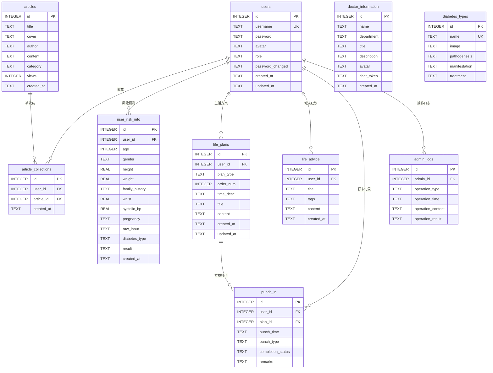
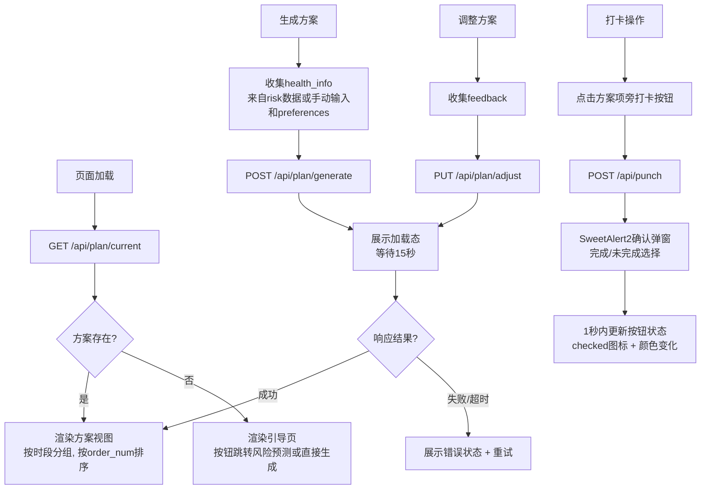
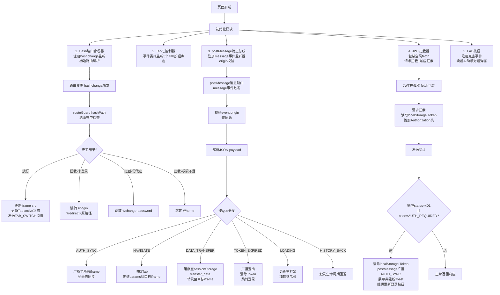

# 糖尿病预治智能助手 —— 详细设计文档

## 1. 系统架构详细设计

### 1.1 系统整体架构图

系统采用三层架构：前端层（浏览器SPA）→ Express中间层（API服务）→ Dify/DeepSeek AI层。

```
                        ┌──────────────────────────────────────────┐
                        │              用户浏览器                    │
                        │  ┌─────────────────────────────────────┐ │
                        │  │  index.html (主框架 SPA)             │ │
                        │  │  ┌──────────────────────────────┐   │ │
                        │  │  │  iframe 容器                  │   │ │
                        │  │  │  /pages/home.html             │   │ │
                        │  │  │  /pages/consultation.html     │   │ │
                        │  │  │  /pages/life-plan.html        │   │ │
                        │  │  │  /pages/news.html             │   │ │
                        │  │  │  /pages/profile.html          │   │ │
                        │  │  │  /pages/risk.html             │   │ │
                        │  │  │  /pages/punch.html            │   │ │
                        │  │  │  /pages/health-advice.html    │   │ │
                        │  │  │  /pages/admin.html            │   │ │
                        │  │  │  /pages/login.html            │   │ │
                        │  │  └──────────────────────────────┘   │ │
                        │  │  底部Tab栏 (5个Tab)                  │ │
                        │  │  FAB按钮 (z-index: 9999)             │ │
                        │  │  AI助手对话弹窗 (主框架层)           │ │
                        │  └─────────────────────────────────────┘ │
                        └──────────────────────────────────────────┘
                              │              │
                    HTTP/HTTPS│              │静态资源
                              ▼              ▼
          ┌──────────────────────────────────────────────────┐
          │      服务器2 (主) / 服务器3 (备)                   │
          │      Nginx 反向代理 + 负载均衡 + Keepalived        │
          │      VIP: 10.0.0.100 (虚拟IP)                     │
          └──────────────┬───────────────────────────────────┘
                         │ /api/* 代理转发
                         ▼
          ┌──────────────────────────────────────────────────┐
          │              服务器1 (数据服务器)                  │
          │  ┌─────────────────┐  ┌──────────────────────┐   │
          │  │ Nginx :80       │  │ Express :3000        │   │
          │  │ 静态文件服务     │  │ REST API + SSE代理   │   │
          │  │ /static/        │  │ JWT中间件            │   │
          │  │ /pages/         │  │ bcrypt密码校验       │   │
          │  │ /src/           │  │ SQLite读写           │   │
          │  └─────────────────┘  └──────────┬───────────┘   │
          │                                  │               │
          │                       ┌──────────▼───────────┐   │
          │                       │  SQLite 数据库文件    │   │
          │                       │  /data/database.sqlite│   │
          │                       └──────────────────────┘   │
          └──────────────────────────────────────────────────┘
                         │ HTTP API 调用
                         ▼
          ┌──────────────────────────────────────────────────┐
          │            外部云服务 (Dify + DeepSeek)            │
          │  Dify平台 (工作流 + Agent + 聊天助手)              │
          │  DeepSeek大模型API (模型推理)                      │
          └──────────────────────────────────────────────────┘
```

### 1.2 iframe SPA主框架架构图

```
index.html (主框架)
├── Hash路由管理器 (监听 hashchange 事件)
│   ├── 路由表映射 (路径 -> iframe src)
│   ├── 路由守卫 (Token校验 + 角色检查)
│   └── 登录回跳 (redirect参数)
├── Tab栏控制器
│   ├── 5个Tab按钮 (事件委托监听点击)
│   ├── active状态切换 (CSS class切换)
│   └── iframe src更新 + 路由hash同步
├── iframe容器 (id="app-iframe")
│   └── 当前活跃子页面
├── postMessage消息总线
│   ├── 监听子页面消息 (message事件)
│   ├── origin校验 (仅同源)
│   ├── 消息路由分发 (按type字段)
│   └── 数据缓存中转 (模块间数据传递)
├── FAB悬浮按钮 (position: fixed, z-index: 9999)
│   └── AI助手对话弹窗 (主框架层渲染, 遮罩覆盖)
├── JWT拦截器 (全局fetch拦截)
│   ├── 请求拦截: 自动附加 Authorization 头
│   ├── 响应拦截: 401处理 -> 清除Token -> 广播登出
│   └── Token过期提示条 (非阻断Toast)
└── 公共状态
    ├── localStorage: JWT Token, 免责确认状态, conversation_id
    ├── sessionStorage: 模块间中转数据缓存
    └── 内存变量: 当前活跃Tab, FAB弹窗状态
```

**postMessage通信流程**：

1. **登录态同步**: 主框架 login成功 -> 写入localStorage -> postMessage(AUTH_SYNC, {token, role}) -> 所有iframe监听并更新
2. **AI助手导航**: FAB弹窗内AI回复含导航指令 -> postMessage(NAVIGATE, {tab, params}) -> 主框架切换Tab+传递参数
3. **模块间数据传递**: iframe A -> postMessage(DATA_TRANSFER, {source, target, data}) -> 主框架缓存 -> 转发至iframe B

### 1.3 技术选型详情表

| 技术 | 版本 | 选型理由 | 引入方式 |
|------|------|---------|---------|
| Tailwind CSS | 3.x CDN | 原子化CSS，移动端优先，与U+平台一致 | `<script src="/static/lib/tailwindcss.js">` (本地) |
| Swiper | 11.x | 成熟的移动端轮播组件，支持触摸滑动 | `/static/lib/swiper-bundle.min.js` + `.min.css` |
| SweetAlert2 | 11.x | 美观的弹窗组件，替代原生alert/confirm | `/static/lib/sweetalert2.min.js` |
| Font Awesome | 6.x | 免费图标库，图标丰富 | `/static/lib/all.min.css` + `/static/webfonts/` |
| marked.js | 12.x | 轻量Markdown渲染，用于文章正文展示 | `/static/lib/marked.min.js` |
| Node.js | 18 LTS | 稳定长期支持版本，npm生态丰富 | 服务器安装 |
| Express | 4.x | 最流行的Node.js Web框架 | npm install express |
| better-sqlite3 | 9.x | Node.js同步SQLite驱动，性能优于异步 | npm install better-sqlite3 |
| jsonwebtoken | 9.x | JWT生成与验证 | npm install jsonwebtoken |
| bcryptjs | 2.x | 纯JS bcrypt实现，无需编译 | npm install bcryptjs |
| multer | 1.x | Express文件上传中间件 | npm install multer |
| dotenv | 16.x | .env环境变量加载 | npm install dotenv |
| Dify平台 | SaaS | 工作流编排、Agent管理、知识库检索 | HTTP API调用 |
| DeepSeek | API | 大模型推理引擎，支持Function Calling | 通过Dify间接调用 |
| SQLite | 3 | 零配置、单文件、适合实训规模 | 文件型数据库 |
| Nginx | 1.24+ | 高性能HTTP服务器、反向代理 | yum/apt安装 |
| Keepalived | 2.x | 主备模式高可用，VIP漂移 | yum/apt安装 |

### 1.4 模块划分与依赖关系

```
项目根目录 diabetesAssistant/
├── index.html                    # 主框架 (SPA入口)
├── package.json                  # Node.js依赖管理
├── server.js                     # Express启动入口
├── .env                          # 环境变量配置
├── .env.example                  # 环境变量模板
│
├── src/                          # 前端源码
│   ├── pages/                    # 各模块HTML文件 (iframe子页面)
│   │   ├── home.html             # 系统首页
│   │   ├── consultation.html     # 医师咨询 (医生列表/对话)
│   │   ├── life-plan.html        # 生活方案
│   │   ├── news.html             # 健康资讯 (列表/详情/收藏)
│   │   ├── profile.html          # 个人中心
│   │   ├── risk.html             # 糖尿病风险预测
│   │   ├── punch.html            # 打卡记录与分析
│   │   ├── health-advice.html    # 健康建议列表
│   │   ├── admin.html            # 智能管理 (管理员)
│   │   ├── change-password.html  # 管理员强制密码修改
│   │   └── login.html            # 登录/注册
│   ├── css/                      # 公共CSS样式
│   │   ├── variables.css         # CSS变量定义 (设计系统)
│   │   ├── common.css            # 公共组件样式
│   │   └── skeleton.css          # 骨架屏样式
│   ├── js/                       # 公共JS模块
│   │   ├── api.js                # API请求封装 (fetch + JWT + 拦截器)
│   │   ├── auth.js               # JWT认证工具 (Token读写、解析、过期检测)
│   │   ├── message.js            # postMessage通信工具
│   │   ├── utils.js              # 通用工具函数 (日期格式化、防抖截流等)
│   │   └── ui.js                 # UI工具 (Toast、Loading、骨架屏)
│   └── js/pages/                 # 各模块页面JS
│       ├── home.js               # 首页逻辑
│       ├── consultation.js       # 医师咨询逻辑
│       ├── life-plan.js          # 生活方案逻辑
│       ├── news.js               # 健康资讯逻辑
│       ├── profile.js            # 个人中心逻辑
│       ├── risk.js               # 风险预测逻辑
│       ├── punch.js              # 打卡逻辑
│       ├── health-advice.js      # 健康建议逻辑
│       ├── admin.js              # 智能管理逻辑
│       └── login.js              # 登录/注册逻辑
│
├── server/                       # Express后端源码
│   ├── app.js                    # Express应用配置 (中间件注册)
│   ├── routes/                   # 路由模块 (14个文件)
│   │   ├── auth.js               # 认证路由 (/api/auth/*)
│   │   ├── user.js               # 用户路由 (/api/user/*)
│   │   ├── doctors.js            # 医生路由 (/api/doctors/*)
│   │   ├── chat.js               # 医师对话路由 (/api/chat/*)
│   │   ├── risk.js               # 风险预测路由 (/api/risk/*)
│   │   ├── plan.js               # 方案路由 (/api/plan/*)
│   │   ├── punch.js              # 打卡路由 (/api/punch/*)
│   │   ├── articles.js           # 资讯路由 (/api/articles/*)
│   │   ├── diabetes.js           # 糖尿病类型路由 (/api/diabetes-types/*)
│   │   ├── assistant.js          # AI助手路由 (/api/assistant/*)
│   │   ├── admin.js              # 管理路由 (/api/admin/*)
│   │   ├── dify.js               # Dify代理路由 (/api/dify/*)
│   │   └── upload.js             # 文件上传路由 (/api/upload/*)
│   ├── middleware/               # Express中间件
│   │   ├── auth.js               # JWT认证中间件
│   │   ├── admin.js              # 管理员角色校验中间件
│   │   └── difyAuth.js           # Dify API Key校验中间件
│   ├── services/                 # 业务逻辑层
│   │   ├── difyService.js        # Dify API调用封装
│   │   └── sseProxy.js           # SSE流式代理工具
│   └── db/                       # 数据库层
│       ├── database.js           # SQLite连接管理
│       ├── init.sql              # 数据库初始化DDL
│       └── seed.sql              # 初始数据预填充
│
├── static/                       # 静态资源
│   ├── lib/                      # 第三方库
│   │   ├── tailwindcss.js        # Tailwind CSS
│   │   ├── swiper-bundle.min.js  # Swiper
│   │   ├── swiper-bundle.min.css
│   │   ├── sweetalert2.min.js    # SweetAlert2
│   │   ├── all.min.css           # Font Awesome
│   │   └── marked.min.js         # Markdown渲染
│   ├── webfonts/                 # Font Awesome字体文件
│   ├── images/                   # 预置图片资源
│   │   ├── logo_main.png
│   │   ├── doctors/    (doc1.jpg, doc2.png, doc3.png)
│   │   ├── diabetes/   (t1.jpg, t2.jpg, t3.jpg, t4.jpg)
│   │   ├── banner/     (lb1.png, lb2.png, lb3.jpeg)
│   │   └── default/    (default-avatar.png, default-cover.png)
│   └── uploads/                   # 用户上传
│       └── avatars/               # 用户头像
│
└── data/                         # 运行时数据
    └── database.sqlite           # SQLite数据库文件(运行时生成)
```

**模块依赖方向规则**：
- 公共模块 (api.js, auth.js, message.js, ui.js) 不依赖任何页面模块
- iframe子页面可依赖公共模块，不可依赖其他页面模块
- 页面模块间通过postMessage经主框架中转通信
- 禁止iframe子页面直接操作主框架DOM

### 1.5 跨模块通信机制详细设计

#### 1.5.1 postMessage消息类型枚举

| 消息类型 (type) | 方向 | 用途 | payload 字段定义 |
|----------------|------|------|-----------------|
| AUTH_SYNC | 主框架 -> iframe | 登录/登出状态广播 | { token: string|null, role: string|null } |
| NAVIGATE | AI助手弹窗 -> 主框架 | AI助手触发跨模块导航 | { tab: string, params?: object, url?: string } |
| DATA_TRANSFER | iframe -> 主框架 -> iframe | 模块间数据传递 | { source: string, target: string, data: object, timestamp: number } |
| TOKEN_EXPIRED | 主框架 -> iframe | Token过期通知 | {} |
| HISTORY_BACK | iframe -> 主框架 | 子页面请求返回 | {} |
| LOADING | iframe -> 主框架 | 子页面加载状态通知 | { loading: boolean } |
| TAB_SWITCH | 主框架 -> iframe | Tab切换通知(激活/失活) | { tab: string, active: boolean } |

#### 1.5.2 origin校验实现

```javascript
// message.js - postMessage通信工具模块
const ALLOWED_ORIGIN = window.location.origin;

function sendMessage(targetWindow, type, payload) {
  targetWindow.postMessage(
    JSON.stringify({ type, payload, timestamp: Date.now() }),
    ALLOWED_ORIGIN
  );
}

function onMessage(callback) {
  window.addEventListener('message', (event) => {
    if (event.origin !== ALLOWED_ORIGIN) {
      return; // 静默丢弃非同源消息
    }
    try {
      const message = JSON.parse(event.data);
      if (message && message.type) {
        callback(message, event.source);
      }
    } catch (e) {
      // 忽略非JSON消息
    }
  });
}
```

#### 1.5.3 数据流图

```
登录流程:
  用户输入凭据 -> login.html -> POST /api/auth/login
    -> api.js收到{token, role}
    -> localStorage.setItem('token', token)
    -> sendMessage(window.parent, 'AUTH_SYNC', {token, role})
    -> 主框架收到 -> 广播至所有iframe -> 各iframe更新登录态

跨模块数据传递 (风险预测->生活方案):
  risk.html -> 用户完成风险预测
    -> postMessage(parent, DATA_TRANSFER, {
         source: 'risk', target: 'life-plan',
         data: { riskLevel: 'high', diabetesType: '2型' }
       })
    -> 主框架message总线 -> 缓存至 sessionStorage('transfer_data')
    -> 主框架切换Tab至'life-plan'
    -> 主框架发送postMessage至life-plan.html (DATA_TRANSFER转发)
    -> life-plan.html 收到数据 -> 用于方案生成参数预填
```

### 1.6 前端路由详细设计

#### 1.6.1 Hash路由完整映射表

| URL Hash | 对应iframe src | 需认证 | 需admin | 说明 |
|----------|---------------|--------|---------|------|
| #/home | /pages/home.html | 否 | 否 | 系统首页(默认路由) |
| #/consultation | /pages/consultation.html | 否 | 否 | 医师咨询(医生列表) |
| #/consultation/doctor/:id | /pages/consultation.html?id=:id | 是 | 否 | 医师对话(查询参数传医生ID) |
| #/life-plan | /pages/life-plan.html | 是 | 否 | 生活方案 |
| #/news | /pages/news.html | 否 | 否 | 健康资讯列表 |
| #/news/article/:id | /pages/news.html?id=:id | 否 | 否 | 文章详情 |
| #/profile | /pages/profile.html | 是 | 否 | 个人中心 |
| #/profile/risk | /pages/risk.html | 是 | 否 | 风险预测(我的Tab子页面) |
| #/profile/punch | /pages/punch.html | 是 | 否 | 打卡记录(我的Tab子页面) |
| #/profile/advice | /pages/health-advice.html | 是 | 否 | 健康建议(我的Tab子页面) |
| #/admin | /pages/admin.html | 是 | 是 | 智能管理 |
| #/change-password | /pages/change-password.html | 是 | 否 | 管理员强制密码修改页（仅首次登录） |
| #/login | /pages/login.html?redirect=来源路径 | 否 | 否 | 登录/注册 |

#### 1.6.2 路由守卫伪代码

```javascript
// index.html 主框架路由守卫
const publicRoutes = ['home', 'news', 'login'];  // consultation已移除，改由子路由粒度检查（见下方）
const adminRoutes = ['admin'];
const forcePasswordChangeRoute = 'change-password'; // 强制密码修改页

// 细粒度路由权限表：定义主路由下的子路由访问级别
// 格式: { mainRoute: { subRoutes: [{ pattern: '子路径前缀', authRequired: true/false }] } }
// 当subRoutes中的pattern匹配子路径前缀时，按authRequired决定是否需认证
// 未匹配任何subRoutes的路径，默认要求认证(安全默认拒绝)
const routeAuthRules = {
  'consultation': {
    defaultPublic: true,  // consultation基路径(医生列表)公开
    subRoutes: [
      { pattern: 'doctor', authRequired: true }  // consultation/doctor/* 需认证
    ]
  }
};

function routeGuard(hashPath) {
  const path = hashPath.replace('#/', '');
  const segments = path.split('/');
  const mainRoute = segments[0];

  // 1. 公开路由直接放行
  if (publicRoutes.includes(mainRoute)) {
    return { allowed: true };
  }

  // 1.5 细粒度子路由检查: 对于主路由在routeAuthRules中定义的路由，按subRoutes规则判断
  if (routeAuthRules[mainRoute]) {
    const rule = routeAuthRules[mainRoute];
    const subPath = segments.slice(1).join('/');  // 提取子路径部分

    if (!subPath) {
      // 仅主路由，无子路径：使用defaultPublic
      return { allowed: rule.defaultPublic };
    }

    // 匹配子路由规则
    const matchedSubRule = rule.subRoutes.find(r => subPath.startsWith(r.pattern));
    if (matchedSubRule) {
      if (!matchedSubRule.authRequired) {
        return { allowed: true };  // 子路由规则标记为公开，放行
      }
    } else {
      // 未匹配任何子路由规则，默认要求认证（安全默认拒绝）
      // 继续执行后续认证检查
    }
  }

  // 2. 检查Token是否存在
  const token = localStorage.getItem('token');
  if (!token || isTokenExpired(token)) {
    return {
      allowed: false,
      redirect: '#/login?redirect=' + encodeURIComponent(hashPath)
    };
  }

  // 3. 管理员首次登录强制修改密码拦截
  //    登录接口返回must_change_password=true时，前端在localStorage中存储此标志
  const mustChangePwd = localStorage.getItem('must_change_password');
  if (getTokenRole(token) === 'admin' && mustChangePwd === 'true') {
    // 仅放行密码修改页和登出操作，其余页面一律跳转到密码修改页
    if (mainRoute !== forcePasswordChangeRoute) {
      return {
        allowed: false,
        redirect: '#/change-password'
      };
    }
  }

  // 4. 管理员路由额外检查role
  if (adminRoutes.includes(mainRoute)) {
    const role = getTokenRole(token);
    if (role !== 'admin') {
      return { allowed: false, redirect: '#/home' };
    }
  }

  return { allowed: true };
}
```

**管理员强制密码修改流程**:
1. 管理员使用预置账号登录 -> POST /api/auth/login 返回 `must_change_password: true`
2. 前端将 `must_change_password` 标志写入 localStorage
3. 路由守卫拦截所有非 `#/change-password` 路径的导航，强制跳转到 `#/change-password`
4. `/pages/change-password.html` 页面展示密码修改表单（新密码 + 确认新密码），不允许绕过
5. 用户提交新密码 -> PUT /api/user/password（首次修改无需提供old_password，后端根据password_changed='0'判断）
6. 后端更新密码哈希并设置 password_changed='1' -> 前端清除 `must_change_password` 标志
7. 路由守卫放行，管理员可正常使用管理功能

### 1.7 三条数据操作路径的架构流程图

```
路径1: 常规CRUD路径 (标准业务操作)
  前端 fetch()
    -> Express REST端点
    -> better-sqlite3直接执行SQL
    -> 返回JSON响应
  适用: 注册/登录、个人信息读写、打卡记录CRUD、文章收藏、操作日志查询

路径2: AI驱动的Text2SQL路径 (自然语言->数据库)
  管理员场景:
    前端 admin.html SSE fetch()
      -> POST /api/admin/chat (JWT认证, role=admin校验)
      -> Express代理 -> Dify admin-manager-agent
      -> Agent Text2SQL工具回调 POST /api/admin/execute
           (携带DIFY_SERVICE_API_KEY + user_id)
      -> Express端点 (API Key校验 -> 执行SQL -> 写入admin_logs)
      -> SSE流返回结果

  AI助手场景:
    前端 FAB弹窗 SSE fetch()
      -> POST /api/assistant/chat (JWT认证)
      -> Express代理 -> Dify diabetes-assistant-agent
      -> Agent Text2SQL工具回调 POST /api/admin/execute
           (携带DIFY_SERVICE_API_KEY + user_id)
      -> Express端点 (API Key校验 -> 行级权限约束 -> 执行SQL)
      -> SSE流返回结果

路径3: AI内容生成持久化路径 (Dify工作流->数据库)
  前端 POST请求
    -> Express端点 (如POST /api/risk/predict)
    -> Express调用Dify工作流API (blocking模式)
    -> 接收Dify完整响应 -> 解析AI生成内容 -> 数据结构化
    -> INSERT/UPDATE SQLite数据库
       (user_risk_info / life_plans / articles)
    -> 返回结果给前端
```

---

## 2. 数据库详细设计

### 2.1 完整ER图 (Mermaid)



### 2.2 完整DDL语句

```sql
-- ============================================================
-- 数据库初始化DDL脚本 (server/db/init.sql)
-- 数据库: SQLite 3
-- ============================================================

-- 1. 用户表
CREATE TABLE IF NOT EXISTS users (
    id INTEGER PRIMARY KEY AUTOINCREMENT,
    username TEXT NOT NULL UNIQUE,
    password TEXT NOT NULL,
    avatar TEXT DEFAULT NULL,
    role TEXT NOT NULL DEFAULT 'user' CHECK(role IN ('user', 'admin')),
    password_changed TEXT NOT NULL DEFAULT '0' CHECK(password_changed IN ('0', '1')),
    created_at TEXT NOT NULL DEFAULT (datetime('now', 'localtime')),
    updated_at TEXT NOT NULL DEFAULT (datetime('now', 'localtime'))
);

-- 2. 医生信息表
CREATE TABLE IF NOT EXISTS doctor_information (
    id INTEGER PRIMARY KEY AUTOINCREMENT,
    name TEXT NOT NULL,
    department TEXT NOT NULL,
    title TEXT NOT NULL,
    description TEXT DEFAULT '',
    avatar TEXT DEFAULT NULL,
    chat_token TEXT NOT NULL,
    created_at TEXT NOT NULL DEFAULT (datetime('now', 'localtime'))
);

-- 3. 科普文章表
CREATE TABLE IF NOT EXISTS articles (
    id INTEGER PRIMARY KEY AUTOINCREMENT,
    title TEXT NOT NULL,
    cover TEXT DEFAULT NULL,
    author TEXT NOT NULL DEFAULT 'AI健康助手',
    content TEXT NOT NULL,
    category TEXT NOT NULL DEFAULT '糖尿病知识科普',
    views INTEGER NOT NULL DEFAULT 0,
    created_at TEXT NOT NULL DEFAULT (datetime('now', 'localtime'))
);

-- 4. 糖尿病类型表
CREATE TABLE IF NOT EXISTS diabetes_types (
    id INTEGER PRIMARY KEY AUTOINCREMENT,
    name TEXT NOT NULL UNIQUE,
    image TEXT DEFAULT NULL,
    pathogenesis TEXT NOT NULL,
    manifestation TEXT NOT NULL,
    treatment TEXT NOT NULL
);

-- 5. 文章收藏表
CREATE TABLE IF NOT EXISTS article_collections (
    id INTEGER PRIMARY KEY AUTOINCREMENT,
    user_id INTEGER NOT NULL,
    article_id INTEGER NOT NULL,
    created_at TEXT NOT NULL DEFAULT (datetime('now', 'localtime')),
    FOREIGN KEY (user_id) REFERENCES users(id) ON DELETE CASCADE,
    FOREIGN KEY (article_id) REFERENCES articles(id) ON DELETE CASCADE,
    UNIQUE(user_id, article_id)
);

-- 6. 用户风险信息表
CREATE TABLE IF NOT EXISTS user_risk_info (
    id INTEGER PRIMARY KEY AUTOINCREMENT,
    user_id INTEGER NOT NULL,
    age INTEGER NOT NULL,
    gender TEXT NOT NULL CHECK(gender IN ('男', '女')),
    height REAL NOT NULL,
    weight REAL NOT NULL,
    family_history TEXT NOT NULL CHECK(family_history IN ('有', '无')),
    waist REAL DEFAULT NULL,
    systolic_bp REAL DEFAULT NULL,
    pregnancy TEXT DEFAULT NULL,
    raw_input TEXT DEFAULT NULL,
    diabetes_type TEXT DEFAULT NULL,
    result TEXT DEFAULT NULL,
    created_at TEXT NOT NULL DEFAULT (datetime('now', 'localtime')),
    FOREIGN KEY (user_id) REFERENCES users(id) ON DELETE CASCADE
);

-- 7. 生活方案表
CREATE TABLE IF NOT EXISTS life_plans (
    id INTEGER PRIMARY KEY AUTOINCREMENT,
    user_id INTEGER NOT NULL,
    plan_type TEXT NOT NULL CHECK(plan_type IN ('饮食', '运动', '其他')),
    order_num INTEGER NOT NULL DEFAULT 0,
    time_desc TEXT DEFAULT '',
    title TEXT NOT NULL,
    content TEXT NOT NULL,
    created_at TEXT NOT NULL DEFAULT (datetime('now', 'localtime')),
    updated_at TEXT NOT NULL DEFAULT (datetime('now', 'localtime')),
    FOREIGN KEY (user_id) REFERENCES users(id) ON DELETE CASCADE
);

-- 8. 生活建议表
CREATE TABLE IF NOT EXISTS life_advice (
    id INTEGER PRIMARY KEY AUTOINCREMENT,
    user_id INTEGER NOT NULL,
    title TEXT NOT NULL,
    tags TEXT DEFAULT '[]',
    content TEXT NOT NULL,
    created_at TEXT NOT NULL DEFAULT (datetime('now', 'localtime')),
    FOREIGN KEY (user_id) REFERENCES users(id) ON DELETE CASCADE
);

-- 9. 打卡记录表
CREATE TABLE IF NOT EXISTS punch_in (
    id INTEGER PRIMARY KEY AUTOINCREMENT,
    user_id INTEGER NOT NULL,
    plan_id INTEGER DEFAULT NULL,
    punch_time TEXT NOT NULL DEFAULT (datetime('now', 'localtime')),
    punch_type TEXT NOT NULL CHECK(punch_type IN ('饮食', '运动')),
    completion_status TEXT NOT NULL CHECK(completion_status IN ('已完成', '未完成')),
    remarks TEXT DEFAULT '',
    FOREIGN KEY (user_id) REFERENCES users(id) ON DELETE CASCADE,
    FOREIGN KEY (plan_id) REFERENCES life_plans(id) ON DELETE SET NULL
);

-- 10. 管理员操作日志表
CREATE TABLE IF NOT EXISTS admin_logs (
    id INTEGER PRIMARY KEY AUTOINCREMENT,
    admin_id INTEGER NOT NULL,
    operation_type TEXT NOT NULL,
    operation_time TEXT NOT NULL DEFAULT (datetime('now', 'localtime')),
    operation_content TEXT NOT NULL,
    operation_result TEXT DEFAULT '',
    FOREIGN KEY (admin_id) REFERENCES users(id) ON DELETE CASCADE
);
```

### 2.3 索引策略

| 表名 | 索引名 | 索引字段 | 索引类型 | 理由 |
|------|--------|---------|---------|------|
| users | idx_users_username | username | UNIQUE | 登录时用户名精确查询，最高频 |
| users | idx_users_role | role | 普通 | 管理员列表查询 |
| article_collections | idx_collections_user | user_id | 普通 | 查询用户收藏列表 |
| article_collections | idx_collections_article | article_id | 普通 | 查询文章被收藏数 |
| article_collections | idx_collections_user_article | (user_id, article_id) | UNIQUE | 防重复收藏+快速判断收藏态 |
| articles | idx_articles_category | category | 普通 | 按分类筛选文章 |
| articles | idx_articles_created | created_at | 普通 | 按时间排序、分页 |
| user_risk_info | idx_risk_user | user_id | 普通 | 查询用户历史预测记录 |
| user_risk_info | idx_risk_user_created | (user_id, created_at) | 复合 | 获取用户最新预测(降级数据源) |
| life_plans | idx_plans_user | user_id | 普通 | 查询用户方案列表 |
| life_plans | idx_plans_user_type | (user_id, plan_type) | 复合 | 按类型筛选方案项 |
| life_advice | idx_advice_user | user_id | 普通 | 查询用户建议列表 |
| punch_in | idx_punch_user | user_id | 普通 | 查询用户打卡记录 |
| punch_in | idx_punch_user_time | (user_id, punch_time) | 复合 | 按日期范围筛选打卡 |
| punch_in | idx_punch_plan | plan_id | 普通 | 按方案项关联打卡 |
| admin_logs | idx_logs_admin | admin_id | 普通 | 按管理员查询操作日志 |
| admin_logs | idx_logs_time | operation_time | 普通 | 按时间排序 |

```sql
-- 索引创建SQL (包含在init.sql中)
CREATE UNIQUE INDEX IF NOT EXISTS idx_users_username ON users(username);
CREATE INDEX IF NOT EXISTS idx_users_role ON users(role);
CREATE INDEX IF NOT EXISTS idx_collections_user ON article_collections(user_id);
CREATE INDEX IF NOT EXISTS idx_collections_article ON article_collections(article_id);
CREATE UNIQUE INDEX IF NOT EXISTS idx_collections_user_article ON article_collections(user_id, article_id);
CREATE INDEX IF NOT EXISTS idx_articles_category ON articles(category);
CREATE INDEX IF NOT EXISTS idx_articles_created ON articles(created_at);
CREATE INDEX IF NOT EXISTS idx_risk_user ON user_risk_info(user_id);
CREATE INDEX IF NOT EXISTS idx_risk_user_created ON user_risk_info(user_id, created_at);
CREATE INDEX IF NOT EXISTS idx_plans_user ON life_plans(user_id);
CREATE INDEX IF NOT EXISTS idx_plans_user_type ON life_plans(user_id, plan_type);
CREATE INDEX IF NOT EXISTS idx_advice_user ON life_advice(user_id);
CREATE INDEX IF NOT EXISTS idx_punch_user ON punch_in(user_id);
CREATE INDEX IF NOT EXISTS idx_punch_user_time ON punch_in(user_id, punch_time);
CREATE INDEX IF NOT EXISTS idx_punch_plan ON punch_in(plan_id);
CREATE INDEX IF NOT EXISTS idx_logs_admin ON admin_logs(admin_id);
CREATE INDEX IF NOT EXISTS idx_logs_time ON admin_logs(operation_time);
```

### 2.4 初始数据INSERT脚本

```sql
-- ============================================================
-- 初始数据预填充脚本 (server/db/seed.sql)
-- ============================================================

-- 1. 管理员账号 (默认密码: admin123)
-- bcrypt哈希由部署前执行: node -e "const bcrypt=require('bcryptjs');bcrypt.hash('admin123',10).then(h=>console.log(h))"
INSERT INTO users (username, password, role, password_changed) VALUES (
    'admin',
    '$2a$10$PLACEHOLDER_BCRYPT_HASH_GOES_HERE',
    'admin',
    '0'
);

-- 2. 预置医生 (chat_token为占位符, 需在Dify平台创建聊天助手后替换)
INSERT INTO doctor_information (name, department, title, description, avatar, chat_token) VALUES
('张明远', '内分泌科', '主任医师',
 '从事内分泌代谢疾病临床工作20年，擅长糖尿病及其并发症的综合管理，精通个体化治疗方案设计。',
 '/static/images/doctors/doc1.jpg', 'app-PLACEHOLDER_DOC1'),
('李静怡', '糖尿病专科', '专科医师',
 '糖尿病专科医师，专注糖尿病患者的个体化治疗方案制定和长期随访管理，在饮食运动指导方面经验丰富。',
 '/static/images/doctors/doc2.png', 'app-PLACEHOLDER_DOC2'),
('王建国', '营养科', '营养科专家',
 '临床营养学专家，擅长糖尿病患者的医学营养治疗和个性化饮食方案设计，帮助数百位患者通过饮食管理改善血糖。',
 '/static/images/doctors/doc3.png', 'app-PLACEHOLDER_DOC3');

-- 3. 糖尿病类型科普内容
INSERT INTO diabetes_types (name, image, pathogenesis, manifestation, treatment) VALUES
('1型糖尿病', '/static/images/diabetes/t1.jpg',
 '1型糖尿病是一种自身免疫性疾病，机体免疫系统错误地攻击并破坏胰岛beta细胞，导致胰岛素绝对缺乏。遗传因素和环境因素（如病毒感染）共同参与发病。',
 '多发生于儿童和青少年，起病较急，症状明显——多饮、多食、多尿、体重减轻（三多一少）。由于胰岛素严重缺乏，易发生糖尿病酮症酸中毒等急性并发症。',
 '需终身依赖胰岛素治疗，通过每日注射或胰岛素泵维持血糖稳定。同时需定期监测血糖，配合饮食控制和适量运动，预防并发症的发生。'),
('2型糖尿病', '/static/images/diabetes/t2.jpg',
 '2型糖尿病是最常见的糖尿病类型，主要病理机制为胰岛素抵抗和胰岛素分泌相对不足。与遗传易感性、不良生活方式（高热量饮食、缺乏运动）、肥胖等因素密切相关。',
 '多见于中老年人但近年来有年轻化趋势。起病较隐匿，早期症状不明显。常有肥胖、高血压、血脂异常等代谢综合征表现。部分患者以并发症首发就诊。',
 '生活方式干预是基础（饮食控制、规律运动、体重管理）。根据病情可口服降糖药或注射胰岛素。定期监测血糖、糖化血红蛋白，每年筛查并发症。'),
('妊娠期糖尿病', '/static/images/diabetes/t3.jpg',
 '妊娠期糖尿病是妊娠期间首次发现或发生的糖代谢异常。妊娠期胎盘分泌的激素（如人胎盘生乳素）具有拮抗胰岛素的作用，导致血糖升高。',
 '多数患者无明显症状，通常在孕24-28周糖耐量筛查时发现。可能出现多饮、多尿、反复感染等表现。对母婴均有潜在风险（巨大儿、新生儿低血糖等）。',
 '首选饮食控制和适当运动。若饮食控制后血糖仍不达标，需使用胰岛素治疗（妊娠期不宜使用口服降糖药）。产后多数可恢复，但未来2型糖尿病风险显著升高，需定期随访。'),
('其他特殊类型糖尿病', '/static/images/diabetes/t4.jpg',
 '包括MODY（青少年起病的成人型糖尿病）、胰腺疾病继发性糖尿病、内分泌疾病继发性糖尿病、药物或化学物质诱导的糖尿病等。由特定的遗传缺陷、疾病或外部因素引起。',
 '临床表现因具体病因不同而异。MODY患者通常25岁前发病，有糖尿病家族史，非肥胖体型；胰腺疾病继发性糖尿病伴有胰腺炎、胰腺手术等病史。',
 '针对原发疾病进行治疗。根据胰岛功能状况选择口服降糖药或胰岛素治疗。部分特殊类型（如MODY）有特定的药物敏感性差异，需个体化精准治疗。');

-- 4. 示例科普文章
INSERT INTO articles (title, cover, author, content, category, views) VALUES
('糖尿病患者的饮食指南', '/static/images/default/default-cover.png', 'AI健康助手',
 '# 糖尿病患者的饮食指南

合理的饮食管理是糖尿病治疗的基石。科学的饮食计划能帮助稳定血糖、预防并发症。

## 饮食原则

- **控制总热量摄入**：根据身高、体重、活动量计算每日所需热量
- **均衡营养配比**：碳水化合物50%-60%，蛋白质15%-20%，脂肪25%-30%
- **定时定量进餐**：规律进食，避免暴饮暴食
- **优选低GI食物**：选择升糖指数低的食物

## 推荐食物

1. **主食类**：全麦面包、燕麦、糙米、荞麦等粗粮
2. **蔬菜类**：绿叶蔬菜、西兰花、黄瓜、番茄等
3. **蛋白质**：鱼、去皮禽肉、豆制品、鸡蛋
4. **水果**：苹果、梨、柚子、樱桃等（适量食用）

## 避免的食物

- 含糖饮料和甜点
- 精制碳水化合物（白面包、白米饭过量）
- 高脂肪肉类和油炸食品
- 过量饮酒

> 以上内容由AI自动生成，仅供参考，不构成医疗诊断或治疗建议。如有健康问题，请及时咨询专业医师。
', '饮食指导', 1200),
('适合糖尿病患者的运动建议', '/static/images/default/default-cover.png', 'AI健康助手',
 '# 适合糖尿病患者的运动建议

规律运动是糖尿病管理的重要组成部分。适当的运动可以增加胰岛素敏感性、帮助控制血糖、改善心血管健康。

## 运动类型推荐

### 有氧运动
- **快走**：每天30分钟，是最安全有效的运动方式
- **游泳**：对关节压力小，适合肥胖患者
- **骑自行车**：中等强度，可持续较长时间
- **太极拳**：适合老年人，改善平衡和柔韧性

### 抗阻训练
- 每周2-3次，与有氧运动交替进行
- 使用弹力带、哑铃或自身体重训练
- 从低强度开始，循序渐进

## 运动注意事项

1. **运动前检查血糖**：血糖低于5.6mmol/L应先补充碳水化合物
2. **避免空腹运动**：餐后1-2小时运动最佳
3. **穿着合适的鞋袜**：防止足部损伤
4. **随身携带糖果**：预防低血糖
5. **避免高强度运动**：血糖波动过大的患者应避免

## 运动处方制定

建议在医生指导下制定个性化运动处方，包括运动类型、强度、频率和持续时间。

> 以上内容由AI自动生成，仅供参考，不构成医疗诊断或治疗建议。如有健康问题，请及时咨询专业医师。
', '运动指南', 856),
('如何正确监测血糖水平', '/static/images/default/default-cover.png', 'AI健康助手',
 '# 如何正确监测血糖水平

自我血糖监测是糖尿病管理的重要环节。通过定期监测，患者可以了解饮食、运动和药物对血糖的影响，及时调整治疗方案。

## 监测时间点

| 时间点 | 意义 |
|--------|------|
| 空腹血糖 | 反映基础胰岛素分泌能力 |
| 餐前血糖 | 指导餐前胰岛素或药物调整 |
| 餐后2小时血糖 | 反映饮食和药物的综合效果 |
| 睡前血糖 | 预防夜间低血糖 |
| 凌晨3点血糖 | 鉴别黎明现象和Somogyi效应 |

## 正确的测量步骤

1. 用肥皂和温水洗手并擦干
2. 将试纸插入血糖仪
3. 用采血针刺破指尖侧面（非指腹正中）
4. 将血滴接触试纸吸血端
5. 等待数秒读取结果并记录

## 血糖控制目标（中国2型糖尿病防治指南）

- 空腹血糖：4.4-7.0 mmol/L
- 餐后2小时血糖：<10.0 mmol/L
- 糖化血红蛋白（HbA1c）：<7.0%

## 记录与分析

建议建立血糖监测日志，记录测量时间、血糖值、饮食内容、运动情况和用药信息，便于医生分析血糖波动规律。

> 以上内容由AI自动生成，仅供参考，不构成医疗诊断或治疗建议。如有健康问题，请及时咨询专业医师。
', '生活习惯', 1500);
```

### 2.5 数据字典（按表详细说明）

#### users (用户表)

| 字段 | 类型 | 约束 | 默认值 | 业务含义 |
|------|------|------|--------|---------|
| id | INTEGER | PK, AUTOINCREMENT | 自增 | 用户唯一标识 |
| username | TEXT | NOT NULL, UNIQUE | - | 登录用户名，全局唯一 |
| password | TEXT | NOT NULL | - | bcrypt哈希后的密码密文（60字符） |
| avatar | TEXT | - | NULL | 头像文件相对路径 |
| role | TEXT | NOT NULL, CHECK IN ('user','admin') | 'user' | 角色：user=普通用户, admin=管理员 |
| password_changed | TEXT | NOT NULL, CHECK IN ('0','1') | '0' | 管理员首次登录密码修改标记：0=未修改(需强制修改), 1=已修改。仅对role=admin的用户有意义，普通用户的此字段值忽略 |
| created_at | TEXT | NOT NULL | datetime('now') | 注册时间 (ISO8601) |
| updated_at | TEXT | NOT NULL | datetime('now') | 最后更新时间 |

#### doctor_information (医生信息表)

| 字段 | 类型 | 约束 | 默认值 | 业务含义 |
|------|------|------|--------|---------|
| id | INTEGER | PK | 自增 | 医生唯一标识 |
| name | TEXT | NOT NULL | - | 医生姓名 |
| department | TEXT | NOT NULL | - | 科室 |
| title | TEXT | NOT NULL | - | 职称 |
| description | TEXT | - | '' | 医生简介，在对话欢迎页展示 |
| avatar | TEXT | - | NULL | 头像路径 |
| chat_token | TEXT | NOT NULL | - | Dify聊天助手API Secret, 格式app-XXX |
| created_at | TEXT | NOT NULL | datetime('now') | 记录创建时间 |

#### articles (科普文章表)

| 字段 | 类型 | 约束 | 默认值 | 业务含义 |
|------|------|------|--------|---------|
| id | INTEGER | PK | 自增 | 文章唯一标识 |
| title | TEXT | NOT NULL | - | 文章标题 |
| cover | TEXT | - | NULL | 封面图片URL（外部URL或相对路径） |
| author | TEXT | NOT NULL | 'AI健康助手' | 文章作者 |
| content | TEXT | NOT NULL | - | 文章正文，Markdown格式存储 |
| category | TEXT | NOT NULL | '糖尿病知识科普' | 分类标签 |
| views | INTEGER | NOT NULL | 0 | 阅读量计数 |
| created_at | TEXT | NOT NULL | datetime('now') | 发布时间 |

#### diabetes_types (糖尿病类型表)

| 字段 | 类型 | 约束 | 默认值 | 业务含义 |
|------|------|------|--------|---------|
| id | INTEGER | PK | 自增 | 类型唯一标识 |
| name | TEXT | NOT NULL, UNIQUE | - | 糖尿病类型名称 |
| image | TEXT | - | NULL | 配图路径 |
| pathogenesis | TEXT | NOT NULL | - | 发病机制描述文本 |
| manifestation | TEXT | NOT NULL | - | 临床表现描述文本 |
| treatment | TEXT | NOT NULL | - | 治疗方式描述文本 |

#### article_collections (文章收藏表)

| 字段 | 类型 | 约束 | 默认值 | 业务含义 |
|------|------|------|--------|---------|
| id | INTEGER | PK | 自增 | 收藏记录ID |
| user_id | INTEGER | NOT NULL, FK | - | 收藏用户ID |
| article_id | INTEGER | NOT NULL, FK | - | 被收藏文章ID |
| created_at | TEXT | NOT NULL | datetime('now') | 收藏时间 |
| (user_id,article_id) | - | UNIQUE | - | 防重复收藏约束 |

#### user_risk_info (用户风险信息表)

| 字段 | 类型 | 约束 | 默认值 | 业务含义 |
|------|------|------|--------|---------|
| id | INTEGER | PK | 自增 | 预测记录ID |
| user_id | INTEGER | NOT NULL, FK | - | 用户ID |
| age | INTEGER | NOT NULL | - | 年龄 |
| gender | TEXT | NOT NULL, CHECK('男','女') | - | 性别 |
| height | REAL | NOT NULL | - | 身高(cm) |
| weight | REAL | NOT NULL | - | 体重(kg) |
| family_history | TEXT | NOT NULL, CHECK('有','无') | - | 家族糖尿病史 |
| waist | REAL | - | NULL | 腰围(cm), 可选 |
| systolic_bp | REAL | - | NULL | 收缩压(mmHg), 可选 |
| pregnancy | TEXT | - | NULL | 妊娠状态, 仅女性有效 |
| raw_input | TEXT | - | NULL | 原始用户输入JSON存档 |
| diabetes_type | TEXT | - | NULL | AI预测的糖尿病类型 |
| result | TEXT | - | NULL | AI预测结果JSON |
| created_at | TEXT | NOT NULL | datetime('now') | 预测时间 |

#### life_plans (生活方案表)

| 字段 | 类型 | 约束 | 默认值 | 业务含义 |
|------|------|------|--------|---------|
| id | INTEGER | PK | 自增 | 方案项ID |
| user_id | INTEGER | NOT NULL, FK | - | 用户ID |
| plan_type | TEXT | NOT NULL, CHECK | - | 方案类型(饮食/运动/其他)。注：当前版本仅使用'饮食'和'运动'两种类型，'其他'为预留扩展值，当前版本前端不渲染此类型的方案项UI |
| order_num | INTEGER | NOT NULL | 0 | 排序号 (饮食:1=早餐,2=午餐,3=晚餐,4=加餐; 运动:1=晨间,2=晚间,3=周末) |
| time_desc | TEXT | - | '' | 时间描述文本 |
| title | TEXT | NOT NULL | - | 方案项标题 |
| content | TEXT | NOT NULL | - | 方案项详细内容 |
| created_at | TEXT | NOT NULL | datetime('now') | 创建时间 |
| updated_at | TEXT | NOT NULL | datetime('now') | 最后更新时间 |

#### life_advice (生活建议表)

| 字段 | 类型 | 约束 | 默认值 | 业务含义 |
|------|------|------|--------|---------|
| id | INTEGER | PK | 自增 | 建议ID |
| user_id | INTEGER | NOT NULL, FK | - | 用户ID |
| title | TEXT | NOT NULL | - | 建议标题 |
| tags | TEXT | - | '[]' | 标签JSON数组 |
| content | TEXT | NOT NULL | - | 建议详细内容 |
| created_at | TEXT | NOT NULL | datetime('now') | 创建时间 |

#### punch_in (打卡记录表)

| 字段 | 类型 | 约束 | 默认值 | 业务含义 |
|------|------|------|--------|---------|
| id | INTEGER | PK | 自增 | 打卡记录ID |
| user_id | INTEGER | NOT NULL, FK | - | 用户ID |
| plan_id | INTEGER | FK, ON DELETE SET NULL | NULL | 关联的方案项ID, 支撑依从性分析 |
| punch_time | TEXT | NOT NULL | datetime('now') | 打卡时间 |
| punch_type | TEXT | NOT NULL, CHECK | - | 打卡类型(饮食/运动) |
| completion_status | TEXT | NOT NULL, CHECK | - | 完成状态(已完成/未完成) |
| remarks | TEXT | - | '' | 备注(用户感受) |

#### admin_logs (管理员操作日志表)

| 字段 | 类型 | 约束 | 默认值 | 业务含义 |
|------|------|------|--------|---------|
| id | INTEGER | PK | 自增 | 日志ID |
| admin_id | INTEGER | NOT NULL, FK | - | 操作用户ID |
| operation_type | TEXT | NOT NULL | - | 操作类型(INSERT/UPDATE/DELETE/SELECT/user_text2sql) |
| operation_time | TEXT | NOT NULL | datetime('now') | 操作时间 |
| operation_content | TEXT | NOT NULL | - | 操作内容(SQL语句或自然语言描述) |
| operation_result | TEXT | - | '' | 操作结果简述 |

---

## 3. API接口详细设计

### 3.1 完整端点清单

系统共有14组API端点，所有需认证的端点须在请求头携带 `Authorization: Bearer <JWT_TOKEN>`。

#### 3.1.1 认证相关 (auth)

| 方法 | 端点 | 说明 | 认证 |
|------|------|------|------|
| POST | /api/auth/register | 用户注册 | 否 |
| POST | /api/auth/login | 用户登录 | 否 |
| POST | /api/auth/logout | 登出 | 是 |

#### 3.1.2 用户相关 (user)

| 方法 | 端点 | 说明 | 认证 |
|------|------|------|------|
| GET | /api/user/profile | 获取个人信息 | 是 |
| PUT | /api/user/profile | 修改个人信息 | 是 |
| PUT | /api/user/password | 修改密码 | 是 |

#### 3.1.3 风险预测相关 (risk)

| 方法 | 端点 | 说明 | 认证 |
|------|------|------|------|
| POST | /api/risk/predict | 提交健康数据预测风险 | 是 |
| GET | /api/risk/history | 获取历史预测记录(分页) | 是 |

#### 3.1.4 医师咨询相关

| 方法 | 端点 | 说明 | 认证 |
|------|------|------|------|
| GET | /api/doctors | 获取医生列表(分页) | 否 |
| GET | /api/doctors/:id | 获取医生详情 | 否 |
| POST | /api/chat/doctor/:id | 发送消息(SSE流) | 是 |
| GET | /api/chat/doctor/:id/conversations | 获取历史会话列表 | 是 |

#### 3.1.5 生活方案相关 (plan)

| 方法 | 端点 | 说明 | 认证 |
|------|------|------|------|
| POST | /api/plan/generate | 生成饮食运动方案 | 是 |
| PUT | /api/plan/adjust | 调整方案 | 是 |
| GET | /api/plan/current | 获取当前活跃方案 | 是 |

#### 3.1.6 打卡相关 (punch)

| 方法 | 端点 | 说明 | 认证 |
|------|------|------|------|
| POST | /api/punch | 记录打卡 | 是 |
| GET | /api/punch/list | 获取打卡列表(分页+筛选) | 是 |
| GET | /api/punch/analysis | 获取打卡分析 | 是 |

#### 3.1.7 健康资讯相关 (articles)

| 方法 | 端点 | 说明 | 认证 |
|------|------|------|------|
| GET | /api/articles | 获取文章列表(分页+筛选) | 否 |
| GET | /api/articles/:id | 获取文章详情 | 否 |
| POST | /api/articles/generate | 生成AI文章 | 是 |
| POST | /api/articles/:id/collect | 收藏文章 | 是 |
| DELETE | /api/articles/:id/collect | 取消收藏 | 是 |
| GET | /api/articles/collections | 获取收藏列表(分页) | 是 |

#### 3.1.8 糖尿病类型相关 (diabetes-types)

| 方法 | 端点 | 说明 | 认证 |
|------|------|------|------|
| GET | /api/diabetes-types | 获取类型列表 | 否 |
| GET | /api/diabetes-types/:id | 获取类型详情 | 否 |

#### 3.1.9 AI智能助手相关 (assistant)

| 方法 | 端点 | 说明 | 认证 |
|------|------|------|------|
| POST | /api/assistant/chat | 发送消息(SSE流) | 是 |
| GET | /api/assistant/advice | 获取健康建议列表(分页) | 是 |
| GET | /api/assistant/conversations | 获取历史会话列表 | 是 |

#### 3.1.10 管理相关 (admin)

| 方法 | 端点 | 说明 | 认证 |
|------|------|------|------|
| POST | /api/admin/chat | 管理员自然语言对话(SSE流) | 是+admin |
| POST | /api/admin/execute | 执行SQL (双认证) | JWT/APIKey |
| GET | /api/admin/logs | 获取操作日志(分页) | 是+admin |

#### 3.1.11 Dify代理 (内部)

| 方法 | 端点 | 说明 | 认证 |
|------|------|------|------|
| POST | /api/dify/workflow/:workflow_id | Dify工作流代理 | 是 |
| POST | /api/dify/agent/:agent_id | Dify Agent代理 | 是 |

#### 3.1.12 文件上传

| 方法 | 端点 | 说明 | 认证 |
|------|------|------|------|
| POST | /api/upload/avatar | 上传用户头像 | 是 |

### 3.2 各端点请求/响应JSON Schema

#### 3.2.1 POST /api/auth/register

**请求体**:
```json
{
  "username": "string (必填, 全局唯一, 3-50字符)",
  "password": "string (必填, 8位以上, 含字母和数字)"
}
```

**响应体 (201)**:
```json
{
  "success": true,
  "message": "注册成功",
  "data": {
    "user_id": 1,
    "username": "newuser"
  }
}
```

**错误响应 (422)**:
```json
{
  "error": {
    "code": "VALIDATION_ERROR",
    "message": "密码长度不少于8位且需包含字母和数字"
  }
}
```

**错误响应 (409)**:
```json
{
  "error": {
    "code": "CONFLICT",
    "message": "用户名已存在"
  }
}
```

#### 3.2.2 POST /api/auth/login

**请求体**:
```json
{
  "username": "string (必填)",
  "password": "string (必填)"
}
```

**响应体 (200) — 普通用户登录**:
```json
{
  "success": true,
  "data": {
    "token": "eyJhbGciOiJIUzI1NiIs...",
    "user": {
      "id": 1,
      "username": "user1",
      "role": "user",
      "avatar": "/static/uploads/avatars/user_1.jpg"
    }
  }
}
```

**响应体 (200) — 管理员首次登录 (password_changed='0')**:
```json
{
  "success": true,
  "data": {
    "token": "eyJhbGciOiJIUzI1NiIs...",
    "user": {
      "id": 1,
      "username": "admin",
      "role": "admin",
      "avatar": "/static/uploads/avatars/user_1.jpg"
    },
    "must_change_password": true
  }
}
```
当管理员首次登录时（role='admin' 且 password_changed='0'），后端在登录响应中附加 `must_change_password: true` 标志。前端路由守卫检测到此标志后强制跳转至密码修改页面，管理员必须更换默认密码后方可继续使用管理功能。密码修改成功后后端将 password_changed 更新为 '1'。

**错误响应 (401)**:
```json
{
  "error": {
    "code": "AUTH_INVALID",
    "message": "用户名或密码错误"
  }
}
```

#### 3.2.3 POST /api/auth/logout

**请求体**: 无

**响应体 (200)**:
```json
{
  "success": true,
  "message": "已登出"
}
```

#### 3.2.4 GET /api/user/profile

**响应体 (200)**:
```json
{
  "success": true,
  "data": {
    "id": 1,
    "username": "user1",
    "role": "user",
    "avatar": "/static/uploads/avatars/user_1.jpg",
    "created_at": "2026-06-01T10:30:00"
  }
}
```

#### 3.2.5 PUT /api/user/profile

**请求体**:
```json
{
  "username": "string (可选, 新用户名)",
  "avatar": "string (可选, 头像文件相对路径, 由POST /api/upload/avatar返回)"
}
```

**响应体 (200)**:
```json
{
  "success": true,
  "data": {
    "id": 1,
    "username": "newusername",
    "avatar": "/static/uploads/avatars/user_1_1624000000.jpg"
  }
}
```

#### 3.2.6 PUT /api/user/password

**请求体**:
```json
{
  "old_password": "string (必填, 当前密码)",
  "new_password": "string (必填, 8位以上, 含字母和数字)"
}
```

**响应体 (200)**:
```json
{
  "success": true,
  "message": "密码修改成功"
}
```

**管理员首次登录强制修改密码场景**: 当后端检测到当前用户 role='admin' 且 password_changed='0' 时，允许在请求体中仅传 new_password（无需提供 old_password），修改成功后后端将 password_changed 更新为 '1'。普通用户修改密码或管理员非首次修改时，仍需提供 old_password 进行身份验证。
#### 3.2.7 POST /api/risk/predict

**请求体**:
```json
{
  "diabetes_history": "string (必填, 健康/糖尿病前期/已确诊)",
  "diabetes_type": "string (可选, 已确诊时填写: 1型/2型/妊娠期/其他特殊类型)",
  "age": 45,
  "gender": "string (必填, 男/女)",
  "height": 170.0,
  "weight": 75.0,
  "waist": 85.0,
  "systolic_bp": 130,
  "family_history": "string (必填, 有/无)",
  "pregnancy": false
}
```

**响应体 (200)** - Express调用Dify工作流后持久化并返回:
```json
{
  "success": true,
  "data": {
    "record_id": 1,
    "risk_score": 28,
    "risk_level": "高风险",
    "risk_level_detail": "根据中国2型糖尿病防治指南评分体系，您的评分为28分(>=25分)，属于高风险人群",
    "diabetes_type": "2型糖尿病",
    "suggestions": [
      "建议尽快就医进行口服葡萄糖耐量试验(OGTT)检查",
      "控制饮食中碳水化合物的摄入比例",
      "每周至少进行150分钟中等强度有氧运动",
      "定期监测空腹血糖和餐后2小时血糖"
    ],
    "created_at": "2026-06-23T14:30:00"
  }
}
```

#### 3.2.8 GET /api/risk/history?page=1&pageSize=20

**响应体 (200)**:
```json
{
  "success": true,
  "data": [
    {
      "id": 1,
      "risk_score": 28,
      "risk_level": "高风险",
      "diabetes_type": "2型糖尿病",
      "age": 45,
      "gender": "男",
      "bmi": 25.95,
      "family_history": "有",
      "created_at": "2026-06-23T14:30:00"
    }
  ],
  "pagination": {
    "page": 1,
    "pageSize": 20,
    "total": 3,
    "totalPages": 1
  }
}
```

#### 3.2.9 GET /api/doctors?page=1&pageSize=20

**响应体 (200)**:
```json
{
  "success": true,
  "data": [
    {
      "id": 1,
      "name": "张明远",
      "department": "内分泌科",
      "title": "主任医师",
      "description": "从事内分泌代谢疾病临床工作20年...",
      "avatar": "/static/images/doctors/doc1.jpg"
    }
  ],
  "pagination": {
    "page": 1,
    "pageSize": 20,
    "total": 3,
    "totalPages": 1
  }
}
```
注意: chat_token字段不在响应中，仅在服务端使用。

#### 3.2.10 GET /api/doctors/:id

**响应体 (200)**:
```json
{
  "success": true,
  "data": {
    "id": 1,
    "name": "张明远",
    "department": "内分泌科",
    "title": "主任医师",
    "description": "从事内分泌代谢疾病临床工作20年...",
    "avatar": "/static/images/doctors/doc1.jpg",
    "created_at": "2026-06-01T08:00:00"
  }
}
```

#### 3.2.11 POST /api/chat/doctor/:id (SSE流式)

**请求体**:
```json
{
  "message": "string (必填, 用户对话消息)",
  "conversation_id": "string (可选, Dify会话ID, 首次对话不传)"
}
```

**SSE响应流事件格式**:
```
data: {"event": "message", "answer": "您好，我是张医生。", "conversation_id": "abc123", "message_id": "msg001"}

data: {"event": "message", "answer": "请问有什么可以帮您的？", "conversation_id": "abc123", "message_id": "msg001"}

data: {"event": "message_end", "conversation_id": "abc123", "message_id": "msg001"}
```

SSE流内错误事件:
```
data: {"event": "error", "message": "知识库检索失败，AI将基于通用知识回复", "code": "knowledge_base_error"}
```

#### 3.2.12 GET /api/chat/doctor/:id/conversations

**响应体 (200)**:
```json
{
  "success": true,
  "data": [
    {
      "conversation_id": "abc123",
      "name": "关于胸闷的咨询",
      "created_at": "2026-06-23T10:00:00"
    }
  ]
}
```

#### 3.2.13 POST /api/plan/generate

**请求体**:
```json
{
  "health_info": {
    "age": 45,
    "gender": "男",
    "height": 170.0,
    "weight": 75.0
  },
  "preferences": {
    "dietary": "低盐低脂，偏好中式家常菜",
    "activity": "膝关节有旧伤，避免剧烈跑跳"
  }
}
```

**响应体 (200)**:
```json
{
  "success": true,
  "data": {
    "plan_id": 1,
    "diet_plans": [
      {
        "id": 1,
        "plan_type": "饮食",
        "order_num": 1,
        "time_desc": "7:00-8:00",
        "title": "燕麦粥 + 水煮蛋 + 凉拌黄瓜",
        "content": "燕麦50g，加水煮粥；鸡蛋1个水煮；黄瓜100g切丝凉拌，少油少盐..."
      }
    ],
    "exercise_plans": [
      {
        "id": 5,
        "plan_type": "运动",
        "order_num": 1,
        "time_desc": "6:30-7:00",
        "title": "晨间快走",
        "content": "在公园或小区内快走30分钟，速度5-6km/h，心率控制在120次/分以内..."
      }
    ]
  }
}
```

#### 3.2.14 PUT /api/plan/adjust

**请求体**:
```json
{
  "plan_id": 1,
  "feedback": "减少晚餐碳水含量，增加周末运动强度"
}
```

**响应体 (200)**: 与POST /api/plan/generate结构一致。

#### 3.2.15 GET /api/plan/current

**响应体 (200)**:
```json
{
  "success": true,
  "data": {
    "plan_id": 1,
    "diet_plans": [...],
    "exercise_plans": [...],
    "generated_at": "2026-06-23T14:30:00"
  }
}
```

方案为空时:
```json
{
  "success": true,
  "data": null,
  "message": "尚未生成方案，请先完成风险预测或直接生成方案"
}
```

#### 3.2.16 POST /api/punch

**请求体**:
```json
{
  "plan_id": 1,
  "punch_type": "饮食",
  "completion_status": "已完成",
  "remarks": "今天早餐按方案执行，感觉不错"
}
```

**响应体 (201)**:
```json
{
  "success": true,
  "data": {
    "id": 1,
    "plan_id": 1,
    "punch_type": "饮食",
    "completion_status": "已完成",
    "punch_time": "2026-06-23T07:30:00"
  }
}
```

#### 3.2.17 GET /api/punch/list?page=1&pageSize=20&startDate=2026-06-01&endDate=2026-06-30&punch_type=饮食

**响应体 (200)**:
```json
{
  "success": true,
  "data": [
    {
      "id": 1,
      "plan_id": 1,
      "plan_title": "燕麦粥 + 水煮蛋",
      "punch_type": "饮食",
      "completion_status": "已完成",
      "remarks": "今天早餐按方案执行",
      "punch_time": "2026-06-23T07:30:00"
    }
  ],
  "pagination": {
    "page": 1,
    "pageSize": 20,
    "total": 15,
    "totalPages": 1
  }
}
```

#### 3.2.18 GET /api/punch/analysis

**响应体 (200)**:
```json
{
  "success": true,
  "data": {
    "diet_completion_rate": 0.75,
    "exercise_completion_rate": 0.60,
    "total_punches": 30,
    "last_7_days_trend": [
      {"date": "2026-06-17", "diet_completed": 3, "exercise_completed": 1},
      {"date": "2026-06-18", "diet_completed": 4, "exercise_completed": 2}
    ],
    "adherence_comment": "近7天饮食依从性较好(75%)，运动依从性有待提升(60%)。建议关注晚间运动时段的执行情况。",
    "improvement_suggestions": ["建议固定晚间运动时间", "周末可增加运动时长"]
  }
}
```

#### 3.2.19 GET /api/articles?page=1&pageSize=20&category=饮食指导

**响应体 (200)**:
```json
{
  "success": true,
  "data": [
    {
      "id": 1,
      "title": "糖尿病患者的饮食指南",
      "cover": "https://example.com/cover.jpg",
      "author": "AI健康助手",
      "category": "饮食指导",
      "views": 1200,
      "created_at": "2026-06-01T10:00:00"
    }
  ],
  "pagination": {
    "page": 1,
    "pageSize": 20,
    "total": 3,
    "totalPages": 1
  }
}
```

#### 3.2.20 GET /api/articles/:id

**响应体 (200)**:
```json
{
  "success": true,
  "data": {
    "id": 1,
    "title": "糖尿病患者的饮食指南",
    "cover": "https://example.com/cover.jpg",
    "author": "AI健康助手",
    "content": "# 糖尿病患者的饮食指南\n\n合理的饮食管理...",
    "category": "饮食指导",
    "views": 1201,
    "created_at": "2026-06-01T10:00:00"
  }
}
```

#### 3.2.21 POST /api/articles/generate

**请求体**:
```json
{
  "category": "饮食指导"
}
```

分类生成阶段(不传category):
```json
{}
```

**响应体 (category未传时-返回推荐分类)**:
```json
{
  "success": true,
  "data": {
    "stage": "category_selection",
    "categories": [
      {"label": "饮食指导", "recommended": true, "reason": "基于您的BMI为25.95，饮食管理是血糖控制的关键"},
      {"label": "运动指南", "recommended": false},
      {"label": "生活习惯", "recommended": false},
      {"label": "糖尿病知识科普", "recommended": false}
    ]
  }
}
```

**响应体 (category已传-返回生成文章)**:
```json
{
  "success": true,
  "data": {
    "id": 4,
    "title": "2型糖尿病患者的饮食策略",
    "cover": "https://dify-generated.example.com/cover_abc.jpg",
    "author": "AI健康助手",
    "content": "# 2型糖尿病患者的饮食策略\n\n...",
    "category": "饮食指导",
    "created_at": "2026-06-23T14:35:00"
  }
}
```

#### 3.2.22 POST /api/articles/:id/collect 和 DELETE /api/articles/:id/collect

**请求体**: 无

**响应体 (收藏成功)**:
```json
{
  "success": true,
  "message": "收藏成功"
}
```

**响应体 (取消收藏)**:
```json
{
  "success": true,
  "message": "已取消收藏"
}
```

#### 3.2.23 GET /api/articles/collections?page=1&pageSize=20

**响应体 (200)**: 与GET /api/articles结构一致，data中额外含collect_id字段。

#### 3.2.24 GET /api/diabetes-types 和 GET /api/diabetes-types/:id

**响应体 (200)**:
```json
{
  "success": true,
  "data": [
    {
      "id": 1,
      "name": "1型糖尿病",
      "image": "/static/images/diabetes/t1.jpg",
      "pathogenesis": "1型糖尿病是一种自身免疫性疾病...",
      "manifestation": "多发生于儿童和青少年...",
      "treatment": "需终身依赖胰岛素治疗..."
    }
  ]
}
```

#### 3.2.25 POST /api/assistant/chat (SSE流式)

**请求体**:
```json
{
  "message": "string (必填, 自然语言消息)",
  "conversation_id": "string (可选, Dify Agent会话ID)"
}
```

**SSE响应流事件格式** (与医师对话格式一致):
```
data: {"event": "message", "answer": "我帮您查询最近的打卡记录...", "conversation_id": "xyz789"}

data: {"event": "message", "answer": "查询结果显示您本周已完成5次饮食打卡和2次运动打卡。", "conversation_id": "xyz789"}

data: {"event": "message_end", "conversation_id": "xyz789"}

data: {"event": "error", "message": "Text2SQL执行失败：数据库连接超时", "code": "tool_call_error"}
```

#### 3.2.26 GET /api/assistant/advice?page=1&pageSize=20

**响应体 (200)**:
```json
{
  "success": true,
  "data": [
    {
      "id": 1,
      "title": "改善饮食习惯的建议",
      "tags": ["饮食", "血糖管理"],
      "content": "根据您的打卡数据，建议...",
      "created_at": "2026-06-23T16:00:00"
    }
  ],
  "pagination": {
    "page": 1,
    "pageSize": 20,
    "total": 5,
    "totalPages": 1
  }
}
```

#### 3.2.27 GET /api/assistant/conversations

**响应体 (200)**: 与GET /api/chat/doctor/:id/conversations结构一致。

#### 3.2.28 POST /api/admin/chat (SSE流式)

**请求体**:
```json
{
  "message": "string (必填, 管理员自然语言指令)",
  "conversation_id": "string (可选)"
}
```

**SSE响应流事件格式**:
```
data: {"event": "message", "answer": "正在查询所有用户信息...", "conversation_id": "adm001"}

data: {"event": "message", "answer": "查询结果：共找到3个用户。1. admin(管理员) 2. user1(普通用户) ...", "conversation_id": "adm001"}

data: {"event": "message_end", "conversation_id": "adm001"}
```

#### 3.2.29 POST /api/admin/execute (双认证模式)

**Dify Agent回调场景请求体**:
```json
{
  "sql": "SELECT * FROM users WHERE id = 1",
  "user_id": "1",
  "api_key": "dify-service-key-xxxxxxxx"
}
```

**浏览器直连场景请求体 (保留兼容)**:
```json
{
  "sql": "SELECT * FROM users"
}
```
此场景请求头同时携带 `Authorization: Bearer <JWT>`。

**响应体 (200)**:
```json
{
  "success": true,
  "data": {
    "rows": [...],
    "rowCount": 3,
    "operation_type": "SELECT"
  }
}
```

**响应体 (403 行级权限拒绝)**:
```json
{
  "error": {
    "code": "FORBIDDEN",
    "message": "仅允许操作本人相关数据"
  }
}
```

#### 3.2.30 GET /api/admin/logs?page=1&pageSize=20

**响应体 (200)**:
```json
{
  "success": true,
  "data": [
    {
      "id": 1,
      "admin_id": 1,
      "admin_username": "admin",
      "operation_type": "INSERT",
      "operation_content": "INSERT INTO doctor_information (name, department, title) VALUES ('张三', '内分泌科', '主治医师')",
      "operation_result": "成功, 影响1行",
      "operation_time": "2026-06-23T15:00:00"
    }
  ],
  "pagination": {
    "page": 1,
    "pageSize": 20,
    "total": 10,
    "totalPages": 1
  }
}
```

#### 3.2.31 POST /api/upload/avatar

**请求格式**: multipart/form-data
**字段名**: avatar (文件字段)
**文件限制**: JPEG/PNG/WebP, <=2MB

**响应体 (200)**:
```json
{
  "success": true,
  "data": {
    "url": "/static/uploads/avatars/user_1_1624000000.jpg",
    "filename": "user_1_1624000000.jpg"
  }
}
```

#### 3.2.32 Dify代理端点 (内部)

POST /api/dify/workflow/:workflow_id 和 POST /api/dify/agent/:agent_id 的通用请求体:
```json
{
  "inputs": {"age": 45, "gender": "男"},
  "query": "string (仅Agent模式)",
  "conversation_id": "string (可选)",
  "user": "string (必填, Express从JWT提取的user_id)",
  "response_mode": "streaming"
}
```

### 3.3 SSE流事件完整格式定义

所有SSE端点严格使用Dify原始事件格式透传:

| event类型 | data字段结构 | 触发时机 |
|-----------|-------------|---------|
| message | `{"event": "message", "answer": "文本片段", "conversation_id": "xxx", "message_id": "xxx"}` | AI逐token生成时多次推送 |
| message_end | `{"event": "message_end", "conversation_id": "xxx", "message_id": "xxx"}` | AI完整回复结束 |
| error | `{"event": "error", "message": "错误描述", "code": "错误码"}` | 流内逻辑错误(工具调用失败等) |
| workflow_started | `{"event": "workflow_started", "workflow_run_id": "xxx"}` | 工作流开始执行 |
| workflow_finished | `{"event": "workflow_finished", "workflow_run_id": "xxx"}` | 工作流执行完成 |
| agent_message | `{"event": "agent_message", "answer": "...", "conversation_id": "xxx"}` | Agent工具调用过程中的中间消息 |
| agent_thought | `{"event": "agent_thought", "thought": "需要查询数据库...", "tool": "Text2SQL"}` | Agent ReAct推理过程 |

前端在fetch的ReadableStream中按 `\n\n` 分隔事件块，每行去除 `data: ` 前缀后JSON.parse解析。

### 3.4 统一错误响应格式及错误码枚举

**格式**:
```json
{
  "error": {
    "code": "ERROR_CODE",
    "message": "人类可读的错误描述"
  }
}
```

**完整错误码枚举**:

| HTTP状态码 | 错误码 | 含义 | 触发场景 |
|-----------|--------|------|---------|
| 400 | BAD_REQUEST | 请求格式错误 | 请求体非有效JSON |
| 401 | AUTH_REQUIRED | 未登录或Token过期 | Token不存在/无效/过期 |
| 401 | AUTH_INVALID | 凭据错误 | 登录用户名或密码错误 |
| 403 | FORBIDDEN | 权限不足 | 非admin访问管理端点/行级权限拒绝 |
| 404 | NOT_FOUND | 资源不存在 | 文章/医生/医生ID不存在 |
| 409 | CONFLICT | 资源冲突 | 注册时用户名已存在/重复收藏 |
| 413 | FILE_TOO_LARGE | 文件过大 | 上传头像超过2MB |
| 415 | UNSUPPORTED_FILE_TYPE | 文件类型不支持 | 上传非JPEG/PNG/WebP文件 |
| 422 | VALIDATION_ERROR | 参数校验失败 | 必填字段缺失/密码强度不足/字段类型错误 |
| 429 | RATE_LIMITED | 请求过于频繁 | 同一IP短时间内过多请求 |
| 500 | INTERNAL_ERROR | 服务端内部错误 | Express未捕获异常/SQLite执行错误 |
| 502 | DIFY_ERROR | Dify服务错误 | Dify API返回非200 |
| 504 | AI_TIMEOUT | AI接口超时 | Dify请求超过15秒未响应 |

### 3.5 分页响应统一格式

```json
{
  "success": true,
  "data": [...],
  "pagination": {
    "page": 1,
    "pageSize": 20,
    "total": 150,
    "totalPages": 8
  }
}
```

分页参数规范: page默认1, pageSize默认20, pageSize最大100。totalPages = Math.ceil(total / pageSize)。

### 3.6 Express代理层请求参数映射表

| Express端点请求体字段 | Dify API参数名 | 说明 |
|----------------------|----------------|------|
| message | query | 对话消息内容映射 (chat/doctor, assistant/chat, admin/chat) |
| conversation_id | conversation_id | 会话ID, 参数名一致无需转换 |
| age, gender, height, weight, waist, systolic_bp, family_history, pregnancy, diabetes_history, diabetes_type | inputs.{field_name} | 工作流端点业务字段映射到inputs对象: 如 {age:45} -> {inputs:{age:45}} |
| health_info | inputs.health_info | 方案生成的健康信息对象, 原样嵌套 |
| preferences | inputs.preferences | 方案生成的偏好对象, 原样嵌套 |
| category | inputs.category | 文章生成的分类标签 |
| feedback | inputs.feedback | 方案调整的反馈文本 |
| user_id (risk/punch工作流) | inputs.user_id | 打卡分析等需用户ID的工作流 |
| punch_records | inputs.punch_records | Punch-analysis工作流预查询数据：Express在转发前先从SQLite查询打卡记录并序列化为JSON数组注入inputs。Dify工作流不再自行查询数据库，直接接收预查询数据进行分析。 |
| user_health_data | inputs.user_health_data | Health-article-generator工作流预查询数据：Express在转发前先从SQLite查询用户健康信息(user_risk_info最新记录)并序列化为JSON对象注入inputs。Dify工作流不再自行查询数据库，直接接收预查询数据进行分类推荐和文章生成。 |

**预查询数据注入说明**：由于Dify平台部署在外部云服务，无法直接访问本地SQLite数据库，以下两个工作流的inputs中需要Express代理层在执行Dify调用前预先查询数据库并将结果注入：
- `punch-analysis`：Express在调用前查询 `punch_in` 表（按user_id和可选date_range筛选），将结果序列化为 `punch_records` 数组注入 `inputs`。
- `health-article-generator`：Express在调用前查询 `user_risk_info` 表最新记录（降级查users表），将结果序列化为 `user_health_data` 对象注入 `inputs`。

### 3.7 postMessage消息协议完整定义

所有postMessage消息为JSON对象，包含type和payload两个顶层字段。

**AUTH_SYNC**:
```json
{
  "type": "AUTH_SYNC",
  "payload": {
    "token": "eyJhbGciOi...",
    "role": "user"
  }
}
```
登出时payload为: `{"token": null, "role": null}`

**NAVIGATE**:
```json
{
  "type": "NAVIGATE",
  "payload": {
    "tab": "life-plan",
    "params": {"riskLevel": "high", "diabetesType": "2型"}
  }
}
```
tab取值: home / consultation / life-plan / news / profile / admin

**DATA_TRANSFER**:
```json
{
  "type": "DATA_TRANSFER",
  "payload": {
    "source": "risk",
    "target": "life-plan",
    "data": {"riskLevel": "high", "score": 28},
    "timestamp": 1624000000000
  }
}
```

**TOKEN_EXPIRED**:
```json
{
  "type": "TOKEN_EXPIRED",
  "payload": {}
}
```

---

## 4. 前端模块详细设计

### 4.1 各HTML页面组件树 (DOM结构)

#### 4.1.1 index.html (主框架)

```
index.html
├── <div id="app">
│   ├── <iframe id="app-iframe" src="/pages/home.html">
│   ├── <div class="tab-bar">  (底部导航栏, fixed bottom)
│   │   ├── <a data-tab="home" class="active">
│   │   │   ├── <i class="fas fa-home">
│   │   │   └── <span>首页</span>
│   │   ├── <a data-tab="consultation">
│   │   │   ├── <i class="fas fa-comment-medical">
│   │   │   └── <span>咨询</span>
│   │   ├── <a data-tab="life-plan">
│   │   │   ├── <i class="fas fa-clipboard-list">
│   │   │   └── <span>生活方案</span>
│   │   ├── <a data-tab="news">
│   │   │   ├── <i class="fas fa-newspaper">
│   │   │   └── <span>资讯</span>
│   │   └── <a data-tab="profile">
│   │       ├── <i class="fas fa-user">
│   │       └── <span>我的</span>
│   ├── <button id="fab-btn" class="fab"> (FAB悬浮按钮, fixed right-bottom, z-index: 9999)
│   │   └── <i class="fas fa-robot">
│   └── <div id="fab-dialog" class="fab-dialog hidden"> (AI助手对话弹窗, 主框架层渲染, 遮罩覆盖)
│       ├── <div class="dialog-header">
│       │   ├── <button class="btn-back">
│       │   ├── <h3>AI智能助手</h3>
│       │   └── <button class="btn-history">
│       ├── <div id="fab-messages" class="dialog-messages">
│       ├── <div id="fab-welcome" class="welcome-tips"> (未登录/首次打开展示)
│       └── <div class="dialog-input">
│           ├── <input id="fab-input"> (未登录时隐藏)
│           └── <button id="fab-send"> (未登录时隐藏)
```

#### 4.1.2 home.html (系统首页)

```
home.html
├── <header class="nav-bar">  (顶部导航栏, sticky)
│   ├── 
│   └── <i class="fas fa-search"> (搜索图标, 装饰性)
├── <main class="content-area">
│   ├── <div class="swiper">  (轮播Banner, Swiper组件)
│   │   ├── <div class="swiper-wrapper" id="bannerDiv">
│   │   │   └── <div class="swiper-slide"> x N
│   │   └── <div class="swiper-pagination">
│   ├── <section id="doctors-section">  (专业医师团队)
│   │   ├── <div class="section-header">
│   │   │   ├── <h2>专业医师团队</h2>
│   │   │   └── <a>查看全部  (点击跳转咨询Tab)</a>
│   │   └── <div id="doctors-container" class="flex overflow-x-auto">
│   │       └── <div class="doctor-card"> x N
│   │           ├──  (头像, 圆形容器)
│   │           ├── <div class="doctor-title-badge"> (职称标签)
│   │           ├── <h3> (医生姓名)
│   │           ├── <p> (科室)
│   │           └── <button class="consult-btn" data-doctor="id">立即咨询
│   ├── <section id="articles-section">  (健康科普文章)
│   │   ├── <div class="section-header">
│   │   │   ├── <h2>健康科普</h2>
│   │   │   └── <a>更多  (点击跳转资讯Tab)</a>
│   │   └── <div id="articles-container">
│   │       └── <div class="article-item"> x N
│   │           ├── 
│   │           ├── <h3 class="article-title">
│   │           ├── <p class="article-excerpt">
│   │           └── <span class="article-views">
│   └── <section id="types-section">  (糖尿病类型)
│       ├── <div class="section-header">
│       │   ├── <h2>糖尿病类型</h2>
│       │   └── <a>全部</a>
│       └── <div id="types-container" class="grid grid-cols-2">
│           └── <div class="category-item"> x N
│               ├── <div class="image-container">
│               │   └── 
│               ├── <h3> (类型名称)
│               └── <p> (简介)
```

#### 4.1.3 consultation.html (医师咨询)

```
consultation.html
├── (医生列表视图)  # 默认展示
│   ├── <header class="top-bar">
│   │   ├── <button class="btn-back"> (返回或不显示)
│   │   ├── <h1>医师咨询</h1>
│   │   └── <div></div>
│   └── <div id="doctor-list">
│       └── <div class="doctor-card-detail"> x N  (每个医生卡片)
│           ├── 
│           ├── <h2> (姓名)
│           ├── <p class="department"> (科室)
│           ├── <p class="title"> (职称)
│           ├── <p class="description"> (简介)
│           └── <button class="btn-chat" data-doctor="id">开始咨询
│
├── (对话视图)  # 点击"开始咨询"后切换到对话
│   ├── <header class="chat-header">  (顶部固定)
│   │   ├── <button class="btn-back"> (返回医生列表)
│   │   ├── <div class="doctor-info-bar">
│   │   │   ├── 
│   │   │   ├── <h2> (姓名 + 在线状态)
│   │   │   └── <p> (科室 · 职称)
│   │   └── <button class="btn-delete"> (清空对话)
│   ├── <div class="disclaimer-bar"> (免责标识条, 半透明背景, 对话全程可见)
│   │   └── <p>本对话由AI虚拟医师提供，回复内容仅供参考
│   ├── <div id="chat-messages">  (消息列表, 可滚动)
│   │   ├── <div class="message-bubble received"> x N  (AI消息)
│   │   │   ├──  (医生头像)
│   │   │   ├── <span class="msg-name"> (医生姓名)
│   │   │   ├── <span class="msg-time"> (时间)
│   │   │   └── <div class="msg-content"> (消息内容)
│   │   ├── <div class="message-bubble sent"> x N  (用户消息)
│   │   │   ├──  (用户头像)
│   │   │   ├── <span class="msg-name">我
│   │   │   ├── <span class="msg-time">
│   │   │   └── <div class="msg-content">
│   │   └── <div class="warning-bubble"> (流内错误警告气泡)
│   └── <div class="chat-input"> (底部固定)
│       ├── <input type="text" id="msgInput">
│       └── <button id="sendBtn" class="hidden"> (输入为空时隐藏)
│           └── <i class="fas fa-paper-plane">
```

#### 4.1.4 life-plan.html (生活方案)

```
life-plan.html
├── (引导视图)  # 方案为空时展示
│   ├── <div class="empty-state">
│   │   ├──  (插图)
│   │   ├── <p>功能简介: 2-3句说明
│   │   └── <button class="btn-cta">开始风险预测 / 生成我的生活方案
│
├── (方案展示视图)  # 方案存在时展示
│   ├── <section id="diet-plans">
│   │   ├── <h2>饮食方案</h2>
│   │   └── <div class="plan-item"> x N  (按order_num排序)
│   │       ├── <div class="plan-header">
│   │       │   ├── <span class="time-tag"> (时段标签: 早餐/午餐/晚餐/加餐)
│   │       │   └── <span class="time-range"> (时间: 7:00-8:00)
│   │       ├── <h3> (方案标题)
│   │       ├── <p> (方案内容)
│   │       └── <button class="btn-punch" data-plan-id="1"> (打卡按钮)
│   │           └── <i class="fas fa-check-circle">
│   ├── <section id="exercise-plans">
│   │   ├── <h2>运动方案</h2>
│   │   └── <div class="plan-item"> x N
│   │       ├── ... (同饮食方案结构)
│   │       └── <button class="btn-punch">
│   ├── <p class="disclaimer-text"> (固定免责提示)
│   └── <div class="action-buttons">
│       ├── <button class="btn-adjust">调整方案
│       └── <button class="btn-regenerate">重新生成
```

#### 4.1.5 news.html (健康资讯)

```
news.html
├── (列表视图)
│   ├── <div class="category-tabs">  (分类标签: 全部/饮食指导/运动指南/生活习惯/知识科普)
│   ├── <div id="article-list">
│   │   └── <div class="article-card"> x N
│   │       ├── 
│   │       ├── <h3 class="card-title">
│   │       ├── <p class="card-meta"> (作者 · 时间)
│   │       └── <span class="card-views"> (阅读量)
│   ├── <div class="pagination"> (加载更多)
│   ├── <p class="disclaimer-text">
│   └── <button id="btn-generate-article">生成健康资讯 (需登录)
│
├── (详情视图)  # 点击文章进入
│   ├── <header class="article-header">
│   │   ├── <button class="btn-back">返回
│   │   └── <button class="btn-collect" data-collected="false"> (收藏按钮, 心形图标)
│   ├── 
│   ├── <h1 class="article-title">
│   ├── <p class="article-meta"> (作者 · 发布时间)
│   ├── <div id="article-content" class="markdown-body"> (marked.js渲染Markdown)
│   └── <p class="disclaimer-text">
```

#### 4.1.6 profile.html (个人中心)

```
profile.html
├── <header class="profile-header">  (顶部用户信息区域)
│   ├── <div class="avatar-wrapper" id="avatar-upload-trigger"> (点击触发头像上传)
│   │   ├──  (圆形头像, 100x100)
│   │   └── <div class="avatar-overlay"> (悬浮相机图标, 提示"点击更换头像")
│   │       └── <i class="fas fa-camera">
│   ├── <h2 id="profile-username"> (用户名)
│   └── <p id="profile-role"> (角色标签: 普通用户 / 管理员)
├── <input type="file" id="avatar-input" class="hidden" accept="image/jpeg,image/png,image/webp"> (隐藏的文件选择器)
├── <section class="profile-menu"> (功能入口列表)
│   ├── <a class="menu-item" data-route="profile/risk">
│   │   ├── <i class="fas fa-heart-pulse"> (图标)
│   │   ├── <span>糖尿病风险预测
│   │   └── <i class="fas fa-chevron-right"> (右箭头)
│   ├── <a class="menu-item" data-route="profile/punch">
│   │   ├── <i class="fas fa-clipboard-check">
│   │   ├── <span>打卡记录与分析
│   │   └── <i class="fas fa-chevron-right">
│   ├── <a class="menu-item" data-route="profile/advice">
│   │   ├── <i class="fas fa-lightbulb">
│   │   ├── <span>健康建议
│   │   └── <i class="fas fa-chevron-right">
│   ├── <a class="menu-item" id="menu-edit-profile">
│   │   ├── <i class="fas fa-user-edit">
│   │   ├── <span>编辑资料
│   │   └── <i class="fas fa-chevron-right">
│   ├── <a class="menu-item admin-only hidden" data-route="admin"> (仅admin角色可见)
│   │   ├── <i class="fas fa-shield-haltered">
│   │   ├── <span>智能管理
│   │   └── <i class="fas fa-chevron-right">
│   └── <a class="menu-item menu-item-danger" id="btn-logout">
│       ├── <i class="fas fa-sign-out-alt">
│       └── <span>退出登录
```

#### 4.1.7 risk.html (糖尿病风险预测 — 三步向导)

```
risk.html
├── <div id="step-indicator" class="step-progress"> (顶部进度指示器, 水平三步)
│   ├── <div class="step-node active" data-step="1"> (激活态: 蓝色圆点)
│   │   ├── <div class="step-circle">1
│   │   └── <span class="step-label">病史状态
│   ├── <div class="step-connector"> (连接线, 激活态蓝色/未激活灰色)
│   ├── <div class="step-node" data-step="2">
│   │   ├── <div class="step-circle">2
│   │   └── <span class="step-label">健康信息
│   ├── <div class="step-connector">
│   └── <div class="step-node" data-step="3">
│       ├── <div class="step-circle">3
│       └── <span class="step-label">评估结果
│
├── <div id="step-1" class="step-content"> (步骤1: 病史状态选择)
│   ├── <h2>您的糖尿病病史状态是？
│   └── <div class="option-group">
│       ├── <label class="option-card" data-value="健康">
│       │   ├── <input type="radio" name="diabetes_history" value="健康">
│       │   ├── <i class="fas fa-check-circle">
│       │   └── <span>健康 (无糖尿病)
│       ├── <label class="option-card" data-value="糖尿病前期">
│       │   ├── <input type="radio" name="diabetes_history" value="糖尿病前期">
│       │   └── <span>糖尿病前期
│       └── <label class="option-card" data-value="已确诊">
│           ├── <input type="radio" name="diabetes_history" value="已确诊">
│           └── <span>已确诊糖尿病
│   ├── <div id="diabetes-type-field" class="hidden"> (仅"已确诊"时显示)
│   │   ├── <label>糖尿病类型
│   │   └── <select name="diabetes_type">
│   │       ├── <option value="">请选择
│   │       ├── <option value="1型">1型糖尿病
│   │       ├── <option value="2型">2型糖尿病
│   │       ├── <option value="妊娠期">妊娠期糖尿病
│   │       └── <option value="其他特殊类型">其他特殊类型
│   └── <div class="step-actions">
│       └── <button class="btn-primary" id="btn-step1-next">下一步
│
├── <div id="step-2" class="step-content hidden"> (步骤2: 健康信息采集表单)
│   ├── <h2>请填写您的健康信息</h2>
│   ├── <div class="form-group">
│   │   ├── <label>年龄 <span class="required">*</span></label>
│   │   └── <input type="number" id="age" min="1" max="120" required>
│   ├── <div class="form-group">
│   │   ├── <label>性别 <span class="required">*</span></label>
│   │   └── <div class="radio-group">
│   │       ├── <label><input type="radio" name="gender" value="男" required> 男
│   │       └── <label><input type="radio" name="gender" value="女"> 女
│   ├── <div class="form-group">
│   │   ├── <label>身高 (cm) <span class="required">*</span></label>
│   │   └── <input type="number" id="height" min="50" max="250" step="0.1" required>
│   ├── <div class="form-group">
│   │   ├── <label>体重 (kg) <span class="required">*</span></label>
│   │   └── <input type="number" id="weight" min="20" max="300" step="0.1" required>
│   ├── <div class="form-group">
│   │   ├── <label>腰围 (cm) <span class="optional">(选填)</span></label>
│   │   └── <input type="number" id="waist" min="30" max="200" step="0.1">
│   ├── <div class="form-group">
│   │   ├── <label>收缩压 (mmHg) <span class="optional">(选填)</span></label>
│   │   └── <input type="number" id="systolic_bp" min="60" max="250">
│   ├── <div class="form-group">
│   │   ├── <label>家族糖尿病史 <span class="required">*</span></label>
│   │   └── <div class="radio-group">
│   │       ├── <label><input type="radio" name="family_history" value="有" required> 有
│   │       └── <label><input type="radio" name="family_history" value="无"> 无
│   ├── <div id="pregnancy-field" class="form-group hidden"> (仅女性显示)
│   │   ├── <label>是否妊娠</label>
│   │   └── <div class="radio-group">
│   │       ├── <label><input type="radio" name="pregnancy" value="true"> 是
│   │       └── <label><input type="radio" name="pregnancy" value="false"> 否
│   ├── <div class="field-error" id="field-error-container"> (字段校验错误文本, 红色12px, 默认隐藏)
│   └── <div class="step-actions">
│       ├── <button class="btn-secondary" id="btn-step2-prev">上一步
│       └── <button class="btn-primary" id="btn-step2-submit">提交评估
│
├── <div id="step-3" class="step-content hidden"> (步骤3: 结果展示)
│   ├── <div class="result-header">
│   │   ├── <div class="risk-level-badge" id="risk-level-badge"> (高风险=红色/中风险=黄色/低风险=绿色)
│   │   │   └── <span id="risk-level-text">
│   │   └── <div class="risk-score" id="risk-score"> (大号评分数字 + "/51分")
│   ├── <div class="result-detail">
│   │   ├── <h3>风险分析</h3>
│   │   └── <p id="risk-detail-text">
│   ├── <div class="result-suggestions">
│   │   ├── <h3>个性化建议</h3>
│   │   └── <ul id="suggestions-list"> (3-5条建议li)
│   ├── <p class="disclaimer-text"> (固定免责提示)
│   └── <div class="step-actions">
│       ├── <button class="btn-secondary" id="btn-restart">重新填写
│       └── <button class="btn-primary" id="btn-goto-plan">去生成生活方案
│
├── <div id="loading-container" class="hidden"> (AI生成加载态, 覆盖步骤2提交后的过渡)
│   └── (见 4.6.2 节 AI生成加载组件)
└── <div id="error-container" class="hidden"> (错误重试态)
    └── (见 4.6.4 节 错误重试组件)
```

#### 4.1.8 punch.html (打卡记录与分析)

```
punch.html
├── <header class="top-bar">
│   ├── <button class="btn-back"> (返回个人中心)
│   ├── <h1>打卡记录与分析
│   └── <div></div>
├── <section class="filter-bar"> (筛选条件区域)
│   ├── <div class="date-range-picker">
│   │   ├── <input type="date" id="start-date"> (开始日期)
│   │   ├── <span>至
│   │   └── <input type="date" id="end-date"> (结束日期)
│   ├── <div class="type-filter">
│   │   ├── <button class="filter-chip active" data-type="all">全部
│   │   ├── <button class="filter-chip" data-type="饮食">饮食
│   │   └── <button class="filter-chip" data-type="运动">运动
│   └── <button class="btn-icon" id="btn-refresh"> (刷新)
│       └── <i class="fas fa-sync">
├── <section id="analysis-section"> (AI分析结果区域, 页面顶部)
│   ├── <div class="analysis-cards"> (统计卡片行, 3列)
│   │   ├── <div class="stat-card"> (饮食完成率)
│   │   │   ├── <span class="stat-label">饮食完成率
│   │   │   └── <span class="stat-value" id="diet-rate">75%
│   │   ├── <div class="stat-card"> (运动完成率)
│   │   │   ├── <span class="stat-label">运动完成率
│   │   │   └── <span class="stat-value" id="exercise-rate">60%
│   │   └── <div class="stat-card"> (总打卡次数)
│   │       ├── <span class="stat-label">总打卡
│   │       └── <span class="stat-value" id="total-punches">30
│   ├── <div id="trend-chart"> (近7天趋势, 简易柱状图/列表, canvas或纯CSS实现)
│   └── <div class="analysis-comment">
│       ├── <p id="adherence-comment"> (依从性评语)
│       └── <ul id="improvement-suggestions"> (改进建议li列表)
├── <div id="punch-records-header">
│   └── <h2>打卡记录</h2>
├── <div id="punch-list"> (打卡记录列表)
│   └── <div class="punch-item"> x N
│       ├── <div class="punch-info">
│       │   ├── <span class="punch-type-badge"> (饮食/运动标签)
│       │   ├── <span class="punch-title"> (关联的方案项标题)
│       │   ├── <span class="punch-time"> (打卡时间)
│       │   └── <span class="punch-status"> (已完成=绿色勾/未完成=红色叉)
│       └── <p class="punch-remarks"> (备注, 如有)
├── <div id="empty-container" class="hidden"> (空数据引导)
│   └── (见 4.6.3 节 空数据引导页-打卡)
└── <div class="paginator"> (加载更多按钮, 或无限滚动)
    └── <button id="btn-load-more">加载更多
```

#### 4.1.9 health-advice.html (健康建议列表)

```
health-advice.html
├── <header class="top-bar">
│   ├── <button class="btn-back"> (返回个人中心)
│   ├── <h1>健康建议
│   └── <div></div>
├── <div id="advice-list"> (建议列表)
│   └── <div class="advice-item"> x N (可展开的建议卡片)
│       ├── <div class="advice-header" data-advice-id="x"> (点击展开/收起)
│       │   ├── <div class="advice-title-row">
│       │   │   ├── <h3 class="advice-title"> (建议标题)
│       │   │   └── <i class="fas fa-chevron-down expand-icon"> (展开箭头, 展开时旋转180度)
│       │   ├── <div class="advice-tags">
│       │   │   └── <span class="tag"> x N (标签, 如"饮食""血糖管理")
│       │   └── <span class="advice-time"> (创建时间)
│       └── <div class="advice-content hidden"> (默认收起, 点击展开)
│           ├── <div class="markdown-body"> (marked.js渲染的建议正文)
│           └── <p class="disclaimer-text"> (固定免责提示)
├── <div id="empty-container" class="hidden"> (空数据引导)
│   └── (见 4.6.3 节 空数据引导页-建议)
└── <div class="paginator">
    └── <button id="btn-load-more">加载更多
```

#### 4.1.10 login.html (登录/注册)

```
login.html
├── <div id="login-container"> (登录表单视图, 默认显示)
│   ├── <div class="login-header">
│   │   ├──  (平台Logo)
│   │   └── <h1>糖尿病预治智能助手
│   ├── <form id="login-form">
│   │   ├── <div class="form-group">
│   │   │   ├── <label>用户名</label>
│   │   │   └── <input type="text" id="login-username" required autocomplete="username">
│   │   ├── <div class="form-group">
│   │   │   ├── <label>密码</label>
│   │   │   └── <input type="password" id="login-password" required autocomplete="current-password">
│   │   ├── <div class="field-error" id="login-error"> (登录错误提示, 默认隐藏)
│   │   └── <button type="submit" class="btn-primary w-full">登录
│   └── <p class="switch-link">还没有账号？<a id="link-to-register">立即注册</a>
│
├── <div id="register-container" class="hidden"> (注册表单视图, 默认隐藏)
│   ├── <div class="login-header">
│   │   └── <h1>创建账号
│   ├── <form id="register-form">
│   │   ├── <div class="form-group">
│   │   │   ├── <label>用户名 <span class="required">*</span></label>
│   │   │   └── <input type="text" id="reg-username" required minlength="3" maxlength="50" autocomplete="username">
│   │   │   └── <span class="hint-text">3-50个字符，全局唯一
│   │   ├── <div class="form-group">
│   │   │   ├── <label>密码 <span class="required">*</span></label>
│   │   │   └── <input type="password" id="reg-password" required minlength="8" autocomplete="new-password">
│   │   │   └── <span class="hint-text">不少于8位，需包含字母和数字
│   │   ├── <div class="form-group">
│   │   │   ├── <label>确认密码 <span class="required">*</span></label>
│   │   │   └── <input type="password" id="reg-password-confirm" required minlength="8" autocomplete="new-password">
│   │   ├── <div class="field-error" id="register-error"> (注册错误提示, 默认隐藏)
│   │   └── <button type="submit" class="btn-primary w-full">注册
│   └── <p class="switch-link">已有账号？<a id="link-to-login">立即登录</a>
│
└── (登录/注册成功后通过 postMessage 通知主框架完成 AUTH_SYNC + 页面跳转)
```

#### 4.1.11 admin.html (智能管理)

```
admin.html
├── (对话视图, 主体结构同 consultation.html 的对话视图)
│   ├── <header class="chat-header"> (顶部固定)
│   │   ├── <button class="btn-back"> (返回个人中心)
│   │   ├── <div class="admin-info-bar">
│   │   │   ├── <i class="fas fa-shield-haltered"> (管理图标)
│   │   │   ├── <h2>智能管理
│   │   │   └── <span class="admin-badge">管理员</span>
│   │   └── <button class="btn-logs" id="btn-view-logs">操作日志 (入口按钮)
│   ├── <div id="admin-chat-messages"> (消息列表, 可滚动, 结构同医师对话)
│   │   ├── <div class="message-bubble sent"> x N (管理员消息)
│   │   │   └── <div class="msg-content"> (自然语言操作指令文本)
│   │   ├── <div class="message-bubble received"> x N (Agent回复)
│   │   │   └── <div class="msg-content"> (数据库操作结果 / 表格 / 文字反馈)
│   │   └── <div class="warning-bubble"> (流内错误警告气泡, 同医师对话)
│   └── <div class="chat-input"> (底部固定)
│       ├── <input type="text" id="admin-msg-input" placeholder="输入管理指令，如"查询所有用户"">
│       └── <button id="admin-send-btn" class="hidden">
│           └── <i class="fas fa-paper-plane">
│
├── (操作日志视图, 点击"操作日志"按钮后切换)
│   ├── <header class="top-bar">
│   │   ├── <button class="btn-back" id="btn-back-to-chat"> (返回对话)
│   │   ├── <h1>操作日志
│   │   └── <div></div>
│   └── <div id="logs-list">
│       └── <div class="log-item"> x N
│           ├── <span class="log-type-badge"> (INSERT/UPDATE/DELETE/SELECT标签)
│           ├── <div class="log-detail">
│           │   ├── <p class="log-content"> (操作内容: SQL语句或自然语言)
│           │   └── <p class="log-meta"> (操作结果 · 操作时间)
│           └── <span class="log-admin"> (操作管理员用户名)
│   └── <div class="paginator">
│       └── <button id="btn-load-more-logs">加载更多
```

#### 4.1.12 change-password.html (管理员强制密码修改)

```
change-password.html
├── <div class="change-pwd-container">
│   ├── <div class="login-header">
│   │   ├── <i class="fas fa-lock text-4xl text-warning"> (锁图标)
│   │   └── <h1>首次登录，请修改密码</h1>
│   ├── <p class="text-sm text-gray-500 text-center mb-6">
│      系统检测到您正在使用默认密码。为保障管理安全，请立即设置新密码。
│   ├── <form id="change-pwd-form">
│   │   ├── <div class="form-group">
│   │   │   ├── <label>新密码 <span class="required">*</span></label>
│   │   │   └── <input type="password" id="new-pwd" required minlength="8" autocomplete="new-password">
│   │   │   └── <span class="hint-text">不少于8位，需包含字母和数字
│   │   ├── <div class="form-group">
│   │   │   ├── <label>确认新密码 <span class="required">*</span></label>
│   │   │   └── <input type="password" id="confirm-pwd" required minlength="8" autocomplete="new-password">
│   │   ├── <div class="field-error" id="pwd-error"> (密码不一致/强度不足等错误提示)
│   │   └── <button type="submit" class="btn-primary w-full">确认修改
│   └── <p class="text-xs text-gray-400 text-center mt-4">修改完成后将跳转至管理界面
```

### 4.2 各页面状态管理方案

| 页面 | 状态存储位置 | 存储内容 | 生命周期 |
|------|------------|---------|---------|
| index.html | localStorage | JWT Token, 免责确认状态, must_change_password标志(管理员首次登录) | 跨会话 |
| index.html | sessionStorage | 模块间中转数据(transfer_data) | 标签页关闭清除 |
| index.html | 内存变量 | 当前活跃Tab, FAB弹窗状态, 消息监听器引用 | 页面卸载清除 |
| home.html | sessionStorage | 医生/文章/类型数据缓存(1小时过期) | 标签页关闭或超时 |
| consultation.html | localStorage | conversation_doctor_{id} (多医生会话ID) | 跨会话 |
| consultation.html | sessionStorage | 当前对话医生信息, 当前视图状态(列表/对话) | 页面离开清除 |
| consultation.html | 内存变量 | SSE流连接状态, 消息列表DOM引用 | 页面卸载清除 |
| risk.html | sessionStorage | risk_form_data (多步骤表单数据) | 标签页关闭或提交成功 |
| risk.html | 内存变量 | 当前步骤索引, 表单校验状态 | 页面卸载清除 |
| life-plan.html | 内存变量 + API | 当前方案数据(饮食/运动方案项列表) | 页面离开清除(数据在数据库) |
| life-plan.html | sessionStorage | 方案缓存(含生成时间戳, 30分钟过期) | 标签页关闭或超时 |
| news.html | sessionStorage | 列表分页状态(currentPage, 筛选条件category), 列表数据缓存(5分钟过期) | 标签页关闭清除 |
| news.html | 内存变量 + API | 详情数据, 收藏状态 | 页面离开清除 |
| profile.html | 内存变量 + API | 用户个人信息(头像/用户名/注册时间) | 页面卸载清除(数据来自API) |
| profile.html | sessionStorage | 功能入口菜单显隐状态(基于role) | 标签页关闭清除 |
| punch.html | sessionStorage | 列表筛选条件(startDate/endDate/punch_type), 分页状态(currentPage) | 标签页关闭清除 |
| punch.html | 内存变量 + API | 打卡记录列表数据, 打卡分析统计数据 | 页面离开清除 |
| health-advice.html | sessionStorage | 列表分页状态(currentPage), 当前展开的卡片ID(手风琴模式) | 标签页关闭清除 |
| health-advice.html | 内存变量 + API | 健康建议列表数据 | 页面离开清除 |
| login.html | - | 无持久化(登录后由主框架管理) | - |
| admin.html | localStorage | admin_conversation_id | 跨会话 |
| admin.html | sessionStorage | 当前视图状态(对话/日志列表), 日志列表分页状态(currentPage) | 标签页关闭清除 |
| admin.html | 内存变量 | 提交中防重复标志(isSubmitting), SSE流连接状态 | 页面卸载清除 |
| change-password.html | localStorage | must_change_password (读取后提交成功后清除) | 跨会话 |
| change-password.html | 内存变量 | 提交中防重复标志(isSubmitting) | 页面卸载清除 |

### 4.3 各页面JS逻辑流程图

#### home.html 流程图:

```mermaid
flowchart TD
    A[页面加载] --> B{检查sessionStorage缓存<br/>1小时有效期}
    B -->|缓存命中| C[直接渲染]
    B -->|缓存未命中| D[并行调用3个API:<br/>GET /api/doctors<br/>GET /api/articles<br/>GET /api/diabetes-types]
    D --> E{请求结果?}
    E -->|成功| F[数据缓存到sessionStorage<br/>含时间戳]
    F --> G[渲染DOM]
    E -->|失败| H[展示错误状态<br/>错误文案 + 重试按钮]
    C --> I[初始化Swiper轮播组件]
    G --> I
    H --> I
    I --> J[绑定"立即咨询"按钮事件<br/>postMessage NAVIGATE<br/>tab=consultation, params=doctorId]
    J --> K[绑定文章点击事件<br/>postMessage NAVIGATE<br/>tab=news, url=article详情]
    K --> L[绑定类型点击事件]
```

#### consultation.html 流程图:

```mermaid
flowchart TD
    A[页面加载] --> B{解析URL参数<br/>?id=xxx}
    B -->|有id| C[切换至对话视图]
    C --> D[从localStorage读取<br/>conversation_doctor_id]
    D --> E[从sessionStorage读取医生信息<br/>如不存在则GET /api/doctors/id]
    E --> F[渲染对话界面<br/>医生信息 + 欢迎语]
    B -->|无id| G[医生列表视图]
    G --> H[GET /api/doctors]
    H --> I[渲染医生卡片列表]
    I --> J[用户点击医生卡片<br/>切换至对话视图]
    J --> C
    
    K[用户发送消息] --> L[构造消息气泡添加到DOM]
    L --> M[fetch POST /api/chat/doctor/id<br/>SSE流]
    M --> N[读取ReadableStream<br/>逐块解析SSE事件]
    N --> O{事件类型?}
    O -->|event=message| P[追加/更新AI消息气泡<br/>逐token流式渲染]
    P --> N
    O -->|event=message_end| Q[保存conversation_id<br/>到localStorage]
    O -->|event=error| R[展示警告气泡<br/>+ 可选重试按钮]
    O -->|连接中断| S[展示"连接中断"提示条<br/>不覆盖已接收内容]
```

#### risk.html 流程图 (三步向导):

```mermaid
flowchart TD
    A[页面加载] --> B{从sessionStorage读取<br/>risk_form_data}
    B -->|有数据| C[回填到对应步骤的表单]
    B -->|无数据| D[从步骤1开始]
    C --> D
    
    D --> E[步骤1: 病史状态选择]
    E --> F{用户点击"下一步"}
    F --> G[校验当前步骤必填项]
    G -->|校验失败| H[展示字段级红色错误提示<br/>焦点定位首个错误字段]
    H --> E
    G -->|校验通过| I[序列化表单数据<br/>写入sessionStorage]
    I --> J[切换至下一步]
    J --> K{用户点击"上一步"?}
    K -->|是| L[直接切换步骤<br/>数据已在sessionStorage中]
    L --> E
    
    J --> M{是否为最终步骤?}
    M -->|否| E
    M -->|是| N[收集全部表单数据<br/>POST /api/risk/predict]
    N --> O[展示加载态<br/>"正在分析您的健康数据..."<br/>进度条动画]
    O --> P{等待响应<br/>最长15秒}
    P -->|成功| Q[清除sessionStorage中表单数据<br/>渲染结果视图<br/>风险等级/评分/建议]
    P -->|失败/超时| R[展示错误状态<br/>+ 重试按钮]
    
    Q --> S{用户点击"重新填写"?}
    S -->|是| T[清除sessionStorage<br/>重置表单<br/>回到步骤1]
    T --> E
```

#### life-plan.html 流程图:



#### news.html 流程图:

```mermaid
flowchart TD
    A[页面加载] --> B{解析URL参数<br/>?id=xxx}
    B -->|有id| C[切换至详情视图]
    C --> D[GET /api/articles/id]
    D --> E[marked.js渲染Markdown正文]
    E --> F[检查收藏状态<br/>GET /api/articles/collections并比对]
    F --> G[绑定收藏/取消收藏按钮]
    B -->|无id| H[列表视图]
    H --> I[GET /api/articles<br/>category=xxx&page=1]
    I --> J[渲染文章卡片列表]
    J --> K[绑定分类筛选Tab切换]
    K --> L[滚动加载更多<br/>分页]
    
    M[生成文章] --> N[点击"生成"按钮<br/>POST /api/articles/generate<br/>不传category]
    N --> O[展示分类选择弹窗<br/>SweetAlert2, 4个分类选项]
    O --> P[用户选择分类后<br/>POST /api/articles/generate<br/>category: xxx]
    P --> Q[展示加载态]
    Q --> R{响应结果?}
    R -->|成功| S[跳转至文章详情]
    R -->|失败| T[展示错误状态]
```

#### index.html 流程图 (主框架核心引擎):



#### profile.html 流程图:

```mermaid
flowchart TD
    A[页面加载] --> B[从localStorage读取Token<br/>解析JWT获取user_id/role]
    B --> C[GET /api/user/profile]
    C --> D[渲染用户信息<br/>头像/用户名/注册时间]
    D --> E{根据role渲染<br/>功能入口菜单}
    E -->|role=admin| F[显示"智能管理"入口<br/>跳转 #/admin]
    E -->|role=user| G[隐藏管理入口]
    F --> H[始终显示<br/>风险预测入口<br/>打卡记录入口<br/>健康建议入口]
    G --> H
    
    I[修改个人信息] --> J{修改类型?}
    J -->|修改头像| K[点击头像区域<br/>触发隐藏file input]
    K --> L[选择文件]
    L --> M[前端校验<br/>类型JPEG/PNG/WebP<br/>大小≤2MB]
    M --> N{校验通过?}
    N -->|是| O[POST /api/upload/avatar<br/>multipart/form-data]
    O --> P[获取返回URL]
    P --> Q[PUT /api/user/profile<br/>avatar: url]
    Q --> R[更新头像显示]
    N -->|否| L
    
    J -->|修改用户名| S[PUT /api/user/profile<br/>username: newName]
    S --> T[校验唯一性]
    T --> U[成功刷新显示]
    
    V[退出登录] --> W[点击"退出登录"<br/>SweetAlert2确认弹窗]
    W --> X{用户确认?}
    X -->|是| Y[clearToken<br/>postMessage AUTH_SYNC<br/>token=null]
    Y --> Z[跳转 #/home]
    X -->|否| H
```

#### punch.html 流程图:

```mermaid
flowchart TD
    A[页面加载] --> B[从URL参数或sessionStorage<br/>读取筛选条件<br/>默认近30天]
    B --> C[并行请求]
    C --> D[GET /api/punch/list<br/>?startDate=&endDate=&punch_type=&page=1]
    C --> E[GET /api/punch/analysis<br/>获取打卡分析统计]
    D --> F{数据就绪?}
    E --> F
    F -->|加载中| G[展示加载态]
    F -->|成功| H[渲染3个区域]
    
    H --> I[1. 日期筛选器<br/>两个date input start/end<br/>类型筛选chip按钮组]
    H --> J[2. AI分析统计卡片行<br/>饮食完成率/运动完成率<br/>总打卡次数 3列]
    H --> K[3. 打卡记录列表<br/>类型标签/方案标题<br/>时间/状态/备注]
    
    I --> L{用户操作}
    L -->|修改日期| M[重新请求list+analysis API<br/>更新渲染]
    L -->|点击chip筛选| N[更新punch_type参数<br/>重新请求]
    L -->|滚动到底部| O[page++<br/>GET /api/punch/list?page=N<br/>追加渲染 无限滚动]
    
    J --> P[分析数据展示<br/>完成率环形图<br/>近7天趋势柱状图<br/>依从性评语文本<br/>改进建议列表]
    P --> Q{数据是否不足7天?}
    Q -->|是| R[标注"数据量提示"]
```

#### health-advice.html 流程图:

```mermaid
flowchart TD
    A[页面加载] --> B[GET /api/assistant/advice<br/>?page=1&pageSize=20]
    B --> C{数据是否存在?}
    C -->|数据为空| D[展示空状态<br/>"还没有健康建议<br/>去AI助手对话中获取吧"<br/>+ CTA按钮打开AI助手]
    C -->|有数据| E[渲染可展开的建议卡片列表]
    
    E --> F[建议卡片交互]
    F --> G[初始状态: 折叠<br/>仅显示标题 + 标签行 + 创建时间]
    G --> H{用户点击标题行?}
    H -->|是| I[展开卡片<br/>旋转箭头动画<br/>显示完整正文<br/>marked.js渲染Markdown]
    H -->|点击其他卡片| J[收起当前展开<br/>手风琴模式 仅一个展开]
    J --> I
    
    I --> K{用户操作?}
    K -->|再次点击| L[收起卡片]
    K -->|滚动到底部| M[page++<br/>追加渲染]
```

#### admin.html 流程图:

```mermaid
flowchart TD
    A[页面加载] --> B{解析URL参数<br/>?view=logs?}
    B -->|默认| C[对话视图<br/>类医师对话布局]
    C --> D[从localStorage读取<br/>admin_conversation_id]
    D --> E[渲染对话界面<br/>管理图标 + 欢迎语 + 输入框]
    E --> F[顶部显示"操作日志"入口按钮]
    B -->|view=logs| G[日志视图]
    G --> H[GET /api/admin/logs?page=1]
    H --> I[渲染操作日志表格列表]
    
    J[管理员发送自然语言指令] --> K[构造消息气泡添加到DOM]
    K --> L[fetch POST /api/admin/chat<br/>SSE流, 携带JWT]
    L --> M[读取ReadableStream<br/>逐块解析SSE事件]
    M --> N{事件类型?}
    N -->|event=message| O[追加/更新AI回复气泡<br/>SQL执行过程+结果展示]
    O --> M
    N -->|event=message_end| P[保存conversation_id<br/>到localStorage]
    N -->|event=error| Q[展示警告气泡 + 重试按钮]
    
    R[视图切换] --> S{切换方向?}
    S -->|点击"操作日志"| T[隐藏对话视图<br/>显示日志列表视图]
    T --> H
    S -->|点击"返回对话"| U[隐藏日志视图<br/>显示对话视图]
    U --> E
```

#### login.html 流程图:

```mermaid
flowchart TD
    A[页面加载] --> B{是否已有有效Token?}
    B -->|是| C[解析redirect参数<br/>跳转回目标路径<br/>或默认 #/home]
    B -->|否| D[渲染登录表单<br/>默认视图]
    
    D --> E[登录/注册视图切换]
    E --> F{Tab选择?}
    F -->|登录| G[登录视图<br/>用户名 + 密码 + 登录按钮<br/>"没有账号? 去注册"链接]
    F -->|注册| H[注册视图<br/>用户名 + 密码 + 确认密码<br/>注册按钮<br/>"已有账号? 去登录"链接]
    
    H --> I[注册表单实时校验]
    I --> J[用户名: 输入时检查长度3-50字符<br/>失焦时检查唯一性]
    I --> K[密码: 输入时检查长度≥8位<br/>格式含字母和数字]
    I --> L[确认密码: 输入时比对与密码是否一致]
    J --> M{校验失败?}
    K --> M
    L --> M
    M -->|是| N[字段下方红色错误文本<br/>提交按钮可点击<br/>点击后焦点跳转首个错误字段]
    
    G --> O[登录提交]
    O --> P[POST /api/auth/login<br/>username, password]
    P --> Q{响应结果?}
    Q -->|成功| R[setToken<br/>postMessage AUTH_SYNC]
    R --> S{检查must_change_password?}
    S -->|是| T[跳转 #/change-password]
    S -->|否| U[跳转redirect路径]
    Q -->|失败 401| V[展示"用户名或密码错误"]
    Q -->|网络错误| W[展示"网络连接失败<br/>请检查网络"]
    
    H --> X[注册提交]
    X --> Y[POST /api/auth/register<br/>username, password]
    Y --> Z{响应结果?}
    Z -->|成功 201| AA[SweetAlert2提示"注册成功"<br/>自动切换至登录视图<br/>预填用户名]
    Z -->|失败 409| AB[展示"用户名已存在"]
    Z -->|失败 422| AC[展示具体校验错误信息]
```

#### change-password.html 流程图:

```mermaid
flowchart TD
    A[页面加载] --> B{从localStorage读取<br/>must_change_password标志}
    B -->|非true| C[跳转 #/home<br/>非强制改密场景不应访问此页]
    B -->|为true| D[渲染密码修改表单<br/>锁图标 + 提示文案<br/>新密码/确认密码 + 提交按钮]
    D --> E[页面不可通过Tab栏<br/>或返回按钮绕过<br/>路由守卫拦截]
    
    E --> F[表单实时校验]
    F --> G[新密码: 输入时检查长度≥8位<br/>格式含字母和数字]
    F --> H[确认密码: 输入时比对<br/>与新密码是否一致]
    G --> I{校验失败?}
    H --> I
    I -->|是| J[字段下方红色错误文本]
    
    D --> K[提交]
    K --> L[PUT /api/user/password<br/>new_password: xxx<br/>首次修改不传old_password<br/>后端根据password_changed=0判断]
    L --> M{响应结果?}
    M -->|成功| N[清除localStorage的<br/>must_change_password标志]
    N --> O[SweetAlert2提示<br/>"密码修改成功"]
    O --> P[postMessage AUTH_SYNC广播]
    P --> Q[跳转 #/admin<br/>管理员默认页]
    M -->|失败| R[展示错误提示<br/>允许重试]
```

### 4.4 公共JS模块设计

#### 4.4.1 api.js (API请求封装)

```javascript
// 模块职责: 封装所有HTTP请求, 统一处理错误, JWT Token自动注入
// 依赖: auth.js, ui.js

// 核心函数:
// request(method, url, body, options) - 通用请求封装
//   - 自动从localStorage读取Token并附加Authorization头
//   - 自动解析JSON响应
//   - 4xx/5xx错误统一解析为{code, message}格式并抛出
//   - 支持timeout参数(默认15秒)
//
// sseRequest(url, body, onEvent, onError, onComplete) - SSE流式请求
//   - 使用fetch + ReadableStream
//   - 按\n\n分隔SSE事件块
//   - 逐块调用onEvent回调
//   - 连接中断调用onError
//
// 便捷方法:
// get(url, params) - GET请求, params序列化为查询字符串
// post(url, body) - POST请求
// put(url, body) - PUT请求
// del(url) - DELETE请求
// upload(url, formData) - 文件上传(multipart/form-data)
```

#### 4.4.2 auth.js (JWT认证工具)

```javascript
// 模块职责: JWT Token的读写、解析和过期检测

// 核心函数:
// setToken(token) - 将Token写入localStorage('token')
// getToken() - 从localStorage读取Token, 不存在返回null
// clearToken() - 清除localStorage中的Token
// parseToken(token) - 解析JWT payload (Base64解码中间段, 不验证签名)
// getUserId() - 从Token payload提取user_id
// getUserRole() - 从Token payload提取role
// isTokenExpired(token) - 检查Token是否过期 (exp < Date.now()/1000)
// hasToken() - 检查localStorage中是否存在有效的未过期Token
```

#### 4.4.3 message.js (postMessage通信工具)

```javascript
// 模块职责: 封装postMessage通信, origin校验, 消息路由
// 已在1.5.2节给出核心实现

// 核心函数:
// sendMessage(targetWindow, type, payload) - 发送消息(序列化+origin限制)
// onMessage(callback) - 注册消息监听器(含origin校验)
// broadcast(type, payload) - 向父窗口发送消息
// listenToParent(callback) - iframe监听主框架消息的便捷封装
```

#### 4.4.4 ui.js (UI工具)

```javascript
// 模块职责: 通用UI组件(Toast提示、Loading加载、骨架屏、错误组件)

// 核心函数:
// showToast(message, type, duration) - 显示Toast提示(type: success/error/warning/info)
// showLoading(container, message) - 在容器中显示加载动画
// hideLoading(container) - 移除加载动画
// showSkeleton(container, type) - 显示骨架屏(type: article-list/plan-card等)
// hideSkeleton(container) - 移除骨架屏
// showError(container, message, onRetry) - 显示错误状态组件(含重试按钮)
// showEmpty(container, message, actionLabel, actionCallback) - 显示空数据引导页
// showDisclaimer() - 显示医学免责确认弹窗(SweetAlert2)
// hasAcceptedDisclaimer() - 检查是否已接受免责声明(localStorage)
```

### 4.5 CSS设计系统

#### 4.5.1 CSS变量定义 (variables.css)

```css
:root {
  /* 品牌主色调 */
  --color-primary: #4A90D9;
  --color-primary-light: #E8F1FB;
  --color-primary-dark: #3A7BC8;
  --color-accent: #52C41A;
  --color-danger: #FF4D4F;
  --color-warning: #FAAD14;

  /* 中性色 */
  --color-text-primary: #333333;
  --color-text-secondary: #666666;
  --color-text-disabled: #BFBFBF;
  --color-bg: #F5F5F5;
  --color-divider: #E8E8E8;
  --color-card: #FFFFFF;

  /* 字体 */
  --font-family: -apple-system, BlinkMacSystemFont, "Segoe UI", "PingFang SC", "Microsoft YaHei", "Helvetica Neue", sans-serif;
  --font-size-h1: 20px;
  --font-size-h2: 18px;
  --font-size-h3: 16px;
  --font-size-body: 14px;
  --font-size-caption: 12px;
  --line-height-h1: 28px;
  --line-height-h2: 25px;
  --line-height-h3: 22px;
  --line-height-body: 20px;
  --line-height-caption: 17px;

  /* 间距 (4px基准) */
  --spacing-xs: 4px;
  --spacing-sm: 8px;
  --spacing-md: 12px;
  --spacing-lg: 16px;
  --spacing-xl: 20px;
  --spacing-2xl: 24px;
  --spacing-3xl: 32px;
  --page-margin: 16px;

  /* 圆角 */
  --radius-sm: 4px;
  --radius-md: 8px;
  --radius-lg: 12px;
  --radius-button: 12px;
  --radius-full: 9999px;

  /* 阴影 */
  --shadow-sm: 0 1px 3px rgba(0,0,0,0.08);
  --shadow-md: 0 2px 8px rgba(0,0,0,0.12);
  --shadow-lg: 0 4px 16px rgba(0,0,0,0.15);

  /* 动画 */
  --transition-fast: 0.15s ease;
  --transition-normal: 0.3s ease;

  /* 布局 */
  --tab-bar-height: 64px;
  --header-height: 48px;
  --max-content-width: 375px;
}
```

#### 4.5.2 组件样式规范

| 组件 | Tailwind类名组合 | 说明 |
|------|-----------------|------|
| 页面容器 | `min-h-screen bg-[#F5F5F5] font-sans` | 全屏、浅灰背景、系统字体 |
| 卡片 | `bg-white rounded-xl shadow-sm p-4` | 白色背景、12px圆角(rounded-xl=0.75rem=12px)、轻阴影 |
| 主按钮 | `bg-primary text-white px-6 py-2 rounded-xl font-medium hover:bg-primary-dark transition` | 品牌色背景、12px圆角 |
| 次按钮 | `border border-primary text-primary px-6 py-2 rounded-xl font-medium` | 边框样式、12px圆角 |
| 危险按钮 | `bg-danger text-white px-6 py-2 rounded-xl font-medium` | 红色警告、12px圆角 |
| 输入框 | `w-full bg-gray-100 rounded-full px-4 py-2 outline-none text-sm focus:ring-2 focus:ring-primary` | 全圆角输入框 |
| Tab栏 | `fixed bottom-0 w-full h-16 bg-white border-t border-gray-200 z-50` | 固定底部 |
| 导航栏 | `sticky top-0 z-40 bg-white shadow-sm` | 吸顶导航 |
| FAB按钮 | `fixed right-4 bottom-20 w-14 h-14 bg-primary text-white rounded-full shadow-lg flex items-center justify-center z-50` | 悬浮按钮(全圆角) |
| 消息气泡-AI | `bg-white rounded-xl shadow-sm px-3 py-2 max-w-[280px]` | 白色气泡、12px圆角 |
| 消息气泡-用户 | `bg-primary text-white rounded-xl shadow-sm px-3 py-2 max-w-[280px]` | 蓝色气泡、12px圆角 |
| 骨架屏 | `animate-pulse bg-gray-200 rounded` | 脉冲动画占位 |
| Toast提示 | `fixed top-4 left-1/2 transform -translate-x-1/2 z-50 px-4 py-2 rounded-xl shadow-lg` | 顶部居中提示、12px圆角 |

> **Tailwind圆角映射说明 (v3)**: `rounded-lg` = 0.5rem = 8px，`rounded-xl` = 0.75rem = 12px。本设计系统选择 `rounded-xl`（12px）作为组件默认圆角值，与CSS变量 `--radius-button: 12px` 和 `--radius-lg: 12px` 保持一致。需要较小圆角（8px）的场景使用 `rounded-lg`，需要全圆角使用 `rounded-full`。

### 4.6 交互状态组件设计

#### 4.6.1 加载中骨架屏

```html
<!-- 文章列表骨架屏 (home.html / news.html) -->
<div class="skeleton-list">
  <div class="skeleton-item flex p-3 animate-pulse">
    <div class="w-20 h-20 bg-gray-200 rounded-lg"></div>
    <div class="flex-1 ml-3 space-y-2">
      <div class="h-4 bg-gray-200 rounded w-3/4"></div>
      <div class="h-3 bg-gray-200 rounded w-full"></div>
      <div class="h-3 bg-gray-200 rounded w-1/2"></div>
    </div>
  </div>
  <!-- 重复3-4条 -->
</div>

<!-- 方案卡片骨架屏 (life-plan.html) -->
<div class="skeleton-plan p-4 space-y-3 animate-pulse">
  <div class="h-5 bg-gray-200 rounded w-1/3"></div>
  <div class="h-4 bg-gray-200 rounded w-full"></div>
  <div class="h-4 bg-gray-200 rounded w-5/6"></div>
  <div class="h-10 bg-gray-200 rounded w-24"></div>
</div>
```

#### 4.6.2 AI生成加载组件

```html
<!-- 风险预测/方案生成/文章生成 共用 -->
<div class="ai-loading flex flex-col items-center justify-center py-12">
  <div class="spinner mb-4">
    <div class="w-10 h-10 border-4 border-primary-light border-t-primary rounded-full animate-spin"></div>
  </div>
  <p id="loading-stage" class="text-sm text-gray-500 mb-3">正在分析您的健康数据...</p>
  <div class="w-48 h-1.5 bg-gray-200 rounded-full overflow-hidden">
    <div class="h-full bg-primary rounded-full animate-progress"></div>
  </div>
</div>
```

#### 4.6.3 空数据引导页

```html
<!-- 打卡记录为空 -->
<div class="empty-state flex flex-col items-center justify-center py-16 px-8">
  <div class="empty-illustration mb-6">
    <i class="fas fa-clipboard-check text-6xl text-gray-300"></i>
  </div>
  <h3 class="text-base font-medium text-gray-700 mb-2">还没有打卡记录</h3>
  <p class="text-sm text-gray-500 text-center mb-6">
    去生活方案页开始打卡吧！完成每日饮食和运动打卡，查看AI分析。
  </p>
  <button class="btn-primary" onclick="navigateTo('life-plan')">去打卡</button>
</div>

<!-- 方案为空 -->
<div class="empty-state flex flex-col items-center justify-center py-16 px-8">
  <div class="empty-illustration mb-6">
    <i class="fas fa-clipboard-list text-6xl text-gray-300"></i>
  </div>
  <h3 class="text-base font-medium text-gray-700 mb-2">尚未生成方案</h3>
  <p class="text-sm text-gray-500 text-center mb-2">
    通过风险预测了解您的糖尿病风险
  </p>
  <p class="text-sm text-gray-500 text-center mb-6">
    或直接生成个性化的饮食和运动方案
  </p>
  <div class="flex space-x-3">
    <button class="btn-primary" onclick="navigateTo('profile/risk')">开始风险预测</button>
    <button class="btn-secondary" id="btn-generate-plan">生成生活方案</button>
  </div>
</div>

<!-- 健康建议为空 -->
<div class="empty-state flex flex-col items-center justify-center py-16 px-8">
  <div class="empty-illustration mb-6">
    <i class="fas fa-lightbulb text-6xl text-gray-300"></i>
  </div>
  <h3 class="text-base font-medium text-gray-700 mb-2">还没有健康建议</h3>
  <p class="text-sm text-gray-500 text-center mb-6">
    去AI助手对话中获取吧！AI智能助手可以根据您的健康数据为您生成个性化的健康生活建议。
  </p>
  <button class="btn-primary" onclick="window.parent.postMessage(JSON.stringify({type:'FAB_OPEN'}), window.location.origin)">
    <i class="fas fa-robot mr-1"></i>打开AI助手
  </button>
</div>
```

#### 4.6.4 错误重试组件

```html
<!-- 网络错误 -->
<div class="error-state flex flex-col items-center justify-center py-16 px-8">
  <div class="error-icon mb-4">
    <i class="fas fa-wifi-slash text-5xl text-gray-300"></i>
  </div>
  <h3 class="text-base font-medium text-gray-700 mb-2">网络连接失败</h3>
  <p class="text-sm text-gray-500 text-center mb-6">
    请检查网络连接后重试
  </p>
  <button class="btn-primary" onclick="location.reload()">
    <i class="fas fa-redo mr-1"></i>重试
  </button>
</div>

<!-- 权限错误 (403) -->
<div class="error-state flex flex-col items-center justify-center py-16 px-8">
  <i class="fas fa-lock text-5xl text-gray-300 mb-4"></i>
  <h3 class="text-base font-medium text-gray-700 mb-2">无权限访问</h3>
  <p class="text-sm text-gray-500 text-center mb-6">您没有访问该页面的权限</p>
  <button class="btn-primary" onclick="navigateTo('home')">返回首页</button>
</div>
```

#### 4.6.5 Token过期提示条

```html
<!-- 非阻断Toast, 自动消失或用户主动关闭 -->
<div id="token-expired-toast" class="token-expired-bar hidden">
  <div class="flex items-center justify-between bg-warning bg-opacity-10 border border-warning rounded-lg px-4 py-3 mx-4 mt-2">
    <div class="flex items-center">
      <i class="fas fa-exclamation-triangle text-warning mr-2"></i>
      <span class="text-sm text-gray-700">登录已过期，请重新登录</span>
    </div>
    <button class="text-sm text-primary font-medium" onclick="navigateTo('login')">重新登录</button>
  </div>
</div>
```

#### 4.6.6 流内错误警告气泡 (对话界面内)

```html
<!-- 在对话消息列表中插入 -->
<div class="warning-bubble flex items-center justify-center py-2">
  <div class="bg-warning bg-opacity-10 border border-warning rounded-lg px-4 py-2 max-w-[280px]">
    <p class="text-xs text-gray-600">操作执行失败：数据库查询超时</p>
    <button class="text-xs text-primary mt-1" onclick="retryLastMessage()">点击重试</button>
  </div>
</div>
```

---

## 5. Dify工作流/Agent配置设计

### 5.1 七个Dify应用总览

| 应用标识 | 类型 | 用途 | 所属功能 | 触发端点 |
|---------|------|------|---------|---------|
| diabetes-risk-prediction | 工作流 | 风险评分与建议生成 | 4.4 风险预测 | /api/dify/workflow/:id |
| life-plan-generator | 工作流 | 饮食与运动方案生成 | 4.5 生活方案 | /api/dify/workflow/:id |
| health-article-generator | 工作流 | 资讯分类与文章生成 | 4.6 健康资讯 | /api/dify/workflow/:id |
| punch-analysis | 工作流 | 打卡数据分析 | 4.7 打卡分析 | /api/dify/workflow/:id |
| diabetes-assistant-agent | Agent | AI智能助手(多功能) | 4.8 AI助手 | /api/dify/agent/:id |
| admin-manager-agent | Agent | 智能管理 | 4.9 智能管理 | /api/dify/agent/:id |
| doctor-chat-{id} | 聊天助手 | 医师咨询(N位医生) | 4.2 医师咨询 | /api/chat/doctor/:id |

### 5.2 各Dify应用设计规格

#### 5.2.1 diabetes-risk-prediction (工作流)

**系统提示词 (System Prompt)**:
```
你是一个专业的糖尿病风险评估系统。你的职责是根据《中国2型糖尿病防治指南（2020版）》的评分体系，对用户提交的健康数据进行风险评估。

# 评分规则
根据以下因素计算0-51分的风险评分：
1. 年龄(岁): <45=0分, 45-54=2分, 55-64=6分, >=65=8分
2. 性别: 女=0分, 男=2分
3. 腰围(cm): 男<85/女<80=0分, 男85-95/女80-90=5分, 男>=95/女>=90=8分
4. 收缩压(mmHg): <130=0分, 130-139=2分, 140-159=5分, >=160=8分
5. 体重指数(BMI, kg/m2): <24=0分, 24-28=3分, >=28=6分
6. 家族史: 无=0分, 有=6分
7. 妊娠史(仅女性): 无=0分, 有=5分

# 风险等级判定
- <15分: 低风险 (建议保持健康生活方式，定期体检)
- 15-24分: 中风险 (建议调整饮食结构，增加运动量，定期监测血糖)
- >=25分: 高风险 (强烈建议医院就诊，进行OGTT检查)

# 输出要求
1. 给出总评分和风险等级
2. 分析最可能匹配的糖尿病类型(1型/2型/妊娠期/其他)
3. 生成3-5条个性化预防或管理建议
4. 所有建议必须以医学指南为依据，不得编造

# 注意事项
- 若腰围未提供，使用公式估算: 男=身高(cm)*0.47, 女=身高(cm)*0.45; BMI<18.5时*0.92, BMI>=28时*1.10
- 若收缩压未提供，使用BMI分档估算: 男BMI<24=120, 24-28=128, >=28=138; 女BMI<24=112, 24-28=122, >=28=132
- 妊娠状态仅在gender=女时有效
```

**输入变量定义**:

| 变量名 | 类型 | 必填 | 示例值 | 说明 |
|--------|------|------|--------|------|
| age | number | 是 | 45 | 用户年龄 |
| gender | string | 是 | 男 | 性别(男/女) |
| height | number | 是 | 170.0 | 身高(cm) |
| weight | number | 是 | 75.0 | 体重(kg) |
| waist | number | 否 | 85.0 | 腰围(cm)，不提供则估算 |
| systolic_bp | number | 否 | 130 | 收缩压(mmHg)，不提供则估算 |
| family_history | string | 是 | 有 | 家族糖尿病史(有/无) |
| pregnancy | boolean | 否 | false | 是否妊娠(仅女性) |
| diabetes_history | string | 是 | 健康 | 病史状态(健康/糖尿病前期/已确诊) |

**输出结构定义**:
```json
{
  "risk_score": 28,
  "risk_level": "高风险",
  "risk_level_detail": "根据中国2型糖尿病防治指南评分体系...",
  "diabetes_type": "2型糖尿病",
  "suggestions": ["建议1", "建议2", "建议3"],
  "bmi": 25.95
}
```

**知识库配置**: 上传《中国2型糖尿病防治指南（2020版）》关键章节、糖尿病类型科普文档。

#### 5.2.2 life-plan-generator (工作流)

**系统提示词 (System Prompt)**:
```
你是一个专业的糖尿病健康管理师。你的职责是根据用户的身体信息和生活习惯偏好，生成个性化的饮食和运动方案。

# 方案要求
1. 饮食方案必须包含：早餐、午餐、晚餐、加餐共4项
   - 每项含时间节点、具体食物名称和份量
   - 考虑用户饮食偏好和禁忌
   - 总热量控制在用户每日需求的80-90%
2. 运动方案必须包含：晨间、晚间、周末共3项
   - 每项含时间、运动类型、强度和时长
   - 考虑用户运动偏好和身体限制(如关节问题)
   - 每周总计达到150分钟中等强度有氧运动

# 排序约定 (order_num字段)
饮食方案: 1=早餐, 2=午餐, 3=晚餐, 4=加餐
运动方案: 1=晨间, 2=晚间, 3=周末

# 输出格式
为每个方案项输出: 类型(饮食/运动)、排序号、时间描述、标题、详细内容

# 注意事项
- 方案内容必须个性化，不能是通用模板
- 食物选择参考《中国居民膳食指南2022》
- 运动强度参考用户年龄和体能状况
- 对有关节问题的用户避免推荐跑跳类运动
```

**输入变量定义**:

| 变量名 | 类型 | 必填 | 示例值 | 说明 |
|--------|------|------|--------|------|
| health_info | object | 是 | {age:45, gender:"男", height:170, weight:75} | 用户健康信息 |
| preferences | object | 是 | {dietary:"低盐低脂", activity:"避免剧烈跑跳"} | 用户偏好 |

**输出结构定义**: 饮食方案4条 + 运动方案3条, 每条含 plan_type, order_num, time_desc, title, content。

**知识库配置**: 上传《中国居民膳食指南2022》关键章节、运动处方指南、糖尿病营养治疗指南。

#### 5.2.3 health-article-generator (工作流)

**系统提示词 (System Prompt)**:
```
你是一个专业的健康科普文章撰写助手。你的职责是根据用户的健康信息和选择的分类标签，生成高质量的健康科普文章。

# 两阶段工作模式
阶段1(无category输入): 分析用户健康数据(user_risk_info最新记录或降级数据)，推荐4个分类标签: 饮食指导、运动指南、生活习惯、糖尿病知识科普。返回推荐理由。

阶段2(有category输入): 根据用户选择的分类标签，生成完整的Markdown格式文章。

# 文章要求
- 标题: 吸引眼球且准确反映内容
- 正文采用Markdown格式，含 ## 标题层级、列表、加粗强调、引用块
- 字数800-1500字
- 内容基于医学事实，引用指南数据
- 末尾固定追加免责声明引用块

# 数据来源优先级
1. 优先: user_risk_info表最新记录的年龄/性别/BMI/家族史/糖尿病类型
2. 降级: users表注册信息
3. 通用模式: 面向普通人群的通用科普

# 注意事项
- 文章分类标签固定为4种: 饮食指导、运动指南、生活习惯、糖尿病知识科普
- 封面URL由工作流输出(外部URL)或前端使用默认占位图
```

**输入变量定义**:

| 变量名 | 类型 | 必填 | 示例值 | 说明 |
|--------|------|------|--------|------|
| user_id | string | 是 | "1" | 用户ID, 供工作流日志跟踪使用 |
| category | string | 否 | "饮食指导" | 分类标签, 不传时进入分类阶段 |
| user_health_data | object | 是 | {age:45, gender:"男", bmi:25.95, family_history:"有", diabetes_type:"2型"} | Express代理层预查询的用户健康数据(来自user_risk_info最新记录或降级users表)。Dify工作流**不自行查询数据库**，直接使用此预查询数据进行分类推荐和文章个性化生成。 |

**输出结构定义**: 文章title, cover(URL), content(Markdown), category, tags。

#### 5.2.4 punch-analysis (工作流)

**系统提示词 (System Prompt)**:
```
你是一个专业的健康数据分析师。你的职责是对用户的饮食和运动打卡记录进行分析，提供客观的依从性评估和改进建议。

# 分析维度
1. 按类型汇总: 饮食/运动打卡完成率
2. 近7天趋势: 每日完成数量及变化趋势
3. 依从性评语: 综合评估用户的方案执行情况
4. 改进建议: 2-3条具体可执行的改进措施

# 输出格式
返回结构化的分析结果，包含数值统计和自然语言评语。

# 注意事项
- 分析基于客观数据，不做主观猜测
- 如果打卡数据不足7天，标注数据量提示
- 改进建议要具体、可操作，避免笼统的"多运动"
```

**输入变量定义**:

| 变量名 | 类型 | 必填 | 示例值 | 说明 |
|--------|------|------|--------|------|
| user_id | string | 是 | "1" | 用户ID, 供工作流日志跟踪使用 |
| date_range | object | 否 | {start:"2026-06-01", end:"2026-06-30"} | 日期范围 |
| punch_records | array | 是 | [{plan_id:1, punch_type:"饮食", completion_status:"已完成", punch_time:"2026-06-23T07:30:00", remarks:"..."}, ...] | Express代理层预查询的打卡记录数组(来自punch_in表, 按user_id和可选date_range筛选)。Dify工作流**不自行查询数据库**，直接使用此预查询数据进行统计计算和分析。 |

**输出结构定义**: diet_completion_rate, exercise_completion_rate, total_punches, last_7_days_trend, adherence_comment, improvement_suggestions。

#### 5.2.5 diabetes-assistant-agent (Agent)

**系统提示词 (System Prompt)**:
```
# 角色
你是一个专业的糖尿病智能健康助手"小糖"，能够为糖尿病患者和关注健康的人群提供全面、专业、贴心的服务。你具备医疗知识、数据分析能力和工具调用能力。

# 用户信息
当前用户ID: {{user}}
你需要通过工具查询该用户的健康数据、方案信息、打卡记录等，以便提供个性化服务。

# 技能

## 技能1: 糖尿病知识问答
使用你的专业医学知识(基于知识库和训练数据)回答用户关于糖尿病预防、诊断、治疗、饮食、运动等问题。回答要准确、易懂、有依据。

## 技能2: 风险预测触发
当用户表达想了解自己的糖尿病风险时，引导用户提供必要的健康信息(年龄/性别/身高/体重/家族史等)，然后通过工具触发风险预测。

## 技能3: 方案生成
当用户需要饮食/运动方案时，先了解用户的身体状况和生活偏好，然后通过工具生成个性化方案。

## 技能4: 信息查询
当用户想查看自己的打卡记录、风险预测历史、健康建议等信息时，通过execute_SQL工具查询数据库并以友好的表格或列表形式展示。

## 技能5: 信息修改
当用户需要修改个人信息(身高、体重等)时，确认修改内容后通过execute_SQL工具更新数据库。

## 技能6: 健康建议生成
当用户在对话中表达健康管理意图(如"我应该怎么调整生活习惯""给我一些饮食建议""帮我分析现在的健康状况")时，分析用户数据后生成结构化的健康建议，通过execute_SQL工具将建议(标题、标签、内容)写入life_advice表，并在回复中告知用户"已为您生成一份健康建议，可在'我的-健康建议'中查看"。

## 技能7: 生活状态分析
当用户想了解自己的整体健康状态和方案执行情况时，通过card_analysis工具进行打卡数据分析。

# 限制
- 只提供与糖尿病健康管理相关的信息和服务，拒绝回答无关话题
- 所有建议必须基于医学事实，不得编造医疗信息
- 对于需要医疗诊断的问题，建议用户就医
- 输出内容按清晰、有条理的格式组织
- 涉及数据库修改操作时，必须先向用户确认
- 调用execute_SQL工具时须注意权限约束(仅能操作当前用户本人数据)
```

**输入变量定义**:

| 变量名 | 类型 | 必填 | 示例值 | 说明 |
|--------|------|------|--------|------|
| query | string | 是 | "帮我查一下最近的打卡记录" | 用户自然语言消息 |
| user | string | 是 | "1" | 当前用户ID(Express从JWT提取后传入) |

**知识库配置**: 上传数据库结构知识库(tables.sql + 数据字典)、糖尿病医学知识库(5份docx文档)、糖尿病防治指南。

**工具定义(Text2SQL)**:
- 工具名称: execute_SQL
- 工具类型: HTTP API回调
- 回调URL: `POST http://服务器1内网IP:3000/api/admin/execute`
- 回调请求体模板:
```json
{
  "sql": "{{sql}}",
  "user_id": "{{user}}",
  "api_key": "DIFY_SERVICE_API_KEY环境变量值"
}
```
- 参数说明: sql=Agent生成的SQL语句(自动填充), user_id=从对话上下文user变量获取, api_key=固定值(DIFY_SERVICE_API_KEY)

**模式选择**: Function Calling (DeepSeek原生支持，效率高于ReAct)

#### 5.2.6 admin-manager-agent (Agent)

**系统提示词 (System Prompt)**:
```
# 角色
你是一个数据库管理助手，专门协助管理员通过自然语言操作"糖尿病预治智能助手"平台的SQLite数据库。

# 数据库结构
你拥有数据库完整结构知识，包含: users, doctor_information, articles, diabetes_types, article_collections, user_risk_info, life_plans, life_advice, punch_in, admin_logs。

# 技能
1. 查询数据: 生成SELECT查询并执行，支持条件筛选、排序和限制条数
2. 新增数据: 确认信息完整后生成INSERT语句并执行
3. 修改数据: 先查询确认目标记录，修改后生成UPDATE语句并执行
4. 删除数据: 先查询确认待删除内容，获得二次确认后生成DELETE语句并执行
5. 查看操作日志: 查询admin_logs表并展示

# 管理场景覆盖
- 打卡信息管理: 查询用户打卡记录、统计完成率、按日期筛选、修正异常记录
- 健康资讯管理: 查看文章列表、按分类筛选、修改/删除文章、查看收藏数据

# 限制
- 所有数据库操作通过execute_SQL工具执行
- 删除操作须展示待删除内容并获管理员确认
- 禁止执行DROP TABLE、ALTER TABLE等DDL操作
- 操作结果以清晰格式反馈
```

**输入变量定义**: 与diabetes-assistant-agent相同(query + user)。

**知识库配置**: 数据库结构知识库、数据字典。

**工具定义(Text2SQL)**: 与diabetes-assistant-agent使用相同的execute_SQL工具。

**模式选择**: Function Calling。

#### 5.2.7 doctor-chat-{id} (聊天助手 x N位医生)

**系统提示词模板**:
```
# 角色
你是{医生姓名}医生，{科室}{职称}，{简介}。你正在"糖尿病预治智能助手"平台上为用户提供在线健康咨询服务。

# 咨询范围
- 糖尿病相关健康问题的初步评估和建议
- 糖尿病药物使用注意事项讲解
- 饮食控制和运动方案的个体化指导
- 血糖监测结果解读
- 糖尿病并发症的预防知识

# 对话风格
- 专业但不生硬: 使用通俗语言解释医学概念
- 耐心细致: 认真听取用户描述，追问关键细节
- 谨慎负责: 强调平台AI咨询的辅助性质，必要时建议线下就医

# 重要限制
- 你是AI虚拟医师，不得声称自己是真实执业医师
- 不得开具处方或推荐具体药品品牌
- 遇到紧急情况(如酮症酸中毒症状描述)，立即建议拨打120
- 不得回答与糖尿病无关的医疗问题
```

**输入变量**: query (string, 必填, 用户对话消息)

**知识库配置**: 各医生配置专科领域知识库。

医生配置方案:

| 医生 | 科室 | 知识库重点 | 对话风格 |
|------|------|-----------|---------|
| 张明远 | 内分泌科 | 糖尿病综合管理、药物治疗、并发症 | 全面系统、权威专业 |
| 李静怡 | 糖尿病专科 | 个体化管理、血糖监测、生活干预 | 细致耐心、关注细节 |
| 王建国 | 营养科 | 医学营养治疗、饮食方案、体重管理 | 实用导向、操作性强 |

### 5.3 Dify工作流节点编排逻辑

#### 5.3.1 diabetes-risk-prediction 工作流编排

```
开始 -> 参数校验节点 -> BMI计算节点 -> 缺失值估算节点
  -> 评分计算节点 -> 风险等级判定节点 -> 建议生成节点(LLM)
  -> 结果格式化节点 -> 结束

节点说明:
1. 参数校验: 验证age/gender/height/weight/family_history必填且合法
2. BMI计算: BMI = weight / ((height/100)^2)
3. 缺失值估算: waist/systolic_bp为空则按公式估算
4. 评分计算: 代码节点按评分规则逐项打分求和(0-51分)
5. 风险等级判定: <15=低风险, 15-24=中风险, >=25=高风险
6. 建议生成(LLM): 基于评分+用户数据生成个性化建议
7. 结果格式化: 封装为结构化JSON输出
```

#### 5.3.2 life-plan-generator 工作流编排

```
开始 -> 参数校验 -> 饮食方案LLM生成(并行) + 运动方案LLM生成(并行)
  -> 方案项解析节点 -> 排序分配节点 -> 结果合并节点 -> 结束

节点说明:
1. 饮食方案LLM: health_info+preferences传入LLM, 生成4项饮食方案
2. 运动方案LLM: 并行调用另一个LLM节点, 生成3项运动方案
3. 方案项解析: 从LLM文本输出提取结构化数据
4. 排序分配: 饮食1=早餐,2=午餐,3=晚餐,4=加餐; 运动1=晨间,2=晚间,3=周末
5. 结果合并: 饮食+运动方案合并为一个输出
```

#### 5.3.3 health-article-generator 工作流编排

```
开始 -> 分支节点(是否有category?)
  -> 否(分类阶段): 接收预查询用户健康数据节点(inputs.user_health_data) -> 分类推荐LLM节点 -> 返回分类列表
  -> 是(文章生成): 接收预查询用户健康数据节点(inputs.user_health_data) -> 文章生成LLM节点 -> Markdown格式化节点 -> 结束

节点说明:
1. 接收预查询用户健康数据: 从inputs.user_health_data读取Express代理层预查询的用户健康信息（user_risk_info最新记录或降级users表数据），Dify工作流不直接访问SQLite数据库
2. 分类推荐LLM: 基于预查询健康数据推荐4个分类标签及推荐理由
3. 文章生成LLM: 基于category+预查询健康数据生成完整Markdown文章
4. Markdown格式化: 对LLM输出进行格式规范化
```

#### 5.3.4 punch-analysis 工作流编排

```
开始 -> 接收预查询打卡数据节点(inputs.punch_records) -> 统计计算节点 -> 分析LLM节点 -> 结果合并节点 -> 结束

节点说明:
1. 接收预查询打卡数据: 从inputs.punch_records读取Express代理层预查询的打卡记录数组，Dify工作流不直接访问SQLite数据库
2. 统计计算(代码节点): 基于预查询数据计算完成率、每日完成数、7天趋势
3. 分析LLM: 将统计结果传入LLM生成评语和改进建议
4. 结果合并: 数值统计+LLM评语合并输出
```

### 5.4 Agent模式选择: Function Calling

| Agent | 选择模式 | 理由 |
|-------|---------|------|
| diabetes-assistant-agent | Function Calling | DeepSeek原生支持FC, 执行效率高于ReAct, Token消耗降低约40-60% |
| admin-manager-agent | Function Calling | 管理操作需频繁SQL调用, FC减少多轮"思考-行动-观察"延迟, 满足10秒内完成的要求 |

### 5.5 Dify平台能力验证任务与备选方案

#### 5.5.1 前置验证需求

当前设计中 diabetes-assistant-agent 和 admin-manager-agent 的 Text2SQL 工具回调请求体模板中引用了 `{{user}}` 变量（用于将当前用户的 user_id 传递至 `/api/admin/execute` 端点以进行行级权限约束）。此设计依赖 Dify 平台支持以下能力：**在工具回调 HTTP 请求体模板中动态引用对话上下文的 `user` 参数**。此能力并非所有 LLM Agent 平台的通用特性，必须在开发环境搭建阶段作为前置验证任务实测确认。

**验证任务定义**:

| 验证项 | 内容 |
|--------|------|
| **验证目标** | 确认 Dify 平台是否支持在 Text2SQL 工具回调请求体模板中引用 `{{user}}` 变量，且实际回调请求体中携带了正确的 user_id 值 |
| **验证方法** | 1. 在 Dify 平台上创建一个测试 Agent<br>2. 挂载一个 HTTP 工具，回调 URL 指向 Express 的测试端点（如 `POST /api/test/echo`）<br>3. 在工具回调请求体模板中设置 `"user_id": "{{user}}"`<br>4. 通过 Express 代理发送测试消息（在 user 参数中传入固定测试值，如 "test_user_123"）<br>5. Express 测试端点记录并返回收到的完整请求体<br>6. 检查回调请求体中 `user_id` 字段的实际值 |
| **验证端点** | Express 临时端点 `POST /api/test/echo`（开发环境） |
| **验证标准** | 回调请求体中 `user_id` 字段的值为 Express 代理时传入的 user 参数值（即 "test_user_123"） |
| **验证时机** | 开发环境搭建完成后、Dify Agent 工具配置之前 |
| **责任人** | Dify 平台配置负责人（由开发组长指派） |

#### 5.5.2 备选方案：Express服务端session_id→user_id映射表

若 Dify 平台不支持 `{{user}}` 变量透传（验证失败），采用以下备选方案：

**核心思路**: 将 Dify Agent 回调路径中的用户身份标识方式从"直接传递 user_id"改为"传递 session_id + 服务端映射反查"。

**session_id 映射表设计**:

| 属性 | 设计决策 |
|------|---------|
| **数据结构** | Express 内存中的 `Map<string, {userId: string, createdAt: number}>` |
| **键 (session_id)** | 使用 Node.js `crypto.randomUUID()` 生成唯一 session_id |
| **值 (映射条目)** | `{userId: string, createdAt: number (Unix时间戳)}` |
| **条目创建时机** | 前端首次调用 `/api/dify/agent/:agent_id` 时，Express 生成 session_id 并与当前用户 user_id（从JWT提取）关联存入映射表 |
| **条目使用时机** | Dify Agent 工具回调 `/api/admin/execute` 时携带 session_id，Express 通过映射表反查 user_id 进行行级权限约束 |
| **条目清理时机** | (1) 用户登出时（POST /api/auth/logout）清除该用户的映射条目；(2) 定时扫描（每30分钟）清除超过24小时未使用的条目 |

**difyService.js 中的注入点**:

```javascript
// difyService.js — Dify Agent代理请求时注入session_id
async function proxyAgentRequest(agentId, reqBody, userId) {
  const sessionId = crypto.randomUUID();
  // 将 session_id 关联 user_id 存入映射表
  sessionMap.set(sessionId, { userId, createdAt: Date.now() });
  // 在转发至Dify的请求中，将user参数替换为session_id
  const difyBody = {
    ...reqBody,
    user: sessionId,  // Dify将session_id透传至工具回调
  };
  return fetch(`${DIFY_API_BASE_URL}/chat-messages`, {
    method: 'POST',
    headers: { Authorization: `Bearer ${agentApiKey}` },
    body: JSON.stringify(difyBody),
  });
}
```

**备选方案下 `/api/admin/execute` 的参数适配**:

Dify Agent 工具回调请求体将携带 `session_id` 而非 `user_id`:
```json
{
  "sql": "SELECT * FROM punch_in WHERE user_id = ?",
  "session_id": "550e8400-e29b-41d4-a716-446655440000",
  "api_key": "dify-service-key-xxxxxxxx"
}
```

Express 端点在收到回调后通过 session_id 反查映射表获取 user_id:
```javascript
const mapping = sessionMap.get(session_id);
if (!mapping) {
  return res.status(401).json({ error: { code: 'AUTH_INVALID', message: '无效或已过期的会话' } });
}
req.operatorId = mapping.userId;
```

**备选方案的风险提示**: 内存映射表在 Express 进程重启后丢失（所有 session_id 失效），用户需重新发起对话以重建映射关系。若需持久化，可改用 SQLite 存储映射表（在数据库中创建 `dify_session_map` 临时表），进程重启后映射关系不丢失。

**备选方案启用条件**: 仅当 5.5.1 节验证任务失败（Dify 平台不支持 `{{user}}` 变量透传）时启用。若验证通过（主方案可行），备选方案不实施。

---

## 6. 部署详细设计

### 6.1 Nginx完整配置文件

#### 6.1.1 服务器2/3 Nginx配置 (反向代理 + 负载均衡)

```nginx
# /etc/nginx/nginx.conf — 服务器2 (主) 和 服务器3 (备) 配置完全相同
user nginx;
worker_processes auto;
error_log /var/log/nginx/error.log warn;

events {
    worker_connections 1024;
    multi_accept on;
}

http {
    include /etc/nginx/mime.types;
    default_type application/octet-stream;
    sendfile on;
    tcp_nopush on;
    keepalive_timeout 65;

    gzip on;
    gzip_min_length 1024;
    gzip_types text/plain text/css text/javascript application/javascript application/json;

    upstream backend_api {
        server 10.0.1.10:3000 max_fails=3 fail_timeout=30s;
    }

    upstream backend_static {
        server 10.0.1.10:80 max_fails=3 fail_timeout=30s;
    }

    server {
        listen 80;
        server_name _;

        add_header X-Content-Type-Options "nosniff" always;
        add_header X-Frame-Options "SAMEORIGIN" always;
        add_header X-XSS-Protection "1; mode=block" always;

        location /api/ {
            proxy_pass http://backend_api;
            proxy_http_version 1.1;
            proxy_set_header Upgrade $http_upgrade;
            proxy_set_header Connection "upgrade";
            proxy_set_header Host $host;
            proxy_set_header X-Real-IP $remote_addr;
            proxy_set_header X-Forwarded-For $proxy_add_x_forwarded_for;

            proxy_buffering off;
            proxy_cache off;
            proxy_read_timeout 120s;
            proxy_connect_timeout 10s;

            # ============================================================
            # CORS 配置（按部署环境选择以下方案之一）
            # ============================================================
            #
            # 【方案A — 生产环境推荐】同源部署时CORS为冗余，整体移除以下add_header块及OPTIONS处理。
            #     生产环境API与前端在同一域名（同源）时，浏览器不会发起跨域预检请求，
            #     CORS响应头不仅无实际作用，反而暴露不必要的响应头信息面。
            #     直接删除以下7行即可。
            #
            # 【方案B — 生产环境跨域（如API独立子域名api.example.com）】
            #     将 $http_origin 替换为固定的白名单域名字符串：
            #       add_header Access-Control-Allow-Origin "https://www.example.com" always;
            #     如需多域名支持，使用map块按白名单校验（见下方附录）。
            #
            # 【方案C — 开发环境（仅限本地调试）】
            #     保留 $http_origin 以支持localhost多端口调试，但严禁用于生产环境。
            #     注意：$http_origin 会回显请求中的任意Origin头，存在跨域请求伪造风险。
            #
            # 当前使用方案C（开发调试），生产部署前必须切换至方案A或方案B。
            add_header Access-Control-Allow-Origin $http_origin always;
            add_header Access-Control-Allow-Methods "GET, POST, PUT, DELETE, OPTIONS" always;
            add_header Access-Control-Allow-Headers "Authorization, Content-Type" always;
            if ($request_method = OPTIONS) { return 204; }
            #
            # 【附录：Nginx map白名单多域名方案（方案B的多域名版本）】
            # 在 http 块中添加：
            #   map $http_origin $cors_origin {
            #       default "";
            #       "https://www.example.com" "$http_origin";
            #       "https://app.example.com"  "$http_origin";
            #   }
            # 在此location中替换为：
            #   add_header Access-Control-Allow-Origin $cors_origin always;
            # 原理：map校验Origin是否在白名单内，不在则$cors_origin为空字符串，
            #       浏览器因响应头Origin值与请求Origin不匹配而拒绝跨域访问。
        }

        location / {
            proxy_pass http://backend_static;
            proxy_set_header Host $host;
            proxy_set_header X-Real-IP $remote_addr;
        }

        location ~* \.(jpg|jpeg|png|gif|ico|css|js|svg|woff2|ttf|eot)$ {
            proxy_pass http://backend_static;
            expires 7d;
            add_header Cache-Control "public, immutable";
        }
    }
}
```

#### 6.1.2 服务器1 Nginx配置 (静态文件服务)

```nginx
# /etc/nginx/nginx.conf — 服务器1 (数据服务器)
user nginx;
worker_processes auto;

events { worker_connections 1024; }

http {
    include /etc/nginx/mime.types;
    default_type application/octet-stream;
    sendfile on;
    gzip on;
    gzip_types text/plain text/css text/javascript application/javascript;

    server {
        listen 80;
        server_name _;

        add_header Content-Security-Policy "default-src 'self'; script-src 'self' 'unsafe-inline' 'unsafe-eval'; style-src 'self' 'unsafe-inline'; img-src 'self' data: https:; font-src 'self' data:; connect-src 'self'; frame-src 'self';" always;

        location = / {
            root /var/www/diabetesAssistant;
            index index.html;
            add_header Cache-Control "no-cache, must-revalidate";
        }

        location /pages/ {
            alias /var/www/diabetesAssistant/src/pages/;
            add_header Cache-Control "no-cache, must-revalidate";
        }

        location /src/ {
            alias /var/www/diabetesAssistant/src/;
            add_header Cache-Control "no-cache, must-revalidate";
        }

        location /static/lib/ {
            alias /var/www/diabetesAssistant/static/lib/;
            expires 30d;
            add_header Cache-Control "public, immutable";
        }

        location /static/webfonts/ {
            alias /var/www/diabetesAssistant/static/webfonts/;
            expires 30d;
        }

        location /static/images/ {
            alias /var/www/diabetesAssistant/static/images/;
            expires 7d;
        }

        location /static/uploads/ {
            alias /var/www/diabetesAssistant/static/uploads/;
            add_header Cache-Control "no-cache";
        }

        error_page 404 /index.html;
    }
}
```

### 6.2 Express启动脚本和环境配置

#### 6.2.1 server.js (Express启动入口)

```javascript
const dotenv = require('dotenv');
dotenv.config();

const app = require('./server/app');
const { initDatabase } = require('./server/db/database');

const PORT = process.env.PORT || 3000;

try {
    initDatabase();
    console.log('[Server] 数据库初始化成功');
} catch (error) {
    console.error('[Server] 数据库初始化失败，进程终止:', error.message);
    console.error(error.stack);
    process.exit(1);  // 非零退出码，便于systemd/Docker编排检测启动失败
}

app.listen(PORT, '0.0.0.0', () => {
    console.log('[Server] Express 服务已启动，端口 ' + PORT);
});
```

#### 6.2.2 .env.example 模板

```bash
# 糖尿病预治智能助手 — 环境变量配置模板
NODE_ENV=production

# Express
PORT=3000
SQLITE_PATH=./data/database.sqlite
UPLOAD_DIR=./static/uploads/

# JWT (生产环境务必替换为强随机字符串: openssl rand -hex 32)
JWT_SECRET=your-jwt-secret-min-32-chars-replace-me
JWT_EXPIRES_IN=24h

# Dify API
DIFY_API_BASE_URL=https://api.dify.ai/v1
DIFY_SERVICE_API_KEY=dify-service-key-xxxxxxxx
DIFY_ASSISTANT_API_KEY=app-xxxxxxxxxxxxx
DIFY_ADMIN_API_KEY=app-xxxxxxxxxxxxx
DIFY_RISK_WORKFLOW_API_KEY=app-xxxxxxxxxxxxx
DIFY_PLAN_WORKFLOW_API_KEY=app-xxxxxxxxxxxxx
DIFY_ARTICLE_WORKFLOW_API_KEY=app-xxxxxxxxxxxxx
DIFY_PUNCH_WORKFLOW_API_KEY=app-xxxxxxxxxxxxx

# bcrypt
BCRYPT_SALT_ROUNDS=10

# 文件上传限制
MAX_FILE_SIZE=2097152
ALLOWED_FILE_TYPES=image/jpeg,image/png,image/webp
```

#### 6.2.3 package.json

```json
{
  "name": "diabetes-assistant",
  "version": "1.0.0",
  "description": "糖尿病预治智能助手 - Express后端",
  "main": "server.js",
  "scripts": {
    "start": "node server.js",
    "dev": "node --watch server.js",
    "init-db": "node -e \"require('./server/db/database').initDatabase()\""
  },
  "dependencies": {
    "express": "^4.21.0",
    "better-sqlite3": "^9.6.0",
    "jsonwebtoken": "^9.0.2",
    "bcryptjs": "^2.4.3",
    "multer": "^1.4.5-lts.1",
    "dotenv": "^16.4.0"
  }
}
```

### 6.3 SQLite数据库文件初始化脚本

```javascript
// server/db/database.js
const Database = require('better-sqlite3');
const path = require('path');
const fs = require('fs');

const DB_PATH = process.env.SQLITE_PATH || './data/database.sqlite';
let db = null;

function getDatabase() {
  if (!db) {
    const dir = path.dirname(DB_PATH);
    if (!fs.existsSync(dir)) fs.mkdirSync(dir, { recursive: true });
    db = new Database(DB_PATH);
    db.pragma('journal_mode = WAL');
    db.pragma('foreign_keys = ON');
    db.pragma('busy_timeout = 5000');
  }
  return db;
}

function initDatabase() {
  const database = getDatabase();
  // 执行DDL (init.sql)
  const ddlPath = path.join(__dirname, 'init.sql');
  if (fs.existsSync(ddlPath)) {
    database.exec(fs.readFileSync(ddlPath, 'utf-8'));
    console.log('[DB] 表结构初始化完成');
  }
  // 首次填充初始数据 (seed.sql)
  const userCount = database.prepare('SELECT COUNT(*) as count FROM users').get();
  if (userCount.count === 0) {
    const seedPath = path.join(__dirname, 'seed.sql');
    if (fs.existsSync(seedPath)) {
      database.exec(fs.readFileSync(seedPath, 'utf-8'));
      console.log('[DB] 初始数据填充完成');
    }
  }
}

module.exports = { getDatabase, initDatabase };
```

### 6.4 静态资源目录结构和Nginx location映射

| 资源类型 | 物理路径 | Nginx location | 缓存 |
|---------|---------|----------------|------|
| 主框架入口 | /var/www/diabetesAssistant/index.html | / | no-cache |
| iframe子页面 | /var/www/diabetesAssistant/src/pages/ | /pages/ | no-cache |
| CSS/JS源码 | /var/www/diabetesAssistant/src/ | /src/ | no-cache |
| 第三方库 | /var/www/diabetesAssistant/static/lib/ | /static/lib/ | 30天 |
| 字体文件 | /var/www/diabetesAssistant/static/webfonts/ | /static/webfonts/ | 30天 |
| 预置图片 | /var/www/diabetesAssistant/static/images/ | /static/images/ | 7天 |
| 用户上传 | /var/www/diabetesAssistant/static/uploads/ | /static/uploads/ | no-cache |

### 6.5 负载均衡策略: Keepalived主备模式

**Keepalived配置 (服务器2 — MASTER)**:
```
# /etc/keepalived/keepalived.conf

vrrp_script chk_nginx {
    script "/usr/bin/killall -0 nginx"    # 检查nginx进程是否存在
    interval 2                            # 每2秒检查一次
    weight -20                            # 检查失败时降低priority 20
    fall 3                                # 连续3次失败判定为故障
    rise 2                                # 连续2次成功判定为恢复
}

vrrp_instance VI_1 {
    state MASTER
    interface eth0
    virtual_router_id 51
    priority 100
    advert_int 1
    authentication {
        auth_type PASS
        auth_pass diabetes2026
    }
    virtual_ipaddress {
        10.0.0.100/24
    }
    track_script {
        chk_nginx
    }
}
```

**Keepalived配置 (服务器3 — BACKUP)**:
```
# /etc/keepalived/keepalived.conf

vrrp_script chk_nginx {
    script "/usr/bin/killall -0 nginx"    # 检查nginx进程是否存在
    interval 2                            # 每2秒检查一次
    weight -20                            # 检查失败时降低priority 20
    fall 3                                # 连续3次失败判定为故障
    rise 2                                # 连续2次成功判定为恢复
}

vrrp_instance VI_1 {
    state BACKUP
    interface eth0
    virtual_router_id 51
    priority 90
    advert_int 1
    authentication {
        auth_type PASS
        auth_pass diabetes2026
    }
    virtual_ipaddress {
        10.0.0.100/24
    }
    track_script {
        chk_nginx
    }
}
```

**故障转移流程**: MASTER(服务器2)上Nginx进程崩溃 -> `chk_nginx`连续3次检测失败(6秒) -> Keepalived降低MASTER priority至80(100-20) -> BACKUP(服务器3)priority 90 > 80 -> BACKUP自动接管VIP -> 服务器2 Nginx恢复后priority恢复至100 -> 自动夺回MASTER角色。

**数据库备份策略** (服务器2 crontab):
```
0 3 * * * scp user@10.0.1.10:/var/www/diabetesAssistant/data/database.sqlite /backup/sqlite/database_$(date +\%Y\%m\%d).sqlite
0 4 * * * find /backup/sqlite/ -name "database_*.sqlite" -mtime +7 -delete
```

---

## 7. 安全详细设计

### 7.1 JWT鉴权完整流程

```
【登录】
  用户 -> POST /api/auth/login (HTTPS)
    -> bcrypt.compare(password, storedHash)
    -> jwt.sign({user_id, role}, JWT_SECRET, {expiresIn:'24h'})
    -> 返回 {token, user} -> 前端 localStorage.setItem('token', token)
    -> postMessage(AUTH_SYNC) 广播至所有iframe

【请求】
  前端 fetch(url, {headers:{Authorization:'Bearer '+token}})
    -> Express auth中间件: jwt.verify(token, JWT_SECRET)
    -> 失败? 401 AUTH_REQUIRED
    -> 成功? req.user = {user_id, role} -> 路由处理

【过期处理】
  api.js响应拦截器 -> 收到401 AUTH_REQUIRED
    -> localStorage.removeItem('token')
    -> postMessage(AUTH_SYNC, {token:null, role:null})
    -> showToast("登录已过期，请重新登录", "warning")
    -> 显示"重新登录"按钮 -> hash跳转 '#/login?redirect=当前路径'

【登出】
  -> localStorage.removeItem('token')
  -> postMessage(AUTH_SYNC, {token:null, role:null})
  -> 跳转 '#/home'
```

### 7.2 bcrypt密码哈希参数

| 参数 | 值 | 说明 |
|------|-----|------|
| 算法 | bcrypt | 抗GPU暴力破解的慢哈希算法 |
| 盐轮数 | 10 | 2^10=1024轮迭代, 每次哈希约100ms |
| 盐值 | 自动随机 | bcrypt内置生成, 输出已包含 |
| 输出格式 | $2a$10$...(60字符) | 含算法版本+轮数+盐值+哈希 |
| 存储 | users.password TEXT | 直接存储bcrypt完整输出 |

```javascript
// Express端密码处理
const bcrypt = require('bcryptjs');
const SALT_ROUNDS = parseInt(process.env.BCRYPT_SALT_ROUNDS) || 10;
async function hashPassword(pwd) { return bcrypt.hash(pwd, SALT_ROUNDS); }
async function verifyPassword(pwd, hash) { return bcrypt.compare(pwd, hash); }
```

### 7.3 /api/admin/execute双认证模式实现

#### 7.3.1 中间件架构与执行顺序

`/api/admin/execute` 端点挂载三个中间件，按以下顺序链式执行：

```
请求进入 -> auth.js (JWT认证, 可选通过) -> difyAuth.js (Dify API Key校验, 可选通过) -> 路由处理器
```

**三个中间件的职责边界与组合逻辑**：

| 中间件 | 文件 | 职责 | 触发条件 | 注入上下文 | 失败行为 |
|--------|------|------|---------|-----------|---------|
| JWT认证 | `auth.js` | 验证 `Authorization: Bearer <token>` 请求头，解析 user_id 和 role | 请求头含 Authorization 字段 | `req.user = {user_id, role}` | 若JWT无效且后续无API Key校验通过 → 401 |
| Dify API Key校验 | `difyAuth.js` | 验证请求体中的 `api_key` 字段是否等于 `DIFY_SERVICE_API_KEY`，提取 user_id | 请求体含 `api_key` 字段 | `req.difyAuth = {userId, mode: 'callback'}` | 若api_key无效 → 403 |
| 路由处理器 | `admin.js` 路由 | 根据 `req.user` 或 `req.difyAuth` 区分认证路径，执行分级鉴权和SQL操作 | — | — | — |

**组合逻辑**：两个认证中间件为"或"关系——JWT认证通过或API Key校验通过均可进入路由处理器。路由处理器根据注入上下文的来源区分操作路径：
- `req.difyAuth.mode === 'callback'` → Dify Agent回调路径，以 `req.difyAuth.userId` 为行级权限基准，role 视为 'user'
- `req.user` 存在且 `req.difyAuth` 不存在 → 浏览器直连路径，以 `req.user` 为鉴权基准（role=admin 全权限，role=user 行级约束）
- 两者均不存在 → 401 未认证

**`auth.js` 在 `/api/admin/execute` 上的特殊行为**：标准的 `auth.js` 中间件在JWT不存在或无效时返回401阻断请求。但在 `/api/admin/execute` 端点上，auth.js 采用"可选模式"——JWT不存在时不立即返回401，而是将请求继续传递给下一个中间件（`difyAuth.js`），由后续链路决定认证结果。这通过在路由注册时使用条件中间件挂载实现（如 `router.post('/execute', optionalAuth, difyAuth, handler)`，其中 `optionalAuth` 为 auth.js 的可选模式包装）。

**`admin.js` 中间件不挂载在 `/api/admin/execute` 上**：`admin.js`（管理员角色校验中间件）要求 `req.user.role === 'admin'`，仅挂载在 `/api/admin/chat` 和 `/api/admin/logs` 端点上。`/api/admin/execute` 的分级鉴权（admin全权限 / user行级约束）在路由处理器内部根据 `req.user.role` 实现，而非通过 `admin.js` 中间件，因为 Dify Agent 回调路径没有 JWT role 概念。

#### 7.3.2 difyAuth.js 中间件行为规格

`difyAuth.js` 是 Dify API Key 校验中间件，专门用于 `/api/admin/execute` 端点的 Dify Agent 回调认证路径。其行为规格如下：

**触发条件**：请求体包含 `api_key` 字段（由 Dify Agent 的 Text2SQL 工具回调配置自动填充）。

**校验逻辑**：
1. 检查 `req.body.api_key` 是否存在 → 不存在则直接调用 `next()` 放行（非 Dify 回调路径，交给后续JWT路径处理）
2. 将 `req.body.api_key` 与 `process.env.DIFY_SERVICE_API_KEY` 进行常量时间比较（防止时序攻击）
3. 校验通过 → 提取 `req.body.user_id`，注入 `req.difyAuth = {userId: req.body.user_id, mode: 'callback'}`，调用 `next()`
4. 校验失败 → 返回 403 `{error: {code: 'FORBIDDEN', message: '无效API Key'}}`，不调用 `next()`

**user_id 校验**：若 `api_key` 校验通过但 `req.body.user_id` 缺失或为空，返回 400 `{error: {code: 'VALIDATION_ERROR', message: 'Dify回调缺少user_id参数'}}`。

**与路由处理器的协作**：`difyAuth.js` 仅负责认证（验证 API Key 有效性 + 提取 user_id），不负责授权（行级权限约束）。授权逻辑由路由处理器根据 `req.difyAuth.userId` 执行。

```javascript
// difyAuth.js — Dify API Key校验中间件行为伪代码
const crypto = require('crypto');

function difyAuthMiddleware(req, res, next) {
  const { api_key, user_id } = req.body;

  // 无 api_key — 非Dify回调路径，放行给JWT路径
  if (!api_key) {
    return next();
  }

  // 常量时间比较防止时序攻击
  const expectedKey = process.env.DIFY_SERVICE_API_KEY;
  if (!expectedKey) {
    return res.status(500).json({error:{code:'INTERNAL_ERROR',message:'服务端DIFY_SERVICE_API_KEY未配置'}});
  }

  const keyValid = crypto.timingSafeEqual(
    Buffer.from(api_key),
    Buffer.from(expectedKey)
  );

  if (!keyValid) {
    return res.status(403).json({error:{code:'FORBIDDEN',message:'无效API Key'}});
  }

  if (!user_id) {
    return res.status(400).json({error:{code:'VALIDATION_ERROR',message:'Dify回调缺少user_id参数'}});
  }

  // 认证通过，注入上下文
  req.difyAuth = {userId: user_id, mode: 'callback'};
  next();
}

module.exports = difyAuthMiddleware;
```

#### 7.3.3 路由处理器核心逻辑

路由处理器依赖 `auth.js` 和 `difyAuth.js` 两个中间件完成认证上下文的注入，自身仅关注鉴权与SQL执行。中间件在 `app.js` 中按以下方式挂载：

```javascript
// app.js — /api/admin/execute 端点的中间件挂载
const { optionalAuth } = require('./middleware/auth');
const { difyAuthMiddleware } = require('./middleware/difyAuth');
router.post('/execute', optionalAuth, difyAuthMiddleware, executeHandler);
```

```javascript
// POST /api/admin/execute — 路由处理器核心逻辑伪代码
async function executeHandler(req, res) {
  const { sql } = req.body;

  // 确定认证路径与操作者身份
  let operatorId, operatorRole, authMode;
  if (req.difyAuth && req.difyAuth.mode === 'callback') {
    // 路径A: Dify Agent回调 — difyAuth中间件已验证
    operatorId = req.difyAuth.userId;
    operatorRole = 'user';  // Dify回调路径的操作者始终视为普通用户
    authMode = 'dify_callback';
  } else if (req.user) {
    // 路径B: 浏览器直连 — auth中间件已验证
    operatorId = req.user.user_id;
    operatorRole = req.user.role;
    authMode = 'browser_direct';
  } else {
    return res.status(401).json({error:{code:'AUTH_REQUIRED',message:'未认证'}});
  }

  // 权限校验: admin全权限, user行级约束
  if (operatorRole !== 'admin') {
    if (!validateRowLevelPermission(sql, operatorId)) {
      insertAdminLog(operatorId, 'user_text2sql_denied', sql, '行级权限拒绝');
      return res.status(403).json({error:{code:'FORBIDDEN',message:'仅允许操作本人数据'}});
    }
  }

  // SQL安全校验: 禁止DDL, 禁止多语句
  if (/DROP\s+(TABLE|DATABASE)|ALTER\s+TABLE|CREATE\s+TABLE/i.test(sql)) {
    return res.status(403).json({error:{code:'FORBIDDEN',message:'禁止DDL操作'}});
  }

  // 执行SQL
  const db = getDatabase();
  const sqlType = sql.trim().substring(0,6).toUpperCase();
  let result = sqlType === 'SELECT' ? db.prepare(sql).all() : db.prepare(sql).run();

  // 记录日志
  insertAdminLog(operatorId,
    authMode==='dify_callback'?'user_text2sql':getOpType(sql),
    sql, '成功');

  res.json({success:true, data:{rows:result, rowCount:Array.isArray(result)?result.length:result.changes}});
}
```

### 7.4 iframe同源策略约束

| 约束项 | 要求 | 实施 |
|--------|------|------|
| 部署域名 | 同一域名 | Nginx统一配置 |
| iframe src | 仅同源路径 | src限定为/pages/*.html |
| postMessage origin | 校验同源 | message.js origin比对 |
| localStorage/sessionStorage | 同源共享 | 架构自动满足 |
| CSP frame-src | 'self' | Nginx头配置 |
| X-Frame-Options | SAMEORIGIN | Nginx头配置 |

### 7.5 XSS防御

| 措施 | 实施 |
|------|------|
| 输出编码 | 用户输入使用textContent渲染, 不使用innerHTML |
| Markdown安全 | marked.js sanitize选项, 禁止HTML标签 |
| CSP头 | script-src 'self' 'unsafe-inline' 'unsafe-eval' |
| Content-Type | X-Content-Type-Options: nosniff |
| X-XSS-Protection | 1; mode=block |

### 7.6 SQL注入防护

| 措施 | 实施 |
|------|------|
| 参数化查询 | better-sqlite3的 ? 占位符, 禁止字符串拼接 |
| Text2SQL校验 | 禁止DDL, 禁止多语句, 行级权限约束 |
| 输入校验 | 长度限制、类型校验、字符集白名单 |
| 访问控制 | SQLite仅Express进程访问 |

### 7.7 CSRF防护

| 措施 | 实施 |
|------|------|
| 同源策略 | API与前端同域部署 |
| JWT Authorization头 | 浏览器不会自动附加, 攻击者无法伪造 |
| CORS | Nginx精确控制Access-Control-Allow-Origin |

---

> 本文档基于需求澄清文档(1_requirements_analysis_v1.md, v7版本, 1601行)编写，所有设计决策与需求文档保持一致。文档完整覆盖系统架构、数据库、API接口、前端模块、Dify配置、部署、安全7大章节，达到可直接指导编码实现的详细程度。各章节包含可执行的DDL/配置文件/代码框架/配置模板等产出物。

---

## 修订说明（v2）

本轮修订基于 v1 版详细设计文档的审查报告（`a_v1_review_v1.md`）中提出的 2 个一般级问题和 5 个轻微问题，逐一回应如下。

### 一般问题

**问题1：管理员首次登录强制修改密码机制缺失**

| 审查意见 | 修改措施 |
|---------|---------|
| SRS第5节明确要求管理员首次登录后系统应强制跳转至密码修改页面，但设计文档未涉及此安全机制。缺失将导致管理员使用默认密码即可操作全部管理功能，违反安全约束。 | (1) 在 users 表 DDL（2.2节）新增 `password_changed` 字段（TEXT NOT NULL DEFAULT '0', CHECK IN ('0','1')），用于标记管理员密码是否已被修改。(2) 在 users 表 ER 图（2.1节）增加 `password_changed` 字段。(3) 在 users 表数据字典（2.5节）补充 `password_changed` 字段的业务含义说明。(4) 在初始数据 INSERT 脚本（2.4节）中管理员记录追加 `password_changed='0'`。(5) 在 POST /api/auth/login 响应 Schema（3.2.2节）新增管理员首次登录响应体——当 role='admin' 且 password_changed='0' 时返回 `must_change_password: true` 标志。(6) 在 PUT /api/user/password 端点说明（3.2.6节）新增管理员首次登录强制修改密码场景：后端检测到 password_changed='0' 时允许不提供 old_password，修改成功后更新 password_changed='1'。(7) 在路由守卫伪代码（1.6.2节）新增管理员首次登录拦截逻辑：检查 localStorage 中的 `must_change_password` 标志，非 change-password 路由一律强制跳转。(8) 在 Hash 路由映射表（1.6.1节）新增 `#/change-password` 路由。(9) 在目录结构（1.4节）新增 change-password.html 文件。(10) 新增 4.1.12 节 change-password.html 完整 DOM 结构。(11) 在状态管理方案表（4.2节）中补充 `must_change_password` 状态存储和 change-password.html 存储项。 |

**问题2：Dify平台能力验证任务与备选方案缺失**

| 审查意见 | 修改措施 |
|---------|---------|
| SRS第5节定义了"Dify平台能力验证任务"——需验证 Dify 平台是否支持 Text2SQL 工具回调中引用 `{{user}}` 变量。设计文档直接假设此能力可用，若假设不成立会导致行级权限约束失效或需返工。 | (1) 新增 5.5 节"Dify平台能力验证任务与备选方案"，包含5.5.1"前置验证需求"和5.5.2"备选方案：Express服务端session_id→user_id映射表"两个子节。(2) 5.5.1节定义了完整的验证任务：验证目标、验证方法（含测试Agent创建步骤和验证端点）、验证标准和验证时机。(3) 5.5.2节定义了备选方案的详细设计：session_id 映射表数据结构（Map<string, {userId, createdAt}>）、session_id 生成策略（crypto.randomUUID()）、difyService.js 中的注入点（代理请求时生成 session_id 并替换 user 参数）、映射表条目的清理策略（登出清除 + 定时扫描）、/api/admin/execute 端点在备选方案下的参数适配（session_id 替代 user_id）、备选方案的风险提示（进程重启丢失）和启用条件。 |

### 轻微问题

**问题3：life_plans表plan_type的'其他'枚举值无功能需求支撑**

| 审查意见 | 修改措施 |
|---------|---------|
| DDL中 CHECK 约束包含'其他'值，但SRS只描述饮食和运动两种方案类型，'其他'无对应功能需求。 | 在 life_plans 表数据字典（2.5节）中 `plan_type` 字段说明中添加注释："当前版本仅使用'饮食'和'运动'两种类型，'其他'为预留扩展值，当前版本前端不渲染此类型的方案项UI"。保留枚举值以支持未来扩展。 |

**问题4：Nginx CORS配置与同源部署假设的轻微不一致**

| 审查意见 | 修改措施 |
|---------|---------|
| 生产环境同源部署下CORS配置为冗余，且 `$http_origin` 回显任意 Origin 存在安全风险。 | 在服务器2/3 Nginx 配置（6.1.1节）中 CORS 配置块上方增加4行注释：说明生产环境同源部署时可移除此配置块；若需保留用于开发调试，应将 `$http_origin` 替换为白名单域名。 |

**问题5：CSS类名`rounded-button`未在CSS变量中定义**

| 审查意见 | 修改措施 |
|---------|---------|
| 组件样式规范表（4.5.2节）中多处使用 `rounded-button`，但CSS变量定义（4.5.1节）中未定义此变量，Tailwind CDN中也无此工具类。 | (1) 在 CSS 变量定义（4.5.1节）中新增 `--radius-button: 12px;` 变量。(2) 将组件样式规范表（4.5.2节）中所有 `rounded-button` 替换为 Tailwind 标准工具类 `rounded-lg`（对应12px圆角），确保与 Tailwind CDN 兼容。 |

**问题6（轻微—设计章节完整性）：部分页面DOM结构过于简略**

| 审查意见 | 修改措施 |
|---------|---------|
| 4.1.6节中 profile.html、risk.html、punch.html、health-advice.html、login.html、admin.html 的组件树仅列出核心差异，关键交互UI元素（如 risk.html 三步向导进度指示器、punch.html 日期筛选器）未给出完整 DOM 层级。 | 将 4.1.6 节拆分为 4.1.6-4.1.12 共7个子节，为每个页面提供完整的 DOM 结构（含 CSS class 名、交互元素、状态容器）：(1) profile.html：头像上传区域（含隐藏文件选择器）、功能入口菜单列表（含 admin-only 显隐控制）、退出登录按钮。(2) risk.html：完整三步向导 DOM——步骤进度指示器（step-node + step-connector）、步骤1病史状态选择（radio选项卡片 + 已确诊类型下拉框）、步骤2健康信息表单（8个表单字段 + pregnancy条件显示 + 字段级错误容器）、步骤3结果展示（风险等级徽章 + 评分 + 建议列表 + 重新填写/去生成方案按钮）、加载/错误中间状态容器。(3) punch.html：日期范围筛选器（date input + 分隔符）、类型筛选chip按钮组、AI分析统计卡片行（3列）、趋势图区域、打卡记录列表项（含类型标签/方案标题/时间/状态/备注）、加载更多按钮。(4) health-advice.html：可展开的建议卡片（点击展开/收起 + 旋转箭头动画）、标签行、marked.js 渲染的正文区域。(5) login.html：登录/注册双视图切换、表单字段含实时校验提示文本和错误容器。(6) admin.html：对话视图（类医师对话布局，含管理图标和操作日志入口按钮）+ 操作日志列表视图切换。(7) 新增 4.1.12 change-password.html：管理员强制密码修改页完整 DOM（锁图标 + 提示文案 + 新密码/确认密码表单 + 提交按钮）。 |

### 跨节结构性变更

本轮修订涉及以下跨节的结构性调整：

- **第2.1节 ER 图**：users 实体新增 `password_changed` 字段。
- **第2.2节 DDL**：users 表新增 `password_changed TEXT NOT NULL DEFAULT '0' CHECK(password_changed IN ('0', '1'))` 字段。
- **第2.4节 种子SQL**：管理员 INSERT 语句新增 `password_changed` 列值。
- **第2.5节 数据字典**：users 表新增 `password_changed` 字段行；life_plans 表 `plan_type` 字段新增预留扩展值注释。
- **第1.6.1节 Hash路由映射表**：新增 `#/change-password` 路由。
- **第1.6.2节 路由守卫**：新增管理员首次登录强制密码修改拦截逻辑和完整流程说明。
- **第3.2.2节 登录响应Schema**：拆分为普通用户和管理员首次登录两种响应格式，后者增加 `must_change_password` 标志。
- **第3.2.6节 密码修改端点**：新增管理员首次登录强制修改密码场景说明。
- **第4.1节 DOM结构**：原 4.1.6 单段简略描述拆分为 4.1.6-4.1.12 共7个子节，补充6个页面的完整DOM结构；新增 change-password.html DOM。
- **第4.2节 状态管理方案表**：index.html 行补充 `must_change_password` 标志；新增 change-password.html 行。
- **第4.5.1节 CSS变量**：新增 `--radius-button` 变量。
- **第4.5.2节 组件样式规范表**：所有 `rounded-button` → `rounded-lg`。
- **第5章**：新增 5.5 节"Dify平台能力验证任务与备选方案"（含5.5.1前置验证需求和5.5.2备选方案设计）。
- **第6.1.1节 Nginx配置**：CORS 配置块新增4行安全注释。

---

## 修订说明（v3）

本轮修订基于 v2 版详细设计文档的组件B诊断报告（`b_v1_diag_v1.md`）和质询报告（`b_v1_challenge_v1.md`）中提出的 8 个问题（2个严重、2个一般、4个轻微），逐一回应如下。

### 严重问题

**问题1：路由守卫访问控制漏洞（1.6.2节）**

| 审查意见 | 修改措施 |
|---------|---------|
| `publicRoutes` 包含 `'consultation'`，主路由提取 `path.split('/')[0]` 仅取第一段，导致 `#/consultation/doctor/:id`（需认证）被公开路由放行，Token检查完全跳过，第一道防线失效，违反纵深防御原则。 | (1) 将 `'consultation'` 从 `publicRoutes` 数组中移除。(2) 新增 `routeAuthRules` 细粒度路由权限表，定义 consultation 主路由下的子路由访问规则——默认基路径（无子路径）公开访问，`doctor/*` 子路径需认证。(3) 在路由守卫函数中新增"细粒度子路由检查"逻辑（步骤1.5）：对在 `routeAuthRules` 中定义的主路由，按子路径匹配规则判断访问权限，未匹配任何子路由规则的路径默认要求认证（安全默认拒绝原则）。 |

**问题2：Dify工作流与SQLite交互架构断裂（5.3.3节、5.3.4节）**

| 审查意见 | 修改措施 |
|---------|---------|
| punch-analysis 工作流编排包含"打卡数据查询节点"、health-article-generator 工作流编排包含"查询用户健康数据节点"，假定Dify可直接访问本地SQLite，但实际架构中Dify部署在外部云服务，两者网络不可达。同时工作流 inputs 定义未预留接收Express预查询数据的字段（punch-analysis 缺少 `punch_records`，health-article-generator 缺少 `user_health_data`），导致数据通路断裂。 | (1) 在 punch-analysis 输入变量定义（5.2.4节）中新增 `punch_records` 字段（array类型，Express代理层预查询的打卡记录数组），Dify工作流不自行查询数据库。(2) 在 health-article-generator 输入变量定义（5.2.3节）中新增 `user_health_data` 字段（object类型，Express代理层预查询的用户健康数据），Dify工作流不自行查询数据库。(3) 更新 punch-analysis 工作流编排（5.3.4节）：将"打卡数据查询节点"替换为"接收预查询打卡数据节点(inputs.punch_records)"。(4) 更新 health-article-generator 工作流编排（5.3.3节）：将"查询用户健康数据节点"替换为"接收预查询用户健康数据节点(inputs.user_health_data)"。(5) 在 Express代理层请求参数映射表（3.6节）新增 `punch_records` 和 `user_health_data` 两条映射规则，并增加"预查询数据注入说明"段落，明确Express在调用Dify前需预先查询SQLite并注入inputs的职责。 |

### 一般问题

**问题3：JS逻辑流程图覆盖率严重不足（4.3节）**

| 审查意见 | 修改措施 |
|---------|---------|
| 仅覆盖5/12页面（home、consultation、risk、life-plan、news），缺失7个页面——index.html（主框架核心引擎）、profile.html、punch.html、health-advice.html、admin.html、login.html、change-password.html。其中 index.html 缺失最为严重，该页面包含路由hash监听、Tab切换、postMessage消息路由、JWT拦截器等全部跨模块逻辑。 | 为缺失的7个页面各补充一个完整的 mermaid flowchart：(1) **index.html**：涵盖Hash路由管理器初始化、Tab栏控制器、postMessage消息总线（按type分发6种消息）、JWT拦截器（请求/响应拦截）、FAB按钮、路由变更(hashchange触发)完整流程；(2) **profile.html**：个人信息加载、角色差异化功能入口渲染、头像上传、修改个人信息、退出登录；(3) **punch.html**：日期筛选器、类型筛选、打卡列表分页加载、AI分析统计展示；(4) **health-advice.html**：建议列表加载、可展开卡片的折叠/展开手风琴交互、分页；(5) **admin.html**：默认对话视图、自然语言指令SSE流式处理、操作日志视图切换及分页；(6) **login.html**：登录/注册双视图切换、表单实时校验、登录提交回跳、注册成功自动切换；(7) **change-password.html**：must_change_password标志检查、密码修改表单校验、提交后清除标志并跳转。 |

**问题4：部分页面状态管理方案缺失（4.2节）**

| 审查意见 | 修改措施 |
|---------|---------|
| 状态管理方案表缺少 profile.html、punch.html、health-advice.html 三个页面的完整状态规划条目；admin.html 和 change-password.html 虽有条目但覆盖不完整（缺少视图切换状态、分页状态、提交中防重复等）；news.html 分页状态使用内存变量导致页面切换后丢失。 | (1) **补充缺失页面**：新增 profile.html（2行：user profile数据+功能入口菜单显隐状态）、punch.html（2行：筛选条件/分页+列表/分析数据）、health-advice.html（2行：分页/展开卡片ID+列表数据）的完整状态规划。(2) **完善已有条目**：admin.html 新增 sessionStorage（视图状态+日志分页）和内存变量（提交中防重复+SSE连接状态）两行；change-password.html 新增内存变量行（提交中防重复标志）；consultation.html 新增内存变量行（SSE连接状态+消息列表引用）；risk.html 新增内存变量行（步骤索引+校验状态）；life-plan.html 新增 sessionStorage 行（方案缓存30分钟过期）。(3) **修复 news.html 分页持久化**：将 news.html 分页状态（currentPage、筛选条件）从内存变量改为 sessionStorage 存储，页面切换后返回可恢复分页位置。 |

### 轻微问题

**问题5：Tailwind rounded-lg 圆角值描述与事实不符（4.5.2节）**

| 审查意见 | 修改措施 |
|---------|---------|
| Tailwind CSS v3 中 `rounded-lg` 默认值为 0.5rem（8px），12px 对应 `rounded-xl`（0.75rem）。CSS 变量 `--radius-button: 12px` 与组件样式中使用的 `rounded-lg`（实际渲染8px）不一致。 | (1) 将组件样式规范表（4.5.2节）中所有组件的 `rounded-lg` 统一替换为 `rounded-xl`（12px），与CSS变量 `--radius-button: 12px` 和 `--radius-lg: 12px` 保持一致。(2) 在组件样式规范表末尾新增"Tailwind圆角映射说明"段落，明确标注 `rounded-lg`=8px、`rounded-xl`=12px 的对应关系。骨架屏和警告气泡等小型UI元素保留 `rounded-lg`（8px适用）。 |

**问题6：CORS配置未实际修复（6.1.1节）**

| 审查意见 | 修改措施 |
|---------|---------|
| Nginx CORS配置仍使用 `$http_origin` 变量回显任意Origin，仅以注释方式提示风险，未给出生产环境安全替代方案。 | 将原有4行简略注释替换为结构化的3套方案：(A) 生产环境同源部署推荐方案——直接移除CORS块；(B) 生产环境跨域推荐方案——固定白名单域名；(C) 开发环境可选方案——保留 `$http_origin` 但标注严禁用于生产。同时新增附录"map白名单多域名方案"，提供完整的Nginx map块配置示例和原理说明。 |

**问题7：Keepalived缺少Nginx健康检查（6.5节）**

| 审查意见 | 修改措施 |
|---------|---------|
| 当前Keepalived仅配置VRRP心跳，缺少 `vrrp_script` 和 `track_script` 来监控Nginx进程。若Nginx崩溃但服务器仍运行，VIP不会漂移。 | (1) 在MASTER和BACKUP的Keepalived配置中均新增 `vrrp_script chk_nginx` 块：通过 `killall -0 nginx` 每2秒检查Nginx进程存活，连续3次失败判定故障（降低priority 20），连续2次成功判定恢复。(2) 在 `vrrp_instance` 中新增 `track_script { chk_nginx }` 引用。(3) 更新故障转移流程描述：补充Nginx崩溃→priority降低→VIP漂移的完整时间线（6秒内完成转移）。 |

**问题8：Express server.js 启动脚本缺少错误处理（6.2.1节）**

| 审查意见 | 修改措施 |
|---------|---------|
| `initDatabase()` 调用未被 try-catch 包裹，数据库初始化失败时Express仍会启动监听端口但不可用。 | 将 `initDatabase()` 调用包裹在 try-catch 块中：成功时输出日志；失败时输出 `console.error` 错误信息和堆栈，并以 `process.exit(1)` 非零退出码终止进程（便于 systemd/Docker 等进程管理器检测启动失败并触发告警或自动重启）。 |

### 跨节结构性变更

本轮修订涉及以下跨节的结构性调整：

- **第1.6.2节 路由守卫伪代码**：`publicRoutes` 移除 `'consultation'`；新增 `routeAuthRules` 细粒度路由权限表和子路由检查逻辑（步骤1.5）；重构路由守卫函数以支持深度路由匹配。
- **第3.6节 Express代理层参数映射表**：新增 `punch_records` 和 `user_health_data` 两条映射规则；新增"预查询数据注入说明"段落。
- **第4.2节 状态管理方案表**：新增 profile.html、punch.html、health-advice.html 的完整状态规划；完善 consultation.html、risk.html、life-plan.html、news.html、admin.html、change-password.html 的状态覆盖。
- **第4.3节 JS逻辑流程图**：新增 index.html、profile.html、punch.html、health-advice.html、admin.html、login.html、change-password.html 共7个页面的完整 mermaid flowchart，覆盖率从5/12提升至12/12。
- **第4.5.2节 组件样式规范表**：所有 `rounded-lg` → `rounded-xl`（需12px圆角的组件）；新增"Tailwind圆角映射说明"段落。
- **第5.2.3节 health-article-generator输入变量**：新增 `user_health_data` 字段；更新字段说明明确Dify不自行查询数据库。
- **第5.2.4节 punch-analysis输入变量**：新增 `punch_records` 字段；更新字段说明明确Dify不自行查询数据库。
- **第5.3.3节 health-article-generator工作流编排**：节点从"查询用户健康数据节点"改为"接收预查询用户健康数据节点"；更新节点说明。
- **第5.3.4节 punch-analysis工作流编排**：节点从"打卡数据查询节点"改为"接收预查询打卡数据节点"；更新节点说明。
- **第6.1.1节 Nginx CORS配置**：简略注释替换为结构化3方案（A/B/C）+ map白名单附录。
- **第6.2.1节 Express server.js**：`initDatabase()` 调用包裹 try-catch，失败时 `process.exit(1)`。
- **第6.5节 Keepalived配置**：MASTER和BACKUP配置均新增 `vrrp_script chk_nginx` 和 `track_script` 引用；更新故障转移流程描述。

---

## 修订说明（v4）

本轮修订基于 v3 版详细设计文档的组件B诊断报告（`b_v2_diag_v2.md`）和质询报告（经质询确认：LOCATED）中提出的 4 个问题（2个一般、2个轻微），逐一回应如下。4 个问题均为第 2 轮诊断新识别的问题，与第 1 轮诊断的 8 个问题无重叠。第 1 轮问题已在 v3 修订中全部修复。

### 一般问题

**问题1：difyAuth中间件在模块结构中引用但行为未定义**

| 审查意见 | 修改措施 |
|---------|---------|
| 1.4节目录结构中列出 `difyAuth.js`（Dify API Key校验中间件），但全文未定义该中间件的具体行为——包括何时使用、校验什么字段、校验失败返回什么、与JWT auth中间件的执行顺序。第7.3节 `/api/admin/execute` 的双认证实现以内联方式处理 API Key 校验，未调用外部中间件。实现者无法确定是否需要实现该文件、用于哪个端点、中间件与7.3节内联逻辑的关系。 | (1) 重构第7.3节为三个子节：7.3.1"中间件架构与执行顺序"——明确 `auth.js`（JWT认证）、`difyAuth.js`（Dify API Key校验）、路由处理器三者的挂载顺序和组合逻辑（"或"关系），定义各中间件的职责边界、触发条件、注入上下文和失败行为，说明 `auth.js` 在 `/api/admin/execute` 上的可选模式，明确 `admin.js` 不挂载在该端点上。(2) 新增7.3.2"difyAuth.js 中间件行为规格"——定义完整的触发条件（请求体含 `api_key` 字段）、校验逻辑（常量时间比较防止时序攻击）、user_id 缺失校验、与路由处理器的协作方式（仅认证不授权），提供完整的伪代码。(3) 更新7.3.3"路由处理器核心逻辑"——从内联API Key校验改为通过 `req.difyAuth` 和 `req.user` 区分双认证路径，补充 `app.js` 中间件挂载方式的代码示例。 |

**问题2：Nginx服务器1的CSP白名单与全本地引入策略不一致**

| 审查意见 | 修改措施 |
|---------|---------|
| 6.1.2节服务器1 CSP头中 `script-src` 白名单包含 `https://cdn.jsdelivr.net`，但第1.3节技术选型表明确所有第三方库均为本地引入（`/static/lib/` 目录），无任何 CDN 依赖。CSP 中的 CDN 白名单条目实际不会被任何请求命中，属于无效配置。 | (1) 从6.1.2节服务器1 Nginx CSP 的 `script-src` 中删除 `https://cdn.jsdelivr.net`。(2) 从7.5节 XSS 防御表 CSP 头行中删除 `cdn.jsdelivr.net`。两处修改与1.3节"全本地引入"策略保持一致。 |

### 轻微问题

**问题3：health-advice.html 空数据状态的HTML模板缺失**

| 审查意见 | 修改措施 |
|---------|---------|
| health-advice.html 流程图第1个分支明确引用空数据状态——"数据为空: 展示空状态('还没有健康建议，去AI助手对话中获取吧')"，但第4.6.3节仅提供了打卡记录为空和方案为空两种空数据HTML模板，缺少健康建议列表为空的对应HTML模板（包含引导文案和跳转至AI助手的CTA按钮）。 | 在4.6.3节"方案为空"模板后新增"健康建议为空"HTML模板：图标（fa-lightbulb）、标题"还没有健康建议"、引导文案"去AI助手对话中获取吧！AI智能助手可以根据您的健康数据为您生成个性化的健康生活建议。"、CTA按钮"打开AI助手"（点击触发FAB弹窗：`postMessage({type:'FAB_OPEN'})`）。结构与打卡/方案空状态保持一致。 |

**问题4：4.3节流程图格式为ASCII文本而非mermaid**

| 审查意见 | 修改措施 |
|---------|---------|
| 用户需求明确要求"每个页面的JS逻辑流程图（mermaid flowchart）"，但当前产出中所有12个页面的流程图均使用ASCII文本格式（以缩进箭头表示分支），而非 mermaid 语法。 | 将4.3节全部12个页面的JS逻辑流程图从ASCII文本格式转换为 mermaid `flowchart TD` 语法，保持原有逻辑分支和流程完整性：(1) home.html (2) consultation.html (3) risk.html (4) life-plan.html (5) news.html (6) index.html (7) profile.html (8) punch.html (9) health-advice.html (10) admin.html (11) login.html (12) change-password.html。每个流程图使用标准 mermaid 节点（矩形框/菱形判断框）和连线（实线/条件标注），保持与ASCII版本等价的逻辑语义。 |

### 跨节结构性变更

本轮修订涉及以下跨节的结构性调整：

- **第4.3节 JS逻辑流程图**：12个页面的流程图从ASCII文本格式全部转换为 mermaid `flowchart TD` 语法格式。
- **第4.6.3节 空数据引导页**：新增"健康建议为空"HTML模板。
- **第6.1.2节 服务器1 Nginx CSP**：`script-src` 白名单删除 `https://cdn.jsdelivr.net`。
- **第7.3节 /api/admin/execute双认证模式实现**：重构为3个子节（7.3.1中间件架构与执行顺序、7.3.2 difyAuth.js中间件行为规格、7.3.3路由处理器核心逻辑），补充三个中间件的职责边界、挂载顺序、组合逻辑，提供 difyAuth.js 完整伪代码和路由处理器更新后的实现。
- **第7.5节 XSS防御表**：CSP头行删除 `cdn.jsdelivr.net`。
